## Introduction
---
**IBM Knowledge Catalog** is the primary offering within the IBM data governance portfolio. It streamlines access to trusted, quality data and delivers on the overarching benefits of the data governance use case of IBM’s data fabric approach so organizations can establish a governed data foundation, address data privacy requirements, support compliance with industry regulations, and simplify the management of data products.

This hands-on lab will cover the extensive capabilities of **Knowledge Catalog** to prepare technical sellers for whatever requirements they may encounter while conducting an **Knowledge Catalog** Proof of Experience (PoX) engagement with clients. It provides instructions on how to implement and use Knowledge Catalog's features and functions using a use case based scenario, which is most likely what a technical seller will encounter during a PoX, that will follow **Knowledge Catalog's** best practice **Data Governance Lifecycle** approach to establish a solid data governance foundation to deliver trusted, high-quality data to data consumers in a self-service manner.

## Use Case
---
Based on metrics available on the executive dashboard, management can clearly see that there was a significant drop in order fulfillment and increased shipping times. It is also apparent that a vast majority of shipping delays are happening across the **United States (US)**, and a good amount of **US** based customers have been complaining about it in their surveys and to customer service. The customer management analytics project team has been tasked with doing deeper analysis to determine what might be causing the significant drop in **US** shipping delays and customer satisfaction.

In order to investigate this further, the analytics team is requesting **US employee** data, data related to staff members working in **US warehouses**, and supporting logistics data related to **US warehouse** staff availability and shifts in those warehouses. The data request specifies that the team needs the following data to perform the analytical and AI tasks to deliver on their business objectives:

|Data Requested       |Analytics and AI Use Case                                   |
|---------------------|------------------------------------------------------------|
|US Employees         |Needed for decision optimization analysis to investigate US warehouse staffing and executive dashboard enhancements.|
|US Warehouse Shifts  |Needed for decision optimization analysis to investigate US warehouse staffing and executive dashboard enhancements.|
|US Warehouse Staff   |Needed for decision optimization analysis to investigate US warehouse staffing and executive dashboard enhancements.|
|US Warehouse Staffing |Needed for decision optimization analysis to investigate US warehouse staffing and executive dashboard enhancements.|

Before the analytics team can begin performing analytics and building and training machine learning and AI models to help determine the decline in customer satisfaction, it’s important for them to understand and trust the data they are about to use. The analytics and resulting outcomes are only as good as the data. The best data is data that is fully understood and trusted and just because users can access the data doesn’t mean that it’s prepared for AI use cases.

To satisfy the project team's data request so they can meet their analytical objectives, the data steward  will use the **Data governance** capabilities of IBM's data fabric solution, **Cloud Pak for Data**, that are provided by **Knowledge Catalog**, to ensure the data needed is easily found and accessible from a trusted source, that the data content is of the highest quality, and can be fully understood, and that any confidential, personal or sensitive information is governed and protected with no risk of being exposed to those who do not have the authority to access or view it.

### Data Governance Lifecycle
---

To accomplish this, the data governance team will follow the **IBM Knowledge Catalog** inherent **Data Governance Lifecycle** depicted in the diagram below:


The following tasks will be performed in this lab in accordance with the **Data Governance Lifecycle**:

|Data Governance Step               |Data Governance Task                            |
|-----------------------------------|------------------------------------------------|
|1. Define Data Sources             |Define the data sources that contain the relevant data requested by the business as shareable platform connections across the platform.|
|2. Define Business Vocabulary      |Define the **Categories, Custom Artifacts, Reference Data, Data Classes, Business Terms, Governance Policies and Rules**.       |
|3. Curate and Enrich Data          |Discover and import the relevant data assets to a metadata enrichment project using the automated **Metadata import** process.         |
|                                   |Enrich data asset metadata using the **Metadata enrichment** processes to: **Profile data content, assess data quality, and assign business terms**.                                                                    |
|4. Analyze Data Quality            |Analyze the metadata enrichment data quality results to assess, address and rectify any data quality issues                       |
|5. Catalog Governed Data           |Publish the data assets to a governed catalog.                                                                             |
|6. Augment Cataloged Data          |Augment and socialize the cataloged data assets with additional metadata and reviews.                                                |

> Business terms and data classes can be leveraged and assigned during the metadata enrichment process as data assets are automatically profiled so data consumers can get a better understanding of the the data and business context. There are two types of governance artifact rules: **Data governance** and **Data protection**. Data governance rules are descriptive and are **not** enforceable, must be assigned to a category, and can be imported using a CSV file. Data protection rules are enforceable and actionable, are not assigned to a category, cannot be imported, and reside outside of the governance artifact category hierarchy. Data protection rules autonomously enforce data privacy actions, without any human intervention, to eliminate the risk of confidential, personal, and sensitive information being exposed to those who are not authorized to access or view it.

## Prerequisites
---
Complete all the steps in this section before proceeding with the hands-on lab instructions.

## 1. Download the Lab Files
---
In the [Define the Business Vocabulary](#Define_the_Business_Vocabulary) section of this lab, the instructions refer to a series of governance artifact CSV files. These files have been predefined and are provided in a zip file that is located in the **IBM Data and AI Live Demos** GitHub repository. Before proceeding, click on the link below to download the zip file:

[Knowledge-Catalog-L4-PoX-Lab.zip](https://github.com/CloudPak-Outcomes/Outcomes-Projects/blob/main/Knowledge-Catalog-L4-PoX/Knowledge-Catalog-L4-PoX-Lab.zip)

1. Click the **View raw** link to download the file (It will be downloaded to the default download location set for the browser).


---
---

When the download is complete, go to the download location and unzip the **Knowledge-Catalog-L4-PoX-Lab.zip** file. Remember where the files were extracted because they will be asked for by name throughout the [Define the Business Vocabulary](#Define_the_Business_Vocabulary) section of the lab.

Unzipping the file will create a directory named **Knowledge-Catalog-L4-PoX-Lab** that will contain the following CSV files:

|File Name                            |Description                                      |
|-------------------------------------|-------------------------------------------------|
|governance-business-terms.csv        |Data governance business terms                   |
|governance-categories.csv            |Data governance categories                       |
|governance-classifications.csv       |Data governance classifications                  |
|governance-data-classes.csv          |Data governance data classes                     |
|governance-policies.csv              |Data governance policy                           |
|governance-rules.csv                 |Data governance rules                            |
|governance-termination.csv           |Termination reference dataset codes and values   |

## 2. Reserve an Environment
---
First and foremost, **you must reserve** a Knowledge Catalog Level 4 PoX environment. If this has already been done, skip this step, if not, go to the [Level 4 Pox - CPD Environments](https://cp4d-outcomes.techzone.ibm.com/l4-pox/cp4d/environments) page of this website and follow the instructions in the **Environments** section of the table of contents entitled **2. Data Governance** on how to provision a **Knowledge Catalog Level 4 PoX** environment and complete the **Post Provisioning Instructions** section to locate the the **Cloud Pak for Data** console URL and the **admin** user's credentials and to login to the environment.

## 3. Change the Admin Password
---
Before proceeding with any administrator tasks the **admin** user's password needs to be changed. The admin user will be creating the **Db2** database in the next step so it is essential that the password be changed before the database is created. Also, the password for the admin user will be needed to create a platform connection to the **Db2** database that is created in the next step so it can be selected when setting up **Knowledge Catalog** reporting later on in the lab. Lastly, the admin user will be logging in and out of the cluster and the default password assigned is difficult to remember, and retrieve. Therefore, for ease of use, and to ensure there are no issues creating or accessing the **Db2** database, the admin user's password will be changed to a consistent value that can be documented and used throughout the lab.

1. Click the Cloud Pak for Data user **Avatar** on the toolbar in the upper right corner.
2. Click the **Profile and settings** link.


---
---

> In the following screen shot the passwords are visible to ensure the new password is entered correctly. When the old and new passwords are copied into the fields they will be hidden. To show the passwords that were just entered and copied click on the icon that looks like an **eye** to view them.

3. Click the **Password** tab.
4. Enter or paste the **admin password** that was retrieved from the Redhat OpenShift Pipeline log that was just used to login as admin.
5. Click the **Copy** button below and paste the value into the **Password** field:
```
cpdadmin
```
6. Click the **Copy** button below and paste the value into the **Confirm Password** field:
```
cpdadmin
```
7. Click the **Save** button.


---
---

A message will appear that the password has successfully been updated.

8. Click the Cloud Pak for Data user **Avatar** on the toolbar in the upper right corner.
9. Select the **Log out** menu option.


---
---

10. Enter **admin** for the Username.
11. Enter **cpdadmin** for the Password.
12. Click the **Log in** button.


---
---

## 4. Create the Db2 Database
---
The **Db2** database is created so it can be selected as the **Knowledge Catalog** reporting database to store metadata related to business vocabulary categories, governed catalogs, projects, and data quality dimensions and issues.

> This internal **Db2** database **cannot** be used to store client data.

1. Select the **Navigation** menu (the 4 stacked horizontal lines in the upper left corner).


---
---

2. Select **Data &gt; Databases** from the menu.


---
---

3. Click the **Create a database** button.


---
---

4. Select **Db2** as the database type (the default and only database type).
5. Click the **Next** button.


---
---

> Ignore the informational message at the top of the page.

6. Scroll **down** the page to the Storage structure section and select the **Single location for all data** radio button as the storage option.
7. Click the **Next** button.


---
---

8. Using the **Page size** dropdown, select **32768** for a 32K page size.
9. Click the **Next** button.


---
---

10. Using the Credentials **Input method** dropdown, select **Generate a Kubernetes secret**.
11. Click the **Next** button.


---
---

12. Using the **Storage class** dropdown, select **ocs-storagecluster-cephfs**.
13. Click into the storage **Size** area and enter **50** to allocate 50 GiB.
14. Click the **Next** button.


---
---

15. Click the **X** on the **Warning** message to close it.
16. Change the **Display name** to **cpd-database** (in lower case).
17. Click the **Create +** button.

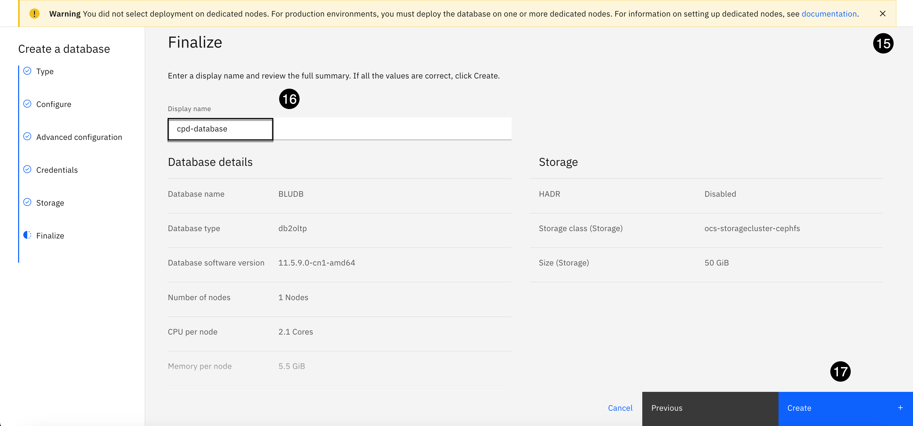

---
---

The database will begin creating and be on **Step 1 Preparing the worker nodes**. The database typically takes about **10-15** minutes to create. Stay on this page until the database creation is completed.


---
---

When the database has created successfully you will see a green checkmark next to it like in the screen shot below.


---
---

## 5. Construct the Db2 Host Name
---
Since the **Db2** database is internally within the **Cloud Pak for Data** cluster. Therefore, the host name provided is not reliable and cannot be used to connect to the internal database. The most reliable means to connect to the internal database is to construct the host name for the database from the database's deployment Id, which will also equates to the database's service name. Remember how this host name was constructed and place it somewhere that is readily available because it will be needed when the **Db2** platform connection is created in the [Define the Data Sources](#_Define_the_Data_Sources) section.

1. Select the **database menu** (the three ellipses in the top right corner).
2. Select the **Details** menu item.


---
---

3. Locate the **Deployment id** in the middle of the details page. Select and copy the **Deployment id** somewhere to perform the following modifications that will turn it into the host name of the database and the corresponding service name.

    The service name for the database, can also be used as the host name. It contains the **Deployment id** with a prefix of **c-** and a suffix of **-db2u**. For the database in the screen shot below, the host name (also the service name) would be **c-db2oltp-1727971014552567-db2u**. Based on this method, construct the host hame for your environment and place it somewhere that is easily accessible because this host name will be needed to create a connection to this internal Db2 database in the upcoming [Define the Data Sources](#_Define_the_Data_Sources) section.

4. Click the **IBM Cloud Pak for Data** label in the upper left corner to return to the home page.

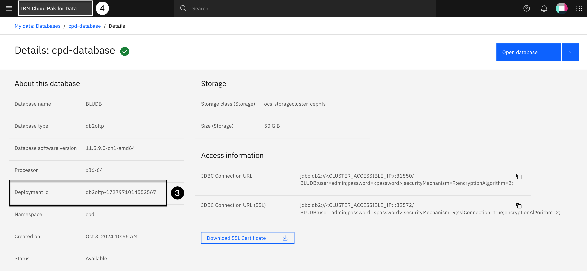

---
---

## Establish Access Controls
---
This section utilizes the **Access control** features of **Cloud Pak for Data**. These access controls are provided by **Cloud Pak for Data** to adjust to the different needs and internal departmental structures of an organization. This allows organizations to establish what their access control implementation would look like based on the tasks that need to be performed and the different roles defined within their data governance team: data engineers, data stewards, data quality analysts, data privacy stewards, and and data consumers (data analysts, data scientists, citizen analysts etc.).

For this lab, multiple users will be created with the appropriate permissions needed to perform their respective tasks. When instructed, these users will login and perform the tasks as outlined in the table below:

|User             |User Tasks Performed                                                 |
|-----------------|---------------------------------------------------------------------|
|Admin            |Creates the Db2 database, performs role and user management and defines the data sources that are typically defined by a **Data Engineer**|
|Data Steward     |Creates workflows, the business vocabulary, policies, and rules. Performs data curation, manages data quality, catalogs and augments governed data assets|
|Privacy Steward  |Reviews and approves governance policies and rules as defined by the data steward in the **Governance Artifacts** workflow|
|Quality Analyst  |Reviews and approves data quality SLA remediation violations as defined by the data steward in the **Data Quality SLA Rule Remediation** workflow|
|Business User    |The data consumers on the analytics project team that benefits from the work done by the data governance team, to find, understand, trust, and use the data|

> The **Business User** will have view only authority in the governed catalog. All sensitive and personally identifiable information (PII) for the user will be masked based on the masking methods defined in the data protection rules created by the data steward.

The following role and user management access control steps will be performed by the **admin** user who is the **Administrator** of the platform who would hold that responsibility in a real world scenario.

1. Select the **Navigation** menu (the 4 stacked horizontal lines in the upper left corner).


---
---

2. Select **Administration &gt; Access control** from the menu.


---
---

## 1. Modify Data Steward Role
---
In this step, the predefined **Data Steward** role will be modified before it is assigned to the **Data Steward** user that will be created in the [User Management](#2._User_Management) section. The role will be expanded to include the proper permissions, that are missing in the default role definition, that are needed by the data steward to manage workflows, governance artifacts, policies and rules, data curation, data quality, catalogs, reporting, and dashboard creation.

1. Click the **Roles** tab.
2. Select the **Data Steward** role from the list of roles.


---
---

3. Click the **Add permissions +** button.


---
---

4. In the **Catalogs** section, select the checkbox next to **Manage catalogs** permission.
5. Open the **Dashboards** section, select the checkbox next to the **Create dashboards** permission.
6. Open the **Data curation** section, select the checkbox next to all **4** permissions: **Drill down to issue details, Manage data quality SLA rules, Manage data quality assets, Measure data quality**.

Scroll **down** to the **Governance artifacts** section to select more permissions.


---
---

7. Open the **Governance artifacts** section, select the checkbox next to all **3** permissions: **Administer governance artifacts, Manage glossary,Manage governance categories**.
8. Open the **Workflows** section, select the checkbox next to the **Manage workflows** permission.
9. Click the **Assign 10 permission** button.


A message will appear that the permission was successfully added.

10. Select the **Access control: Roles** breadcrumb breadcrumb link in the upper left corner to go back to the access control home page.


---
---

## 2. Define Data Privacy Role
---
A data governance team comprises professionals dedicated to managing an organization's data assets effectively by utilizing an organization's data governance processes to ensure compliance. Among them, the **Privacy Steward** plays a pivotal role in upholding data privacy and compliance standards.

In this step, a **Data Privacy** role will be created that will be assigned to the **Privacy Steward** user that will be created in the [User Management](#2._User_Management) section that has the appropriate permissions needed to review and approve data governance policies and rules to demonstrate the **Governance artifacts** workflow approval process for governance policies and rules.

> For the sake of time, even though the **Data Privacy** role was granted permission to create governance artifacts, the **Privacy Steward** user will not be creating any governance artifacts in this lab. In a real world data governance lifecycle implementation they would most likely be the persona that creates the governance policies and rules, and data protection rules and then have a senior member of the data privacy team review and approve them, like a **Data Compliance Officer**.

1. Click the **New role +** button.


---
---

2. Click the **Copy** button below and paste the value into the **Name** field:
```
Data Privacy
```
3. Click the **Copy** button below and paste the value into the **Description** field:
```
Role within an organization that is responsible for upholding data privacy and compliance standards.
```
4. Click the **Next** button.


---
---

Scroll **down** the list of sections. Open the section as instructed and select the checkbox next to the permissions as instructed. **Do not** select the **Next** button until instructed to do so.

5. In the **Catalogs** section, select the checkbox next to the **Access catalogs** permission.
6. In the **Catalogs** section, select the checkbox next to the **Add catalog assets to projects** permission.
7. In the **Dashboards** section, select the checkbox next to the **View dashboards** permission.


---
---

8. In the **Governance artifacts** section, select the checkbox next to the **Access governance artifacts** permission.
9. In the **Governance artifacts** section, select the checkbox next to the **Manage data protection rules** permission.
10. In the **Governance artifacts** section, select the checkbox next to the **Manage glossary** permission.
11. In the **Project** section, select the checkbox next to the **Create projects** permission.
12. Click the **Next** button.


---
---

13. Click the **Create** button.


---
---

A message will appear that the role was created successfully and the **Data Privacy** role will appear as the first role in the list with **0 users, 0 groups** assigned and **Access catalogs +6 more** permissions assigned to the role.

---
---

## 3. Create the Business User
---
The **Business user** will be used at the end of the lab to showcase how a data consumer (data analyst, business analyst, data scientist etc.) benefits from all the work that is performed in the lab by the data governance team to easily find the data they need, understand and trust its content and quality, and use it with confidence for analytics and AI.

1. Click the **Users** tab.


---
---

2. Click the **Add users +** button.


---
---

3. Click the **Copy** button below and paste the value into the **Full name** field:
```
Business User
```
4. Click the **Copy** button below and paste the value into the **Username** field:
```
business-user
```
5. Click the **Copy** button below and paste the value into the **Email** field:
```
business-user@cpd.ibm.com
```
6. Click the **Copy** button below and paste the value into the **Password** field:
```
cpdbuser
```
7. Click the **Copy** button below and paste the value into the **Confirm password** field:
```
cpdbuser
```
8. Click the **Next** button.


---
---

9. Select the **Assign roles directly** role assignment option (should be selected by default).
10. Click the **Next** button.


---
---

11. Select the checkbox next to the **Data Scientist** role.
12. Click the **Next** button.


---
---

13. Click the **Add** button.


A message will appear that 1 user was added successfully.

---
---

## 4. Create the Privacy Steward
---
The **Privacy steward** will review and approve the data governance rules and policies defined for the project by the data steward to ensure they comply with company data privacy policies and regulations and that any sensitive or personally identifiable information (PII) is fully protected so that those that do not have the authority to view it are now allowed to do so.

1. Click the **Add users +** button.


---
---

2. Click the **Copy** button below and paste the value into the **Full name** field:
```
Privacy Steward
```
3. Click the **Copy** button below and paste the value into the **Username** field:
```
privacy-steward
```
4. Click the **Copy** button below and paste the value into the **Email** field:
```
privacy-steward@cpd.ibm.com
```
5. Click the **Copy** button below and paste the value into the **Password** field:
```
cpdpsteward
```
6. Click the **Copy** button below and paste the value into the **Confirm password** field:
```
cpdpsteward
```
7. Click the **Next** button.


---
---

8. Select the **Assign roles directly** role assignment option (should be selected by default).
9. Click the **Next** button.


---
---

10. Select the checkbox next to the **Data Privacy** role.
11. Click the **Next** button.


---
---

12. Click the **Add** button.


A message will appear that 1 user was added successfully.

---
---

## 5. Create the Quality Analyst
---
The **Quality Analyst** will define the data quality rules for the project to ensure that the quality of the data assets requested by the analytics project team are of the hightest quality and that they comply with company data quality standards. The data quality analyst will also be assigned as the Reviewer, Fixer and Approver of any data quality SLA rule violations before the data assets are published to the governed catalog for data consumers.

1. Click the **Add users +** button.


---
---

2. Click the **Copy** button below and paste the value into the **Full name** field:
```
Quality Analyst
```
3. Click the **Copy** button below and paste the value into the **Username** field:
```
quality-analyst
```
4. Click the **Copy** button below and paste the value into the **Email** field:
```
quality-analyst@cpd.ibm.com
```
5. Click the **Copy** button below and paste the value into the **Password** field:
```
cpdqanalyst
```
6. Click the **Copy** button below and paste the value into the **Confirm password** field:
```
cpdqanalyst
```
7. Click the **Next** button.

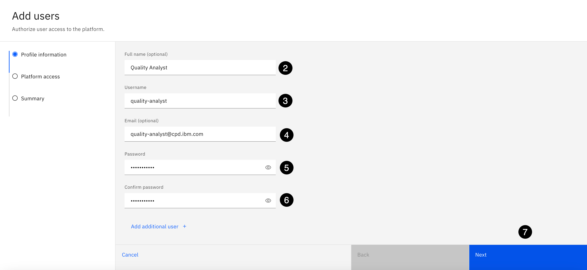

---
---

8. Select the **Assign roles directly** role assignment option (should be selected by default).
9. Click the **Next** button.


---
---

10. Select the checkbox next to the **Data Privacy** role.
11. Click the **Next** button.


---
---

12. Click the **Add** button.


A message will appear that 1 user was added successfully.

---
---

## 6. Create the Data Steward
---
The **Data Stewards** have a tremendous amount of responsibility and are invaluable to a data governance program. The **Data Steward** user will be responsible for and own a vast majority of the content created in this lab. The user will create the governance and data quality remediation workflows, define the business vocabulary, define governance policies, and rules, define data protection rules, perform data curation and enrichment, manage data quality, and catalog and augment high quality, governed data assets.

1. Click the **Add users +** button.


---
---

2. Click the **Copy** button below and paste the value into the **Full name** field:
```
Data Steward
```
3. Click the **Copy** button below and paste the value into the **Username** field:
```
data-steward
```
4. Click the **Copy** button below and paste the value into the **Email** field:
```
data-steward@cpd.ibm.com
```
5. Click the **Copy** button below and paste the value into the **Password** field:
```
cpdsteward
```
6. Click the **Copy** button below and paste the value into the **Confirm password** field:
```
cpdsteward
```
7. Click the **Next** button.


---
---

8. Select the **Assign roles directly** role assignment option (should be selected by default).
9. Click the **Next** button.


---
---

10. Select the checkbox next to the **Data Steward** role.
11. Select the checkbox next to the **Reporting Administrator** role.
12. Click the **Next** button.


---
---

13. Click the **Add** button.


A message will appear that 1 user was added successfully.

## 7. Grant Db2 Database Access
---
In this step, the newly created users will be granted access to the internal **Db2 Database** that was created in the [Prerequisites](#Prerequisites) section that will serve as the **Knowledge Catalog** reporting database which will be setup in the upcoming [Setup Repoting](#Setup_Reporting) section of the lab. 

The **admin** user created and owns the database and is the only user with any authority in the database so access will be granted to the other users so they can access, view and query the reporting data that will be written to the database by **Knowledge Catalog** for **Category**, **Catalog** and **Project** activities and events.

1. Select the **Navigation** menu (the 4 stacked horizontal lines in the upper left corner).


---
---

2. Select **Data &gt; Databases** from the menu.


---
---

3. Select the **database menu** (the three ellipses in the top right corner).
4. Select the **Manage access** menu item.


---
---

5. Click the **Add users +** button.


---
---

6. Select the checkbox next to the **Quality Analyst** user. Using the **Choose a Role** dropdown select the **Admin** role.
7.  Select the checkbox next to the **Data Steward** user. Using the **Choose a Role** dropdown select the **Admin** role.
8. Click the **Add** button.


---
---

## Define the Data Sources
---
In this section you will be acting as the data engineer in an organization who are responsible for designing, building, and maintaining data infrastructures to optimize data systems and make data accessible for data consumers.

Before the data governance lifecycle processes can begin, data stewards and data consumers need access to data. As a best practice, identifying and providing access to data sources needs to happen before data stewardship can begin so that the data is accessible to the **data steward** to begin discovering relevant data, analyzing data content and quality, and enforcing data privacy policies in order to provide timely access to high quality, governed data to the **data consumers** who will use it for analytics and AI.

In this section, three **Platform connections** are created that will be shared across the **Cloud Pak for Data** platform that are required to satisfy the data requested by the business to accomplish their analytical objectives to provide read only access to the data for data stewardship and data consumption:

|Name                 |Connection Type           |Connection Description                |
|---------------------|--------------------------|--------------------------------------|
| PostgreSQL          |PostgreSQL EDB            |Contains the warehouse data needed by the analytics project team|
| Db2 Warehouse       |IBM Db2 Warehouse         |Contains the employee data needed by the analytics project team|
| Db2 Database        |IBM Db2 Internal Database |Used to store Knowledge Catalog metadata pertaining to catalogs, projects, categories and data quality|

---
---

1. Select the **Navigation** menu (the 4 stacked horizontal lines in the upper left corner).


---
---

2. Select **Data &gt; Connectivity** from the menu.


---
---

## 1. PostgreSQL Connection
---
Create a platform connection to the **PostgreSQL EDB** data source that contains the **Warehouse data** needed by the analytics project team:

1. Click the **New connection +** button.


---
---

2. Type **post** in the search area.
3. Select the **PostgreSQL** connector.
4. Click the **Next** button.


---
---

Perform the following steps to complete the creation of the **PostgreSQL** connection:

5. Click the **Copy** button below and paste the value into the **Name** field:
```
PostgreSQL
```
6. Click the **Copy** button below and paste the value into the **Description** field:
```
Contains the warehouse data needed by the analytics project team.
```


---
---

7. Select the **Connection details** section from the left side panel.
8. Click the **Copy** button below and paste the value into the **Database** field:
```
L4POXLAB
```
9. Click the **Copy** button below and paste the value into the **Host name of IP address** field:
```
85331fa6-6b56-4355-935e-290f3ac8aa8c.8117147f814b4b2ea643610826cd2046.databases.appdomain.cloud
```
10. Click the **Copy** button below and paste the value into the **Port** field:
```
31128
```
11. Keep the default setting of **Shared** for the **Credentials** setting.


---
---

12. Select the **Credentials** section from the left side panel.
13. Click the **Copy** button below and paste the value into the **Username** field:
```
cpdemo
```
14. Click the **Copy** button below and paste the value into the **Password** field:
```
C!oudP@k4DataDem0s
```


---
---

15. Select the **Certificates** section from the left side panel.
16. Select the checkbox next to the **Port is SSL-enabled** option.
17. Click the **Test connection** button in the upper right corner.
18. When the test is successful, dismiss **The test was successful** message and click on the **Create** button. If the test is **not** successful, loop back through all of the previous steps and make sure all parameters were entered correctly and try the test again. When it succeeds, select the **Create** button.


---
---

## 2. Db2 Warehouse Connection
---
Create a platform connection to the **Db2 Warehouse** database that contains the employee data needed by the analytics project team.

1. Click the **New connection +** button.


---
---

2. Type **db2 warehouse** in the search area.
3. Select the **IBM Db2 Warehouse** connector.
4. Click the **Select** button.


---
---

Perform the following steps to complete the creation of the **Db2 Warehouse** connection:

5. Click the **Copy** button below and paste the value into the **Name** field:
```
Db2 Warehouse
```
6. Click the **Copy** button below and paste the value into the **Description** field:
```
Contains the employee data needed by the analytics project team.
```
7. Click the **Copy** button below and paste the value into the **Database** field:
```
BLUDB
```


---
---

8. Select the **Connection details** section from the left side panel.
9. Click the **Copy** button below and paste the value into the **Hostname or IP address** field:
```
db2w-qrarnar.us-south.db2w.cloud.ibm.com
```
10. The **Port** should be set to **50001** by default. Keep the default value.


---
---

11. Select the **Credentials** section from the connection left side panel.
12. Keep the default setting of **Shared** for the **Credential setting**.
13. Keep the default setting of **Enter credentials manually** for the **Input method**.
14. Using the **Authentication method** dropdown, select **Username and password** from the list.
15. Click the **Copy** button below and paste the value into the **Username** field:
```
cpdemo
```
16. Click the **Copy** button below and paste the value into the **Password** field:
```
C!oudP@k4DataDem0s
```


---
---

17. Select the **Certificates** section from the connection left side panel.
18. The **Port is SSL-enabled** checkbox should be checked by default. Leave it checked.
19. Click the **Test connection** button in the upper right corner.
20. When the test is successful, dismiss **The test was successful** message and click on the **Create** button. If the test is **not** successful, loop back through all of the previous steps and make sure all the parameters are entered correctly and try the test again. When it succeeds, select the **Create** button.


---
---

## 3. Db2 Database Connection
---
Create a platform connection to the **Db2** internal database that will be used to store all of the **Knowledge Catalog** metadata used for reporting. This is the **Db2** database that was created in step [4. Create the Db2 Database](#4._Create_the_Db2_Database) in the [Prerequisites](#Prerequities) section.

1. Click the **New connection +** button.


---
---

2. Type **db2** in the search area.
3. Select the **IBM Db2** connector.
4. Click the **Select** button.


---
---

Perform the following steps to complete the creation of the **Db2 Database** connection:

5. Click the **Copy** button below and paste the value into the **Name** field:
```
Db2 Database
```
6. Click the **Copy** button below and paste the value into the **Description** field:
```
Contains the metadata for Knowledge Catalog reporting.
```


---
---

7. Select the **Connection details** section from the left side panel.
8. Click the **Copy** button below and paste the value into the **Database** field:
```
BLUDB
```
9. Enter the **host name** that you were instructed to construct in step [5. Construct the Db2 Host Name](#5._Construct_the_Db2_Host_Name) of the [Prerequisites](#Prerequisites) section.

    For this environment the host name is **c-db2oltp-1727971014552567-db2u**

10. Click the **Copy** button below and paste the value into the **Port** field:
```
50001
```


---
---

11. Select the **Credentials** section from the left side panel.
12. Keep the default setting of **Shared** for the **Credential setting**.
13. Keep the default setting of **Enter credentials manually** for the **Input method**.
14. Click the **Copy** button below and paste the value into the **Username** field:
```
admin
```
15. Click the **Copy** button below and paste the value into the **Password** field:
```
cpdadmin
```


---
---

16. Select the **Certificates** section from the left side panel.
17. Select the checkbox next to the **Port is SSL-enabled** checkbox.
18. Click the **Test connection** button in the upper right corner.
19. When the test is successful, dismiss **The test was successful** message and click on the **Create** button. If the test is **not** successful, loop back through all of the previous steps and make sure all the parameters are entered correctly and try the test again. When it succeeds, select the **Create** button.


---
---

You should now see the **3** new connections in the **Platform connections** list. 


---
---

## Login as the Data Steward
---
This is the end of the **admin** tasks. The remaining tasks, with the exception of reviewing and approving the governance and data quality workflows, will be performed by the **Data Steward**.

1. Click the user **Avatar** on the toolbar.
2. Select **Log out** from the menu.


---
---

3. Click the **Log out** button on the confirmation dialog. 


---
---

4. Click the **Copy** button below and paste the value into the **Username** field:
```
data-steward
```
5. Click the **Copy** button below and paste the value into the **Password** field:
```
cpdsteward
```
6. Click the **Log in** button. 


---
---

You should now be logged in as the **Data Steward** with a **Welcome Data Steward!** message on the Cloud Pak for Data home page.


---
---

## Define Workflows
---
Organizations can use **Workflows** to manage business processes. A workflow defines the sequence of steps that must be completed and the decisions that must be made to support a specific process. Users can either use one of the predefined workflows for certain governance tasks, or create custom workflows that meet their business needs. **Knowledge Catalog** provides several predefined workflows:

* Governance artifact workflows: The governance artifact predefined workflows help to manage the process of creating, updating, and deleting governance artifacts. This type of workflow is available with the Base, Standard, and Premium editions of **Knowledge Catalog**.

* Data quality SLA rules remediation workflows: When users create new data quality SLA rule, they must specify which action to take if an asset does not meet the specified requirements by selecting a workflow configuration to start a remediation task for an asset that violates the specific rule. This type of workflow is only available with the Base and Premium editions of **Knowledge Catalog**.

1. Select the **Navigation** menu (the 4 stacked horizontal lines in the upper left corner).


---
---

2. Select **Administration &gt; Workflows** from the menu.


---
---

## 1. Governance Artifacts
---
Managing the workflow configurations for governance artifacts helps control which workflow configurations apply to which conditions, and which people work on each step of the workflow. Workflow configuration defines which actions trigger a workflow, the template that is associated with a trigger, the users who are responsible for completing the workflow steps (tasks), and those who should be notified about specific steps in the workflow.

In this step, a **Governance artifact** workflow will be created for governance **Policies and rules**. The **Privacy Steward** user that was created earlier will be assigned as the **reviewer** and **approver** and will have to approve their definitions before they can be published to the business glossary to ensure they comply and adhere with corporate data privacy standards and guidelines.

1. Select the **Governance artifact management** tile.


---
---

2. Click the **Workflow template files** tab.

**&#9432;** **Notice:** that there are **4** template files provided and that the **Default** workflow template file is set to the **AutoPublish.bpmn** file. This can be changed by the administrator of workflow management.


---
---

3. Click the **Workflow configurations** tab.
4. Click the **New configuration +** button.


---
---

5. Click the **Copy** button below and paste the value into the **Name** field:
```
Data Privacy Artifacts
```
6. Click the **Copy** button below and paste the value into the **Description** field:
```
Workflow for governance artifacts related to complying with data privacy standards and guidelines that need to be reviewed and approved by a member of the data privacy team.
```
7. Select the **One approval step one review step** workflow template.
8. Click the **Create** button.


---
---

First, the **Workflow Conditions** will be configured.

9. Click the **Add condition +** button.


---
---

Scroll **down** the list of governance artifacts until the **Governance rule** artifact is at the top of the list as depicted in the screen shot below.

10. Leave the default category selection set to **All Categories**.
11. For the **Governance rule** artifact, select the **Create, Update, Import, Delete and Move** conditions until a line is drawn through them and they have a checkmark.
12. For the **Policy** artifact, select the **Create, Update, Import, Delete and Move** conditions until a line is drawn through them and they have a checkmark.
13. Click the **Select** button.


---
---

Next, the Workflow **Approve** task will be configured to specify which users are assigned to the **Approve** task. For this use case, the **Privacy Steward** user will be assigned as the approver for any events triggered for Data governance rules and policies.

14. Select the **Approve** task from the left side menu.
15. Select the checkbox next to **Users and user groups** in the **Assignees** section.
16. Click the **Add users or user groups +** button.
17. Select **Users** from the dropdown list.


---
---

18. Select the checkbox for the **Privacy Steward** user.
19. Click the **Add** button.


---
---

Next, the Workflow **Approve** task **Notifications** will be configured. Scroll **down** to the **Notifications** section of the **Approve** task.

20. For the **Assignee** notifications, select the checkbox for the **Task assigned and Overdue+** events.
21. For the **Requestor** notifications, select the checkbox for the **Task assigned, Approve, Reject, Publish, and Delete** events.


---
---

This workflow will only require an **Approve** task so the **Review** task will be skipped. Finally, the Workflow **Publish** task conditions will be configured. For this use case, the approval process will automatically publish the Data governance rules and policy artifacts.

22. Select the **Publish** task from the left side menu.
23. Select the checkbox next to the option to **Automatically publish artifacts. Skip manual publishing**.
24. Click the **Activate** button.


---
---

25. Select the checkbox next to the option to **Apply changes to subcategories**.
26. Click the **Save and activate** button.


---
---

27. Select the **Governance artifact management** breadcrumb link in the upper left corner to go back to the Governance artifact management configuration page.


---
---

The **Data Privacy Artifacts** workflow was created and configured successfully and it is now active and will take affect for any Data Governance Rule or Policy events that are triggered.

28. Select the **Workflows** breadcrumb link in the upper left corner to go back to the Workflows home page.


---
---

## 1. Data Quality Remediation
---
Configuring workflows for data quality remediation tasks help resolve data quality issues reported by violated data quality **SLA** rules. When a data quality SLA rule is created, you specify which action to take if an asset does not meet the specified requirements. Users can select a predefined workflow configuration to launch a remediation task for an asset that violates the specific rule. Users can also change that configuration, or import a custom workflow and use it to manage violations.

In this step, a **Data Quality Remediation** workflow will be created using the default template provided.

1. Select the **Data quality remediation** tile.


---
---

2. Click the **Workflow configurations** tab.
3. Click the **New configuration +** button.


---
---

4. Click the **Copy** button below and paste the value into the **Name** field:
```
Data Quality SLA Rule Remediation
```
5. Click the **Copy** button below and paste the value into the **Description** field:
```
Workflow process to notify the responsible data asset owner when a data asset's data quality assessment violates the established data quality SLA (Service Level Agreement) rule defined so the data quality issue(s) can be addressed and remediated accordingly.
```
6. Select the **This template is used for data quality remediation** option.
7. Click the **Create** button.


---
---

The first step is to configure the **Review** task.

8. Select the **Review** task from the left side menu.
9. In the **Task duration (optional)** section, click the **Plus sign +** in the Duration field and set the Duration to **1**.
10. In the **Task duration (optional)** section, using the **Units** dropdown, select **days**.
11. In the **Assignee** section, select the **Workflow requester**.
12. In the **Notifications** section, for the **Assignee** Recipient, select the **Task assigned** notification option.


---
---

Scroll **down** to the bottom of the **Review** page to gain more real estate.

13. Click the **Add recipients +** button.
14. Select **Users** from the dropdown list.


---
---

15. Select the checkbox for the **Quality Analyst** user.
16. Click the **Add** button.


The **Quality Analyst** is added to the **Notifications** section and will be notified when the task is assigned.

---
---

The next step is to configure the **Fix** task. The assignee for the **Fix** task is set in the **Review** task by the user who is completing the review. Any assignees defined in the **Fix** task workflow configuration are ignored.

17. Select the **Review** task from the left side menu.
18. In the **Task duration (optional)** section, click the **Plus sign +** in the Duration field and set the Duration to **1**.
19. In the **Task duration (optional)** section, using the **Units** dropdown, select **days**.
20. In the **Notifications** section, for the **Assignee** Recipient, select the **Task assigned and Overdue** notification options.


---
---

The next step is to configure the **Approve** task. The assignee for the **Approve** task is set in the **Review** task by the user who is completing the review. Any assignees defined in the **Approve** task workflow configuration are ignored.

21. Select the **Approve** task from the left side menu.
22. In the **Task duration (optional)** section, click the **Plus sign +** in the Duration field and set the Duration to **1**.
23. In the **Task duration (optional)** section, using the **Units** dropdown, select **days**.
24. In the **Notifications** section, for the **Assignee** Recipient, select the **Task assigned and Overdue** notification options.
25. In the **Notifications** section, for the **Requestor** Recipient, select the **Task assigned, Reject and Approve** notification options.
26. Click the **Activate** button.


27. Click the **Save and activate** button.


---
---

28. Select the **Data quality remediation** breadcrumb link in the upper left corner to go back to the Data quality remediation configuration page.


---
---

**&#9432;** **Notice:** that both the **default** and your newly configured workflow configurations are active. The **default** workflow applies to existing tasks, but because your lab environment does not have any tasks, you can deactivate it.

29. Select the **default** workflow.


---
---

30. Select the **Deactivate** button.


---
---

31. Select the **Deactivate** button in the confirmation dialog.


---
---

32. Select the **Data quality remediation** breadcrumb link in the upper left corner to go back to the Data quality remediation configuration page.


---
---

**&#9432;** **Notice:** that the **default** workflow is now set to **Inactive** and the newly created **Data Quality Remediation SLA Rule** workflow is set to **Active**.


---
---

## Define the Business Vocabulary
---
This section creates all the governance artifacts needed to establish a trusted, business ready, governance foundation. It uses a set of **CSV** files to import and create the artifacts in the upcoming steps so make sure the governance artifacts zip file has been downloaded and unzipped based on the instructions contained in the [Download the Lab Files](#1._Download_the_Lab_Files) section above.

It is essential to establish the business vocabulary first before any data curation, enrichment and cataloging of data assets takes place. This is because governance artifacts, like data classes and business terms, can be automatically assigned to data assets during metadata enrichment and cataloging. If not, all of those tasks would have to be done manually, which defeats taking advantage of the automated and built-in data governance capabilities of Knowledge Catalog.

Building a complete and meaningful business vocabulary can be very labor intensive and time consuming without automated processes in place. **Knowledge Catalog** provides governance artifact import capabilities to automate and expedite this process. You will use this feature to methodically create data governance artifacts using prebuilt CSV files to populate the business glossary with all the needed artifacts. There is a specific order that must be followed to create governance artifacts. This lab provides explicit instructions on that processing order (**do not** deviate from the order in which they are defined) to ensure all governance artifacts are defined in the proper sequence to establish proper relationships between them, and to avoid any errors and conflicts.

## 1. Create Custom Attributes
---
This section creates a **Custom attribute** that will be added to all business terms. Custom attributes and relationships need to be defined before any data governance artifacts are defined because they will be attributes of those governance artifacts and need to be established before the artifacts are imported and created. All business terms will have a custom attribute added to them that defines which **Department** in the company is responsible for their definition, meaning and maintenance.

1. Select the **Navigation** menu (the 4 stacked horizontal lines in the upper left corner).


---
---

2. Select **Administration &gt; Governance and catalogs** from the menu.


---
---

3. Select the **Asset and artifact definitions** tile.


---
---

4. Select the **Custom properties** definition from the left side menu.
5. Click the **Import from file** button.


---
---

6. Click the **Drag and drop file here or upload** link.


---
---

7. Select the **governance-custom-attributes.json** file from your download location.
8. Click the **Open** button.


---
---

9. Click the **Import** button.


---
---

A message box will appear with a notification that 1/1 custom attributed was imported successfully.


---

## 2. Create Categories
---
Categories act as folders or directories to organize governance artifacts and provide access controls to authorize who can author and manage those artifacts. Categories provide the logical structure for all governance artifacts, except data protection rules. You group governance artifacts in categories to make them easy to find and manage, and to control their visibility. Categories can be organized in a hierarchy based on their meaning and relationships to one another. A category can have subcategories, but a subcategory can have only one direct parent category.

In this section, **3** categories will be imported and created (one parent category and two sub-categories) that will provide the logical structure for the governance artifacts that are defined in this lab.

1. Select the **Navigation** menu (the 4 stacked horizontal lines in the upper left corner).


---
---

2. Select **Governance &gt; Categories** from the menu.


---
---

3. Using the **Add category** dropdown, select **Import from file**.


---
---

4. Click the **Drag and drop file here or upload** link.


---
---

5. Select the **governance-categories.csv** file from your download location.
6. Click the **Open** button.


---
---

7. Click the **Next** button.


---
---

8. Select the **Replace all values** merge option.
9. Click the **Next** button.


---
---

The import will begin processing and should succeed with **3** new categories. 

10. Select the **Close** button.


---
---

It can take several minutes for the new categories to appear so don't be alarmed if they don't appear immediately. If the new categories do not appear in the user interface after a successful import, **refresh** the page in your browser several times.

> If the import spins for an excessive amount of time and it never returns with a successful message or a **Close** button to close the dialog, exit out of the dialog. The category import job is running in the background and categories are being created, but for whatever reason is not responding back to the dialog. If the new categories do not appear after you close the dialog, **refresh** the page in your browser numerous times.

For either of the above conditions, if the browser refresh doesn't work, going back to the main menu and selecting categories again can sometimes force the categories to appear:

11. Select the **Navigation** menu (the 4 stacked horizontal lines in the upper left corner). 


---
---

12. Select the **Governance &gt; Categories** menu.


---
---

At this point you should see the **Business** category in the list.

13. Select the category **Sidebar** icon in the upper left corner to open the sidebar to get a tree view.


---
---

14. Expand the **Business** category to view all sub-categories.

You should see the **[uncategorized]** and **Locations** system categories and the **3 new categories** that were imported and created with a parent category named: **Business** and two sub-categories underneath it named: **Employee** and **Privacy**.

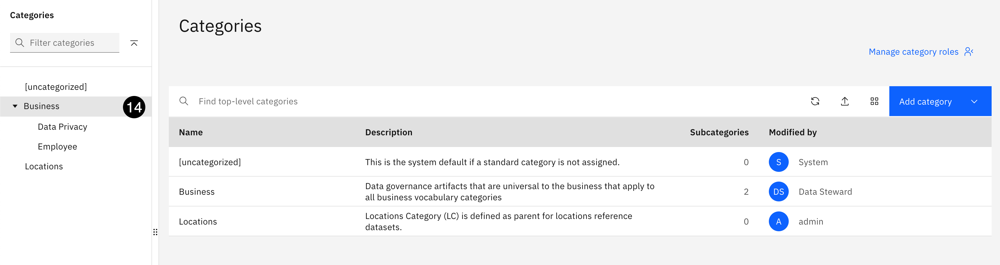

---
---

Before exiting the Category section, the **[uncategorized]** category needs the **Data Steward** added as the owner and admin of the category and the category needs to be changed to allow reporting. The  **Business** category also needs to be updated to allow **Viewer** access to the **All users** group so everyone can view the governance artifacts in the category.

15. Select the **[uncategorized]** category from the list of categories.


---
---

16. Click the **Access control** tab.
17. Using the **Add collaborators** dropdown, select **Add users**.


---
---

18. Select the checkbox next to the **Data Steward** user.
19. To the right of the user, select the **Find roles** dropdown or the **Data Steward** user,
20. Select the checkbox next to the **Owner** and **Admin** roles.
21. Click the **Add** button.


---
---

A message will appear the the ueer was successfully added and the **Data Steward** will appear in the user list as an **Admin** and **Owner** of the category.

22. Click the **Allow reporting** button.


---
---

23. Click the **Allow reporting** button in the confirmation dialog.


A message will appear that reporting was allowed successfully.

---
---

24. Select the **Business** category from the category tree panel.
25. Click the **Access control** tab.
26. Using the **Add collaborators** dropdown, select **Add user groups**.


---
---

27. Select the checkbox next to the **All users** group.
28. Using the **Role** dropdown, select **Viewer**.
29. Click the **Add** button.


---
---

## 3. Move Classifications
---
The default **Classifications** supplied by **Knowledge Catalog** in the **[uncategorized]** category are excellent with very well written descriptions so there is no need to create new classifications. However, in a real client implementation, they would more than likely be assigned to a different category by the business. Therefore, in this step, the classifications will be moved from the **[uncategorized]** category to the newly created **Business >> Data Privacy** sub-category.

> In the previous version of this lab that used version 4.8.5 of **Knowledge Catalog** it was not possible to change the primary category of these classifications to a new category using the bulk **import from file** method. Each classification's primary category had to be changed individually after they were updated with tags and assigned to a secondary category. With the new 5.0 version of **Knowledge Catalog** the primary category can be changed in bulk using the **Edit** feature. This saves a lot of time and effort for this lab and for IBM clients!

1. Select the **Navigation** menu (the 4 stacked horizontal lines in the upper left corner).


---
---

2. Select the **Governance &gt; Classifications** menu.


---
---

3. Select the **high level** checkbox at the top of the **Classifications** list to change the category for all four classifications.
4. Using the **Edit** dropdown that appears on the toolbar, select **Primary category**.


---
---

5. Select the **Business** parent category to open it and see the secondary categories. **Do not** select the radio button.


---
---

6. Select the radio button on the **Data Privacy** sub-category.
7. Click the **Save** button.


---
---

The **Primary category** was changed successfully but **&#9432;** **Notice:** that the **Primary category** is still set to **[uncategorized]** in the list of classifications. The primary category was changed but the classificaition updates have been added as tasks to the **Task Inbox** that need to be **Published** before they take effect.

8. Select the **Navigation** menu (the 4 stacked horizontal lines in the upper left corner).


---
---

9. Select the **Task inbox** menu.


---
---

> From this point forward, all governance artifacts have to be published. Categories and Data Protection Rules **do not** need to be published but all other governance artifacts you create or update will be in draft mode until you publish them. Familiarize yourself with the **Task inbox**. On the left are the open tasks that need to be published and the tasks you have already completed. You are always presented with the details of the task in the middle of the page. Notice that you are publishing 4 classifications with a means to view the details of each one.

10. Click the **Publish** menu.


---
---

11. Click the **Publish** button again without entering a comment.


---
---

12. Select the **Navigation** menu (the 4 stacked horizontal lines in the upper left corner).


---
---

13. Select the **Governance &gt; Classifications** menu.


---
---

## 4. Update Classifications
---
The **Primary category** was changed successfully. **&#9432;** **Notice:** that the **Primary category** is now set to **Data Privacy** in the list of classifications. Now that the classifications have successfully moved, they wil be updated with tags and assigned to the **Business >> Employee** sub-category as a secondary category because they apply to data associated with employees of the business.

1. Using the **Add classification** dropdown, select **Import from file**.


---
---

2. Click the **Drag and drop file here or upload** link.


---
---

3. Select the **governance-classifications.csv** file from your download location.
4. Click the **Open** button.


---
---

5. Click the **Next** button.


---
---

6. Select the **Replace only empty values** merge option.
7. Click the **Next** button.


> This option is the best choice when you want to update attributes for existing governance artifacts. It leaves the existing artifact in place and only updates values with new values you supply and leaves all other attributes unchanged.

---
---

The import should complete successfully with **4** classifications imported. 

> From this point forward, all governance artifacts have to be published. Categories and Data Protection Rules **do not** need to be published but all other governance artifacts you create or update will be in draft mode until you publish them.

8. Click the **Go to task** button.


Familiarize yourself with the **Task inbox**. On the left are the open tasks that need to be published and the tasks you have already completed. You are always presented with the details of the task in the middle of the page. Notice that you are publishing 4 classifications with a means to view the details of each one.

9. Click the **Publish** button.


 
 ---
 ---

 10. Click the **Publish** button again without entering a comment.


---
---

11. Select the **Navigation** menu (the 4 stacked horizontal lines in the upper left corner).


---
---

12. Select the **Governance &gt; Classifications** menu.


---
---

You should now see the 4 original classifications, which are assigned to the **Data Privacy** category, but with a **Last Modified date** of today (the day you are doing this lab). Lets verify that the imported changes were applied correctly.

13. Select the **Confidential** classification. The first classification in the list.


---
---

**&#9432;** **Notice:** that the classification has a tag of **Employee** and that it was also assigned to the **Business >> Employee** sub-category as a secondary category. All of the classifications will have the same change applied. If time permits, and you are curious, select the other **3** classifications to see the same changes have been applied.


---
---

## 5. Create Reference Data
---
Reference data sets provide logical groupings of code values (reference data values), such as department and gender codes. These codes are sets of allowed values that are associated with data fields and can be assigned to data classes. Which is why they need to be created before data classes are created.

Reference data sets are created so that enterprise standards can be accessed centrally by users or by consuming applications through APIs. Reference data sets can also be used to provide the matching pattern for data classes, allowing data fields to be automatically classified through data profiling and discovery. These data classes can then be used in data quality analysis to evaluate the quality and consistency of the values in data columns. Which is why you create data classes before you create reference data.

In this step, a **Reference data set** will be created for the **Termination** reference data set with its corresponding data values **before data classes** are created because the **Termination Code** data class uses the reference data set as the matching method to classify the **TERMINATION_CODE** column of the **EMPLOYEE** table and to validate the quality of its content. The reference data import process **does not** provide the means to supply the reference data values, or a **CSV** file that contains the reference data values, so instead of importing and creating the reference data set and then loading the reference data set values it will be done in one step using the **CSV** file provided during the creation process.

1. Select the **Navigation** menu (the 4 stacked horizontal lines in the upper left corner).


---
---

2. Select the **Governance &gt; Reference data** menu.

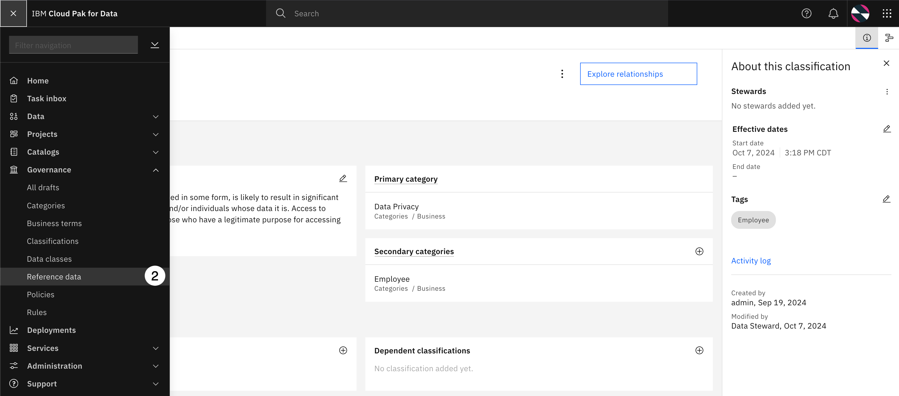

---
---

3. Using the **Add reference data set** dropdown, select **New reference data set**.


**&#9432;** **Notice:** that **Knowledge Catalog** has predefined two reference data sets that reside in the **Locations** category. These reference data sets provide the physical location and sovereign location that you select when you are designing data location rules to move data from one location to another. Data location rules are in the **experimental** stage so you will not be using these reference data sets in this lab.

4. Click the **Drag and drop file here or upload** link.


---
---

5. Select the **governance-reference-data.csv** file from the download location.
6. Click the **Open** button.


---
---

Scroll **down** to the bottom of the dialog.

7. Click the **Copy** button below and paste the value into the **Name** field:
```
Termination Lookup
```
8. Click the **Copy** button below and paste the value into the **Description** field:
```
Valid codes and values for employee termination codes.
```
9. Click the **Select** button to select a primary category.


---
---

10. Select the **Business** parent category to open it and see the secondary categories. **Do not** select the radio button.


---
---

11. Select the radio button on the **Employee** sub-category.
12. Click the **Save** button.


---
---

13. Click the **Next** button.


---
---

14. Make sure the **First row as column header** option is set to **On**. 
15. Using the **Column** dropdown, select the **TERMINATION_CODE** column from the list.
16. Using the **Target column** dropdown, select **Code** from the list.


---
---

17. Using the **Column** dropdown, select the **TERMINATION_VALUE** column from the list.
18. Using the **Select column** Target columns dropdown, select **Value** from the list.
19. Click the **Next** button.


---
---

20. Click the **Create** button.


---
---

21. Click the **Publish** button.


---
---

22. Click the **Publish** button again without entering a comment.


---
---

23.  Click the **Reference data** breadcrumb to get back to the reference data home page.


---
---

There will be **1** newly created reference data set named **Termination Lookup** that is assigned to the **Employee** category.


---
---

## 6. Create Data Classes
---
In this step, a set of new data classes to support this use case will be added with fully defined matching criteria to allow **Knowledge Catalog** to use them during the automatic assignment of data classes in the **Metadata enrichment** process. All these data classes that will be used during the Metadata enrichment process will be created and added to the **Business** category.

1. Select the **Navigation** menu (the 4 stacked horizontal lines in the upper left corner).


---
---

2. Select the **Governance &gt; Data classes** menu.


---
---

3. Using the **Add data class** dropdown, select **Import from file**.


---
---

4. Click the **Drag and drop file here or upload** link.


---
---

5. Select the **governance-data-classes.csv** file from your download location.
6. Click **Open**.


---
---

7. Click the **Next** button.


---
---

8. Select **Replace all values** merge option.
9. Click the **Next** button.


---
---

The import should complete successfully with **15** new data classes imported. 

10. Click the **Go to task** button.


---
---

You should see **15** new data classes to publish.

11. Click the **Publish** button.


---
---

12. Click the **Publish** button again without entering a comment.


---
---

13. Select the **Navigation** menu (the 4 stacked horizontal lines in the upper left corner).


---
---

14. Select the **Governance &gt; Data classes** menu.


---
---

**&#9432;** **Notice:** That there are now **180** data classes. There were **165** default data classes defined by **Knowledge Catalog** and **15** new data classes were just imported for a total of **180**. We will use the **Filter** area to reduce the list to the **21** data classes that were just imported that were assigned to the **Business** category.

15. Click the **Filter** button to open the filter area.
16. Open the **Primary category** filter.
17. Select the checkbox next to the **Business** primary category.
18. Click the **Apply** button.


---
---

There will be **15** data classes assigned to the **Business** category. Before proceeding, the **Termination Code** data class needs to be updated to use the **Termination Lookup** reference data set that was just created in the previous step as the matching criteria for the data class. The matching criteria definition for this data class could not be set in the **CSV** file that was used to import the data classes because the definition uses the reference data set's unique guid as the name for the reference data set which is different in every environment. This also provides an opportunity to learn how to set matching criteria for a data class to ensure that **Knowledge Catalog** will use it during the **Metadata enrichment** process.

Scroll **down** to the bottom of the list.

19. Select the **Termination Code** data class from the list.


---
---

20. In the **Data matching** section, click the **Add** button to add a matching method.


---
---

21. Select **Match to reference data** as the matching method.
22. Click the **Next** button.


---
---

23. Select **Termination Lookup** as the reference data set.
24. Change the **Percentage match threshold** option to **60**.
25. Click the **Next** button.


---
---

26. Using the **Column data type** dropdown, select **Text**.
27. Enter **3** for the Minimum length of data value field.
28. Enter **3** for the Maximum length of data value field.
29. Click the **Next** button.


---
---

This is a **very important** setting so make sure it's set correctly!

30. Set the **Data class priority** to **12**.
31. Click the **Save** button.


---
---

32. Click the **Publish** button.


---
---

33. Click the **Publish** button again without entering a comment.


---
---

## 7. Create Business Terms
---
Business terms have references to data classes and classifications, and can be referenced in data governance and data protection rules, so they need to be defined after data classes and classifications but before data governance or data protection rules that reference them. Business terms can also be related to other business terms so they must be imported in a specific order. The business terms in the CSV import file you will use are in the correct order to establish these relationships.

You will import and create **150** business terms. Using the import process for such a large volume of governance artifacts is a prime example of the type of productivity automation that is provided by **Knowledge Catalog**. This is a huge time saver that runs in minutes. Doing this manually would take a data steward hours or days.

1. Select the **Navigation** menu (the 4 stacked horizontal lines in the upper left corner).


---
---

2. Select the **Governance &gt; Business terms** menu.


---
---

The environment was just provisioned so there should not be any business terms defined.

3. Using the **Add business term** dropdown, select **Import from file**.


---
---

4. Click the **Drag and drop file here or upload** link.


---
---

5. Select the **governance-business-terms.csv** file from the download location.
6. Click the **Open** button.


---
---

7. Click the **Next** button.


---
---

8. Select **Replace all values** as the merge option.
9. Click the **Next** button.


---
---

The import should complete successfully with **29** new business terms imported. 

10. Click the **Go to task** button.


---
---

You should see **29** new business terms to publish.

11. Click the **Publish** button.


---
---

12. Click the **Publish** button again without entering a comment.


---
---

13. Select the **Navigation** menu (the 4 stacked horizontal lines in the upper left corner).


---
---

14. Select **Governance &gt; Business terms**.


---
---

There should be **29** published business terms. If there are less that number, refresh the page in the browser until they all appear. Sometimes there is a slight delay and it takes a few minutes for the user interface to display the total terms imported.


---
---

## Define Policies and Rules
---
In this section, the governance policies and rules and the data protection rules will be created. Governance policies and rules were added to the **Data Privacy Artifacts** governance artifacts workflow definition so they will be sent for approval to the **Privacy Steward**. After approval, they will be automatically published to the business glossary.

Policies are used to describe and document an organization’s guidelines, regulations, standards or procedures to ensure data and data assets are properly managed and used. A policy is a natural-language description of a governance subject area. Policies describe how to control data. For example, policies that document how sensitive data is handled, data quality standards, how long data is retained, and data archival compliance strategies. A policy is a natural-language description of a governance subject area. Policies describe how to control data. A policy consists of one or more rules. Each policy can:

* Contain multiple sub-policies.
* Reference a parent rule which needs to be sufficiently broad to encompass all of its sub-policies.
* Reference one or more Governance rules to describe the characteristics for making information resources compliant with corporate objectives.
* Reference one or more Data protection rules to create policies that specify types of data to restrict.
* Reference related artifacts, such as business terms and classifications.

Data protection rules dynamically control access to data in governed catalogs, and under some conditions, in projects. Data protection rules are automatically enforced when a catalog member attempts to view or act on a data asset in a governed catalog to prevent unauthorized users from accessing sensitive data. However, if the user who is trying to access the asset is the owner of the asset (by default, the user who created the asset), then access is always granted.

Unlike data protection rules, governance rules are only descriptive and can't be enforced. A governance rule is a description of the criteria used to determine whether information assets are compliant with business objectives and provide the business definition of the required behavior or actions to be taken to implement a given governance policy or subject area such as information quality, retention, privacy, or regulatory compliance.

## 1. Create Policies
---
In this step, a governance policy will be created. This lab's use case only has **one** policy but will continue to use the import process to assign the appropriate business terms and classifications and then assign the governance and data protection rules to the policy in a later step after they are created. As a reminder, **Policies** were added as a condition for the **Data Privacy Artifacts** governance artifact workflow definition so they will have to be approved by the **Privacy Steward**. Once approved, they will be published to the business glossary.

1. Select the **Navigation** menu (the 4 stacked horizontal lines in the upper left corner).


---
---

2. Select the **Governance &gt; Policies** menu.


---
---

The environment was just provisioned so there should not be any policies defined.

3. Using the **Add policy** dropdown, select **Import from file**.


---
---

4. Click the **Drag and drop file here or upload** link.


---
---

5. Select the **governance-policies.csv** file from the download location.
6. Click the **Open** button.


---
---

7. Click the **Next** button.


---
---

8. Select the **Replace all values** merge option.
9. Click the **Next** button.


---
---

10. Click the **Go to task** button.


---
---

11. Click the **Send for approval** button.


---
---

12. Click the **Copy** button below and paste the value into the **Comment** field:
```
This policy describes the standards and guidelines for handling sensitive information. The data used in this project contains sensitive information so this policy must be published. This policy requires the Data Privacy teams approval. Please approve this policy.
```
13. Click the **Send for approval** button.


---
---

The **Notification** icon on the toolbar (looks like a bell) has a red annotation notifying you that there is a notification message. This was generated because the **Data Privacy Artifacts** workflow definition was configured to notify the workflow **Requestor** (i.e the Data Steward). 

14. Select the **Notification** icon on the toolbar to read the message.


---
---

This is only a courtesy informational message that there is a new **Approve Governance Policy** task and that no action needs to be taken. The approval will be done by the **Privacy Steward** in the [Approve Policy and Rules](#10._Approve_Policy_and_Rules) step after the **Policy** is created.

15. Select the **Navigation** menu (the 4 stacked horizontal lines in the upper left corner).


---
---

16. Select the **Governance &gt; Policies** menu.


---
---

**&#9432;** **Notice:** That there are no published polices because they are still awaiting approval by the **Privacy Steward**. After approval, there will be **1** published policy.


---
---

## 2. Create Governance Rules
---
Unlike data protection rules, governance rules are descriptive only rules and can't be enforced. A governance rule is a description of the criteria used to determine whether information assets are compliant with business objectives and provide the business definition of the required behavior or actions to be taken to implement a given governance policy or subject area such as information quality, retention, privacy, or regulatory compliance.

In this section, you will import and create **4** data governance rules related to privacy and regulatory compliance to document the business requirements and actions that need to be taken to protect personal and sensitive information. As a reminder, data governance rules were added to the **Data Privacy Artifacts** workflow definition so they will be sent for approval to the **Privacy Steward** user who will review them and be responsible for the final publication to the business glossary.

1. Select the **Navigation** menu (the 4 stacked horizontal lines in the upper left corner).


---
---

2. Select the **Governance &gt; Rules** menu.


---
---

3. Using the **Add rule** dropdown, select **Import from file**.


---
---

4. Click the **Drag and drop file here or upload** link.


---
---

5. Select the **governance-rules.csv** file from the download location.
6. Click the **Open** button.


---
---

7. Click the **Next** button.


---
---

8. Select the **Replace all values** merge option.
9. Click the **Next** button.


---
---

The import should complete successfully with **4** new Governance rule drafts. 

10. Click the **Go to task** button.


---
---

The **Data Privacy Artifacts** workflow approval process has been initiated. Before these data governance rules can be published they will need to be approved by the **Privacy Steward** who is a member of the data privacy team.

11. Click the **Send for approval** button.


---
---

12. Click the **Copy** button below and paste the value into the **Comment** field:
```
The data for this project contains an employees Birth Date, Email Address, US Social Security Number (National Identifier) and Work Phone which must be protected per corporate policy. These rules need the Data Privacy teams approval. Please approve them. 
```
13. Click the **Send for approval** button.


---
---

The **Notification** icon on the toolbar (looks like a bell) has a red annotation notifying you that there is **1** new notification message. This was generated because the **Data Privacy Artifacts** workflow definition was configured to notify the workflow **Requestor** (i.e the Data Steward). 

14. Select the **Notification** icon on the toolbar to read the message.


---
---

This is only a courtesy informational message that there is a new **Approve Governance Rule** task and that no action needs to be taken. The approval will be done by the **Privacy Steward** in the [Approve Policy and Rules](#10._Approve_Policy_and_Rules) step after the **Governance Rules** are created.

15. Select the **Navigation** menu (the 4 stacked horizontal lines in the upper left corner).


---
---

16. Select the **Governance &gt; Rules** menu.


---
---

**&#9432;** **Notice:** That there are no published governance rules because they are still awaiting approval by the **Privacy Steward**. After approval, there will be **4** governance rules published.


---
---

## 3. Login as the Privacy Steward
---
In order to approve the policy and governance rules in the next step, that were just sent for approval by the **Data Steward**, logout and login as the **Privacy Steward**.

1. Click the user **Avatar** on the toolbar.
2. Select **Log out** from the menu.


---
---

3. Click the **Log out** button on the confirmation dialog.


---
---

4. Click the **Copy** button below and paste the value into the **Username** field:
```
privacy-steward
```
5. Click the **Copy** button below and paste the value into the **Password** field:
```
cpdpsteward
```
6. Click the **Log in** button. 


---
---

You should now be logged in as the **Privacy Steward** with a **Welcome Privacy Steward!** message on the Cloud Pak for Data home page.


---
---

## 4. Approve Policies and Rules
---
In this section, the **Privacy Steward** will review and approve the governance policy and rules that were created and sent for approval by the **Data Steward**.

There are several notifications in the **Notifications** section on the Cloud Pak for Data home page alerting the **Privacy Steward** that there are tasks assigned to **Approve governance rules** and to **Approve Policies**. These are the tasks that were just sent for approval by the **Data Steward**.

1. Select the link in the **Notifications** section to **Approve governance rules**.


---
---

As the **Privacy Steward**, read the comments left by the **Data Steward** and review the governance rules that have been sent for approval to ensure they meet corporate standards and guidelines based on the sensitivity of the data that was requested by the analytics project team.

2. Click the **Publish** button.


---
---

3. Click the **Copy** button below and paste the value into the **Comment** field:
```
I have read the detailed comments and have reviewed the governance rules defined. All the proper rules have been defined. Based on these rules, a data protection rule must also be defined that takes action on these rule definitions. I approve this task!
```
4. Click the **Publish** button.


The **Governance rules** will be published with one task remaining to **Approve Policies**.

---
---

As the **Privacy Steward**, read the comments left by the **Data Steward** and review the governance policy that has been sent for approval to ensure it meets corporate standards and guidelines to handle and protect sensitive information.

5. Click the **Publish** button.


---
---

6. Click the **Copy** button below and paste the value into the **Comment** field:
```
I have read the detailed comments and have reviewed the proposed governance policy. This is the approved standard corporate policy on how to handle and protect sensitive information that should be defined and published. I approve this task!
```
7. Click the **Publish** button.


---
---

Now that the policy and governance rules have been approved by the **Privacy Steward**, logout and login as the **Data Steward** and review the approved and published policy and rules.

8. Click the user **Avatar** on the toolbar.
9. Select **Log out** from the menu.


---
---

10. Click the **Log out** button on the confirmation dialog.


---
---

11. Click the **Copy** button below and paste the value into the **Username** field:
```
data-steward
```
12. Click the **Copy** button below and paste the value into the **Password** field:
```
cpdsteward
```
13. Click the **Log in** button. 


**&#9432;** **Notice:** that the **Notifications** section has two messages notifying the **Data Steward** that the **Privacy Steward** has published the policy and governance rule tasks that were sent for approval so let's validate that they are published and ready for use.

14. Select the **Navigation** menu (the 4 stacked horizontal lines in the upper left corner).


---
---

15. Select the **Governance &gt; Policies** menu.


---
---

The policy is published and ready for use. It has been created in the correct **Data Privacy** category and is still owned by the **Data Steward**. Let's validate the governance rules.

16. Select the **Navigation** menu (the 4 stacked horizontal lines in the upper left corner).


---
---

17. Select the **Governance &gt; Rules** menu.


The governance rules are published and ready for use. They have been created in the correct **Data Privacy** category and are still owned by the **Data Steward**. Based on the comments provided by the **Privacy Steward** when the governance rules were published, the **Data Steward** will take the next step and make sure the required and corresponding data protection rules are created to protect all sensitive information contained in the data requested by the analytics project team.


---
---

## Create Data Protection Rules
---
Data protection rules dynamically control access to data in governed catalogs. Data that is added from a governed catalog to a project will only be protected by data protection rules if the data was added to the governed cataloged by a deep enforcement solution. A deep enforcement solution is a protection solution to enforce rules on data that is outside of Cloud Pak for Data when the data source is integrated with one of these services:

* IBM watsonx.data
* IBM Data Virtualization
* IBM Security Guardium Data Protection

In this section, **4** data protection rules are created based on the governance rules that were defined and approved by the **Privacy Steward**. They are enforced based on the data class assigned to columns of data assets for the following sensitive information:

 * Date of Birth
 * Email Address
 * US Phone Number
 * US Social Security Number

> If you recall from the [Use Case](#Use_Case) section, this use case only applies to US employees working in US warehouses so all phone numbers should be US phone numbers and every employee should have an assigned US social security number.

You will use the **Obfuscate** masking method, using some of the advanced data privacy options, to mask data classified as a **Date of Birth**, **Email Address**, **US Phone Number** or **US Social Security Number**. This will introduce you to the new advanced data privacy capabilities, and demonstrate how the obfuscation masking method maintains the original format of the data, and consistently replaces the original value with fictional values, every time it encounters the same value, to maintain referential integrity.

> The **Obfuscate** masking method is unique to a single attribute type because it is dependent on the specific format of the content, requiring a separate rule for every attribute type. The **Redaction** and **Substitute** masking methods can mask data for multiple attribute types using the same rule, allowing for the creation of one master redaction rule that can redact one to many attribute types using the same rule.

## 1. Create Data of Birth Rule
---
In this step, a data protection rule will be created to mask data classified as a **Date of Birth**. The **Obfuscate** masking method will be chosen and utilize some of the advanced data privacy options that are specific to a date of birth.

1. Using the **Add rule** dropdown, select **New data protection rule**.


---
---

2. Click the **Copy** button below and paste the value into the **Name** field:
```
Protect Date of Birth
```
3. Click the **Copy** button below and paste the value into the **Business definition** field:
```
Protect all birth dates using the data privacy advanced masking method.
```
4. Click the **Next** button.


---
---

In the **When does this rule apply?** section, specify the rule **Criteria** as follows:

5. Using the **If** statement dropdown on the left, select **Data class**.
6. Using the **If** statement dropdown on the right, select **contains any**.
7. Enter the word **birth** (in lower case) into the **Data class** field.
8. Select **Date of Birth** from the data class list that appears.


---
---

In the **What does this rule do?** section, specify the rule **Action** as follows:

9. Using the **Action** dropdown on the left, select **Obfuscate columns**. 
10. Using the **When column has** dropdown in the middle, select **Data class**.

The **Date of Birth** data class will automatically be filled into the **That contains any** field.


---
---

Scroll **down** to the **Advanced masking options** section.

11. Using the **Date similarity** dropdown, select **Mask date to same time period**.
12. Select the **Same quarter** option. A sample of the obfuscation results will be displayed in the Example area.


---
---

The remaining default **Advanced masking options** set by **Knowledge Catalog** are correct for this data protection rule. They should be set as follows:

|Advanced Option      |Option Setting                                             |
|---------------------|-----------------------------------------------------------|
|**Obfuscate method** |Preserve format (default)                                  |
|**Date Similarity**  |Mask date to same time period with **Same quarter** option |
|**Reversibility**    |Irreversible masking                                       |
|**Consistency**      |Repeatable                                                 |
|**Input Validation** |Selected and enabled                                       |

Double check that the options are set correctly. If they are not, change them to the proper setting listed above before you create the rule.

13. Click the **Create** button.


---
---

The **Where are data protection rules enforced?** dialog appears. This dialog will appear every time you create a data protection rule.

14. Read the message and select the **I understand** checkbox.
15. Click the **Continue** button.


---
---

A **Successfully created!** message will appear and the new rule is created. 

16. Select the **Rules** breadcrumb in the upper left corner to return to Rules main page.


---
---

## 2. Create Email Address Rule
---
In this step, a data protection rule will be created to mask data classified as an **Email Address**. The **Obfuscate** masking method will be chosen and utilize some of the advanced data privacy options that are specific to an email address.

1. Using the **Add rule** dropdown, select **New data protection rule**.


---
---

2. Click the **Copy** button below and paste the value into the **Name** field:
```
Protect Email Addresses
```
3. Click the **Copy** button below and paste the value into the **Business definition** field:
```
Protect all email addresses using the data privacy advanced masking method.
```
4. Click the **Next** button.


---
---

In the **When does this rule apply?** section, specify the rule **Criteria** as follows:

5. Using the **If** statement dropdown on the left, select **Data class**.
6. Using the **If** statement dropdown on the right, select **contains any**.
7. Enter the word **email** (in lower case) into the **Data class** field.
8. Select **Email Address** from the data class list that appears.


---
---

In the **What does this rule do?** section, specify the rule **Action** as follows:

9. Using the **Action** dropdown on the left, select **Obfuscate columns**. 
10. Using the **When column has** dropdown in the middle, select **Data class**.

The **Email Address** data class will automatically be filled into the **That contains any** field.


---
---

Scroll **down** to the **Advanced masking options** section.

11. In the **Domain name** section, select the **Custom** option.
12. Enter **ibm.cpd.com** for the **Custom** domain name.


---
---

> If you see several warning dialogs appear in the top right corner when the **Custom** option for **Domain name** is selected do not be alarmed. The UI is expecting a **Username format** to be selected first even though one is already selected by default (which is the correct selection). If this happens, go to the **Username format** section and select the **Prefix plus number** option and then immediately switch it back to **Generate user name**. It will adjust the preview accordingly and the warnings will disappear. Make sure that the **Username format** is actually set to **Generate user name** before creating the rule.

The remaining default **Advanced masking options** set by **Knowledge Catalog** are correct for this data protection rule. They should be set as follows:

|Advanced Option      |Option Setting            |
|---------------------|--------------------------|
|**Obfuscate method** |Preserve format (default) |
|**Username format**  |Generate user name        |
|**Domain name**      |Custom - **cpd.ibm.com**  |
|**Consistency**      |Repeatable                |
|**Input Validation** |Selected and enabled      |

Double check that the options are set correctly. If they are not, change them to the proper setting listed above before you create the rule.

13. Click the **Create** button.


---
---

The **Where are data protection rules enforced?** dialog appears. This dialog will appear every time you create a data protection rule.

14. Select the **I understand** checkbox.
15. Click the **Continue** button.


---
---

A **Successfully created!** message will appear and the new rule is created. 

16. Select the **Rules** breadcrumb in the upper left corner to return to Rules main page.


---
---

## 3. Create US Phone Number Rule
---
In this step, a data protection rule will be created to mask data classified as a **US Phone Number**. The **Obfuscate** masking method will be chosen and utilize some of the advanced data privacy options that are specific to a US phone number.

Masking phone numbers is challenging because you have to take into consideration whether they are United States or International phone numbers. If you are confident, and sure of their format, you can create an obfuscation data protection rule to preserve their format and replace the original value with a fictional value. If not, the redaction method is the better choice because the format does not matter. The redaction masking method just replaces the existing values with a set of characters you designate.

1. Using the **Add rule** dropdown, select **New data protection rule**.


---
---

2. Click the **Copy** button below and paste the value into the **Name** field:
```
Protect US Phone Numbers
```
3. Click the **Copy** button below and paste the value into the **Business definition** field:
```
Protect all US phone numbers using the advanced data privacy masking method.
```
4. Click the **Next** button


---
---

In the **When does this rule apply?** section, specify the rule **Criteria** as follows:

5. Using the **If** statement dropdown on the left, select **Data class**.
6. Using the **If** statement dropdown on the right, select **contains any**.
7. Enter the words **us phone** (in lower case) into the **Data class** field.
8. Select **US Phone Numbers** from the data class list that appears.


---
---

In the **What does this rule do?** section, specify the rule **Action** as follows:

9. Using the **Action** dropdown on the left, select **Obfuscate columns**. 
10. Using the **When column has** dropdown in the middle, select **Data class**.

The **US Phone Number** data class will automatically be filled into the **That contains any** field.


---
---

The remaining default **Advanced masking options** set by **Knowledge Catalog** are correct for this data protection rule. They should be set as follows:

|Advanced Option      |Option Setting            |
|---------------------|--------------------------|
|**Obfuscate method** |Preserve format (default) |
|**Consistency**      |Repeatable                |
|**Input Validation** |Set to **No validation**  |

Double check that the options are set correctly. If they are not, change them to the proper setting listed above before you create the rule.

11. Click the **Create** button.


---
---

The **Where are data protection rules enforced?** dialog appears. This dialog will appear every time you create a data protection rule.

12. Select the **I understand** checkbox.
13. Click the **Continue** button.


---
---

A **Successfully created!** message will appear and the new rule is created. 

14. Select the **Rules** breadcrumb in the upper left corner to return to Rules main page.


---
---

## 4. Create US Social Security Rule
---
In this step, you will create a data protection rule to mask data classified as a **US Social Security Number**. You will use the **Obfuscate** masking method, using some of the advanced data privacy options that are specific to a United States social security number.

1. Using the **Add rule** dropdown, select **New data protection rule**.


---
---

2. Click the **Copy** button below and paste the value into the **Name** field:
```
Protect US Social Security Numbers
```
3. Click the **Copy** button below and paste the value into the **Business definition** field:
```
Protect all US social security numbers using the data privacy advanced masking method.
```
4. Click the **Next** button


---
---

In the **When does this rule apply?** section, specify the rule **Criteria** as follows:

5. Using the **If** statement dropdown on the left, select **Data class**.
6. Using the **If** statement dropdown on the right, select **contains any**.
7. Enter the words **us social** (in lower case) into the **Data class** field.
8. Select **US Social Security Number** from the data class list that appears.

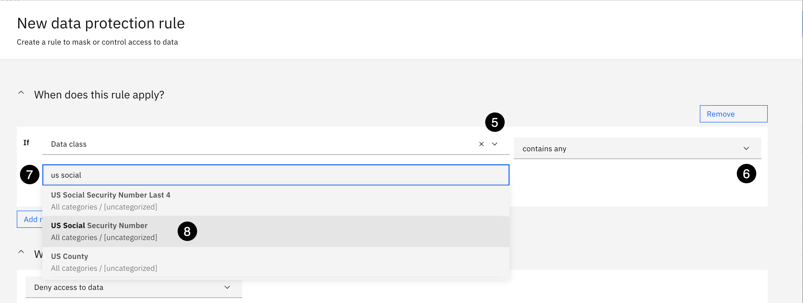

---
---

In the **What does this rule do?** section, specify the rule **Action** as follows:

9. Using the **Action** dropdown on the left, select **Obfuscate columns**. 
10. Using the **When column has** dropdown in the middle, select **Data class**.

The **US Social Security Number** data class will automatically be filled into the **That contains any** field.


---
---

Scroll **down** to the **Advanced masking options** section.

The remaining default **Advanced masking options** set by **Knowledge Catalog** are correct for this data protection rule. They should be set as follows:

|Advanced Option      |Option Setting            |
|---------------------|--------------------------|
|**Obfuscate method** |Preserve format (default) |
|**Consistency**      |Repeatable                |
|**Input Validation** |Set to **No validation**  |

Double check that the options are set correctly. If they are not, change them to the proper setting listed above before you create the rule.

11. Click the **Create** button.


---
---

The **Where are data protection rules enforced?** dialog appears. This dialog will appear every time you create a data protection rule.

12. Select the **I understand** checkbox.
13. Click the **Continue** button.

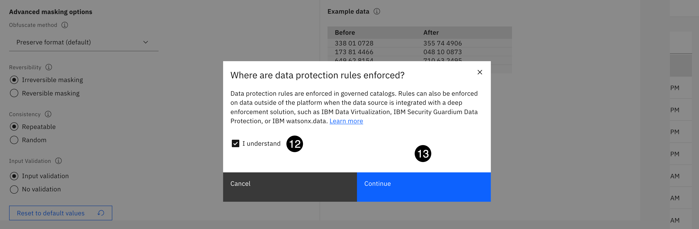

---
---

A **Successfully created!** message will appear and the new rule is created. 

14. Select the **Rules** breadcrumb in the upper left corner to return to Rules main page.


---
---

You should now see the **3** new data protection rules with a total of 7 rules: **4** governance rules and **3** data protection rules. You have adhered to the governance rules defined by the business to protect all National Identifiers (i.e. US Social Security Numbers), Email Addresses and Phone Numbers.


---
---

## 5. Associate Rules to Policy
---
In this step, the governance and data protection rules will be associated to the governance policy so they are cross-referenced in the business glossary, and so everyone in the organization understands the data protection rules that are enforcing the requirements of the organization's governance policy and rules.

1. Select the **Navigation** menu (the 4 stacked horizontal lines in the upper left corner).


---
---

2. Select the **Governance &gt; Policies** menu.


---
---

3. Select the **Protection of Sensitive Personal Information** policy.


---
---

Scroll down to the **Rules** section.

4. Click the **Add rules +** button.


---
---

5. Select the checkbox next to the **All Birth Dates Must be Protected** rule.
6. Select the checkbox next to the **All Email Addresses Must be Protected** rule.
7. Select the checkbox next to the **All National Identifiers Must be Protected** rule.
8. Select the checkbox next to the **All Phone Numbers Must be Protected** rule.
9. Click the **Add** button.


---
---

**Do not** click the **Send for approval** button yet. Scroll down to the **Data protection rules** section.

10. Click the **Add data protection rules +** button.


---
---

11. Select the checkbox next to the **Protect Date of Birth** rule.
12. Select the checkbox next to the **Protect Email Addresses** rule.
13. Select the checkbox next to the **Protect US Phone Numbers** rule.
14. Select the checkbox next to the **Protect US Social Security Numbers** rule.
15. Click the **Add** button.


---
---

All of the governance and data protection rules now assigned to the policy. Scroll **down** to the bottom of the page to the **Related artifacts** section.

**&#9432;** **Notice:** that the business terms that describe sensitive data elements are assigned to the policy along with all the classifications. These were added when the policy was imported during the creation process. This is a well defined, published policy for everyone to easily understand and adhere to.

Since the policy has been updated, it has to be sent for approval to the **Privacy Steward** who will review and publish the changes. This is the **Data Privacy Artifacts** governance workflow in action, simulating how it would work in an actual implementation.

16. Click the **Send for approval** button.


---
---

17. Click the **Copy** button below and paste the value into the **Comment** field:
```
The data protection rules have been created as required and the governance and data protection rules have been assigned to the policy for everyone to easily understand and adhere to them. Please approve and publish these changes.
```
18. Click the **Send for approval** button.


This action can take several minutes to process so please be patient and wait until the **Send for approval** button re-appears and a message is displayed that there is a new notification message and the **Notifications** icon on the toolbar has a red annotation.

---
---

The **Notification** icon on the toolbar (looks like a bell) has a red annotation notifying you that there is **1** new notification message. This was generated because the **Data Privacy Artifacts** workflow definition was configured to notify the workflow **Requestor** (i.e the Data Steward). 

19. Select the **Notification** icon on the toolbar to read the notification message.


---
---

This is only a courtesy informational message that there is a new **Approve Policy Protection of Personal and Sensitive Information** task and that no action needs to be taken. The approval will be done by the **Privacy Steward**.

20. Select the **Notification** icon (looks like a bell) to close the notification messages.


---
---

## 6. Login as the Privacy Steward
---
In order to approve the policy changes that were just sent for approval by the **Data Steward**, logout and login as the **Privacy Steward**.

1. Click the user **Avatar** on the toolbar.
2. Select **Log out** from the menu.


---
---

3. Click the **Log out** button on the confirmation dialog.


---
---

4. Click the **Copy** button below and paste the value into the **Username** field:
```
privacy-steward
```
5. Click the **Copy** button below and paste the value into the **Password** field:
```
cpdpsteward
```
6. Click the **Log in** button. 


---
---

You should now be logged in as the **Privacy Steward** with a **Welcome Privacy Steward!** message on the Cloud Pak for Data home page.


---
---

## 7. Approve Policy Changes
---
In this section, the **Privacy Steward** will review and approve the governance policy changes that were just sent for approval by the **Data Steward**.

There is a notification in the **Notifications** section on the Cloud Pak for Data home page alerting the **Privacy Steward** that there is a task assigned to **Approve Policy Personal and Sensitive...**. This is the task that was just sent for approval by the **Data Steward**.

1. Select the link in the **Notifications** section to **Approve Policy Personal and Sensitive Information**.


---
---

As the **Privacy Steward**, read the comments left by the **Data Steward**. The policy has only been modified and you trust the comments provided by the **Data Steward** are accurate.

2. Click the **Publish** button.


---
---

3. Click the **Copy** button below and paste the value into the **Comment** field:
```
Thank you for adding the data protection rules as instructed and for adding all the rules to the policy for everyone to understand and comply with. I trust your changes and approve this task!
```
4. Click the **Publish** button.


---
---

Now that the policy changes have been approved by the **Privacy Steward**, logout and login as the **Data Steward**.

5. Click the user **Avatar** on the toolbar.
6. Select **Log out** from the menu.


---
---

7. Click the **Log out** button on the confirmation dialog.


---
---

8. Click the **Copy** button below and paste the value into the **Username** field:
```
data-steward
```
9. Click the **Copy** button below and paste the value into the **Password** field:
```
cpdsteward
```
10. Click the **Log in** button. 


---
---

**&#9432;** **Notice:** that the **Notifications** section has a message notifying the **Data Steward** that the **Privacy Steward** has approved and published the **Protection of Personal and Sensitive Information** policy so we'll check it's status. 

11. Select the **Navigation** menu (the 4 stacked horizontal lines in the upper left corner).


---
---

12. Select the **Governance &gt; Policies** menu.


---
---

13. Select the **Protection of Personal and Sensitive Information** policy.


---
---

The governance policy is now published and no longer in a draft status. 


---
---

## Explore Relationships
---
The business vocabulary is fully defined and published, the governance policy and rules are defined and published, and the data protection rules to protect sensitive information are defined and enforceable. During the process of building out the business vocabulary, relationships have been established between these governance artifacts. Using the **Relationship Explorer**, data practitioners and data consumers can easily visualize, explore, and govern metadata by generating a graph to show how governance artifacts and data assets related to each other. It provides a context for reaching a high level of understanding of the metadata.

> This feature is not available by default. It must be enabled by installing the optional **knowledge graph** component of **Knowledge Catalog** (this option has been enabled for this environemt) or **Knowledge Catalog Premium**. Users must have the **Access governance artifacts** and **Manage glossary** permission assigned to use this feature.

We will start the exploration from the **Policy** to get a graphical view of the relationships that were just established between the policy, business terms, categories, classification,data protection rules, and governance rules.

1. Click the **Explore Relationships** button from the policy.

A new tab will open in the browser. This is standard behavior in **Knowledge Catalog** anytime the **Relationship Explorer** is invoked.


---
---

The **Relationship Explorer** welcome dialog is presented. For the sake of time, the tour will not be taken, but feel free to take the tour at the end of the lab.

2. Click **directly** on the **Skip** option, otherwise the **Next** button is chosen.


---
---

If you did not click directly on the **Skip** button (it's a common mistake) the tour appears, select the **X** on the tour dialog to close and stop the tour.


---
---

We'll spend a few minutes on the layout of the explorer to understand how it works. For a more detailed overview, refer to the
[Relationship Explorer Documentation](https://www.ibm.com/docs/en/cloud-paks/cp-data/5.0.x?topic=catalog-exploring-relationships) in the **Cloud Pak for Data 5.0** documentation.

The middle of the explorer is the **Canvas** that will display the graph depending on which related items are selected.

The left side panel controls what **Related** items are available to display. **&#9432;** **Notice:** that the policy we chose to explore has **17** related items: Business terms, Categories, Classifications, Data Protection Rules, and Governance Rules.

The right side panel is the **Canvas Summary** and shows what has been added to the canvas and allows for each item to be expanded if there are multiple items in that item's category. The toolbar has viewing controls (Zoom in and out, and vertical and horizontal positioning), related item removal, undo and redo, and the ability to reset all options back to the default settings. It also has an option to export the graph as a PDF document.

If all **17** of the related items are selected the graph can become very complex and difficult to navigate through. Therefore, we'll start by selecting each item individually and then view the entire graph as a collective whole.


---
---

3. Select the **Business term** checkbox in the **Related items** panel.
4. Open the **Business term** folder in the **Canvas summary** panel.


---
---

5. Clear the **Business term** checkbox in the **Related items** panel.
6. Select the **Category** checkbox in the **Related items** panel.
7. Select the **Zoom to fit** item on the toolbar.
8. Open the **Category** folder in the **Canvas summary** panel.


---
---

9. Clear the **Category** checkbox in the **Related items** panel.
10. Select the **Classification** checkbox in the **Related items** panel.
11. Open the **Classification** folder in the **Canvas summary** panel.


---
---


12. Clear the **Classification** checkbox in the **Related items** panel.
13. Select the **Data Protection Rule** and **Governance Rule** checkboxes in the **Related items** panel.
14. Open the **Data Protection Rule** folder in the **Canvas summary** panel.
15. Open the **Governance Rule** folder in the **Canvas summary** panel.


---
---

16. Clear the **Data Protection Rule** and **Governance Rule** checkboxes in the **Related items** panel.


---
---

Each related item has been viewed individually to demonstrate how to visualize the details with simplicity and clarity and without a lot of clutter. As the final step, all related items will be selected to visualize them on the canvas as an inclusive set.

17. Select the **All related items** checkbox in the **Related items** panel.
18. Use the **Zoom** controls on the toolbar to resize the graph as desired.
19. Open the related items **Folders** in the **Canvas Summary** panel.
20. Click into the **Canvas** and move the graph around to get a feel for how it works.


Close the **Relationship Explorer** tab in your browser and **Go back** to the **Cloud Pak for Data** tab in your browser.

---
---

## Curate and Enrich Data Assets
---
Now that there is a well defined business glossary established with a complete set of published governance artifacts, the data curation process can begin. Data curation is the process of discovering and adding data assets to a project or a catalog, enriching them by assigning classifications, data classes, and business terms, and analyzing and improving the quality of the data.

Curation can be a very labor intensive and time consuming process, and for a lot of organizations, it's mostly done manually where data assets are curated one at a time. Advanced data curation, which is included with **Knowledge Catalog**, and what you will use in this lab, is primarily an automated process where many of the curation tasks are completed automatically for multiple data assets simultaneously.

Depending on the curation tasks performed, the curation of the data assets can happen in a project, a catalog, or both before the data is ready for use by data consumers. This lab will use both. The majority of the data curation tasks will be done in a project before they are published to a governed catalog. Once they are published to the catalog, some additional enrichment will be done in the catalog that are not available from a project. In order to accomplish this, the following data curation steps will be performed.

## 1. Create the Enrichment Project

In this section, the project is created that will be used to create and execute the automated **Metadata import and enrichment** processes to discover and curate the data assets needed by the analytics project team before they are published to the governed **Business** catalog.

This project is very valuable and reusable and the data curation process is repeatable. The metadata imports can be modified to add or remove assets. The metadata enrichment process can be modified to improve data quality and business term and data class assignment accuracy, and the project can learn from the improvements and produce better results. Changes can also be made to the business vocabulary governance artifacts to improve the data curation accuracy and the metadata enrichment process can be run again to take advantage of those changes. After reviewing the metadata enrichment results, existing data assets can be re-published and new data assets can be added to the governed catalog, which is why the **Duplicate asset handling** option was set to **Update original assets** when the **Business** catalog was created.

1. Select the **Navigation** menu (the 4 stacked horizontal lines in the upper left corner).


---
---

2. Select the **Projects &gt; All projects** menu.


---
---

The environment was just provisioned so there should not be any projects defined.

3. Click the **New project+** button.


---
---

4. Click the **Copy** button below and paste the value into the **Name** field:
```
Business Catalog Enrichment
```
5. Click the **Copy** button below and paste the value into the **Description** field:
```
This project is used to import and enrich the metadata for the data assets that will be published to the Business catalog that will be accessible to the analytics project team for analytics and AI tasks.
```
6. Click the **Create** button.


When the project creation is complete, you will be brought into the **Overview** section of the new project.

---
---

### Manage Access Control
---
In order to manage data quality for the project, the **Quality Analyst** needs be added to the project with **Edit** authority.

1. Click the **Manage** tab.

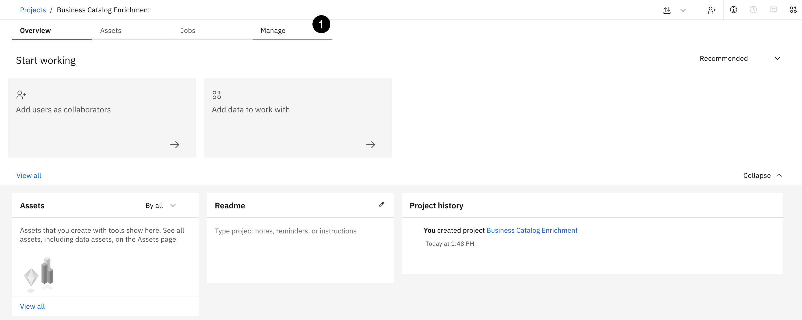

---
---

2. Select the **Access control** project menu.
3. Using the **Add collaborators** dropdown, select **Add users**.


---
---

4. Enter the word **quality** in the search area.
5. Select the checkbox next to the **Quality Analyst** user.
6. Using the **Role** dropdown, select **Editor** for the **Quality Analyst** user.
7. Click the **Add** button.


---
---

### Adjust Project Settings
---
The project **Metadata enrichment** settings are distinct to each project and apply to all metadata enrichment assets created in a project. They are available as global project settings that can be set prior to the creation and execution of metadata enrichment jobs. As a best practice, these settings should be reviewed and adjusted in advance of creating and running metadata enrichment jobs to ensure they will produce the most accurate results.

For this lab, the metadata enrichment **Term assignment** settings that are used by **Knowledge Catalog** to automatically assign business terms will be adjusted. The machine learning and Data-class-based-assignments will be turned off and only the **Name matching** term assignment method will be used to influence the metadata enrichment process to produce more accurate results.

Machine learning and the default settings are beneficial and typically produce a good first attempt at analyzing data content, but sometimes those methods are not enough and it takes the knowledge of a subject matter expert (SME), like a data steward, who has a deep understanding of the data and the business metadata, to adjust the settings to achieve better results. Making just a few adjustments can easily rectify incorrect and inaccurate assignments and suggestions which can save a data steward a lot of time by eliminating the manual effort required to correct them.

1. Select the **Metadata enrichment** settings project menu.
2. Scroll **down** until the **Term assignment** settings are at the top of the page.
3. In the Term assignment methods to use area, clear the **Machine learning** and **Data-class based assignments** check boxes. The only method that will be used and that wil remain selected is **Name matching**.
4. In the Select assets used for training built in model and adjustment area, select the **From Project** radio button.
5. Click the **Assets** tab.

> Setting changes take affect immediately so there is no need to save them once they are updated.


---
---

## 2. Add the Platform Connections
---
The next step is to add the connections to the project that will be used by **Metadata import**. These are the **Platform connections** that were created earlier in the [Define the Data Sources](#Define_the_Data_Sources) section.

### Add PostgreSQL Connection
---
The next step is to add the connections to the project that will be used by **Metadata import**. These are the **Platform connections** that were created earlier in the [Define the Data Sources](#Define_the_Data_Sources) section.

The **PostgreSQL** data source connection contains the **Warehouse** data that was requested by the analytics project team.

1. Click the **Assets** tab.
2. Click the **New asset +** button.


---
---

3. Select the **Connect to data source** goal.


---
---

4. Enter the word **post** into the search area.
5. Select **PostgreSQL** data source type from the left side panel.
6. Click the **Select a platform connection** tab.
7. Select the **PostgreSQL** platform connection radio button.
8. Click the **Next** button.


---
---

9. Click the **Create** button.


---
---

### Add Db2 Warehouse Connection
---
The **Db2 Warehouse** data source connection contains the **Employee** data that was requested by the analytics project team.

1. Click the **New asset +** button.


---
---

2. Select the **Prepare data** goal from the tools menu on the left.
3. Select the **Connect to data source** tool.


---
---

4. Enter the words **db2 warehouse** into the search area.
5. Select the **IBM Db2 Warehouse** data source type from the left side panel.
6. Click the **Select a platform connection** tab.
7. Select the **Db2 Warehouse** platform connection radio button.
8. Click the **Next** button.


9. Click the **Create** button.


You should now see the two new connections in the project.

## 3. Import the Data Assets
---
This section uses the automated **Metadata import** tool to quickly and easily connect to data source connections to discover and add the data assets that are relevant to the enrichment project. The data assets will be imported into the project that was just created and used as input into the **Metadata enrichment** process. **Four** data assets will be discovered and imported to fullfil the data requested by the analytics project team that reside across the **two** disparate data source connections that were just created.

### Import the Employee Data
---
In this step, you will create the **Metadata Import** to import the **Employee** data asset from the **Data Warehouse** connection into the project.

1. Click the **New asset +** button.


---
---

2. Select the **Prepare data** goal from the tools menu on the left.
3. Select the **Import metadata for data assets** tool.


---
---

> The Discover, Import and Get Lineage goals page shown below will only be displayed if the **Knowledge Catalog** metadata pods have been restarted. The instructions on how to restart the metadata pods are provided in step **4. Restart Metadata Pods** in the **Post Provisioning** section of the [Level 4 Pox - CPD Environments](https://cp4d-outcomes.techzone.ibm.com/l4-pox/cp4d/environments) page on this website. If these steps have not been completed, complete them **now** before proceeding.

4. Select the **Discover** goal.
5. Click the **Next** button.


---
---

6. Click the **Copy** button below and paste the value into the **Name** field:
```
Db2 Warehouse Import
```
7. Click the **Copy** button below and paste the value into the **Description** field:
```
Discover and import the Employee data asset and associated metadata that were requested by the analytics project team that reside in the Db2 Warehouse data source.
```
**Do not** enter any tags. These are metadata import tags, not data asset tags. The import automatically adds the data asset's schema, or folder name, as a tag during the import process.

8. Click the **Next** button.


---
---

9. Select **This project (Business Catalog Enrichment)** as the target (it should be selected by default).
10. Click the **Next** button.


---
---

11. Click the **Select connection** button.


---
---

12. Select the **Db2 Warehouse** connection from the Connections list on the left.
13. Select the **Arrow** on the **EMPLOYEE** schema. **Do not select the checkbox** next to the **EMPLOYEE** schema. Doing so will select all tables in the schema.
14. Select the checkbox for the **EMPLOYEE** table from the list.
15. Click the **Select** button.


---
---

16. Click the **Next** button.


---
---

Take the default **Job name** and leave the Run definition to **Run after job creation**.

17. Click the **Next** button.


---
---

Take the default **Advanced options** that are selected for **Update on reimport**.

18. Click the **Next** button.


---
---


Take a minute to review the import before you create it. Your **Scope** is importing **1** data assets from the **Db2 Warehouse** connection into the **Business Catalog Enrichment** project as the Target.

19. Click the **Create** button.


---
---

The import process should run quickly. In a few seconds, you should begin seeing the import process adding the data assets you selected to the Imported assets list. You can click on the **Refresh** button at the top of the page to update the results.


---
---

When the import is complete, you should see a message at the top of the page: **Metadata import complete. 1 assets were imported successfully**. The data asset will appear in the Imported assets list and is now added to the project.

20. Select the **Business Catalog Enrichment** project breadcrumb at the top of the page to get back to the project home page.


---
---

### Import the Warehouse Data
---
In this step, you will create the **Metadata Import** to import the **Warehouse** data assets from the **PostgreSQL** connection into the project.

1. Click the **New asset +** button.


---
---

2. Select the **Prepare data** goal from the tools menu on the left.
3. Select the **Import metadata for data assets** tool.


---
---

4. Select the **Discover** goal.
5. Click the **Next** button.


---
---

6. Click the **Copy** button below and paste the value into the **Name** field:
```
PostgreSQL Import
```
7. Click the **Copy** button below and paste the value into the **Description** field:
```
Discover and import the Warehouse data assets and associated metadata that were requested by the analytics project team that reside in the PostgreSQL data source.
```
**Do not** enter any tags. These are metadata import tags, not data asset tags. The import automatically adds the data asset's schema, or folder name, as a tag during the import process.

8. Click the **Next** button.


---
---

9. Select **This project (Business Catalog Enrichment)** as the target (It should be selected by default).
10. Click the **Next** button.


---
---

11. Click the **Select connection** button.


---
---

12. Select the **PostgreSQL** connection from the Connections list on the left.
13. Enter the word **warehouse** in the schema search area.
14. Select the **Arrow** on the **WAREHOUSE** schema. **Do not select the checkbox** next to the **WAREHOUSE** schema. Doing so will select all tables in the schema. This method shows you what tables are in the schema so you can see exactly what will be imported.
15. Select the checkbox next to the **WAREHOUSE_SHIFTS, WAREHOUSE_STAFF, and WAREHOUSE_STAFFING** tables.
16. Click the **Select** button.


---
---

17. Click the **Next** button.

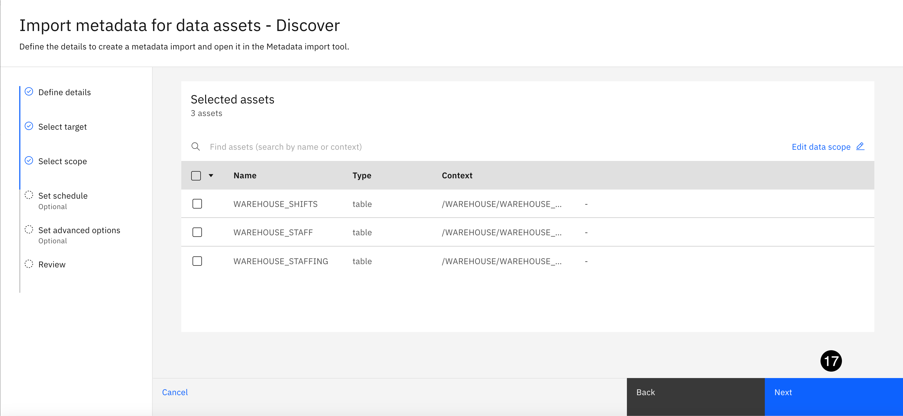

---
---

Take the default **Job name** and leave the Run definition to **Run after job creation**.

18. Click the **Next** button.


---
---

Take the default **Advanced options** that are selected for **Update on reimport**.

19. Click the **Next** button.


---
---

Take a minute to review the import before you create it. Your **Scope** is importing **3** data assets from the **PostgreSQL** connection into the **Business Catalog Enrichment** project as the Target.

20. Click the **Create** button.


---
---

The import process should run quickly. In a few seconds, you should begin seeing the import process adding the data assets you selected to the Imported assets list. You can click on the **Refresh** button at the top of the page to update the results.


---
---

When the import is complete, you should see a message at the top of the page: **Metadata import complete. 3 assets were imported successfully**. The data assets will appear in the Imported assets list and are now added to the project.

21. Select the **Business Catalog Enrichment** breadcrumb at the top of the page to get back to the project home page.


---
---

## 4. Enrich the Data Assets
---
This section uses the automated **Metadata enrichment** tool provided by **Knowledge Catalog** to enrich the data assets that were discovered and imported during the **Metadata import** processes that was just completed. Metadata imports can be used as input into **Metadata enrichment** processes to automatically profile the data, analyze and assess data quality, and assign data classifications and business terms by leveraging governance artifacts defined in the business glossary.

This is where all the work that was done up front building out a complete, meaningful, and cross-referenced business glossary, to establish a business ready governance foundation, pays dividends. Metadata enrichment can now leverage the data classes and business terms and automatically assign them and make suggestions during the metadata enrichment process. This saves organizations a tremendous amount of time and resources by alleviating the manual effort that would have been involved to accomplish the same result.

1. Click the **New Asset +** button.


---
---

2. Select the **Prepare data** goal from the tools menu on the left.
3. Select the **Enrich data assets with metadata** tool.


---
---

4. Click the **Copy** button below and paste the value into the **Name** field:
```
Business Catalog Enrichment
```
5. Click the **Copy** button below and paste the value into the **Description** field:
```
Enrich the metadata for all the data assets that are being published to the Business catalog for the analytics project team.
```
**Do not** enter any tags. These are metadata enrichment tags, not data asset tags.

6. Click the **Next** button.


---
---

7. Click the **Select data from project** button.


---
---

8. Select the **Metadata Import** from the Asset types list on the left.
9. Select the **high level** checkbox in the **Metadata Imports** section to select all the metadata imports you just completed.
10. Click the **Select** button.


---
---

11. Click the **Next** button.


---
---

12. Select the checkbox for the **Profile data** Enrichment objective.
13. Select the checkbox for the **Analyze quality** Enrichment objective.
14. Select the checkbox for the **Assign terms** Enrichment objective.
15. Click the **Select categories +** button.


---
---

16. Select the checkbox next to the **[uncategorized]** category.
17. Select the checkbox next to the **Business** category.
18. Click the **Select** button.

**&#9432;** **Notice:** that **4** categories have been included even though only **2** were selected. This is the benefit of using sub-categories. The **Business** parent category was selected and it automatically included the **Employee** and **Data Privacy** sub-categories.


---
---

Scroll **down** to view the **Sampling** options.

19. Select the **Basic** sampling method (it should be selected by default).
20. Click the **Next** button.


---
---

> You can choose one of the predefined sampling methods or customize it based on your organization's requirements. For this lab, the **Basic** sampling method will suffice and execute quickly.

21. Select **All data assets** for the Data scope of reruns option (it should be selected by default).
22. Click the **Next** button.


---
---

Take a minute to review the metadata enrichment before creating it. The **Data Scope** will be analyzing **2** data assets (these are the 2 metadata imports that contain the 4 data assets that were just created) with an enrichment **Objective** to **Profile data**, **Analyze quality** and **Assign terms** across **5 Categories** using the **Basic** sampling method.

23. Click the **Create** button.


---
---

The enrichment process will take approximately 2 minutes to complete. The status will change from **Not analyzed** to **In progress** to **Finished**.

24. Select the **Refresh** button to update the status and monitor the progress.


---
---

Eventually a message will appear notifying you that the **Metadata enrichment completed** with a **Refresh** button.

25. Select the **Refresh** button.
26. Select the **X** in the top right corner of the **About this metadata enrichment** panel to close it to view the data asset enrichment status.


---
---

All data assets should have a status of **Finished**. This is the definitive notification that the enrichment process has completed for all data assets. Now that the enrichment process is complete the **Asset** and **Column** results can be reviewed. The **Metadata Enrichment** process automatically profiled all of the data assets, analyzed data quality at the data asset and column level, assigned and suggested business terms for all the data assets and columns, and assigned data classes for all columns of the data assets.


---
---

## 5. Review Asset Enrichment
---
**&#9432;** **Notice:** that data classes are **not assigned** at the asset level and that **no** business terms were assigned at the asset level. It is more important to have business terms automatically assigned at the column level, especially if business terms are being used to trigger data protection rule actions. Business terms at the data asset level are primarily for informational purposes to notify users that data assets may contain personally identifiable or sensitive data, and to provide additional information about data asset content in the lineage tab and so users do not have to view the actual data. Asset business term assignments will be rectified in step [7. Rectify Asset Enrichment](#6._Rectify_Asset_Enrichment) below.

**&#9432;** **Notice:** that all of the data assets **do not** have a primary key assigned, but that all of them except for the **WAREHOUSE_STAFFING** data asset have primary key suggestions. Primary keys assignments will be rectified in step [7. Rectify Asset Enrichment](#6._Rectify_Asset_Enrichment) below.

The data quality scores at the asset level are excellent. The **EMPLOYEE** data asset has a data quality score of **98.6%** and all the **WAREHOUSE** data assets have a data quality score of **100%**. The data quality dimensions and details for each data asset can be drilled into to determine what is contributing to the overall quality score. The **Quality Analyst** will be taking a much deeper look into the overall data quality of this metadata enrichment result in the upcoming [Manage Data Quality](#Manage_Data_Quality) section.


## 6. Review Column Enrichment
---
Before reviewing the columns results for this metadata enrichment, remember that a significant amount of time and effort was spent building out a complete business vocabulary with well defined reference datasets for termination codes and values, **15** new data classes were defined with very detailed and specific matching methods and criteria, and **29** business terms were defined that were specific to every single column for all the data assets included in the metadata enrichment.

This is **extremely important** because, as stated earlier, the more time and effort invested up front building out a well defined and accurate business glossary delivers **significant benefits** downstream, with better outcomes produced during the metadata enrichment data curation process. Spending less time rectifying incorrect and missing metadata assignments results in minimal to zero time spent by data practitioners so they can deliver data faster to the data consumers that need the data for analytics and AI.

1. Click the **Columns** tab.

Scroll **down** the list of columns to review the business term and data class assignments. Pay close attention to the data class assignments for these **5** columns:  **Birth Date**, **Email**, **SSN**, **Fax** and **Work Phone**. They are being protected by the data protection rules that were created earlier so their data class assignments have to be set to **Date of Birth**, **Email Address**, **US Social Security Number** and **US Phone Number** (Fax and Work Phone are US phone numbers) respectively. 

> **Metadata enrichment** can be unpredictable. This lab was tested many times over with the same results produced. If for some reason your results for the other non sensitive columns are different, don't worry about them and move on. However, the columns listed above are the most important and need to be assigned the correct data class. If they are not then set them to the proper data class in the screen shots below.


---
---

### Business Term Assignment
---
**All 31** columns were assigned a definitive business term with zero suggestions. This is a result of setting the Metadata enrichment **Term assignment** setting to assign business terms based on column **Name only**. There is **no additional enrichment** work that needs to be done to business term assignments.

> **Knowledge Catalog** considers suggested business term assignments as missing assignments until the suggestions are accepted and applied to the column as a valid business term.

### Data Class Assignment
---
**All 31** columns were assigned a definitive data class from the **Business** and **[uncategorized]** categories with zero suggestions. This is a result of the well defined and detailed matching methods and criteria specified in the default data classes supplied out of the box by **Knowledgge Catalog** and the **15** data classes that were imported and defined in the **Business** category that also have well defined matching methods and criteria to help **Knowledge Catalog** producte a **100%** assignment rate. AFter the lab is completed, take some time to go back to the **15** data classes defined in the **Business** category to take a look at some of the matching methods and criteria that was used. Some use regular expressions, some use lists, and the **Termination Code** data class uses the **Termination Lookup** reference dataset as the matching method.

There is **no additional enrichment** work that needs to be done to data class assignments.

This is valuable information for the data steward because it validates the accuracy and completeness of the business glossary. The business term definitions in the business glossary are accurate and with a single modification to the metadata enrichment project settings, the accuracy rate of the metadata enrichment business term assignment process was 100%. Data class assignment was also 100% accurate by leveraging the default **Knowledge Catalog** data class definitions and by adding new data class with the proper matching methods and criteria.

### Data Quality Assessment
---
As noted when reviewing the data assets, the **EMPLOYEE** data asset has a quality score of **98.6** so it is inevitable that some of the column data quality scores are going to be below 100%. The **Quality Analyst** will be looking into data quality in more depth in an upcoming step but we can spend a few minutes to take a look at what columns are contributing to the lower quality score.

Scroll **up** to the top of the page.

2. Click the **Data quality** column header to sort the columns in descending order (Arrow pointing up).

There are **5** columns from the **EMPLOYEE** data asset that are contributing to the lower quality score with **Zip Code** having the lowest score. The **Quality Analyst** will dive deeper into these quality issues in an upcoming step so we will continue with the data curation process.


---
---

### Mark as Reviewed
---
Since there is **no additional** column level assignment rectification that needs to be done, the columns can be marked as reviewed.

3. Select the **high level** checkbox to select **all columns** in the list.
4. Using the **More** action dropdown on the toolbar, select **Mark as reviewed**.


---
---

5. Click the **Done** button.


---
---

6. Click the **Refresh** button in the top right corner of the message displayed.


---
---

The **Review status** columns now has a **check mark** next to all the columns.

7. Click the **Assets** tab.


---
---

## 7. Rectify Asset Enrichment
---
In this step, business terms will be added to all the **Assets** and primary key suggestions will be reviewed and accepted. **Knowledge Catalog** considers suggested metadata (business terms, data classes and primary keys) as missing so they are not considered during any decision making processes. Therefore, it is a best practice to review all suggestions and either remove or accept them.

### Rectify EMPLOYEE Data Asset
---

1. Hover over the **Business terms** column of the **EMPLOYEE** asset, click the **View more** link that appears.
2. Click the **+** sign in the **Business terms** section of the **Governance** tab.


> Selecting the **View more** link for business terms automatically opens the **Governance** tab of the information panel on the right.

---
---

3. Select the checkbox next to the **Date of Birth** business term.
4. Select the checkbox next to the **Email** business term.
5. Select the checkbox next to the **Fax** business term.
6. Scroll **down** to the bottom of he list, **Do not** click the **Assign** button until you are instructed.


---
---

7. Select the checkbox next to the **Work Phone** business term.
8. Select the checkbox next to the **SSN** business term. 
9. Click the **Assign** button. Multiple dialog boxes will appear with notification that the business terms were assigned.


---
---

10. Hover over the **Primary key** column of the **EMPLOYEE** asset, click the **View more** link that appears.
11. Scroll **down** in the **Keys** tab of the right side panel.
12. Click the **Assign** button for the **EMPLOYEE_CODE** column in the **Keys** tab. A dialog boxes will appear notifying you that the primary key was assigned.


> Selecting the **View more** link for primary keys automatically opens the **Keys** tab of the information panel on the right.

---
---

### Rectify WAREHOUSE_SHIFTS Data Asset
---

1. Hover over the **Business terms** column of the **WAREHOUSE_SHIFTS** asset, click the **View more** link that appears.
2. Click the **+** sign in the **Business terms** section of the **Governance** tab.


---
---

3. Using the **search area**, enter the word **shift**.
4. Select the checkbox next to the **Shift Duration** business term.
5. Select the checkbox next to the **Shift Day** business term.
6. Select the checkbox next to the **Shift Start Hour** business term.
7. Select the checkbox next to the **Shift Shift ID** business term.
8. Click the **Assign** button. Multiple dialog boxes will appear notifying you that the business terms were assigned.


---
---

9. Hover over the **Primary key** column of the **WAREHOUSE_SHIFTS** asset, click the **View more** link that appears.
10. Click the **Assign** button for the **SHIFT_ID** column in the **Keys** tab. A dialog boxes will appear notifying you that the primary key was assigned.


---
---

### Rectify WAREHOUSE_STAFF Data Asset
---

1. Hover over the **Business terms** column of the **WAREHOUSE_STAFF** asset, click the **View more** link that appears.
2. Click the **+** sign in the **Business terms** section of the **Governance** tab.


---
---

3. Using the **search area**, enter the words **skill**.
4. Select the checkbox next to the **Skill Set** business term.
5. Select the checkbox next to the **Skill Required** business term.
6. Select the checkbox next to the **Skill Experience** business term.
7. Click the **Assign** button.


---
---

8. Hover over the **Primary key** column of the **WAREHOUSE_STAFF** asset, click the **View more** link that appears.
9. Click the **Assign** button for the **EMPLOYEE_CODE** column in the **Keys** tab. A dialog boxes will appear notifying you that the primary key was assigned.


---
---

### Rectify WAREHOUSE_STAFFING Data Asset
---

1. Hover over the **Business Terms** column of the **WAREHOUSE_STAFFING.csv** asset, click the **View more** link that appears.
2. Click the **+** sign in the **Business terms** section of the **Governance** tab.


---
---

3. Select the checkbox next to the **Day** business term.
4. Select the checkbox next to the **Employee Code** business term.
5. Scroll **down** until to the **Max Shifts** business term.


---
---

6. Select the checkbox next to the **Max Shifts** business term.
7. Click the **Assign** button. A dialog boxes will appear notifying you that the primary key was assigned.


---
---

8. Select the **WAREHOUSE_STAFFING** data asset.

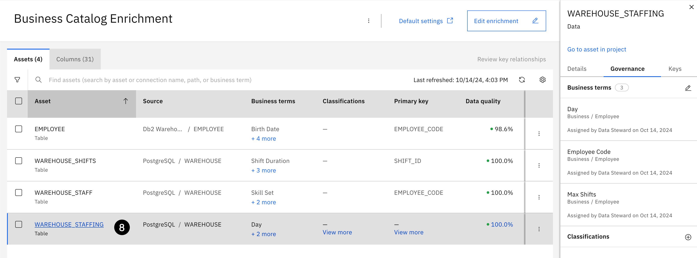

---
---

9. Select the **checkbox** next to the **EMPLOYEE_CODE** column.
10. Using the **More** dropdown from the toolbar, select **Assign as primary key**.

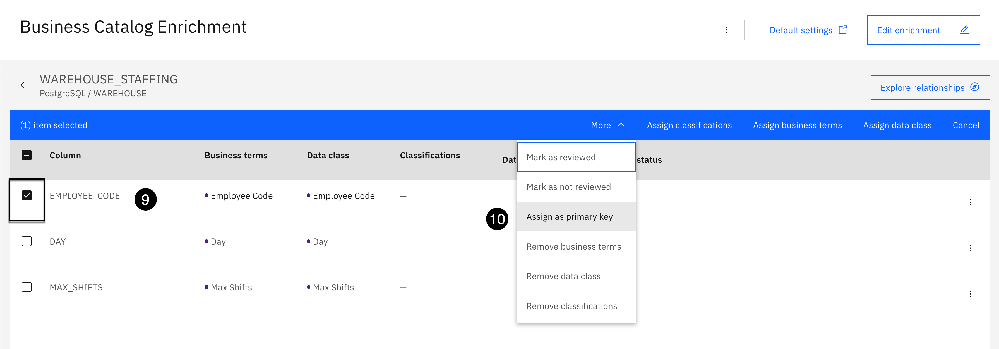

---
---

11. Click the **Back** button (indicated by an arrow pointing to the left) to go back to the **Asset** tab.


**&#9432;** **Notice:** that the **EMPLOYEE_CODE** has a primary key indicator.

---
---

**&#9432;** **Notice:** that the **EMPLOYEE_CODE** is now assigned as the primary key.


---
---

### Mark as Reviewed
---
This completes the modifications you will make at the **Asset** level so the status of the **Assets** can be set to **Reviewed**. All assets now have a correct, meaningful and useful set of business terms and primary keys assigned that will provide additional information to help end users understand their content.

1. Select the **high level** checkbox to select all **4** assets in the list.
2. Using the **More** dropdown from the toolbar, select **Mark as reviewed**.


---
---

3. Click the **Done** button.


---
---

4. Click the **Refresh** button in the top right corner of the message displayed.

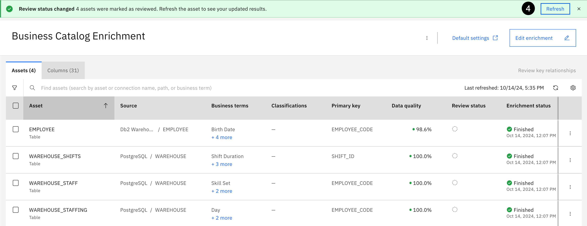

---
---

The **Review status** columns now has a **check mark** next to all the assets indicating that they have been reviewed.

5. Select the **Business Catalog Enrichment** breadcrumb at the top of the page to get back to the project home page.


---
---

## Catalog Governed Data
---
The data curation process is complete and the **Data Steward** is ready to create the governed catalog and publish the fully enriched data assets to the catalog so they are ready for use by the analytics project team to accomplish their data and AI analytical objectives.

## 1. Create the Catalog

This section creates the **governed** catalog that will be used to publish the fully enriched data assets that were just discovered and curated. This catalog will be named the **Business** catalog. Do not use a different name because the remainder of this lab makes reference to that catalog name and changing the name will affect the remaining instructions. It's a good best practice to give the catalog a meaningful name based on the client, industry or use case you are conducting during a PoX. Also, when Knowledge Catalog is installed into Cloud Pak for Data it automatically creates a **Platform assets catalog** and a **Default** catalog.

The **Platform assets catalog** is **not** a governed catalog. Which means sensitive, confidential, or personally identifiable information (PII) **is not protected** by data protection rules. It is a Knowledge Catalog "catalog" that is automatically created by the platform to be used to store platform connections that can be shared across the Cloud Pak for Data platform.

The **Default** catalog is a **governed catalog** is created to assist clients in getting started with a pre-defined governed catalog.

1. Select the **Navigation** menu (the 4 stacked horizontal lines in the upper left corner).


---
---

2. Select the **Catalogs &gt; All catalogs** menu.


---
---

3. Click the **New Catalog** button.


---
---

4. Click the **Copy** button below and paste the value into the **Name** field:
```
Business
```
5. Click the **Copy** button below and paste the value into the **Description** field:
```
This catalog stores governed assets used by the business for analytical and AI projects.
```
6. Select the checkbox to **Enforce data protection rules**.


---
---

7. Click the **OK** button when asked to **Permanently enable rule enforcement?**.


> This setting is **mandatory** to establish a **governed** catalog.

---
---

8. Set the the switch to **On** in the **Controls** section to **Alow reporting on asset metadata**.


---
---

9. Click the **OK** button when asked to **Allow reporting on this catalog?**.


> This setting is **mandatory** and needs to be set in order for the **Data Steward** and **Quality Analyst** to report on and query metadata for this catalog. Turning on this setting allows **Knowledge Catalog** to collect metadata about this catalog. It stores the metadata in the internal **Db2** reporting database that was created at the beginning of the lab.

---
---

10. Keep the default option to **Update original assets** in the **Duplicate asset handling** section.
11. Click the **Create** button.

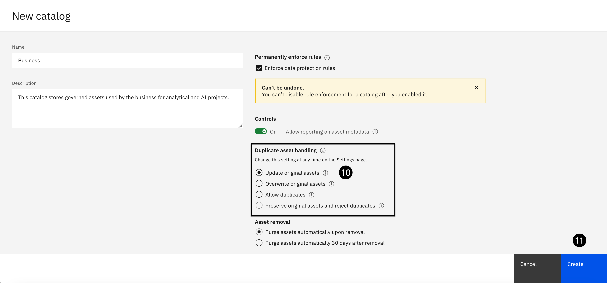

---
---

You will see a notification of: **Creating Business, This might take a minute...**. When the creation of the catalog is complete, you are taken into the new **Business** catalog.


---
---

12. Click the **Access control** tab.
13. Using the **Add collaborators** dropdown, select **Add user group**.


---
---

14. Select **Viewer** for the access level. It should be selected by default.
15. Enter the wold **all** in the Groups search area.
16. Select the **All users** group that appears.


---
---

17. Click the **Add** button.


---
---

18. Select the **Catalogs** breadcrumb at the top of the page to go back to the catalog home page.


---
---

You should now see the new **Business** catalog and the **Platform assets catalog**.

> The **Default** catalog exists but the **Data Steward** has not been given access to that catalog by the **Admin**, who is the owner of the catalog by default, so it does not show up in the list of available catalogs. The **Platform access catalog** is created by default to allow **Viewer** access to the **All users** group.

19. Select the **Navigation** menu (the 4 stacked horizontal lines in the upper left corner).


---
---

20. Select the **Projects &gt; All projects** menu.


---
---

21. Select the **Business Catalog Enrichment** project.


---
---

## 2. Publish Connections
---
In this section, the data source connections will be published one at a time, and in the order listed in the instructions below, to the governed **Business** catalog before any data assets are published. This will place them at the end of the **Recently added** featured assets category in the catalog, leaving room for the data assets to appear front and center, in order of importance, so they are easily found and viewable.

1. Select the **X** in the top right corner of the information panel to close it.
2. From the **Assets types** section on the left, select **Data access &gt; Connections**.


---
---

3. Select the checkbox next to the **PostgreSQL** connection.
4. Click the **Publish to catalog** button on the toolbar.


---
---

5. Make sure the **Business** catalog is selected. It should be selected by default because it is the only **governed** catalog the **Data Steward** has access to.
6. Select the **Next** button.


---
---

7. Click the **Copy** button below and paste the value into the **Description** field:
```
PostgreSQL database that contains the warehouse data needed by the business for analytics and AI.
```
8. Click the **Next** button.


---
---

9. Click the **Publish** button.


---
---

10. Select the checkbox next to the **Db2 Warehouse** connection.
11. Click the **Publish to catalog** button on the toolbar.


---
---

12. Make sure the **Business** catalog is selected. It should be selected by default.
13. Select the **Next** button.


---
---

14. Click the **Copy** button below and paste the value into the **Description** field:
```
Db2 Warehouse database that contains employee data needed by the business for analytics and AI projects.
```
15. Click the **Next** button.


---
---

16. Click the **Publish** button.


---
---

## 3. Publish Data Assets
---
In this section, the data assets will be publish to the **Business** catalog. Like connections, the data assets are published in a specific order, so that the **Recently Added** eatured assets category in the catalog gets populated properly. The **WAREHOUSE** data assets will get published first and the **EMPLOYEE** data asset will get published last.

1. From the **Assets types** section on the left, select **Data &gt; Data assets**.


### Publish WAREHOUSE_SHIFTS Data Asset
---
---

1. Select the checkbox next to the **WAREHOUSE_SHIFTS** data asset.
2. Click the **Publish to catalog** button on the toolbar.


---
---

3. Make sure the **Business** catalog is selected. It should be selected by default.
4. Select the **Next** button.


---
---

5. Click the **Copy** button below and paste the value into the **Description** field:
```
Shift information for all departments within the warehouse.
```
6. Click the **Next** button.


---
---

7. Click the **Publish** button.


### Publish WAREHOUSE_STAFF Data Asset
---
---

1. Select the checkbox next to the **WAREHOUSE_STAFF** data asset.
2. Click the **Publish to catalog** button on the toolbar.


---
---

3. Make sure the **Business** catalog is selected. It should be selected by default.
4. Select the **Next** button.


---
---

5. Click the **Copy** button below and paste the value into the **Description** field:
```
All employee that work as staff members in the warehouse processing orders.
```
6. Click the **Next** button.


---
---

7. Click the **Publish** button.


### Publish WAREHOUSE_STAFFING Data Asset
---
---

1. Select the checkbox next to the **WAREHOUSE_STAFFING** data asset.
2. Click the **Publish to catalog** button on the toolbar.


---
---

3. Make sure the **Business** catalog is selected. It should be selected by default.
4. Select the **Next** button.


---
---

5. Click the **Copy** button below and paste the value into the **Description** field:
```
The days of the week and maximum shifts that staff members are available to work warehouse shifts.
```
6. Click the **Next** button.


---
---

7. Click the **Publish** button.


### Publish EMPLOYEE Data Asset
---
---

1. Select the checkbox next to the **EMPLOYEE** data asset.
2. Click the **Publish to catalog** button on the toolbar.


---
---

3. Make sure the **Business** catalog is selected. It should be selected by default.
4. Select the **Next** button.


---
---

5. Select the checkbox to **Go to the catalog after publishing it**.
6. Click the **Copy** button below and paste the value into the **Description** field:
```
Official and current Employee master.
```
7. Click the **Next** button.


---
---

> Since the **Go to the catalog after publishing it** option was selected, you will leave the project and be brought into the **Business** catalog
when the **Publish** button is clicked.

8. Click the **Publish** button.


---
---

## Augment Cataloged Data
---
In this section, additional metadata will be added to the cataloged data assets that were just published like classifications, related assets, tags, and reviews so data consumers can better understand and trust the data content and to contribute further to the knowledge base of the **Knowledge Catalog** search engine to make it easier for users to find what they are looking for.

> Knowledge Catalog orders reviews in the **Highly rated** category from the highest to lowest rating. If more than one review for a data asset has the same rating, it orders the same rated reviews in the order they were entered into the catalog, which is why the cataloged assets are being enriched in the order listed below. Reviews provide social commentary from users of data assets to help others make informed decisions related to the quality, completeness, and usage of the data for analytical use cases.

Upon entering the catalog, the **Featured assets** categories of the catalog are front and center. Notice that the **Recently added** category has all of the data assets and connections listed in the order they were published.

1. Click the **Hide featured assets** button to hide the section. 


> Hiding the **Featured assets** categories provides easier access to the catalog asset list that will be used to complete the remaining tasks in this section for the assets in the catalog.

---

## 1. PostgreSQL Metadata
---
In this step, related assets and tag metadata will be added to the **PostgreSQL** connection.

1. Select the **PostgreSQL** connection from the asset list.


---

### Add Related Assets
---
---

1. Using the **Add related items** dropdown, select **Add related assets**.


---
---

2. Select **Contains** as the relationship type.
3. Click the **Next** button.


---
---

The screen shot below has the **Workspace** dropdown open to show the options available. This feature allows for data asset and governance artifact relationships to be added to an asset in the catalog that exist across the platform: **Catalog, Project and Deployment** (i.e. Deployment spaces). It is displayed for informational purposes only. By default, it is set to **Catalog**, which is the correct choice, and there is **no need to change this setting** for any of the steps below that add related assets to data assets in the catalog.

4. Select the checkbox next to the **WAREHOUSE_SHIFTS** asset.
5. Select the checkbox next to the **WAREHOUSE_STAFF** asset.
6. Select the checkbox next to the **WAREHOUSE_STAFFING** asset.
7. Click the **Add** button.


---

### Add Tags
---
---

1. In the **Tags** section of the **About this asset** panel, click the **Add** button.


---
---

2. Using the **Search tags** dropdown, select the **WAREHOUSE** tag.


---
---

3. Click the **Apply** button.
4. Click the **Business** breadcrumb on the toolbar to get back to the asset list.


---

## 2. Db2 Warehouse Metadata
---
---

In this step, classifications, related assets and tag metadata will be added to the **Db2 Warehouse** connection.

1. Select the **Db2 Warehouse** connection from the asset list.


---

### Add Classifications
---

1. Select the **Add classifications +** button in the **Classifications** section.


---
---

1. Select the checkbox next to the **Sensitive Information** classification.
2. Select the checkbox next to the **Personal Information** classification.
3. Select the checkbox next to the **Personally Identifiable Information** classification.
4. Click the **Save** button.


---

### Add Related Assets
---

1. Using the **Add related items** dropdown, select **Add related assets**.


---
---

2. Select **Contains** as the relationship type.
3. Click the **Next** button.


---
---

4. Select the checkbox next to the **EMPLOYEE** asset.
5. Click the **Add** button.


---

### Add Tags
---

1. In the **Tags** section of the **About this asset** panel, click the **Add** button.


---
---

2. Using the **Search tags** dropdown, select the **EMPLOYEE** tag.


---
---

3. Click the **Apply** button.


---

### Add Reviews
---

1. Click the **Review** tab.
2. Click the **5th** star to the far right to assign a **5 Star** rating.
3. Click the **Copy** button below and paste the value into the **Comments** area:
```
Contains all governed, trusted and quality data approved and published by the data governance team to use for analytical and AI projects. Some of the data is sensitive but data protection rules are in place to govern it.
```
4. Click the **Submit** button.


---
---

5. Select the **Business** breadcrumb on the toolbar to get back to the asset list.


---

## 3. Employee Metadata
---

1. Click the **EMPLOYEE** data asset from the asset list.


---
---

**Notice** the data quality scores for the columns as well as the business term and data class assignments. All that metadata was inherited from the work that was done during the metadata enrichment process. Similar to the metadata enrichment process, that benefited from a detailed and fully published business glossary, the work done in the metadata enrichment project is paying dividends as the governed catalog is published and augmented. This will also be the case for the **Warehouse** data assets that were published from the metadata enrichment project.

2. Scroll **down** the Overview section until the **Governance artifacts** section is at the top of the page.


---

### Add Classifications
---

1. Select the **Add classification +** button in the **Classifications** section.


---
---

2. Select the checkbox next to the **Sensitive Information** classification.
3. Select the checkbox next to the **Personal Information** classification.
4. Select the checkbox next to the **Personally Identifiable Information** classification.
5. Click the **Save** button.


---

### Add Related Assets
---

1. Scroll **down** to the **Related items** section.
2. Using the **Add related items** dropdown, select **Add related assets**.


---
---

3. Using the search area, enter the word **related**.
4. Select **Is Related to** as the relationship type.
5. Click the **Next** button.


---
---

6. Select the checkbox next to the **WAREHOUSE_STAFF** asset.
7. Select the checkbox next to the **WAREHOUSE_STAFFING** asset.
8. Click the **Add** button.


---

### Add Tags
---

1. Scroll **down** to the bottom of the **Overview** section to see the new **Related items** that were added.
2. Scroll **down** in the **About this asset** panel to the **Tags** section.
3. Click the **Edit** button (looks like a pencil) in the **Tags** section.


---
---

4. Using the **Search tags** dropdown, select the **WAREHOUSE** tag.


---
---

5. Click the **Apply** button.


---

### Add Reviews
---

1. Click the **Review** tab.
2. Click the **5th** star to the right to assign a **5 Star** rating.
3. Click the **Copy** button below and paste the value into the **Comments** area:
```
Contains governed and trusted employee data to use for business analytical projects. This is the full company employee record master. It contains sensitive and personal information, but the data governance office has defined data protection rules to govern that information.
```
4. Click **Submit**.


---
---

5. Select the **Business** breadcrumb on the toolbar to get back to the list.


---

## 4. Warehouse Staff Metadata
---

1. Select the **WAREHOUSE_STAFF** data asset from the asset list.


---

### Add Related Assets
---

1. Scroll **down** to the bottom of the **Overview** section to the **Related items** section.
2. Using the **Add related items** dropdown, select **Add related assets**.


---
---

3. Using the search area, enter the word **related**.
4. Select **Is Related to** as the relationship type.
5. Click the **Next** button.


---
---

6. Select the checkbox next to the **WAREHOUSE_SHIFTS** asset.
7. Select the checkbox next to the **WAREHOUSE_STAFFING** asset.
8. Click the **Add** button.


---

### Add Reviews
---

1. Click the **Review** tab.
2. Click the **4th** star, second from the right, to assign a **4 Star** rating.
3. Click the **Copy** button below and paste the value into the **Comments** area:
```
Contains up to date information about all employees who are staff members that work in the warehouse processing customer orders. It can be used for analytics and AI but it does not contain the employee's name so it must be combined with the EMPLOYEE data.
```
4. Click **Submit**.


---
---

5. Select the **Business** breadcrumb on the toolbar to get back to the list.


---

## 5. Warehouse Staffing Metadata
---


1. Click the **WAREHOUSE_STAFFING** data asset from the asset list.

### Add Related Assets
---

1. Using the **Add related items** dropdown, select **Add related assets**.


---
---

2. Using the search area, enter the word **related**.
3. Select **Is Related to** as the relationship.
4. Click the **Next** button.


---
---

5. Select the checkbox next to the **WAREHOUSE_SHIFTS** asset.
6. Select the checkbox next to the **WAREHOUSE_STAFF** asset.
7. Click the **Add** button.


---

### Add Reviews
---

1. Click the **Review** tab.
2. Click the **4th** star, second from the right, to assign a **4 Star** rating.
3. Click the **Copy** button below and paste the value into the **Comments** area:
```
Contains accurate availability; days of the week and maximum number of shifts, for employees who are staff members in the warehouse to optimize the schedule needed to maximize customer order fulfillment. However, it only contains the employee code so it must be combined with the EMPLOYEE data asset.
```
4. Click **Submit**.


---
---

5. Click the **Business** breadcrumb on the toolbar to get back to the list.


---

## 6. Warehouse Shifts Metadata
---


1. Click the **WAREHOUSE_SHIFTS** data asset from the assets list.

### Add Related Assets
---

1. Scroll **down** to the bottom of the **Overview** section to the **Related items** section.

**Notice** that the **WAREHOUSE_STAFF** and **WAREHOUSE_STAFFING** data assets are already added as related data assets because the **WAREHOUSE_SHIFTS** data asset was added to both of them previously. No further data assets needs to be added as related assets.


---

### Add Reviews
---

1. Click the **Review** tab.
2. Click the **4th** star, second from the right, to assign a **4 Star** rating.
3. Click the **Copy** button below and paste the value into the **Comments** area:
```
Contains valid and current shift information needed to optimize the best staffing schedule to maximize customer order fulfillment. However, it is only useful for analysis when combined with the EMPLOYEE, WAREHOUSE_STAFF and WAREHOUSE_STAFFING data assets.
```
4. Click **Submit**.


---
---

5. Click the **Business** breadcrumb on the toolbar to get back to the list.


---
---


6. Click the **Show featured assets** button to display the featured assets categories.

---
---


---
---

## Initiate Reporting
---
In this section, the **Data Steward**, who was assigned the **Reporting Administrator** role, will initiate **Knowledge Catalog** reporting to synchronize governance artifact and asset metadata from the categories, project, and catalog there were created and populated to the internal **Db2** database that was created earlier. By doing so, the data in the reporting database can queried using SQL and can also be used to build dashboards using the **Cognos embedded dashboard**. In this lab, SQL will be used to query the database and produce reporting results.

## 1. Setup Reporting
---
In this step, the **Data Steward**, acting as the reporting administrator, will go into the governance and catalog settings of **Cloud Pak for Data** to setup and start **Knowledge Catalog** reporting. This has to happen first before any data is available in the reporting database to query.

1. Select the **Navigation** menu (the 4 stacked horizontal lines in the upper left corner).


---
---

2. Select **Administration &gt; Governance and catalogs** from the menu.


---
---

3. Select the **Reporting setup** tile.


---
---

4. Select the **DB2INST1** schema.
5. Click the **Select** button.


---
---

6. Select **Catalog** from the left side menu.
7. Set the **Reporting switch** to **Enabled** for the **Business** catalog.
8. Set the **Reporting switch** to **Enabled** for the **Platform assets catalog**.


---
---

9. Select **Projects** from the left side menu.
10. Set the **Reporting switch** to **Enabled** for the **Business Catalog Enrichment** project.


---
---

11. Select **Categories** from the left side menu.
12. Set the **Reporting switch** to **Enabled** for the **Business** category.
13. Set the **Reporting switch** to **Enabled** for the **[uncategorized]** category.


---
---

14. Select **Others** from the left side menu.
15. Set the **Reporting switch** to **Enabled** for **Data protection rules**.
16. Set the **Reporting switch** to **Enabled** for **Workflow configurations**.
17. Click the **Start reporting** button.


---
---

Click the **Continue** button in the confirmation dialog.

A message will appear with notification that the reporting synchronization process is starting. The synchronization process takes about 10-15 minutes to complete. The process is running in the background and the status will continue to be updated with a completion percentage.


---
---

Wait until the synchronization is complete and the Reporting Status turns to **Established** before continuing to the next step to query the reporting database.


---
---

## 2. Query the Reporting Database
---
In this step, the internal **Db2** database, that is being used as the **Knowledge Catalog** reporting database, will be accessed through the **Data management console** (which is installed in this environment for this purpose) to view one of the **Knowledge Catalog** tables that was created during the setup process and to run a SQL query against the table using the **Db2** SQL editor.

1. Select the **Navigation** menu (the 4 stacked horizontal lines in the upper left corner).


---
---

2. Select **Data &gt; Databases** from the menu.


---
---

3. Using the **Ellipses** menu on the database, select **Open database**.

> It will take a few minutes for the **Data management console** to initialize and for the database to open.


---
---

4. Open the the **Summary** menu.
5. Scroll **down** to the **Data** section. Open the **Data** section and select **Tables**.


---
---

6. Click on the **DB2INST1** schema to open a list of tables (there are over 100).
7. Scroll **down** to the **GOVERNANCE_ARTIFACTS** table.
8. Click on the **GOVERNANCE_ARTIFACTS** table.


---
---

9. Click the **View data** button.


---
---

This is just a sample of the type of data that is brought into the reporting database by **Knowledge Catalog** reporting. There is a significant amount of metadata about all the categories, catalogs, projects, data protection rules and more...for data practitioners to browse and query to build very detailed and informative reports to validate the data governance process and to share with other members of the data governance team. It also provides the means to **Export** the data to a **CSV** file for off platform analysis or to load into another reporting tool that is being used by an organization. 

> Spend a few minutes scrolling through the columns and rows of the data to get a better idea of what governance artifact metadata has been collected for governance artifacts.

10. Select the **cpd-database** breadcrumb breadcrumb link in the upper left corner to go back to the database home page.


---
---

Lastly we will run a SQL query against this same table to show how the data can be easily queried and to get a more focused result set.

11. Open the the **Summary** menu.
12. Scroll **down** and select the **Run SQL** menu item.


---
---

13. Click the **Copy** button below and paste the value into the **Query** window:
```
SELECT
  ARTIFACT_TYPE,
  COUNT(*) TOTAL
FROM
  DB2INST1.GOVERNANCE_ARTIFACTS
GROUP BY
  ARTIFACT_TYPE
```
14. Click the **Run all** button.


---
---

15. Hover over the **splitter** bar and **pull it down** to gain more real estate.
16. Click the **Select** statement in the **History** section.

The **Results** tab will open to view the query results.


---
---

The total number for all the governance artifacts in the result set is **exactly what was imported and added** to the business glossary during this lab.


---
---

You can optionally repeat steps 13-16 to run and save one of the other [Sample Queries](https://www.ibm.com/docs/en/cloud-paks/cp-data/5.0.x?topic=catalog-sample-reporting-queries) provided in the **Knowledge Catalog** documentation. To do so, simply Click the **Add new** script button to begin a new query.


---
---

## Login as the Business User
---
The **Data Steward's** work is now complete and will now logout. To get ready for the final section, the **Business User** will login.

1. Click the user **Avatar** on the toolbar.
2. Select **Log out** from the menu.


---
---

3. Click the **Log out** button on the confirmation dialog.


---
---

4. Click the **Copy** button below and paste the value into the **Username** field:
```
business-user
```
5. Click the **Copy** button below and paste the value into the **Password** field:
```
cpdbuser
```
6. Click the **Log in** button. 


---
---

You should now be logged in as the **Business User** with a **Welcome Business User!** message on the Cloud Pak for Data home page.


---
---

## Prepare for Analytics
---
The data governance lifecycle is now complete by providing a fully governed catalog of data assets that are easily accessible, trusted, protected, well understood, and of the highest quality, that will meet the needs of the business. The analytics project team now has the data they need to fullfil their analytical gaols with the confidence that the data they will be using to perform their analytical tasks will produce trusted and reliable outcomes. 

Finally, in this last section, the **Business User** will be able to leverage all the work done by the data governance team to easily search for and find the data needed for their analytics project and then go to the governed catalog to view the data and trust and understand its content. In the process of doing so, they will be taking a tour of the catalog results built by the data governance team.

## 1. Find the Right Data
---
In this step, the global search will be used to look across catalogs, projects and governance artifacts to find relevant data and information assets pertaining to an **employee**.

1. Click into the **Cloud Pak for Data** search area, enter the word **employee**.
2. Using the **Try searching for this..** dropdown, select **Data**.


---
---

The search area should look like the screen shot below:

3. Press the **Enter** or **Return** key on your keyboard.


---
---

In just a few seconds, only the data assets associated with the word **employee** are displayed because **Data** was explicitly included as part of the search criteria, The search engine inspects all projects and catalogs you've been given access to and produces a cumulative result. This is a huge time savings because only **3** data assets associated with the word **employee** are displayed. Without this search criteria there could be hundreds of objects displayed.

> That the **WAREHOUSE_STAFF** and **WAREHOUSE_STAFFING** data assets are also included in the search results. This is due to the **Data Steward** adding **Tags** and **Descriptions** to all the governed data assets and establishing **Relationships** between the data assets.

This is exactly the data that was requested by the project team. Data assets can be selected and accessed directly from the search results, but that method takes you directly to that data asset in the respective catalog. **Knowledge Catalog** also provides the means to go directly to the catalog where the data asset resides. To experience the augmented, automated and intelligent capabilities provided by **Knowledge Catalog**, we will use the catalog selection method. The catalog link, in this scenario, the **Business** catalog, is provided directly underneath the data asset name.

4. Hover over the links directly below the **EMPLOYEE** data asset name and click the **Business** catalog link to go to the **Business** catalog.


---
---

## 2. Review Featured Assets
---
Upon entering the catalog, the **Featured assets** section is front and center. **Featured assets** are intelligently categorized and displayed for quick access to assets without the need to search for them. The catalog automatically keeps track of what’s been **Recently added**, to discover and understand what’s new, **Recommended** assets you might be interested in, and assets that are **Highly rated** with a rating of **3 stars** or higher.


> The data assets in the **Recently added** category were just added by **Data steward** to satisfy the project teams request for **Employee** and **Warehouse** data. Also, the **Featured assets** can be hidden and shown by toggling the featured assets display button.

---
---

1. Click the **Recommended** tab to view the recommended assets.


The **Recommended** category features up to 20 recommended assets. **Knowledge Catalog** uses machine learning to derive a list of assets that you haven't accessed yet based on attributes common to the assets that you've viewed, created, and added to projects, such as tags, asset classification, data classes, data types, asset owners, and asset types. The more assets you access, the better the recommendations.

**&#9432;** **Notice** that all the assets being recommended share a common set of attributes. They contain a tag of **WAREHOUSE**, are owned by the **Data Steward**, have the same asset type etc. Recommendations will change over time based on usage of the catalog. The more assets that are accessed, the better the recommendations.

---
---

2. Click the **Highly rated** tab to view the rated assets.


**Knowledge Catalog** keeps track of what’s **Highly rated** based on reviews that have a rating of **3 stars** or higher. It ranks them from highest to lowest, with social commentary from users of the asset, to help data consumers make decisions about using the data based on what others are saying. The order of highly rated assets has changed over time due to users in the environment writing reviews for data assets. This skews the order and ranking of reviews which affects the integrity of the demo. Therefore, the screen shot below may look different than it was intended.

**&#9432;** **Notice** that the **Db2 Warehouse** connection (the source of the **EMPLOYEE** data asset) and the **EMPLOYEE** data asset have been reviewed and have a **5 star** rating, the highest rating that can be assigned. This is a great indication of the quality and usability of the data and that it comes from a trusted source.

---
---

3. Select the **EMPLOYEE** data asset to review its content and metadata.


---
---

## 3. Review Employee Data
---
The **Columns** section of the **Overview** tab displays content information for every column in the data asset including the Quality score, Type, Description, Business terms, and Data class assignments, so data consumers can get a good understanding of the data content at the column level without having to preview the data or data profile. This metadata was carried over from the metadata enrichment project when the connections and data assets were published to the governed catalog.

The **About this asset** panel contains information about the data asset. Notice that the **Description** that was added in the metadata enrichment project was brought over as well as the **Data Quality** score for the data asset and the data asset **Format**. Again, this is valuable information for data consumers so they can get a better understanding of the data asset content, where the data originated from and an assessment of the overall data quality.


---
---

1. Scroll **down** the **Overview** section to the **Governance artifacts** section.
2. Scroll **down** to the bottom of the **About this asset** panel to view additional information.


The **Business terms** that were added to the data asset during **Metadata enrichment** appear in the **Overview** section so data consumers can immediately understand the data asset content without previewing the data. The **Classifications** that were added during **Catalog augmentation** appear in the **Overview** section so data consumers can immediately understand that the data asset contains personal, personally identifiable, and sensitive personal information. The **Tags** that were added during **Metadata enrichment** and **Catalog augmentation** appear in the **About this asset** section, so data consumers can use the tags as search criteria to help them find the data or locate similar data.

---
---

3. Scroll **down** the **Overview** section to the **Related items** section.


The **Related assets** that were added during **Catalog augmentation** appear in the **Overview** section so data consumers can immediately understand the relationships to other data assets and data source connections to direct them to other assets they might be interested in.

---
---

4. Click the **X** on the **About this asset** section to close it.
5. Click the **Asset** tab to preview the data.


---
---

**Knowledge Catalog** immediately alerts the **Business User** that **5** columns in the asset view are **Masked** and are annotated with a **Shield** icon to indicated they are protected by data protection rules. The **BIRTH_DATE** and **WORK_PHONE** columns are visible in the initial view. The **FAX**, **SSN** (US Social Security Number), and **EMAIL** (Email Address) columns are to the far right. The **Business User** does not have authority to view this sensitive information and sees the masked version of the data values. The data protection rules have been defined correctly and are in full effect!

6. Scroll to the **right** to see the remaining columns and the columns classified as sensitive data.


---
---

All **5** columns have been masked using the **Obfuscation** masking method that chosen when the data protection rules were created. The data values are fictional and are not the actual values but their format has been preserved. Open up the **FAX** and **EMAIL** columns to see the full value. If you remember, the **Protect Email Addresses** data protection rule added a fictional domain of **cpd.ibm.com**.

7. Click the **Profile** tab.


---
---

**Notice** that every column has been profiled and contains a **Quality score**, **Data class**, **Data type**, and detailed and meaningful content statistics. To view more detailed information.

8. Scroll to the **right** to the end of the columns.


---
---

**Notice** that the profile statistics are **not available** to the **Business User**. Viewing statistics would expose sensitive information.

9. Click the **Lineage** tab.


---
---

The **Lineage** tab contains business lineage for the data asset and other assets like reports and ETL flows. In this use case, lineage was not collected for this data asset so the only lineage is the asset itself. One thing to note is that the business terms that were added during enrichment are carried over into business lineage.

10. Click the **Data Quality** tab.


---
---

The data quality information that was generated by the **Metadata enrichment process** is carried over into the catalog for data consumers to gain trust in the data they are about to use for analytics and AI.

11. Click the **Review** tab.


---
---

This review was written by the **Data Steward** with a **5** star rating. This informs data consumers that the data is of the highest quality and also allows for other users to add reviews on data content and usage.

12. Scroll **down** to view the **Data Steward's** review comments.
13. Click the **IBM Cloud Pak for Data** label to return to the Cloud Pak for Data home page.


---
---

## Summary
---
You utilized the comprehensive, automated, and AI assisted **Data governance** capabilities of IBM's data fabric solution, **Cloud Pak for Data**, that are provided by **IBM Knowledge Catalog**, to satisfy the data request submitted by the analytics project team. The team is now able to quickly search, find and access the data they need, understand and trust it's content, that is of the highest quality, with no risk of being exposed to sensitive information, to perform the analytics and AI tasks to deliver on their business objectives and produce valuable outcomes for the business.

This was all accomplished by following Knowledge Catalog's inherent **Data governance** lifecycle to complete the following tasks:

* The **Admin** user defined the data sources that contained the relevant data that was needed by the project team.
* The **Data Steward** defined and published a complete and meaningful set of governance artifacts to the business glossary.
* The **Privacy Steward** reviewed and approved the governance policies and rules.
* The **Data Steward**created the data protection rules to protect personal and sensitive information.
* The **Data Steward** discovered and added the data assets that were needed using Metadata Import.
* The **Data Steward** curated the data assets using Metadata Enrichment to profile, access data quality, and assign business terms and data classes.
* The **Quality Analyst** accessed data quality issues and setup a data quality monitoring process with an SLA data quality rule.
* The **Data Steward** published the connections and data assets to a governed catalog that you created.
* The **Data Steward** augmented the cataloged assets with additional metadata: Classifications, Related Assets, Terms and Reviews.
* The **Business User** found the data they needed and reviewed the **Business** catalog assets and metadata.

Congratulations! You successfully completed the **IBM Knowledge Catalog** Level 4 PoX technical lab.
