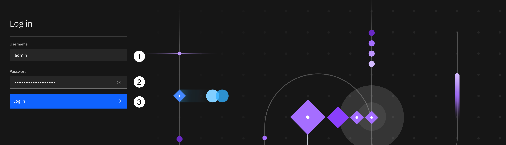
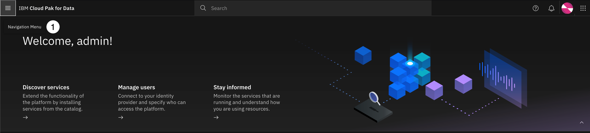
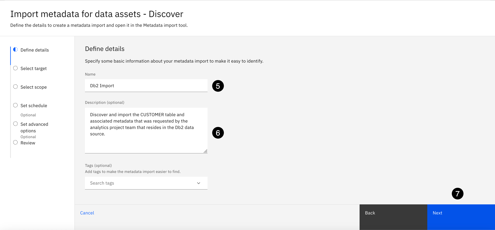
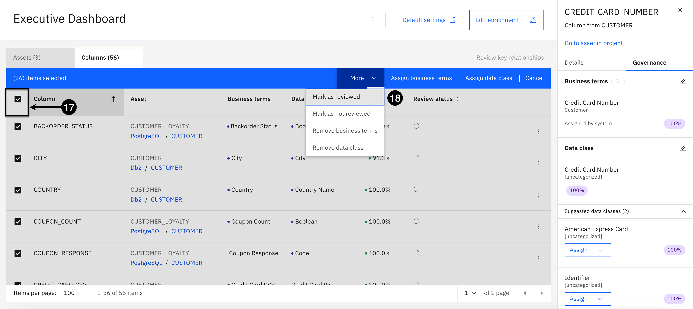
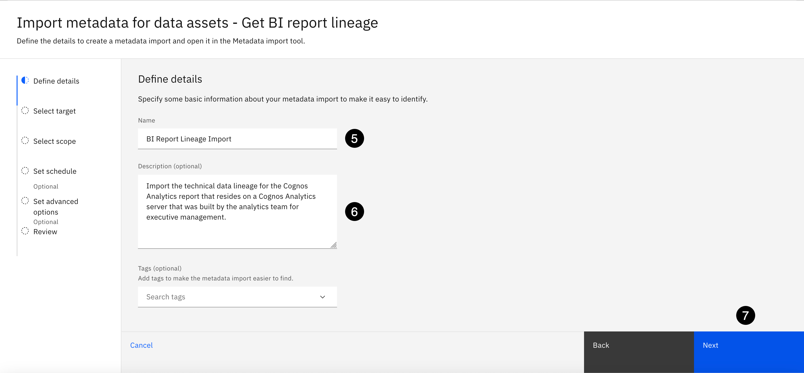
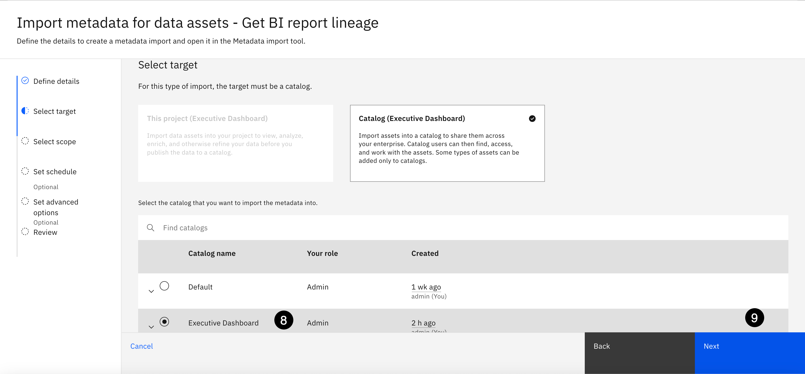

## Introduction
---


Data lineage is an essential component of an effective data management strategy and data governance practice that provides tremendous benefits:

* Traceability - Where does data originate from, how has it changed over time, how is it being consumed, and by whom
* **Trust in data - Visibility, transparency, and trust into the journey of data to produce accurate and quality analytical and AI outcomes**
* Regulatory compliance - Meet government and industry regulation obligations to truthfully respond to compliance audits and inquires
* Impact analysis - Assess and understand the downstream impact of planned changes before they negatively impact business processes
* Root cause analysis - Accelerate data incident identification and remediation by quickly and effectively isolating the cause of the problem
* Data platform migrations - Sort out the assets that need to be migrated and which ones can be ignored, saving time, money, and resources

---

This lab focuses on the *Data Governance and Compliance* use case of **IBM Manta Data Lineage** (IBM Manta) so organizations have visibility, transparency, and **trust into the journey of data** to produce accurate and quality analytical and AI outcomes. The lab uses **IBM Manta** installed and integrated along-side **Knowledge Catalog** in **Cloud Pak for Data**. This lab **does not** cover the stand-alone version of **IBM Manta**. It provides technical sellers with an in-depth introduction into the different technical data lineage extraction, and metadata collection capabilities provided by IBM Manta:

**Data Lineage** - Technical data lineage about where data comes from, how it changes, and where it moves over time for the supported data source scanners provided by **IBM Manta**. This lab uses the **Db2**, **PostgreSQL** and **Cognos Analytics** scanners provided by **IBM Manta**.

**ETL Job Lineage** - Technical data lineage for Extract, Transform, and Load (ETL) jobs that are created and maintained in data integration tools. Including information about the flow of data and the activities within a job. This lab uses **DataStage** as the ETL tool.

**BI Report Lineage** - Technical data lineage for business intelligence (BI) reports from analysis and reporting tools and information about relationships and data flows between objects within a report. This lab uses **Cognos Analytics** as the analytics reporting tool.

To ensure all these capabilities can be demonstrated, this lab provides a pre-defined project file that contains the connections to the **Db2**, **PostgreSQL** and **Cognos Analytics** data sources and the **DataStage** flow used in the lab.

## Overview
---
**Knowledge Catalog** in conjunction with **IBM Manta** allows data practitioners to augment data assets in a catalog with business metadata, business lineage, and technical data lineage for all stakeholders to understand the provenance of data, how it has changed and moved over time, how it's being used.

**Business users** can view a high-level summary of business lineage and associated metadata: business terms and data quality scores.


**Technical users** can view advanced data lineage details: technical, indirect, column level, and historical lineage.


## Use Case
---
It has come to the attention of executive management that there has been a significant drop in order fulfillment and increased shipping times and customers have been complaining about it in their surveys and to customer service. The executive management team has requested the customer management analytics project team to do some analysis to determine what might be causing the significant drop in customer satisfaction and wants the results provided to them on an executive dashboard to visualize the outcomes and to monitor the situation more closely now and in the future to make sure it does not happen again.

In order to investigate this and deliver the requested executive dashboard the analytics team is requesting customer, customer sales, and supporting logistics data related to warehouse staff shift assignments. The data request specifies that the team needs the following data to perform the analytical tasks to deliver on their business objectives:

|Data Requested             |Analytics and AI Use Case                                |
|---------------------------|---------------------------------------------------------|
|Customer                   |Needed for the customer logistic content of the executive dashboard|
|Customer Loyalty           |Needed for the customer sales and satisfaction content of the executive dashboard|
|Warehouse Assigned Shifts  |Needed for the warehouse staffing content of the executive dashboard|

Before the data analytics team can begin performing analytics and building out the executive dashboard to help determine the decline in customer satisfaction, it’s important for them to understand and trust the data they are about to use. The analytics and resulting business outcomes are only as good as the data. The best data is data that is fully understood and trusted to deliver accurate and meaningful insights.

To satisfy the project team's data request the data steward and data engineer will utilize the **Data governance** capabilities of IBM's data fabric solution, **Cloud Pak for Data**, that are provided by **IBM Knowledge Catalog** and **IBM Manta Data Lineage**. This will ensure the data is easily accessible, obtained from a trusted source, that the data content is of the highest quality, and that the content can be fully understood and traceable from the source and throughout its lifecycle, and that any personal or sensitive information is governed and protected with no risk of being exposed to those who do not have the authority to access or view it.

### Data Governance Lifecycle
---

To accomplish this, the data governance team will follow the **IBM Knowledge Catalog** inherent **Data Governance Lifecycle** depicted in the diagram below:


The following tasks will be performed in this lab in accordance with the **Data Governance Lifecycle**:

|Data Governance Step               |Data Governance Task                            |
|-----------------------------------|------------------------------------------------|
|1. Define Data Sources             |Define the data sources that contain the relevant data requested by the business  Already defined in the project |
|2. Define Business Vocabulary      |Define the business vocabulary: **Categories, Business Terms** and **Data Protection Rules** |
|3. Curate and Enrich Data          |Discover and import relevant data assets using the automated **Metadata import** process|
|                                   |Enrich data asset metadata using the **Metadata enrichment** processes to profile data content and assign business terms |
|4. Analyze Data Quality            |Review the data quality of the enriched data assets to identify any data quality issues |
|5. Catalog Governed Data           |Publish enriched data assets to a governed catalog                             |
|6. Augment Cataloged Data          |Augment the cataloged data assets with **business metadata**, **business lineage**, and **technical data lineage**|

Business terms and data classes can be automatically assigned and data quality can be analyzed that produces data quality scores for all data assets and their associated columns during the metadata enrichment process. However, as of this version of the lab and the software, only the business terms and data quality scores assigned to data assets can be viewed by data consumers and data practitioners as additional metadata in the business lineage generated by **Knowledge Catalog**. Business metadata like business terms and data quality scores are not available yet in the technical data lineage generated by **IBM Manta**.

## Prerequisites
---
Complete **all the steps** in this section before proceeding with the hands-on lab instructions.

## 1. Download the Lab Files
---
This lab requires a zip file that has been predefined and is located in the IBM Data and AI Live Demos GitHub repository. The file is organized into three folders. Each folder contains files that are required for specific sections in the lab. One of the folders contains the predefined project file and one contains the CSV files needed to define the business glossary. The third folder contains an IBM Manta license key and some **Cognos Analytics** jar files that are needed for IBM Manta to connect to Cognos Analytics to extract technical lineage for the **Cognos Analytics** executive dashboard report used in the lab. Before proceeding, click on the link below to download the zip file:

[IBM-Manta-L3-Lab.zip](https://github.com/CloudPak-Outcomes/Outcomes-Projects/blob/main/IBM%20Manta%20L3%20Lab/IBM-Manta-L3-Lab.zip)

1. Click the **Download raw file** icon on the toolbar to download the file (It will be downloaded to the default download location set for the browser).


---

When the download is complete, go to the download location and unzip the **IBM-Manta-L3-Lab.zip** file. Remember where the files were downloaded because they will be asked for by name in the following sections of the lab.

Unzipping the file will create a folder named **IBM-Manta-L3-Lab** that will contain three folders with the following files:

|Folder Name |File Name                     |Description                               |
|------------|------------------------------|------------------------------------------|
|Cognos      |axis.jar                      |Cognos jar file needed by Manta           |
|Cognos      |axisCognosClient.jar          |Cognos jar file needed by Manta           |
|Cognos      |axisReportNetClient.jar       |Cognos jar file needed by Manta           |
|Cognos      |jaxrpc.jar                    |Cognos jar file needed by Manta           |
|Glossary    |governance-categories.csv     |Data governance categories                |
|Glossary    |governance-business-terms.csv |Data governance business terms            ||
|Project     |Data-Lineage-L3-Project.zip   |Manta data lineage project file           |

## 2. Reserve an Environment
---
The diagram below outlines the cluster configuration for this environment that was sized using the [IBM Sales Configurator](https://app.ibmsalesconfigurator.com/#/).


---

This environment takes approximately **5 hours** to provision and install the Cloud Pak for Data base control plane and all the predefined services so be patient and manage your time accordingly. **Click the link** below to provision and reserve this environment. It will take you to TechZone in a new tab in your browser. Follow the instructions below the link to create a reservation.

[Manta Data Lineage Level 3](https://techzone.ibm.com/my/reservations/create/667df179d68034001e7920d5)

The TechZone environment reservation process is straight forward and self-explanatory so screen shots will not be provided. The primary purpose of this environment is for **Education** and should be the **Purpose** selection when reserving this environment (If you have too many **Education** reservations select **Test**). However, this environment can also be reserved for a client **Demo** or **Pilot**. If you choose a purpose of **Demo** or **Pilot** you will be required to enter a valid [ Sales opportunity number or Gainsight Relationship ID](https://ibm.seismic.com/Link/Content/DCFqG8BTPh8VfGfXV7TccgQF8RCP). Providing a **Sales opportunity number** or **Gainsight Relationship ID** will also allow for an extended reservation period. Review the [Reservation Duration Policy](https://github.com/IBM/itz-support-public/blob/main/IBM-Technology-Zone/IBM-Technology-Zone-Runbooks/reservation-duration-policy.md) to understand default durations allowed for specific infrastructures based on the purpose of the reservation.

Follow these steps to complete the environment reservation process:

1. Select the **Reserve now** radio button.
2. Accept the supplied default **Name**.
3. Select a **Purpose**.
4. Enter a **Purpose description**.
5. Select a **Preferred Geography**.
6. Select the **checkbox** in the bottom right corner of the page to agree to IBM Technology Zone's Terms and Conditions and End User Security Policies.
7. Click the **Submit** button in the bottom right corner of the page.
8. Click the **My Reservations** button to view the reservation.

TechZone will issue a series of emails notifying you of the provisioning process and progress. When you get the final email notifying you the environment is **Ready**, the reservation will be populated with a link to access the **Red Hat OpenShift Console** for the environment, and the **Redhat OpenShift Console** credentials (the **Kubeadmin** user and password) to login to the console.


> **Ready** does not mean that **Cloud Pak for Data** is fully installed and ready to use. It means the **Red Hat OpenShift** cluster was provisioned successfully and that the **Cloud Pak for Data** base control plane and the predefined **Cloud Pak for Data** services are in the process of being installed.

## 3. Log in to OpenShift Console
---
Follow the instructions in this step to locate the **Redhat OpenShift** console URL and credentials to log in to the **RedHat OpenShift** environment that has been successfully provisioned and that TechZone has provided a **notification email** informing you that the reservation for the environment is **Ready**. These instructions will also show how to monitor the installation of **Cloud Pak for Data** and how to locate the **Cloud Pak for Data** console route (URL) and credentials to log in to the **Cloud Pak for Data** console.

Check the email account associated with your **TechZone** account and look for an email with the subject: **[EXTERNAL] Reservation Ready on IBM Technology Zone**. It will look similar to the screen shot below. If you use the Microsoft Outlook web client for email, the email might be placed in the **Other** tab in your inbox so make sure you check the **Other** tab if you don't see it in the **Focused** tab.

> Make note of the **Reservation Name** because there may be multiple reservations in your TechZone account. Your reservation name may be different from the name depicted in the screenshot below if you changed the name of the environment when you reserved it. Also, the example used in the following instructions were produced by reserving a **Manta Data Lineage Level 3** environment. Other than the name of the environment, the instructions are universal for all the **Level 3 Technical Enablement** TechZone Certified Deployer environments.

1. Click the **View My Reservations** button.


If prompted, and depending on the authentication method you are presented with, enter your IBMId or IBM w3id and password.

 Leave this **TechZone Reservation** details tab open in your browser because you might need to get back to the Redhat OpenShift console or have to supply the Redhat OpenShift console password at another point in the lab.

---
---

 As mentioned previously, it is more than likely that you will have multiple reservations in your TechZone account like the screenshot below. So, make sure the reservation you are instructed to select in the following step is for the Level 4 PoX Enablement environment you just reserved, and make sure the reservation status is set to **Ready**.

2. Click the **Manta Data Lineage Level 3** environment to view the details of the reservation.


---
---

3. Click the **copy** button next to the password field to copy the **kubeadmin** password to the clipboard.
4. Click the **Open your IBM Cloud environment** button.


---
---

If prompted, enter the Redhat OpenShift console credentials:

5. Click the Log in with **kube:admin** button.


---
---

6. Enter **kubeadmin** for the Username.
7. Paste the **password** that was copied to the clipboard in the previous step into the Password field.
8. Click the **Log in** button.


---
---

9. From the left side menu, click the **Pipelines** menu to open it, and select the **Pipelines** sub-menu.


---
---

10. Click the **PipelineRuns** tab.
11. Click the **cloud-pak-deployer-4.8-data-governance-run-xxxx** (where xxxx is a unique random identifier). There should only be one Pipeline run in the list.


---
---

12. Click the **Logs** tab.


---
---

On the left side of the logs tab, the log is broken down into sections that convey the different steps that are executed to install **Cloud Pak for Data**. When you first enter the log you will most likely be taken to the **run-the-deployer** section of the log (the current step that is being executed) with a ton of **Waiting for job to Complete.** messages displayed and the **run-the-deployer** menu items depicting a blue spinning wheel. This means that **Cloud Pak for Data** is still being installed and the environment **is not ready** for use just yet.


---
---

When all log menus have a green check mark and you see the **update-configmap-success** log step (the very last step in the log menu) with a green check mark next to it, and it contains the **Cloud Pak for Data** Console Route, Username, and Password, the **Cloud Pak for Data** installation is complete! These instructions are universal anytime you reserve a **Certified TechZone Deployer** environment.

13. Select the the **Password**, right mouse click, and select **Copy**. This will copy the password to the clipboard.
14. Select the **Console Route**, right mouse click, and select **Open link in new tab**. This will open the **Cloud Pak for Data** console in a new tab in the browser.


> **Leave the tab to the OpenShift console open in the browser!** There are steps coming up in the lab that will instruct you to come back to the Redhat OpenShift (RHOS) console to download the **oc** (OpenShift command line) software, obtain a token to access the cluster using the **oc** command line utility. There may also be a need to do some troubleshooting if something does not look right in the environment after you log in to **Cloud Pak for Data** that may have to be addressed using the RHOS console. 

## 4. Log in to Cloud Pak for Data
---
You should be now be in the new tab that was just opened from the **Redhat OpenShift** console with the **Cloud Pak for Data** console ready to log in.

1. Enter **admin** for the Username.
2. Paste the **password** you copied to the clipboard in the previous step into the Password field.
3. Click the **Log in** button.



---
---

## 5. Restart the Metadata Pods
---
In order for the **Metadata import** data access tool to present all of the discovery and lineage import goals, several **Knowledge Catalog** metadata pods need to be restarted. These pods can be restarted using the **Monitoring** feature from the **Cloud Pak for Data** user interface.

1. Select the **Navigation** menu (the 4 stacked horizontal lines in the upper left corner).



---
---

2. Select **Administration > Monitoring** from the menu.


---
---

3. Select **Pods** from the Status summary section on the left.


---
---

4. In the **Find Pods** search area, enter the word **metadata**.


---
---

5. Select the **metadata-discovery-xxxx...** pod action **Menu** (looks like three horizontal dots ...).
6. Select the **Restart pod** menu item.


---
---

7. Click the **Restart** button.


---
---

8. A **Success!** notification message should be displayed. Click the **X** on the message to close the notification.

Wait for the screen to refresh before proceeding to the next step. It should refresh on its own in about 15-30 seconds. If not, click the **Refresh** button that is highlighted on the screen shot below.


---
---

9. Select the **wkc-meta-imports-xxxx...** pod action **Menu** (looks like three horizontal dots ...).
10. Select the **Restart pod** menu item.


---
---

11. Click the **Restart** button.


---
---

12. A **Success!** notification message should be displayed. Click the **X** on the message to close the notification.

Wait for the screen to refresh before proceeding to the next step. It should refresh on its own in about 15-30 seconds. If not, click the **Refresh** button that is highlighted on the screen shot below.

13. Click the **IBM Cloud Pak for Data** label to return to the home page.


---
---

## 6. Verify the Manta License Key
---
In order to enable the **IBM Manta** automated data lineage goals of the **Metadata import** data access tool and to run **Get Lineage** goals a valid **IBM Manta** license key is needed. Fortunately, the **IBM Manta** service **includes** an **IBM unlimited non-expiring FIPS-compliant** license key when the software is installed as of version 5.0.0 of **Cloud Pak for Data**. The key is provided by IBM for client, demonstrations, technical labs, and for clients to begin using the software.

This step is included to educate technical sellers on how to verify and manage **IBM Manta** license keys and to familiarize them on how to access the **Manta Administration GUI**. The Manta administration user interface has valuable tooling to access logs for monitoring and troubleshooting technical data lineage processes, configuring and adding custom scanners, and a whole lot more. If technical sellers are going to be supporting **IBM Manta** doing technical demonstrations for clients, especially during a **PoX** (Proof of Experience), they need to know how to access the **Manta Administration GUI**.

1. Right mouse click on the **IBM Cloud Pak for Data** label and select **Open in new tab**.


---
---

2. At the very end of the Cloud Pak for Data URL in the new tab, **remove** the **zen/?context=icp4data#/homepage** at the end of the URL.


---
---

3. Click the **Copy** button below and paste it at the end of the URL and select the return or enter key on the keyboard:
```
manta-admin-gui
```


---
---

4. Select **Configuration** from the main menu.


---
---

5. Select **License** from the left side panel.

**ⓘ** **Notice:** that an **IBM Unlimited non-expiring FIPS-compliant key** with unlimited connections and support for **1 billion** scripts is already applied. If a new license key needs to be applied, end users can use the **Upload new license** button to upload a key from their system.  


---
---

6. Close the **IBM Automatic Data Lineage for IBM Cloud Pak for Data** browser tab.
7. Select the **Home | IBM Cloud Pak for Data** browser tab to return to the Cloud Pak for Data home screen.


---
---

## Configure Manta for Cognos
---
Complete **all the steps** in this section before proceeding with the hands-on lab instructions. 

This section performs the current post installation steps as of version 5.0.1 of **Cloud Pak for Data** that are required for the **IBM Manta** service to successfully collect and document BI Report Lineage from **IBM Cognos Analytics**. Future versions of **IBM Manta** are in plan that will eventually remove these manual tasks.

This lab uses **Cognos Analytics** as one of the **IBM Manta** scanners to scan BI Report lineage for the **Cognos** report used in this lab. In the current version of the **Manta** service (version 5.0.1) **IBM Manta** does not package and include the required **Cognos Analytics** jar (Java Archive) files that are needed by **IBM Manta** to collect and document technical data lineage for **Cognos Analytics** reports. As IBM, we have access to these jar files, and have the authority to provide them for this lab, but they have to uploaded manually by using the **oc** copy command (OC cp) to copy them into the **manta-admin-gui...** (...stands for the unique suffix at the end of the  manta-admin-gui pod name that is different on every cluster) pod in the **Cloud Pak for Data** environment that is also provided for this lab.

In order to do the steps in this section, technical sellers need to have the latest version of the **oc** (OpenShift Command Line Interface) utility installed and operational on their workstation, and have the knowledge on how to use it. The lab will provide instructions on how to obtain the software and link to the documentation on how to install the software, but it assumes that technical sellers are knowledgeable on how to use the **oc** utility. That will not be taught in this lab.

Steps 1 and 2 in this section are done from the **Redhat OpenShift** console so before you begin, **Go back** to the **Redhat OpenShift** console in your browser that you were instructed to leave open and follow the instructions below to obtain and download the latest **oc** utility software and to get the **oc** login token that will be needed for steps 3 and 4.

> If the **oc** software is already installed and operational on your workstation, **skip** step 1 and proceed to step [2. Get OC Login Token](#2._Get_OC_Login_Token).

## 1. Install the OpenShift CLI
---
From the **Redhat OpenShift** console in your browser:

1. Click the **?** on the console toolbar and select **Command line tools**.


---
---

2. Hover over the **software image for your workstation operating system** and click on the link to download it. In the screen shot below, the workstation is Mac OS with an Intel chip so the **Mac for x86 64** image was selected.

    Depending on the browser being used, in this example it's **Firefox**, the download dialog appears in the upper right corner with notification that a file named **oc.zip** is being downloaded to the download location specified in the browser settings.


---
---

To install the software, follow the instructions provided in the **Redhat OpenShift** documentation for your type of operating system by clicking on this link [Getting Started with Openshift CLI](https://docs.openshift.com/container-platform/4.16/cli_reference/openshift_cli/getting-started-cli.html).

After the software has been installed, verify that the **oc** utility is working properly by going to a command line terminal or window on your system and type in the command **oc** and press the enter or return key. The **OpenShift Client** help should be displayed:


---
---

## 2. Get OC Login Token
---
From the **Redhat OpenShift** console in your browser:

1. Using the **Kube.admin** dropdown on the toolbar, select **Copy login command**.

    A new tab will open in the browser.


---
---

If prompted, enter the Redhat OpenShift console credentials:

2. Click the Log in with **kube:admin** button.


---
---

3. Enter **kubeadmin** for the Username.
4. Paste the **password** that was copied to the clipboard in the [Log in to OpenShift Console](#3._Log_in_to_OpenShift_Console) step into the Password field.
5. Click the **Log in** button.


---
---

6. Click the **Display Token** link.


---
---

7. Using your mouse, **highlight** and grab the entire token from **oc** to the port at the end as show in the screen shot below.
8. Right mouse click and select **Copy**.


---
---

9. **Go to** the terminal or command line window where the **oc** utility is installed and **Paste** the **oc login** command into the terminal of command window and select the enter or return key on the keyboard.


---
---

## 3. Copy Cognos Jar Files
---
This step takes a few minutes and requires some copy and pasting of **oc** commands but with your great **oc** skills it should a walk in the park. All the tasks will be done from the command line using **oc** commands in the command line terminal or window where you just ran the previous **oc login** command.

From the **Command line** interface terminal or window:

1. **cd** (Change directories) to the **Cognos** folder where the **IBM-Manta_L3-Lab.zip** file was downloaded to and unzipped. This is where the **Cognos** jar files reside.

In the example screen shot below, on this system, the **IBM-Manta_L3-Lab.zip** file was downloaded to and unzipped to the **Desktop** directory. The command that was entered on this system is **cd /Users/Rick/Desktop/IBM-Manta-L3-Lab/Cognos**


List the contents of the directory based on your operating system. The **ls -la** command on this **Mac** shows there are **4** jar files in the **Cognos** directory. This is what your directory should contain as well:

* axis.jar
* axisCognosClient.jar
* axisReportNetClient.jar
* jaxrpc.jar

All **4** of these jar files need to be copied into the **manta-admin-gui** pod in the Cloud Pak for Data **cpd** project where **IBM Manta** is installed.

---
---

From this directory, perform the following **oc** commands:

2. Click the **Copy** button below and paste the value into the **Command line** terminal or window:
```
oc get pods -l app.kubernetes.io/component=manta-admin-gui
```


The **manta-admin-gui** pod will have a unique identifier at the end of the pod name that is different on every cluster. In the example screen shot above, the manta-admin-gui pod name is **manta-admin-gui-5c56f54778-nwtgs** and the suffix is **5c56f54778-nwtgs**.

---
---

3. Highlight the **suffix** of the manta-admin-gui-**suffix**, right mouse click and select copy. 


This is a **very important** step because the suffix will be needed for the **oc rsync** command that copies the **Cognos** jar files into the manta-admin-gui pod extension directory so **save the copied suffix** somewhere that can be copied and pasted in the next set of commands.

---
---

The **oc rsync** command will be used to copy the jar files into the **manta-admin-gui** pod's **/opt/mantaflow/cli/scenarios/manta-dataflow-cli/lib-ext** directory so **IBM Manta** can access and extract lineage for **Cognos Analytics**. The **oc rsync** command provides the means to copy one to many files in a local directory into an OpenShift pod directory. Here is an example of what the command will look like after you make the updates outlined below:

oc rsync **/Users/Rick/Desktop/IBM-Manta-L3-Lab/Cognos/** manta-admin-gui-**5c56f54778-nwtgs**:/opt/mantaflow/cli/scenarios/manta-dataflow-cli/lib-ext

The sections of the command that are highlighted in **bold** are the two sections that need to be updated. The first section is the local directory where the Cognos jar files reside on your local system. On this system the Cognos jar files are in the **/Users/Rick/Desktop/IBM-Manta-L3-Lab/Cognos/** directory. A fully qualified path to the files has to be provided and **very importantly**, there has to be a forward slash **/** at the end of the local directory specified. This tells the **oc rsync** command to copy all files in the directory.

Update the following **oc rsync** command as follows:

oc rsync **/Local Path/IBM-Manta-L3-Lab/Cognos/** manta-admin-gui-**xxxxxxxxxx**:/opt/mantaflow/cli/scenarios/manta-dataflow-cli/lib-ext

* Replace the **/Local Path/** section in the command to the the local path on your system where the **IBM-Manta-L3-Lab/Cognos/** folder resides.
* Replace the **xxxxxxxxxx** in the command to the **suffix** of the **manta-admin-gui** pod on your OpenShift cluster that you just copied in the previous step. 

---
---

The example command below is the command that was run on this system. Make sure your command looks like the command below with the proper local, fully qualified path and suffix replaced:

oc rsync /Users/Rick/Desktop/IBM-Manta-L3-Lab/Cognos/ manta-admin-gui-5c56f54778-nwtgs:/opt/mantaflow/cli/scenarios/manta-dataflow-cli/lib-ext

4. Copy and paste **your oc rsync** command into the terminal or command window and run it.


Ignore the **Warning** because it did not stop the command from running and this is expected behavior. The expected output from the command is that the **4** files are listed as being copied to the pod. Another file, the .DS_Store file was also copied because it is a system file on Mac OS that the OS adds to every folder as a metadata file for its contents. It will not hurt copying this file to the manta-admin-gui pod directory. As will be demonstrated in the next step when the results are verified, this file can be deleted. 

---
---

The results can be verified by going back to the Redhat OpenShift console. From the console, the **manta-admin-gui** pod can be selected and a terminal window can be used to look into the **/opt/mantaflow/cli/scenarios/manta-dataflow-cli/lib-ext** directory for the pod to see if the files were actually copied into the directory.

5. **Go back** to the **Redhat OpenShift** tab in the browser.
6. Select the **Workload** menu and then select the **Pods** sub-menu on the left.
7. Make sure the **Project** has **All projects** selected. If not, using the projects drop down menu, select **all projects**. 
8. Enter **manta-admin-gui** in the search area.
9. Select the **manta-admin-gui...** link to open the pod.


---
---

10. Click the **Terminal** tab.
11. Click the **Copy** button below and paste the value into the **Terminal window**:
```
cd /opt/mantaflow/cli/scenarios/manta-dataflow-cli/lib-ext
```
12. Click the **Copy** button below and paste the value into the **Terminal window**:
```
ls -la
```
The **4** jar files that were copied with the **oc rscync** command should be listed and exist in the directory! If the files  were copied from a **Mac OS** system and there may also be a **.DS_Store** file. If so, delete it using the following command:

13. Click the **Copy** button below and paste the value into the **Terminal window**:
```
rm .DS_Store
```
14. Click the **Copy** button below and paste the value into the **Terminal window**:
```
ls -la
```


---
---

Scroll **down** to see that the .DS_Store files had been deleted.


---
---

## 4. Restart the Manta Pods
---
In order to restart the **Manta** pods the pods can be deleted in bulk by using the label parameter of the **oc delete pod** command. The pods **do not** actually get deleted because they are set to restart so they will restart themselves after they are deleted.

**Go back** to the the command line interface terminal or window where the **oc login** command was run and run the following 2 **oc** commands to restart the **IBM Manta** pods: 

1. Click the **Copy** button below and paste the value into the **Terminal window**:
```
oc get pods -l app.kubernetes.io/part-of=manta
```


**5** pods with a **manta** prefix will be listed.

---
---

2. Click the **Copy** button below and paste the value into the **Terminal window**:
```
oc delete pods -l app.kubernetes.io/part-of=manta
```


It takes about **20-30** seconds for the pods to be deleted. Be patient and wait for the command prompt to re-appear. Once it does proceed to the next step.

---
---

Copy the **oc get pods** command below and run it a couple of times to see the **Status** of the pods when they restart:

> If enabled in your command line terminal or window, select the **up arrow** on the keyboard to display the last command and press the enter or return key. It will save a copy and paste step.

3. Click the **Copy** button below and paste the value into the **Terminal window**:
```
oc get pods -l app.kubernetes.io/part-of=manta
```


The pods will show that they are in the process of restarting.

---
---

Wait about **2** minutes and then run the **oc get pods** command again until you see all pods with **1/1** Ready and in a **Running** Status like the screen shot below:


Eventually all **5** pods will show **1/1** pods in a Ready state and a Status of **Running**. When they are, the post installation steps are complete and the lab can finally begin!

---
---

## Define the Business Vocabulary
---
This section creates all the governance artifacts needed to establish a trusted, business ready, data governance foundation. It uses a set of **CSV** files to import and create the artifacts in the upcoming steps so make sure the zip file that contains the governance artifacts has been downloaded and unzipped based on the instructions contained in the [Download the Lab Files](#1._Download_the_Lab_Files) section above.

It is essential to establish the business glossary before any data curation, or cataloging of data assets takes place. This is because governance artifacts, like data classes and business terms, can be automatically assigned to data assets during metadata enrichment, cataloging, and when viewing **business and technical data lineage**. Otherwise, all data curation tasks would have to be done manually, which defeats taking advantage of the automated and built-in data governance capabilities of Knowledge Catalog and IBM Manta.

Building a complete and meaningful business glossary can be very labor intensive and time consuming without automated processes in place. **Knowledge Catalog** provides governance artifact import capabilities to automate and expedite this process. You will use this feature to methodically create data governance artifacts using prebuilt CSV files to populate the business glossary with all the needed artifacts. There is a specific order that must be followed to create governance artifacts. This lab provides explicit instructions on that processing order (**do not** deviate from the order in which they are defined) to ensure all governance artifacts are defined in the proper sequence to establish proper relationships between them, and to avoid any errors and conflicts.

## 1. Create Categories
---
Categories act as folders or directories to organize governance artifacts and provide access controls to authorize who can author and manage those artifacts. Categories provide the logical structure for all governance artifacts, except data protection rules. Governance artifacts are grouped into categories to make them easy to find and manage, and to control their visibility. Categories can be organized in a hierarchy based on their meaning and relationships to one another. A category can have subcategories, but a subcategory can have only one direct parent category.

This step imports and creates **three** categories that will be used to provide the logical structure for the governance artifacts that are defined and required by this lab.

1. Select the **Navigation** menu (the 4 stacked horizontal lines in the upper left corner).


---
---

2. Select **Governance > Categories** from the menu.


---
---

3. Using the **Add category** dropdown, select **Import from file**.


---
---

4. Click the **Drag and drop file here or upload** link.


---
---

5. Go to your download location, open the **Glossary** folder and select the **governance-categories.csv** file.
6. Click the **Open** button.


---
---

7. Click the **Next** button.


---
---

8. Select the **Replace all values** merge option.
9. Click the **Next** button.


---
---

The import will begin processing and should succeed with **3** new categories. 

10. Select the **Close** button.


---
---

> It can take up to 5 minutes for the new categories to appear. This is a known issue so don't be alarmed if they don't immediately appear. If the new categories do not appear in the user interface after a successful import, **refresh** the page in your browser several times. If the browser refresh doesn't work, going back to the main menu and selecting categories again can sometimes force the categories to appear:

11. Select the **Navigation** menu (the 4 stacked horizontal lines in the upper left corner). 


---
---

12. Select the **Governance > Categories** menu.


---
---

13. Select the category **Sidebar** icon in the upper left corner to open the sidebar to get a tree view.


---
---

14. Open the parent **Business** category in the tree view.

You should see the **[uncategorized]** and **Locations** system categories and the **3** new categories: The **Business** parent category with **2** sub-categories named **Customer** and **Employee**.


---
---

## 2. Create Business Terms
---
Business terms have references to data classes and classifications, and can be referenced in data governance and data protection rules, so they need to be defined after data classes and classifications but before data governance or data protection rules that reference them. Business terms can also be related to other business terms so they must be imported in a specific order. The business terms in the CSV import file you will use are in the correct order to establish these relationships.

This step imports and creates **55** business terms. Using the import process for such a large volume of governance artifacts is a prime example of the type of productivity automation that is provided by **Knowledge Catalog**. This is a huge time saver that runs in minutes. Doing this manually would take a data steward hours or days.

1. Select the **Navigation** menu (the 4 stacked horizontal lines in the upper left corner).


---
---

2. Select the **Governance > Business terms** menu.


---
---

The environment was just provisioned so there should not be any business terms defined.

3. Using the **Add business term** dropdown, select **Import from file**.


---
---

4. Click the **Drag and drop file here or upload** link.


---
---

5. Go to your download location, open the **Glossary** folder and select the **governance-business-terms.csv** file.
6. Click the **Open** button.


---
---

7. Click the **Next** button.


---
---

8. Select **Replace all values** as the merge option.
9. Click the **Next** button.


---
---

The import should complete successfully with **55** new business terms imported. 

10. Click the **Go to task** button.


---
---

You should see **55** new business terms to publish.

11. Click the **Publish** button.


---
---

12. Click the **Publish** button again without entering a comment.


---
---

13. Select the **Navigation** menu (the 4 stacked horizontal lines in the upper left corner).


---
---

14. Select **Governance > Business terms**.


---
---

Look at the total line on the bottom of the business term page. You should see **1-50 of 55 items** (business terms). If there are less than **55**, refresh the page in the browser until all **55** appear. Sometimes there is a slight delay and it takes a few minutes for the user interface to display the total terms imported.

15. Using the items per page filter, select **100** items per page.
16. Scroll **down** to view all the newly created business terms.


---
---

## 3. Create Data Protection Rule
---
This step creates a data protection rule to protect sensitive credit card information contained in the **CUSTOMER** virtual data asset that is virtualized in the **Data Virtualization** lab. It uses the **Redaction** masking method so the values are not visible to those who do not have the authority to view the information. The data protection rule is defined using **Column name** as the condition criteria for columns named: **CREDIT_CARD_NUMBER**, **CREDIT_CARD_CVV** and **CREDIT_CARD_EXPIRY**.

1. Select the **Navigation** menu (the 4 stacked horizontal lines in the upper left corner).


---
---

2. Select the **Governance > Rules** menu.


---
---

3. Using the **Add rule** dropdown, select **New data protection rule**.


---
---

4. Click the **Copy** button below and paste the value into the **Name** field:
```
Protect Credit Card Information
```
5. Click the **Copy** button below and paste the value into the **Business definition** field:
```
Protect all components of a credit card. Including the credit card number, credit card validation number (CVV) and the credit card expiration date using the data privacy redaction masking method.
```
6. Click the **Next** button.


---
---

In the **When does this rule apply?** section specify the rule **Criteria** for **Condition 1** as follows:

7. Using the **If** statement dropdown on the left, select **Column name**.
8. Click the **Copy** button below and paste the value into the **Column name** field and Press the **Enter** or **Return** key on the keyboard:
```
CREDIT_CARD_NUMBER, CREDIT_CARD_CVV, CREDIT_CARD_EXPIRY
```
9. Using the **If** statement dropdown on the right, select **contains any**.

In the **What does this rule do?** section specify the rule **Action** as follows:

10. Using the **Action** dropdown on the left, select **Redact columns**.
11. Using the **When column has** dropdown in the middle, select **Column name**.

The **CREDIT_CARD_NUMBER, CREDIT_CARD_CVV, CREDIT_CARD_EXPIRY** column names will automatically be filled into the **That contains any** field.

12. Click the **Create** button.


> The *Where are data protection rules enforced?* confirmation dialog is **new** when creating **Knowledge Catalog** data protection rules. Take a minute to read what the dialog is conveying. **ⓘ** **Notice:** that data protection rules are no longer enforced in a project.

13. Select the **I understand** checkbox acknowledging that you have read and understand **Where data protection rules are enforced**.
14. Click the **Continue** button.


The **Successfully created!** notification message will be displayed and the new rule will be created.

---
---

## Curate and Enrich Data Assets
---
Now that a well defined business glossary with a complete set of published governance artifacts is in place, the next step is to begin the data curation process. Data curation is the process of discovering (Metadata import) and adding data assets to a project or a catalog, enriching them with metadata by automatically assigning data classes and business terms, analyzing data quality, and collecting and documenting business and technical data lineage.

Curation can be a very labor intensive and time consuming process, and for a lot of organizations, it's mostly done manually where data assets are curated one at a time. Advanced data curation provided by **Knowledge Catalog** in conjunction with **IBM Manta** performs data curation tasks automatically for multiple data assets simultaneously. This approach significantly reduces the amount of time and labor to complete the data curation process.

Depending on the curation tasks that are performed, some of the work will take place in a project, or a catalog, or both before the data is ready for use by data consumers. The majority of the data curation tasks in this lab will be done in an enrichment project and then the curated assets will be published to a governed catalog. Once they are published to the catalog, some additional enrichment tasks will be performed using the capabilities of **IBM Manta** to collect and document technical data lineage. In order to accomplish this, the following data curation steps will be performed.

> the project is very valuable and reusable, and the data curation process is repeatable. The metadata imports can be modified to add or remove assets and the metadata enrichment process can be modified and enhanced to improve the business term and data class assignment accuracy and learn from the results. Changes can also be made to governance artifacts to improve data curation accuracy and the metadata enrichment process can then be re-run to take advantage of the modifications. The enrichment results can then be reviewed and existing or new data assets can be re-published to the governed catalog. This is why the instructions in the next step set the **Duplicate asset handling** option to **Update original assets** when the catalog is created.

## 1. Create the Catalog
---
This step creates the **governed** catalog that will be used to publish the fully enriched data assets to that were just discovered and curated. This catalog will be named the **Executive Dashboard** catalog. Do not use a different name because the remainder of this lab makes reference to that catalog name so changing the name will affect the remaining instructions. It's a good best practice to give the catalog a meaningful name based on the client, industry or use case you are demonstrating or conducting during a PoX. Also, when **Knowledge Catalog** is installed into Cloud Pak for Data it automatically creates a **Platform assets catalog** and a **Default** catalog.

The **Platform assets catalog** is **not** a governed catalog. Which means sensitive, confidential, or personally identifiable information (PII) **is not protected** by data protection rules. It's a **Knowledge Catalog** "catalog" that is automatically created by the platform to be used to store platform connections that can be shared across the Cloud Pak for Data services.

The **Default** catalog is a **governed catalog** that is automatically created by **Knowledge Catalog** after installation that is provided to assist clients in getting started with an out of the box predefined **governed** catalog.

1. Select the **Navigation** menu (the 4 stacked horizontal lines in the upper left corner).


---
---

2. Select the **Catalogs > All catalogs** menu.


---
---

3. Click the **New Catalog** button.


---
---

4. Click the **Copy** button below and paste the value into the **Name** field:
```
Executive Dashboard
```
5. Click the **Copy** button below and paste the value into the **Description** field:
```
This governed catalog is used to store the connections, data assets, and the business and technical data lineage generated by IBM Knowledge Catalog and IBM Manta that was requested and needed by the data analytics team to produce the executive management reports.
```
6. Select the checkbox to **Enforce data protection rules**.


---
---

7. Click the **OK** button when asked to **Permanently enable rule enforcement?**

    This setting is **mandatory** to establish a **governed** catalog


---
---

8. Click the **Controls** switch to the **On** position to **Allow reporting on asset metadata**.


---
---

9. Click the **Allow** button when asked to **Allow reporting on this catalog?**

    This setting is **optional** but is a good best practice when you want to take advantage of the extensive reporting features of **Knowledge Catalog**


---
---

Before you create the catalog make sure **Enforce data protection rules** is checked,  **Allow reporting on asset metadata** is turned **On** in the **Controls** section and that the **Update original assets** option is selected in the **Duplicate asset handling** section.

10. Click the **Create** button.


---
---

A notification of **Creating Executive Dashboard - This might take a minute...** will appear. When the catalog creation is complete, the **Executive Dashboard** catalog is opened.


---
---

11. Select the **Catalogs** breadcrumb at the top of the page to go back to the catalog home page.


The **Executive Dashboard** catalog will appear in the list along with the **Default** and **Platform assets catalog**.


---
---

## 2. Create the Project
---
This step creates the project that will be used to create and execute the automated **Metadata import** and **Metadata enrichment** processes to discover and curate the data assets before they are published to the governed catalog that were used by the data engineer to build the **DataStage** flow and the analytics project team to build the **Cognos Analytics** report.

1. Select the **Navigation** menu (the 4 stacked horizontal lines in the upper left corner).


---
---

2. Select the **Projects > All projects** menu.


---
---

The environment was just provisioned so there should not be any projects defined.

3. Click the **New project+** button.


---
---

4. Click the **Copy** button below and paste the value into the **Name** field:
```
Executive Dashboard
```
5. Click the **Copy** button below and paste the value into the **Description** field:
```
This project is used to import and enrich the data assets used by the DataStage flow and the Cognos Analytics report with business terms, data classifications and data quality metadata. After enrichment, the connections and data assets are published to a governed catalog where they are further enriched with business and technical data lineage so they are accessible and reviewable by the analytics project team.
```
**Do not** click the Create button!


---
---

6. Select the **Local file** section from the left side menu.
7. Click the **Browse** button.


---
---

8. Go to your download location, open the **Project** folder and select the **Data-Lineage-L3-Project.zip** file.
9. Click the **Open** button.


10. Click the **Create** button.


---
---

The project creation dialog appears with notification that **Executive Dashboard** is being created. This will take a few minutes to complete.


---
---

The project creation completion dialog appears with notification that **Executive Dashboard** successfully created!

11. Click the **View new project** button.


---
---

The project opens to the **Overview** tab.

12. Click the **Assets** tab to review the assets in the project.


There are **4** assets already created in the project that will be used in the following sections of the lab for Metadata Import, Metadata Enrichment, and for **IBM Manta** to access, collect and document technical data lineage:

|Project Asset        |Project Asset Description                                       |
|---------------------|----------------------------------------------------------------|
|Executive Dashboard  |**DataStage** flow that populates the tables used by **Cognos Analytics** that is already created and executed. **DO NOT modify or execute this flow!**               |
|Db2                  |Connection to the **Db2** database that contains the following data:                 |
|                     |**CUSTOMER** source table read by **DataStage**                 |
|                     |**CUSTOMER_SUMMARY** target table populated by **DataStage** and read by **Cognos Analytics**|
|                     |**WAREHOUSE_ASSIGNED_SHIFTS** target table populated by **DataStage** and read by **Cognos Analytics**| 
|PostgreSQL           |Connection to the **PostgreSQL** database that contains the source **CUSTOMER_LOYALTY** and **WAREHOUSE_ASSIGNED_SHIFTS** tables read by **DataStage**         |
|Cognos Analytics     |Connection to a persistent **Cognos Analytics** server that contains the executive dashboard report that has already been created by the analytics team                  |

## 3. Import Db2 Data
---
This step creates a **Metadata import** using the **Discover** goal to import the **CUSTOMER** table from the **Db2** connection into the project that is used as input to the **DataStage** flow to populate the **CUSTOMER_SUMMARY** table in **Db2** that is used by **Cognos Analytics** to create the executive dashboard reports. It will then be used as input to the **Metadata enrichment** process and by **IBM Manta** to collect and document **technical data lineage**.

1. Click the **New Asset +** button.


---
---

2. Select the **Import metadata for data assets** task.


---
---

3. Select the **Discover** metadata import goal.
4. Click the **Next** button.


---
---

5. Click the **Copy** button below and paste the value into the **Name** field:
```
Db2 Import
```
6. Click the **Copy** button below and paste the value into the **Description** field:
```
Discover and import the CUSTOMER table and associated metadata that was requested by the analytics project team that resides in the Db2 data source.
```
7. Click the **Next** button.



---
---

Keep the default target of **This project (Executive Dashboard)**.

8. Click the **Next** button.


---
---

9. Click the **Select connection** button.


---
---

10. Select the **Db2** connection from the Connections list on the left.
11. Select the **Arrow** on the **CUSTOMER** schema. **Do not select the checkbox** next to the **CUSTOMER** schema. Doing so will select all tables in the schema.
12. Select the **CUSTOMER** table from the list.
13. Click the **Select** button.


---
---

14. Click the **Next** button.


---
---

Take the default **Job name** and leave scheduling turned off.

15. Click the **Next** button.


---
---

Take the default **Advanced options** that are selected for the Update on reimport options.

16. Click the **Next** button.


---
---

Take a minute to review the import. The **Scope** is importing **1** data asset from the **Db2** connection into the **Executive Dashboard** project as the Target.

17. Click the **Create** button.


---
---

The import process should run quickly. In a few seconds you should begin seeing the import process adding the data assets you selected to the Imported assets list. Click the **Refresh** button at the top of the page to update the results.


---
---

When the import is complete you should see a message at the top of the page: **Metadata import complete. 1 assets were imported successfully**. The data asset will appear in the Imported assets list and is now added to the project.

18. Select the **Executive Dashboard** project breadcrumb at the top of the page to get back to the project home page.


---
---

## 4. Import PostgreSQL Data
---
This step creates a **Metadata import** using the **Discover** goal to import the **CUSTOMER_LOYALTY** and **WAREHOUSE_ASSIGNED_SHIFTS** tables from the **PostgreSQL** connection into the project that is used as input to the **DataStage** flow to populate the **CUSTOMER_SUMMARY** and **WAREHOUSE_ASSIGNED_SHIFTS** tables in the **Db2** OUTCOMES schema that is used by **Cognos Analytics** to create the executive management report. It will then be used as input to the **Metadata enrichment** process and by **IBM Manta** to collect and document **technical data lineage**.

1. Click the **New Asset +** button.


---
---

2. Select the **Import metadata for data assets** task from the **Recents** section.


---
---

3. Select the **Discover** metadata import goal.
4. Click the **Next** button.


---
---

5. Click the **Copy** button below and paste the value into the **Name** field:
```
PostgreSQL Import
```
6. Click the **Copy** button below and paste the value into the **Description** field:
```
Discover and import the CUSTOMER_LOYALTY and WAREHOUSE_ASSIGNED_SHIFTS tables and associated metadata that was requested by the analytics project team that resides in the PostgreSQL data source.
```
7. Click the **Next** button.


---
---

Keep the default target of **This project (Executive Dashboard)**.

8. Click the **Next** button.


---
---

9. Click the **Select connection** button.


---
---

10. Select the **PostgreSQL** connection from the Connections list on the left.
11. Select the **Arrow** on the **CUSTOMER** schema. **Do not select the checkbox** next to the **CUSTOMER** schema. Doing so will select all tables in the schema.
12. Select the **CUSTOMER_LOYALTY** table from the list.

**Do not** click the Select button!


---
---

13. In the Schema search area, enter the letters **ware** to find the **WAREHOUSE** schema.
14. Select the **Arrow** on the **WAREHOUSE** schema. **Do not select the checkbox** next to the **WAREHOUSE** schema. Doing so will select all tables in the schema.
15. Select the **WAREHOUSE_ASSIGNED_SHIFTS** table from the list.
16. In the **Selected assets** section, click the arrow on the **CUSTOMER_LOYALTY** table selection to collapse the selection.

**Do not** click the Select button!


---
---

Make sure the **CUSTOMER_LOYALTY** and **WAREHOUSE_ASSIGNED_SHIFTS** tables are selected and included in the scope.

17. Click the **Select** button.


---
---

18. Click the **Next** button.


---
---

Take the default **Job name** and leave scheduling turned off.

19. Click the **Next** button.


---
---

Take the default **Advanced options** that are selected for the Update on reimport options.

20. Click the **Next** button.


---
---

Take a minute to review the import. The **Scope** is importing **2** data assets from the **PostgreSQL** connection into the **Executive Dashboard** project as the Target.

21. Click the **Create** button.


---
---

The import process should run quickly. In a few seconds you should begin seeing the import process adding the data assets you selected to the Imported assets list. Click the **Refresh** button at the top of the page to update the results.


---
---

When the import is complete you should see a message at the top of the page: **Metadata import complete. 2 assets were imported successfully**. The data assets will appear in the Imported assets list and are now added to the project.

22. Select the **Executive Dashboard** project breadcrumb at the top of the page to get back to the project home page.


---
---

## 5. Enrich Imported Data
---
This step uses the automated **Metadata enrichment** process provided by **Knowledge Catalog** to enrich the data assets that were just discovered and imported during the **Metadata import** processes. Metadata imports can be used as input into **Metadata enrichment** processes to automatically profile the data, analyze and assess data quality, and assign data classifications and business terms by leveraging governance artifacts defined in the business glossary.

This is where all the work that was done up front building out a complete and meaningful business glossary to establish a business ready governance foundation pays dividends. Metadata enrichment can now leverage the data classes and business terms and automatically assign them and make suggestions during the metadata enrichment process. This saves organizations a tremendous amount of time and resources by alleviating the manual effort that would have been involved to accomplish the same result.

### Update Metadata Enrichment Settings
---
Before the **Metadata enrichment** process is created and executed, the business term assignment method settings need to be modified to only use the **Name matching** method. This ensures that all columns will have the correct business term assignments without any needed modifications. This is achievable because all the business terms that were imported and added to the business vocabulary match the actual column names. This is not ideally how this would be down in a real world scenario. However, for this lab's use case, which is to showcase and focus on technical data lineage, it makes sense, saves time and effort and eliminates incorrect business term assignments. 

1. Select the **Manage** tab.
2. Select the **Metadata enrichment** menu item from the tools menu on the left.
3. Scroll **down** to the *Term assignment methods to use* settings of the **Term assignment** section.
4. Uncheck the **Machine learning** and **Data-class-based-assignments** term assignment methods. Leave the **Name matching** method checked.
5. Select **From Project** as the *Select assets used for training built-in model and for adjustment** setting.
6. Select the **Assets** tab.

> There is no **save** action for the metadata enrichment settings. Changes made to the settings take effect immediately.


---
---

### Create the Metadata Enrichment Asset
---
The **Metadata enrichment** settings apply to every metadata enrichment asset created and executed in the same project. Now that the settings have been modified the metadata enrichment asset can be created and executed.

1. Click the **New Asset +** button.


---
---

2. Select the **Enrich data assets wit metadata** task.


---
---

3. Click the **Copy** button below and paste the value into the **Name** field:
```
Executive Dashboard
```
4. Click the **Copy** button below and paste the value into the **Description** field:
```
Enrich the metadata for all the data assets that are being published to the Executive Dashboard catalog for the analytics project team.
```
5. Click the **Next** button.


---
---

6. Click the **Select data from project** button.


---
---

7. Select the **Metadata import** from the Asset types list on the left.
8. Select the **high level** checkbox in the **Metadata Imports** section to select all the metadata imports that were just created and completed.
9. Click the **Select** button.


---
---

10. Click the **Next** button.


---
---

11. Select the checkbox for the **Profile data** enrichment objective.
12. Select the checkbox for the **Assign terms** enrichment objective.
13. Select the checkbox for the **Run basic quality analysis** enrichment objective.
14. Click the **Select categories +** button.


---
---

15. Select the checkbox next to the **[uncategorized]** category.
16. Select the checkbox next to the **Business** category.
17. Click the **Select** button.

**ⓘ** **Notice:** that **4** categories are being reported as being selected even though only **2** were selected from the dialog. Selecting the parent **Business** category automatically selected the **2** sub-categories of **Customer** and **Employee**. Once again, work done up front benefits the downstream processes!


---
---

Scroll **down** to view the Sampling options. One of the predefined sampling methods can be chosen or a customized method can be created based on your organization's requirements. For this lab, the **Basic** sampling method will suffice and execute quickly.

Take the default **Basic** sampling method (It should be selected by default).

18. Click the **Next** button.


---
---

19. Select the **All data assets** option for the Data scope of reruns option.
20. Click the **Next** button.


---
---

Take a minute to review the metadata enrichment. The **Data Scope** will be analyzing **2** data assets (these are the 2 metadata imports that contain the 3 data assets that were just created) with an enrichment **Objective** to **Profile data**, **Analyze quality** and **Assign terms** across **2 Categories** using the **Basic** sampling method.

21. Click the **Create** button.


---
---

The enrichment process will take approximately 2-3 minutes to complete. The status will change from **Not analyzed** to **In progress** to **Finished**.

22. Select the **X** in the top corner of the **About this metadata enrichment** panel to close it and gain more user interface real estate.
23. Select the **Refresh** button to update the status and monitor the progress.


---
---

Sometimes, but not always, a notification message of **Metadata enrichment completed** will be displayed. There is no need to wait for it to appear. Simply wait until the **Enrichment status** for all data assets have a status of **Finished** as shown in the screen shot below because that is the definitive indication that the process has completed.


## Review Enrichment Results
---
Based on the enrichment scope and objectives, the **Metadata enrichment** process automatically profiled the data, assigned and suggested business terms and data classes and performed basic data quality analysis for the data assets and their columns that were included in the metadata enrichment job.

This lab focuses on the metadata that is provided by **Knowledge Catalog** that is integrated with and leveraged by **IBM Manta** as additional metadata during to the visualization of business and technical data lineage. At the time this lab was written, only **business terms** and **data quality scores** are included and integrated as additional metadata in lineage visualizations. Therefore, the lab will not spend a significant amount of time rectifying data class assignments for every data asset column and will not address any data quality issues. Those topics are covered in great detail in the [Knowledge Catalog Level 3](https://cp4d-outcomes.techzone.ibm.com/data-fabric-lab/knowledge-catalog) and [Knowledge Catalog Level 4 PoX](https://cp4d-outcomes.techzone.ibm.com/l4-pox/knowledge-catalog) technical labs. The only data classes that will be corrected are the three columns included in the **Protect Credit Card Information** data protection rule: **CREDIT_CARD_NUMBER, CREDIT_CARD_CVV, and CREDIT_CARD_EXPIRY** from the Db2 **CUSTOMER** table. Even though data in these columns is being protected using an identification method of **column name**, it's a good best practice to ensure the columns are assigned the correct data class just in case the rule definition changes the identification method to be based on the column's data class.

## 1. Review Column Terms
---
This step will review the column business term assignments to ensure all columns have a business term assigned and that the **term assignment method** that was set in the metadata enrichment settings was honored by **Knowledge Catalog**. Which means that every column should have a business term assigned equal to the column's name.

1. Select the **Columns** tab.
2. Using the **Items per page** filter, select **100** to show all 56 columns.


---
---

3. Scroll **down** the list of columns and notice that every column has a correctly assigned business term.

    This is a result of modifying the metadata enrichment **term assignment** method to only use the **Name matching** method. Name matching uses the column name and looks for a corresponding business term with the same name. The **55** business terms that were imported match to every column across the 3 data assets that were enriched so the success rate for business term assignment is **100%**. This is **very important** and what we want before the data assets are published to the governed catalog so lineage visualizations can leverage them. 


---
---

> If every column has an assigned business term then proceed to step [2. Review Column Data Classes](#2._Review_Column_Data_Classes). If every column **does not** have an assigned business term that matches the column name then the enrichment settings were not done properly so follow steps **4-8** below to double check.

4. Click the **Default settings** button on the top of the page. A new tab will open in the browser to the metadata enrichment settings.


---
---

Go to the new tab that opened in the browser. Scroll **down** to the **Term assignment methods to use** settings of the **Term assignment** section and make sure that only the **Name matching** checkbox is selected.


---
---

5. Click the **X** on the Executive Dashboard settings tab. It should be named **Executive Dashboard**.
6. Go back to the **IBM Cloud Pak for Data** tab where you launched into the **Default settings** tab.
7. From the actions menu that has three ellipses **...** select **Enrich all assets**. When the enrichment is complete come back to the Columns tab and re-check the business term assignments. If they are still not all assigned, move on to the next step.


---
---

8. When the enrichment is complete, select the **Refresh** button on the completed message.

    You should still be on the **Columns** tab. If not, go back to the **Columns** tab and re-check the business term assignments. If the term assignment method was set properly as instructed, all the business terms should have a correctly assigned business term equal to the column name. If they are still not correctly assigned, move on to the next step.


---
---

## 2. Review Column Data Classes
---
This step will review and make modifications to a selective number of column data class assignments. During the writing of this lab, based on knowing the data, analyzing the data class assignment results and running the metadata enrichment process multiple times, **11** columns do not have a data class assigned and **17** columns have an incorrect data class assignments which equates to a **50%** success rate.

As mentioned previously, this lab will not spend a significant amount of time rectifying every column's incorrect or missing data class assignments. This step will only correct the **three** columns included in the **Protect Credit Card Information** data protection rule: **CREDIT_CARD_NUMBER, CREDIT_CARD_CVV, and CREDIT_CARD_EXPIRY** from the Db2 **CUSTOMER** table.

1. Click the **Copy** button below and paste the value into the **search area**:
```
credit card
```
**ⓘ** **Notice:** that the **CREDIT_CARD_CVV** column does not have a data class assignment. The **CREDIT_CARD_EXPIRY** column has a data class of **Date** which is somewhat correct but not the correct data class. The **CREDIT_CARD_NUMBER** has a data class of **American Express** which is the type of card and not the correct data class. The **CREDIT_CARD_TYPE** column has a data class of **Organization** which is also incorrect. The data classes assignments for these **4** columns need to be rectified before the assets are published to the governed catalog. 


---
---

2. Hover over the **-** missing data class assignment for the **CREDIT_CARD_CVV** column, click the **View more** link that appears.
3. Click the **+** sign in the **Data class** section of the **Governance** tab.

> Selecting the **View more** link for business terms or data classes automatically opens the **Governance** tab of the information panel on the right.


---
---

4. Using the **search area**, enter the word **credit**.
5. Select the **Credit Card Validation Number** data class.
6. Click the **Assign** button.


A **Data class assigned** message box will appear in the top right corner.

---
---

7. Hover over the **Date** data class assignment for the **CREDIT_CARD_EXPIRY** column, click the **View more** link that appears.
8. Click the **+** sign in the **Data class** section of the **Governance** tab.


---
---

9. Using the **search area**, enter the word **credit**.
10. Select the **Credit Card Expiration** data class.
11. Click the **Assign** button.


A **Data class assigned** message box will appear in the top right corner.

---
---

12. Hover over the **American Express** data class assignment for the **CREDIT_CARD_NUMBER** column, click the **View more** link that appears.
13. Open the **Suggested data classes (2)** section of the **Governance** tab.
14. Hover over the suggested **Assign** button for the **Credit Card Number** data class, click the **Assign** button when it becomes enabled to assign the **Credit Card Number** data class.


A **Data class assigned** message box will appear in the top right corner.

---
---

15. Select the **X** at the end of the search area to clear the **credit card** filter.


---
---

16. Using the **Items per page** filter, select **100** to show all 56 columns.


---
---

17. Select the **high level** checkbox to select **all columns** in the list.
18. Using the **More** action dropdown menu on the toolbar, select the **Mark as reviewed** action.



---
---

19. Click the **Done** button.


---
---

A message box will appear with notification that the **Review status changed** 56 columns were marked as reviewed.

20. Click the **Refresh** button in the message box to refresh the results.


---
---

**ⓘ** **Notice:** that all the columns now have a gree check mark indicating they have been reviewed.

21. Select the **X** in the top right corner of the information panel to close it.
22. Select the **Assets** tab.


---
---

## 3. Review Asset Enrichment
---
This step just marks the data assets as **Reviewed**. There is no additional tasks that need to be performed at the asset level.

1. Select the **high level** checkbox to select **all columns** in the list.
2. Using the **More** action dropdown menu on the toolbar, select the **Mark as reviewed** action.


---
---

3. Click the **Done** button.


---
---

A message box will appear with notification that the **Review status changed** 3 assets were marked as reviewed.

4. Click the **Refresh** button in the message box to refresh the results.


---
---

**ⓘ** **Notice:** that all the assets now have a gree check mark indicating they have been reviewed. This concludes the metadata enrichment process.

5. Select the **Executive Dashboard** breadcrumb at the top of the page to get back to the project home page.


---
---

## Catalog Data Assets 
---
Metadata enrichment has been completed and all columns and assets have been marked as reviewed. This step publishes the data assets to the governed catalog that was created earlier. The data assets need to be published and reside in a catalog before technical data lineage imports can be created and executed because all of the technical data lineage collected by **IBM Manta** will be added as additional metadata for published assets in a catalog. Technical data lineage **cannot** be added to a project.

## 1. Publish Connections
---
This step publishes the connections to the governed **Executive Dashboard** catalog before any data assets are published. This will place them at the end of the **Recently added** feature category list in the catalog. This ensures that the data assets that are published after the connections appear first in the list for data consumers to easily find and access.

1. Select the **Assets** tab.
2. Click the **X** in the top right corner of the **Data in this project** panel to close it.
3. From the **Assets types** section on the left, select **Data access > Connections**.
4. Select the **high-level** checkbox to select all the connections.
5. Click the **Publish to catalog** button on the toolbar.


---
---

6. Select the **Executive Dashboard** catalog.
7. Click the **Next** button.


---
---

Take all the defaults. **Do not** change any values or enter any additional information on this page.

8. Click the **Next** button.


---
---

9. Click the **Publish** button.


A message box will appear with notification that **3 assets have been successfully published to the catalog**. Close the message box by clicking on the **X** in the top right corner.

---
---

## 2. Publish Data Assets
---
This step publishes the data assets to the **Executive Dashboard** catalog. The data assets are published in a specific order to ensure the **Recently added** feature category of the catalog gets populated properly and to add a description to them before they are published. The **WAREHOUSE_ASSIGNED_SHIFTS** data asset will be published first, followed by **CUSTOMER_LOYALTY** and then the **CUSTOMER** data asset.

#### Publish WAREHOUSE_ASSIGNED_SHIFTS
---

1. From the **Assets types** section on the left, select **Data > Data assets**.
2. Click the **Name** column header to sort in descending order (arrow pointing down).
3. Select the checkbox next to the **WAREHOUSE_ASSIGNED_SHIFTS** data asset.
4. Click the **Publish to catalog** button on the toolbar.


---
---

5. Select the **Executive Dashboard** catalog.
6. Click the **Next** button.


---
---

7. Click the **Copy** button below and paste the value into the **Description** field:
```
Warehouse shifts that have been assigned to all employees that work as staff members in the warehouse processing orders.
```
8. Click the **Next** button.


---
---

9. Click the **Publish** button.


---
---

A message will appear with notification that **1 asset has been successfully published to the catalog**. Click the **X** in the top right corner to close the message.

#### Publish CUSTOMER_LOYALTY
---

1. Select the checkbox next to the **CUSTOMER_LOYALTY** data asset.
2. Click the **Publish to catalog** button on the toolbar.


---
---

3. Select the **Executive Dashboard** catalog.
4. Click the **Next** button.


---
---

5. Click the **Copy** button below and paste the value into the **Description** field:
```
Sales information for all Customer order purchases. Including information pertaining to the Customer loyalty program.
```
6. Click the **Next** button.


---
---

7. Click the **Publish** button.


A message will appear with notification that **1 asset has been successfully published to the catalog**. Click the **X** in the top right corner to close the message.

#### Publish CUSTOMER
---

1. Select the checkbox next to the **CUSTOMER** data asset.
2. Click the **Publish to catalog** button on the toolbar.


---
---

3. Select the **Executive Dashboard** catalog.
4. Click the **Next** button.


---
---

5. Select the **Go to the catalog after publishing it** checkbox.
6. Click the **Copy** button below and paste the value into the **Description** field:
```
This is the official, certified and current Customer master.
```
7. Click the **Next** button.


---
---

8. Click the **Publish** button.


Because the option was checked to **Go to the catalog after publishing it**, you are immediately taken into the **Executive Dashboard** catalog to the **Assets** page with the **Featured assets** displayed: Recently added, Recommended and Highly rated.

> When the **Executive Dashboard** catalog opens, if the user interface looks like the screen shot below with the data asset names (which happen to be in upper case) chopped off then **zoom out** on the browser to lower the resolution so that it is set to **100%** or lower until the font size is corrected. This is a known defect in the SaaS and on-premises 5.0.0 versions of **Knowledge Catalog** and has been reported to development.


## 3. Review Catalog Results
---
This step will review the connections and data assets that were just cataloged. It will also add some additional metadata, **Business terms** and a **Classification** to the **CUSTOMER** data asset. **ⓘ** **This is important:** because it contains sensitive personal information and we want to make sure data consumers that use this data asset are well aware of its sensitive contents.

1. Select the **CUSTOMER** data asset.


---
---

**ⓘ** **Notice:** that the business terms, data classes and data quality scores for every column have been carried over from the project based on the work that was done during metadata enrichment. There is also a **Lineage** tab for the data asset that contains the business lineage contributed by **Knowledge Catalog**. We will investigate business lineage after the Metadata import lineage scans are created and executed.


---
---

2. Scroll down to the **Governance artifacts** section. Click the **Add business terms** button (looks like a + sign) in the **Business terms** section.


---
---

3. Using the **search area**, enter the word **credit**.
4. Select the **Credit Card CVV** business term.
5. Select the **Credit Card Expiry** business term.
6. Select the **Credit Card Number** business term.
7. Click the **Save** button.

> the correct **4** terms will be displayed but they may not be in the same exact oder as the screen show below so select them based on order displayed.


---
---

8. Click the **Add classification** button (looks like a + sign) in the **Classifications** section.


---
---

9. Select the **Sensitive Personal Information** classification.
10. Click the **Save** button.


---
---

11. Click the **Lineage** tab to view business lineage.

Before any **Metadata import** lineage** scans are executed business lineage is very basic with minimal information. It only contains the database table with the assigned business terms that were just added and the data asset's data quality score. After the execution of **Metadata import** scans, the business lineage becomes far more interesting because the technical data lineage scans will automatically detect lineage relationships, stored procedures, and transformation flows between data assets.


---
---

12. Select the **Navigation** menu (the 4 stacked horizontal lines in the upper left corner).


---
---

13. Select the **Projects > All projects** menu..


---
---

14. Select the **Executive Dashboard** project.


---
---

## Get and Review Data Lineage
---
The connections and data assets have been published to the **Executive Dashboard** catalog but the work in the project is not complete. In the next set of steps the integrated features of **Knowledge Catalog** and **IBM Manta** will be used to collect and document technical data lineage** and business lineage for the **Cognos BI Report**, **DataStage ETL Job**, and the **Db2** and **PostgreSQL** source and target data sources, and add the lineage to the **Executive Dashboard** catalog.

## 1. Get BI Report Lineage
---
This step creates a **Metadata import** with a goal of **Get BI report lineage** using an **IBM Manta** scanner to connect to **Cognos Analytics** to collect and document all the technical data lineage for the reports that were built by the analytics team. The Customer and Warehouse information that executive management requested is organized and  categorized into three tabs: **Executive Dashboard**, **Customer Satisfaction**, and **Warehouse Scheduling** as depicted below in the following screen shots.

#### Executive Dashboard


---
---

#### Customer Satisfaction


---
---

#### Warehouse Scheduling


---
---

1. Click the **New Asset +** button.


---
---

2. Select the **Import metadata for data assets** task from the **Recents** section.


---
---

3. Scroll **down** and select the **Get BI report lineage** metadata import goal.
4. Click the **Next** button.

---
---


5. Click the **Copy** button below and paste the value into the **Name** field:
```
BI Report Lineage Import
```
6. Click the **Copy** button below and paste the value into the **Description** field:
```
Import the technical data lineage for the Cognos Analytics report that resides on a Cognos Analytics server that was built by the analytics team for executive management.
```
7. Click the **Next** button.



---
---

**ⓘ** **Notice:** that the only selection as the target is a **Catalog**.

8. Select the **Executive Dashboard** catalog.
9. Click the **Next** button.



---
---

10. Click the **Select scope** button.


---
---

11. Select the **Connection** from the Categories list on the left.
12. Select the **Arrow** on the **Cognos Analytics** connection. **Do not select the checkbox** next to the **Cognos Analytics** connection. Doing so will select all **Cognos Analytics** folders and all reports in those folders.
13. Select the **Team Content** folder from the list.
14. Click the **Select** button.


---
---

15. Click the **Next** button.


---
---

Take the default **Job name** and leave scheduling turned off.

16. Click the **Next** button.


---
---

Take the default **Advanced options** that are selected for the Update on reimport options.

17. Click the **Next** button.


---
---

Take a minute to review the import. The **Scope** is importing **1** data asset from the **Cognos Analytics** connection into the **Executive Dashboard** catalog as the Target.

18. Click the **Create** button.


---
---

After the import job has been submitted, a **Metadata import in progress** informational banner will appear with notification that the BI Report Lineage Import is currently importing from **Cognos Analytics**. The import can take upwards of **5** minutes to complete so be patient until it is completed.

19. Click the **Refresh** button on the banner to update the import status.


---
---

When the import is complete, a green informational banner will appear with a **Metadata import complete** message with notification that **166** assets were processed successfully (it's possible that the number you see may be different but its nothing to be concerned about). BI Report lineage imports reports, report queries and a vast amount of report query items (like columns, calculations etc.) depending on how complex the report(s) are that were processed.

20. Select the **Executive Dashboard** project breadcrumb at the top of the page to get back to the project home page.


---
---

## 2. Get ETL Job Lineage
---
This step creates a **Metadata import** with a goal of **Get ETL job lineage** using an **IBM Manta** scanner to connect to **DataStage** to collect and document all the technical data lineage for the **Executive Dashboard** DataStage flow that was created and executed by the data engineer. The **Executive Dashboard** DataStage flow depicted below reads the **CUSTOMER** table from Db2 and joins it with the **CUSTOMER_LOYALTY** table in PostgreSQL to create the **CUSTOMER_SUMMARY** table in the **OUTCOMES** schema in Db2 that is used by **Cognos Analytics** to build the **Executive Dashboard** and **Customer Satisfaction** content of the report. The flow also reads the **WAREHOUSE_ASSIGNED_SHIFTS** table from **PostgreSQL** and inserts the rows into the **WAREHOUSE_ASSIGNED_SHIFTS** table in the **OUTCOMES** schema in Db2 that is also used by **Cognos Analytics** to build the **Warehouse Scheduling** content of the report.

#### Executive Dashboard DataStage Flow


---
---

1. Click the **New Asset +** button.


---
---

2. Select the **Import metadata for data assets** task from the **Recents** section.


---
---

3. Scroll **down** and select the **Get ETL job lineage** metadata import goal.
4. Click the **Next** button.

---
---


5. Click the **Copy** button below and paste the value into the **Name** field:
```
ETL Job Lineage Import
```
6. Click the **Copy** button below and paste the value into the **Description** field:
```
Import the technical data lineage for the DataStage "Executive Dashboard" ETL flow that resides in the Executive Dashboard project that was created and executed by the data engineer to provide the data for the analytics team to create the report for executive management.
```
7. Click the **Next** button.


---
---

**ⓘ** **Notice:** that the only selection as the target is a **Catalog**.

8. Select the **Executive Dashboard** catalog.
9. Click the **Next** button.


---
---

10. Click the **Select scope** button.


---
---

11. Select the **DataStage flow** category from the Categories list on the left.
12. Select the **Executive Dashboard** DataStage flow.

**Do not** click the Select button!


---
---

13. Select the **Connection** category from the Categories list on the left.
14. Select the **Arrow** on the **Db2** connection. **Do not select the checkbox**. Doing so will select all schemas and tables in the database.
15. Select the **CUSTOMER** schema from the list.
16. Select the **OUTCOMES** schema from the list.

**Do not** click the Select button!


---
---

17. Select the **Arrow** on the **PostgreSQL** connection. **Do not select the checkbox**. Doing so will select all schemas and tables in the database.
18. Select the **CUSTOMER** schema from the list.

**Do not** click the Select button!


---
---

19. In the schema search area, enter the letters **ware** to find the **WAREHOUSE** schema in the list.
20. Select the **WAREHOUSE** schema from the list.
21. Click the **Select** button.


---
---

Before continuing, review the scope selections and make sure the **DataStage** flow,  **Db2** CUSTOMER and OUTCOMES schemas and the **PostgreSQL** CUSTOMER and WAREHOUSE schemaS are included in the scope.

22. Click the **Next** button.


---
---

Take the default **Job name** and leave scheduling turned off.

23. Click the **Next** button.


---
---

Take the default **Advanced options** that are selected for the Update on reimport options.

24. Click the **Next** button.


---
---

Take a minute to review the import. The **Scope** is importing the local **Executive Dashboard** DataStage flow and **4** data assets from the **Db2** and **PostgreSQL** connections into the **Executive Dashboard** catalog as the Target.

25. Click the **Create** button.


---
---

> An error message box might appear in the top right corner that looks like the screen shot below saying the **Metadata Import asset with this name already exists**. This is a known defect that has been reported to development. As seen in the screen shot below, this error has happened numerous times during the creation of this lab. Its frustrating, but its an easy fix. If the error message appears, click the **Edit** button (looks like a pencil) in the **Details** section of the page.


---
---

Add a suffix like **v2** to the end of the name. Click the **Next** button **4** times to the last page of import wizard that has the **Create** button. Click the **Create** button again. There should be no issues on the 2nd attempt.


---
---

After the import job has been successfully submitted, a **Metadata import in progress** informational banner will appear with notification that the ETL Job Lineage Import is currently importing from Executive Dashboard (the DataStage flow). The import can take upwards of **5** minutes to complete so be patient until it is completed.

31. Click the **Refresh** button on the banner to update the import status.


---
---

When the import is complete, a green informational banner will appear with a **Metadata import complete** message with notification that **200** assets were processed successfully. ETL Job lineage imports data integration jobs, stages, tables and files that are source and target dependencies, and a vast amount of data integration columns depending on how complex the data integration job is and how many dependencies there are that were processed. Take a few minutes to scroll down the list of imported assets to see the types of data integration assets that were imported. The number is astounding!


---
---

## 3. Review Lineage Results
---
This step reviews the state and contents of the **Executive Dashboard** catalog after the successful completion of the **BI report lineage** and **ETL Job lineage** metadata import processes that collected and added technical data lineage and business lineage into the catalog. The amount of assets that are created in a catalog after these types of lineage imports can be shocking and a bit overwhelming so its worth taking a few minutes to investigate the aftermath and introduce technical sellers to what they can expect when presenting these capabilities to clients.

1. Select the **Navigation** menu (the 4 stacked horizontal lines in the upper left corner).


---
---

2. Select the **Catalogs > All catalogs** menu.


---
---

3. Select the **Executive Dashboard** catalog.


---
---

**ⓘ** **Notice:** that the type of assets that appear in the **Recently added** featured asset section has changed significantly from the last time the catalog was reviewed after the connections and data assets were published.

The remainder of the time spent in the catalog will not be using the featured assets section so it can be hidden for the remainder of the lab. This will also provide more user interface real estate to review the vast amount of assets in the catalog.

4. Click the **Hide featured assets** button to hide the assets.


---
---

**ⓘ** **Notice:** at the bottom of the asset list that there are **369** assets in the catalog from the technical data lineage imports. There were only **3** after the data assets were published (connections do not cound in the number of assets) from the project. **166** were created by the **BI report lineage** import and another **200** created by the **ETL job lineage** import. Which is why in the bottom right corner it shows that there are **15** pages of assets.

5. Using the items per page filter, select **100** items per page.


---
---

6. Scroll **down** the list of assets on the first page.

**ⓘ** **Notice:** the number of pages went from 15 down to 4 since the items per page was changed, which is much more manageable. Also **ⓘ** **Notice:** the **tags** that were automatically assigned during the lineage generation process to reflect the type of scanner and lineage process that was used to create the asset (i.e. Cognos for BI report lineage and DataStage for ETL job lineage). Pay close attention to the different types of assets: **Data integration job, data integration components, and columns** added by the ETL job lineage and **Reports, report queries and query items** added by the BI Report lineage. This is a representation of how extensive and minute the technical data lineage is that **IBM Manta** collects and documents, all the way down to the column and query item level.


## 4. Review ETL Job Lineage
---
This step will review the business and technical data lineage that was just collected and documented into the **Executive Dashboard** catalog using the **ETL Job lineage** goal of metadata import for the **DataStage** flow that was created by the data engineer that provided the analytics team with the data that was needed to create the report in **Cognos Analytics** for executive management.

##### Executive Dashboard DataStage Flow
---
Since the DataStage flow is at the epicenter of the overall use case the DataStage **ETL Job lineage** will be reviewed first. This will depict an end to end view of all the lineage that was collected and generated. As a refresher, the screen shot below shows the stages involved in the DataStage job.


---
---

1. Click the **Filter** button next to the left of the search area.
2. Select the arrow next to the **Asset Type** section to open it.
3. Select the **Data integration job** asset type from the list.
4. Click the **Apply** button.


---
---

5. Select the **Executive Dashboard-Executive Dashboard.DataStage job** data integration job from the list of assets.


---
---

6. Click the **Arrow** next to the **Governance artifacts** section to collapse it to gain more user interface real estate.

    Before the business lineage is reviewed, **ⓘ** **Notice:** that **IBM Manta** added all the stages and data assets of the **DataStage** flow as **data integration** components that **Knowledge Catalog** has added as related items.

7. Select the **Lineage** tab.


---
---

The benefits of all the work that has been to this point can now be revealed. This is the business lineage generated by **Knowledge Catalog** by running the ETL job lineage import. A summarized, less technical, but complete view of the **DataStage** flow from end-to-end with the flow, the *Starting asset*, in the center of the view and the *Original source(s)*, the input, on the left and the *Final target(s)*, the output, on the right. This is extremely valuable information and is provided primarily for business users and data consumers who are interested in what the data integration job does but don't need to see the deep, nitty gritty details of everything that took place during the data integration process.

**ⓘ** **Notice:** that data quality scores and asset level business terms are included as business lineage metadata. **IBM Manta** does not carry this metadata just yet in this release but will be adding it in a subsequent release.

8. Click the **Expand** link in the **DataStage** job labeled *Starting asset* in the center of the lineage to view more details.


---
---

Expanding the **DataStage** flow opens up more opportunities to get deeper into the contents of the flow. **ⓘ** **Notice:** that the **CUSTOMER_LOYALTY** and **CUSTOMER** table have a **dotted** line that connects into the **CUSTOMER_SUMMARY** table. This is an indicator that there is more detailed information that can be drilled into.


---
---

9. Using the **Ellipses...** on the **CUSTOMER** table, select **Show all**.


---
---

**ⓘ** **Notice:** that the **JOIN** and **PEEK** stages of the **DataStage** flow are now displayed. Yet another level of detail than what was shown in the previous view.


---
---

10. Using the **Ellipses...** on the **CUSTOMER_LOYALTY** table, select **Show all**.


---
---

**ⓘ** **Notice:** that the **CUSTOMER_LOYALTY** table has now moved alongside the **CUSTOMER** table to show that they were joined together and then passed the results to the **PEEK** stage. Continual expansion of the graph exposes more details about the flow.


---
---

One more drill down and then its time to move on to the technical data lineage.

11. Using the **Ellipses...** on the **WAREHOUSE_ASSIGNED_SHIFTS** table, select **Show all**.


---
---

**ⓘ** **Notice:** that the final **PEEK** stage is now revealed and a full view of the end to end **DataStage** flow is displayed. 


---
---

As the graph expands and more details are added it can be challenging to navigate through the view and know what all the different colors on the assets and lines represent. For instance, the dashed lines. **Knowledge Catalog** provides a legend to understand what the different annotations mean and a mini map for easy navigation as the graph becomes larger.

12. Select the **Settings** button on the toolbar.
13. Click the **Show mini map** and **Show legend** setting to enable them.


---
---

The **legend** and **mini map** are placed in the bottom right corner of the graph. The legend helps users identify what the different objects, assets and connections on the business lineage canvas represent. The mini map allows users to zoom in and out to resize the graph and to easily position and focus on a specific area of the graph. This is extremely helpful whe the graph is expanded begins to contain more details.


---
---

14. Click the **zoom** slider on top of the mini map and resize the graph.
15. Click inside the **mini map** and move the graph to the left.
16. Click the **Reset** button on the toolbar to get back to the default summary view. 

> Continue to experiment with these controls to gain a better understanding of how they work and how they affect the business lineage viewing experience.


---
---

17. Click the **Reset** button on the warning dialog that appears.


---
---

Business lineage is a good summary and starting point for most users. However, for more technical data professionals like data engineers and data stewards, the technical data lineage for the **ETL job lineage** that was contributed by **IBM Manta** is far more extensive and detailed. Users can conveniently access an asset's technical daa lineage from the lineage tab of a data asset.

18. Click the **Starting asset** (Executive Dashboard...) in the center of the business lineage graph. The asset details panel will open on the right.
19. Hover over the **Go to asset's technical data lineage** link, click the **Open link in new tab** button or right mouse click and select **Open link in new tab**.

The **IBM Automatic Data Lineage** tab will open in the browser. 


---
---

Go to the new tab that just opened in the browser. Before diving into the technical data lineage details it is work spending a few minutes to review the elements of the data lineage canvas.

In the bottom left corner are the viewing controls to zoom in and out, undo and redo actions and to re-center the graph on the **Start Node**. In this case, the **Start Node** is the **Executive Dashboard DataStage job** in the center of the graph.

In the top right corner is the **Options** menu that controls the level of detail for all assets displayed on the graph. These controls will be covered in just a few minutes to show the level of detail that is achievable and how much detail is provided by **IBM Manta**. Similar to business lineage, the initial data lineage graph displayed is a collapsed summary with the lowest level of detail. It is up to the end user to change and customize the **Options** to the level of detail they prefer. This is one of the many user interface customizations provided by **IBM Manta** that differentiates it from the competition.


---
---

20. Click the **Zoom out** button **3-4** times to make the graph smaller.
21. Click on the **canvas**, hold down the left mouse key and drag the graph to the left.
22. Click the **Options +** button to open the display options.
23. Click the **Export** menu on the toolbar to see the export choices. Click the **Export** menu again to close it leaving just the **Options** open.


---
---

There are multiple tabs with various **Options** settings:

* Resources - The assets available for viewing: Cognos, DataStage, Db2 and PostgreSQL. Cognos is available but does not apply to this perspective. 
* Filters - Ability to hide inner tables and transformations, functions, procedures and assets outside of the perspective being viewed. 
* Details - The level of technical detail preferred: Resource (R), Lowest (L), Low (L), Medium (M) (the current setting), High (H) and Mixed (X).
* Colors - Changing the color scheme based on Resource, Category or Revision.


> The lab will walk through and experiment with the **Details** settings and then move on to another method of viewing technical data lineage. Otherwise the lab will become too lengthy. Feel free to experiment on your own to see what the effects are by changing the various settings for the perspective graph.

---
---

As a refresher, **3** columns in the Db2 **CUSTOMER** table were classified as sensitive personal information: **CREDIT_CARD_CVV**, **CREDIT_CARD_EXPIRY**, and **CREDIT_CARD_NUMBER**. Knowing this, the data engineer excluded those columns from the **DataStage** flow to ensure the analytics team did not have access to this sensitive personal information in the Db2 **CUSTOMER_SUMMARY** table that was provided for them to create the **Cognos** executive management report. To verify this, the data lineage perspective can be adjusted to focus on **Db2** and **DataStage**.

24. In the **Options** resource tab, uncheck the **Cognos** and **PostgreSQL** resources.
25. Click the **Apply** button.


---
---

26. Click the **Options +** settings button to re-open the settings.


---
---

27. Click the **Details** tab in the **Options** settings.
28. Select Low **L** (next to M) for **Cognos and PostgreSQL** and High **H** for **Db2**.
29. Click the **Apply** button. The graph will adjust to the settings.


---
---

30. On the bottom of the Db2 **CUSTOMER** table columns select **View more**.
31. Click the **Select all** button in the column dialog to view all columns, then click on the canvas to close the dialog.


---
---

**ⓘ** **Notice:** that the **3** Credit Card sensitive personal information columns were not included as columns in the **CUSTOMER** table and were not passed along to the **DataStage** flow.

32. In the **Options** settings **Details** tab select the high-level radio button above the **R** to select all Resources.

**Do not** click the Apply button!


---
---

33. In the **Options** settings **Details** tab select the high-level radio button above the **H** to set lineage viewing to the highest level.
34. Click the **Apply** button.
35. Select the **minus sign -** on the **Options** to close the settings.
36. Click the **Zoom** out button **4-5** times to gain a broader viewing area.


---
---

This is how detailed technical data lineage can get. Every asset is expanded to the highest level to view lineage all the way down to the most granular level. Click in the canvas and move the graph up and down and to the right to view the entire lineage perspective. Use the zoom controls in the bottom left corner to the desired level of detail.

37. Click the **X** on the **IBM Automated Data Lineage** tab to close it.
38. Select and go back to the originating **Cloud Pak for Data** tab that launched the **IBM Automated Data Lineage** tab. 


---
---

## 5. Review BI Report Lineage
---
This step will review the technical data lineage that was collected and documented by **IBM Manta** and the business lineage contributed by **Knowledge Catalog** into the **Executive Dashboard** catalog using the **Cognos Analytics** scanner from **IBM Manta** that is seamlessly integrated into the **BI Report lineage** goal of the **Knowledge Catalog** metadata import process to produce the lineage for the report that was created in **Cognos Analytics** by the analytics team for executive management.

1. Select the **Executive Dashboard** breadcrumb at the top of the page to go back to the catalog home page.


---
---

2. Select the arrow next to the **Asset Type** section to open it.
3. Uncheck the checkbox next to the **Data integration job** asset type.
4. Click the **View all (8)** link to view all asset types. 


---
---

5. Select the **Report** data type.
6. Click the **Select** button.


---
---

7. Click the **Apply** button.


---
---

**ⓘ** **Notice:** that there are **2** reports. The **Executive Dashboard** report is the just the **Cognos** report's workspace. The other report, named **OUTCOMES**, is the full **Cognos** report linked to the data source module that is created in **Cognos**, that happens to be named **OUTCOMES**, that queries all the data from the source **Db2** database and does all the calculations and mapping of data elements to the report.

8. Select the **OUTCOMES** report.


---
---

Before the business lineage is reviewed, **ⓘ** **Notice:** that **IBM Manta** added **3** report query assets from **Cognos** that belong to the **Executive Dashboard** workspace. **Knowledge Catalog** added the report queries as related items to the parent **OUTCOMES** report.

9. Select the **Lineage** tab.


---
---

On the left side of the lineage graph are the **Cognos** report queries that were created by the analytics team to access the **Db2** tables in the **OUTCOMES** schema:  **CUSTOMER_SUMMARY** and **WAREHOUSE_ASSIGNED_SHIFTS** (hence the name of the report) that were populated by **DataStage** and read as input by **Cognos** to build the executive management report. On the right is the **Cognos** report. This is the **Starting asset** for the business lineage.

**ⓘ** **Notice:** that the **Mini-map** and **Legend** are opened because they were already selected as settings for the ETL job business lineage review. Also **ⓘ** **Notice:** that there are **no dashed lines** indicating there is more detail to drill down into. A much more summarized view than the ETL job's business lineage.


---
---

Since there are no additional details to drill down into, the next step is to begin reviewing the technical data lineage for the report.

10. Click the **Starting asset** (the OUTCOMES report) on the right side of the business lineage graph. The asset details panel will open on the right.
11. Hover over the **Go to asset's technical data lineage** link, right mouse click and select **Open link in new tab**.


---
---

Similar to the ETL job's lineage, there is a tremendous amount of detail when viewing the technical data lineage for the report. This is extremely valuable information because it shows the source of the data, the report queries that were executed, and every single column, calculation, and manipulation of the data to build out the contents of the executive management report.

Click on a blank area of the canvas, hold down the left mouse key, and move the graph up and to the left to get a better view the technical details. **ⓘ** **Notice:** that the **CUSTOMER** table is included in the technical lineage view but the table was not queried and **no columns** from the table were used in the report. This is important because this is the table that contains the credit card sensitive personal information.

12. Click the **Options +** button to open the option settings.


---
---

This next task will demonstrate how **IBM Manta** provides **column level** lineage that can track the use of data from its provenance to its end usage. In this use case, from the **Db2** data source, to the report query, and finally to the actual control that displays it on the report. To accomplish this, the graph will be set to show the highest level of lineage for all resources. 

13. Click the **Details** tab in the Options settings.
14. Select the **high-level** radio button above the **H** to set lineage viewing to the highest level.
15. Click the **Apply** button.
16. Select the **minus sign -** on the **Options** to close the settings.


---
---

17. In the **WAREHOUSE_ASSIGNED_SHIFTS** table select the **EMPLOYEE_RATE** column.

The column is highlighted to a different color (in this case blue) and the entire path of the column is highlighted to easily follow the journey of the data from the source, the Db2 **WAREHOUSE_ASSIGNED_SHIFTS** table, to the report query named **Query4**, to the **Packed bubbles** control on the report that displays the results. This is a major differentiator for **IBM Manta** compared to the competition. Ths ability to track data lineage all the way down to the column for source to end use.

**ⓘ** **Notice:** that an element drop-down appears with the column **EMPLOYEE_RATE** column name in the top left corner.

18. Select the **arrow** on the **Element** drop-down to open it.


---
---

The **Element** drop-down appears when an element on the lineage graph is selected. It provides more details about the element selected on the lineage graph. In this case, the **EMPLOYEE_RATE** column is a **Query item** that belongs to the the **Cognos** resource (with its lineage unique identifier, a GUID) that was read by the **OUTCOMES** report module that resides in the **performancemgmt** workspace in **Cognos**.

19. Select the **arrow** on the **Element** drop-down to close it.


---
---

## 6. Review Combined Lineage
---
Lastly, in this step the **IBM Manta Flow Viewer** will be used to include all the technical data lineage by combining the **DataStage** job, **Db2** and **PostgreSQL** data sources and the **Cognos** report into a single technical view.

1. Click the **IBM Automated Data Lineage** label on the upper left corner of the screen next to the **Export** menu.


---
---

2. Click the **Repository** tile to open the **Manta Flow Viewer** to explore lineage.


---
---

3. Open the **Cognos** folder, **DataStage** folder, **Db2** folder, and the **PostgreSQL** folder in the **Repository** tree view on the left.

    **Do not** open the *UNKNOWN SERVER* folder.


---
---

4. Hover over the **Cognos** revision link, until a **+ sign** appears at the end of the link. Click the **+ sign** to add the asset.
5. Hover over the **DataStage** revision link, until a **+ sign** appears at the end of the link. Click the **+ sign** to add the asset.
6. Hover over the **Db2** revision link, until a **+ sign** appears at the end of the link. Click the **+ sign** to add the asset.
7. Hover over the **PostgreSQL** revision link, until a **+ sign** appears at the end of the link. Click the **+ sign** to add the asset.


---
---

The **4** revisions that were just added will be listed in the upper right corner in the **Selected for lineage** section.

8. Click the **Show lineage in a graph** button.


---
---

The data lineage for the **Cognos** report, **DataStage** job, and the **Db2** and **PostgreSQL** data sources are in the full lineage graph. However, because it is all combined into one single view it will take the skills that were just taught by using the **Options** settings and **Zoom** controls to view the full contents.

The **Cognos** report and input data sources are front and center. **DataStage** is at the very bottom of the lineage graph so the **Options** settings need to be adjusted to bring it front and center.

9. Click the **Zoom** out button **1-2** times to decrease the size of the lineage graph. 
10. Clink into a **blank area of the canvas**, hold down the left mouse key and drag the graph up and to the left until it looks similar to the screen shot below.
11. Click the **Options +** button.


---
---

12. Click the **Details** tab in the **Options** settings.
13. Click on Low **L** (next to M) for **Cognos**, click on Medium **M** for **DataStage**, **Db2** and **PostgreSQL**.
14. Click the **Apply** button. The graph will adjust to the settings.
15. Select the **- minus sign** on the **Options** settings to close the settings.


---
---

The **DataStage** flow appears front and center on the canvas with the corresponding **Db2** and **PostgreSQL** data sources and the **Cognos** report is collapsed.

16. Click the **Zoom** out button **3-4** times to decrease the graph size.
17. Clink into a **blank area of the canvas**, hold down the left mouse key and drag the graph up and to the left until it looks similar to the screen shot below.

Time permitting, spend a few minutes using the **Options** settings and the **Zoom** controls to experiment with the technical data lineage graph to see different results when different **Options** settings are chosen.


---
---

19. Click the **Details** tab in the **Options** settings.
20. Click on Low **L** (next to M) for **DataStage**, **Db2** and **PostgreSQL**. Click on Medium **M** for **DataStage**.
14. Click the **Apply** button. The graph will adjust to the settings.


---
---

This completes the **Manta Data Lineage Level 3** lab.

20. Select the **IBM Cloud Pak for Data** label on top of the page to return to the Cloud Pak for Data home page.


---
---

## Summary
---
The comprehensive, automated, and AI assisted **Data governance** capabilities of IBM's data fabric solution, Cloud Pak for Data, that are provided by **IBM Knowledge Catalog** and **IBM Manta Data Lineage** were used to satisfy the data request submitted by the analytics project team so they could build and delver a detailed report to executive management to monitor sales, sales satisfaction and warehouse staffing.

The team is now able to quickly search for, find, and access the data they need, understand and trust it's content and data quality, with no risk of being exposed to sensitive information, trust and trace its provenance from the source data sources to the report for audibility and accuracy to perform the analytics and AI tasks to deliver on their objectives and produce valuable outcomes for the business.

This was all accomplished by performing the following tasks:

- Populating the business glossary with the required governance artifacts.
- Creating data protection rules to protect sensitive personal information.
- Discovering the data assets that were needed using Metadata Import.
- Enriching the data assets using Metadata Enrichment to profile, access data quality, and assign business terms and data classes.
- Publishing the connections and data assets to a governed catalog.
- Augmenting the cataloged assets with business metadata, business lineage, and technical data lineage.

Congratulations on completing the **Manta Data Lineage Level 3** lab!