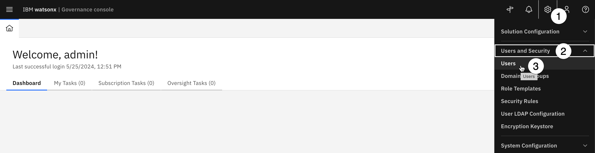

*Updated October 11, 2024*

Welcome to the configuration section of Level 4 Proof of Experience (PoX) hands-on lab for watsonx.governance. In this lab, you will provision an environment that will allow you to perform a watsonx.governance PoX. You will then configure that environment to enable the relevant services and integrations, and will load sample user data to provide a richer, more realistic PoX experience for your client.

Provisioning an environment through TechZone will install the required services necessary for the PoX in a dedicated software environment. However, this step can take up to seven hours, so plan accordingly.

The configurations performed in this lab are more specific to Cloud Pak for Data and the individual services, and less related to the watsonx.governance solution. However, your client may be interested in seeing some of these, such as creating users in Cloud Pak for Data, or loading sample data into the governance console.

**Note**: You will need some of the credentials and user information from this lab when you proceed with the [watsonx.governance Level 4 PoX hands-on lab](https://cp4d-outcomes.techzone.ibm.com/l4-pox/watsonx-governance).

## Getting help - PLEASE READ

This is an extremely lengthy, highly technical lab that touches on multiple products and environments that are all under active development. Every effort has been made to address possible causes and issues in the instructions themselves; however, it is not uncommon for problems to arise, error messages to appear, or screens to sometimes differ from the lab instructions.

**PLEASE** refer to the [Troubleshooting](#Troubleshooting) section of the lab first to see if your problem is addressed there. That section will be continually updated to respond to the most frequent issues encountered in running the lab.

**If your issue is not addressed, PLEASE contact the author via Slack if at all possible**. IBMers can reach Eric Martens [via Slack](https://ibm.enterprise.slack.com/user/@W4XCL2AMC). Business partners can reach out via [email](mailto:emartens@us.ibm.com).

Leaving comments on the YourLearning page or attempting to address issues via a TechZone ticket will eventually get a response, but the above two methods are significantly preferred and will result in a much quicker resolution.

## Architecture

The diagram below shows the overall architecture of the watsonx.governance solution:

Note the white **Build** and **Deploy** tiles are not dependent on IBM software or platforms. The watsonx.governance solution can work with models built and deployed in any environment.

During build time, metadata such as training data sets, frameworks, runtimes, and prompts can be captured automatically (for IBM development environments) or with a few lines of code in a Jupyter notebook (for third-party environments). This metadata passes to the model's Factsheet, which is maintained on Cloud Pak for Data. Factsheet data is automatically synced to the watsonx.governance console (IBM OpenPages) where it can be viewed by appropriate stakeholders.

Also during build time, AI engineers and prompt engineers can take advantage of the watsonx.governance monitoring capabilities hosted on Cloud Pak for Data to evaluate their models and prompts. As the diagram shows, this evaluation data is automatically recorded in the Factsheet for the model, and again, synced to the governance console.

Deploying a model (using IBM or third-party infrastructure) also generates metadata, which can once again be captured and stored on the model's Factsheet. Additionally, the watsonx.governance monitoring service can then begin run-time assessments of the model. For third-party models and IBM-hosted models in pre-production environments, model output and evaluation data can be sent to the watsonx.governance monitoring service via Python SDK, REST API, or direct file upload. For IBM-hosted models in production environments, model output is automatically recorded in the monitoring service's datamart. The datamart can be hosted either in the same Cloud Pak for Data environment as the monitoring service, or externally by providing connection information.

The monitoring service uses data in the datamart to calculate metrics, which are automatically updated in the model's Factsheet, as well as the governance console. 

## Environment

At the time this lab was written, the environments available in TechZone are not equipped with Graphics Processing Units (GPUs) to allow for development and some evaluations of generative AI models. While this restriction will likely ease in the future, the lab will use a combination of the software environment on TechZone and a shared Software-as-a-Service environment on IBM Cloud to demonstrate watsonx.governance capabilities. As environments with GPUs become more readily available, or when the full watsonx.governance solution is available on SaaS, the lab will be updated to use a single environment.

Note that you may be able to access a GPU-enabled environment through IBM, or use a client environment before the instructions have been updated. In that case, the interfaces and capabilities are similar enough that adapting the lab should be relatively straightforward.

Also note that watsonx.governance is undergoing rapid development, and you should expect changes to capabilities, terminology, and user interfaces, particularly when using the SaaS environment. Product screens may differ from lab screenshots. Every effort will be made to update the lab instructions to reflect new features and changes to the user interface, but some flexibility on the part of the user will likely be required.

Finally, be extremely cautious when using environments shared with other sellers for PoX activities, whether they are SaaS accounts or provisioned software clusters. Without provisioning multiple instances of the services in the environment, changes you make and data you load will very likely affect other users. For example, any alterations you make to workflows or views in the governance console (OpenPages) will affect all users of that service instance. Any user who has the authority to add model subscriptions to the monitoring service (OpenScale) also has the authority to delete or modify any other subscription in the same instance.

## 1. Required software and services

An environment provisioned for the Proof of Experience (PoX) will include the base Cloud Pak for Data image, as well as the following services:
- Watsonx.governance (including the OpenPages, OpenScale, and AI Factsheets component services)
- Db2
- Watson Machine Learning
- Watson Studio

The hands-on lab was written using Cloud Pak for Data 4.8.5 and OpenPages 9.0.0.2.

The hands-on lab explores the monitoring and governance of third-party models in Microsoft Azure and Amazon SageMaker. Access to these services can be currently obtained via your technical sales leads, and is coming soon to TechZone. It is also possible to use the client's third-party services if they would prefer. However, certain portions of the watsonx.governance platform, particularly the predictive model explanation service, can send tens of thousands of requests to the model, which will rapidly drive up costs. Please be aware of this, and if at all possible only generate explanations for models hosted on IBM systems.

## 2. Log in to your environment

To begin, you will log into your environment with the credentials provided in your TechZone reservation.

1. Navigate to your [TechZone reservations](https://techzone.ibm.com/my/reservations) page.

2. Locate and click on the tile for the environment you reserved in a previous step.

3. Copy and paste the reservation **Username** and **Password** values from the reservation screen into a text file for later use.

4. Click on the **Open your IBM Cloud environment** button. A new tab opens with the Red Hat OpenShift log in form.

5. If given the option to log in with *kube:admin* credentials or *IBMid* credentials, click on *kube:admin*.

6. Using the values you copied in step 3, log in to the OpenShift cluster.

## 3. Get your Cloud Pak for Data credentials

Now that you have successfully logged into your cluster, you will need the credentials to log into Cloud Pak for Data.

1. Click the **Pipelines** menu on the left side of the screen to expand it.

2. Click the **Pipelines** item from the list.

3. Click the **PipelineRuns** tab to select it.

4. From the list of pipeline runs, click the link for **cloud-pak-deployer-xxx**. It will likely be the only item in the list. Note that if the run is not listed as "Completed" then you will need to wait for it to finish. This pipeline typically takes four hours or longer to run and install all the required software.

5. Click on the **Logs** tab.

6. Click on the last item in the list on the left, titled **update-configmap-success-iam**. Note that if this item does not appear in the list, then either the software installation has failed (if the pipeline run is complete) or has not fully finished.

7. Copy and paste the *Console Route*, *Username*, and *Password* information from the log window into a text file. **Throughout the remainder of this lab, you will use these credentials whenever you are instructed to log into Cloud Pak for Data or watsonx.**

## 4. Create a user

In this step, you will create a sample user in Cloud Pak for Data. This step is required for the Proof of Experience (PoX) hands-on lab, where you will add the user you create here as a user in the governance console.

1. Log in to Cloud Pak for Data using the *Console Route* URL, *Username*, and *Password* information you gathered in the previous step.

2. From the home screen, click on the **hamburger menu** in the upper left.

3. Click on the **Administration** menu item to expand it.

4. Click on **Access control** to open the access control screen.

5. Click on the blue **Add users** button.

6. Fill out the **Profile information** form. Note that the information in the fields can be customized to your client's organization; however, we highly recommend using a generic password like **passw0rd** to avoid login issues. Make a note of the credentials for the user you are creating. You will need them for the Proof of Experience (PoX) hands-on lab.

7. Click **Next** to proceed to the **Platform access** page.

8. Ensure that the **Assign roles directly** tile is selected and click **Next** on the **Platform access** screen to assign roles directly to the user. Note that you can create user access groups to more efficiently manage access, but that is beyond the scope of this lab.

9. Use the checkboxes in the **Roles** section of the screen to assign all roles to the new user. Note that this will govern actions they can perform in Cloud Pak for Data, and will give them all the permissions necessary to perform the lab steps. You can create multiple users with different roles if your client is interested in how Cloud Pak for Data manages roles, but for the sake of simplicity, giving one user all permissions will allow you to focus on the features of watsonx.governance. Clicking on the different roles from this screen will show the various actions that each role is allowed to perform. For more information on these pre-defined roles and the permissions they grant, see the [Cloud Pak for Data documentation](https://www.ibm.com/docs/en/cloud-paks/cp-data/4.8.x?topic=users-predefined-roles-permissions-in-cloud-pak-data).

10. Click **Next** to proceed to the **Summary** screen.

11. From the **Summary** screen, click **Add** to finalize the new user. **DO NOT SWITCH TO THE NEW USER**. Please continue to perform the following steps as the **admin** user.

## Configure the governance console

In this section, you will enable the watsonx.governance console (OpenPages) integration with Factsheets and the watsonx.governance monitoring service (OpenScale), and load sample data into the governance console.

## 1. Create a model inventory

First, you will create an inventory and give the created user access to it. Inventories are collections of model use cases. They are meant to be collaborative so that multiple people that perform different roles can contribute to governance of key assets.

1. Click on the **hamburger menu** in the upper left to open the menu panel.

2. Click on the **AI governance** menu item to expand it.

3. Click on the **AI use cases** menu item.

4. Click on the **gear icon** to open the **AI use case settings** screen.

5. Click the **Inventories** menu item on the left.

6. Click the blue **New inventory** button to create a new inventory.

7. Enter a name for your inventory like **High Oaks Banks Model Use Cases** in the **Name** field.

8. Ensure that the **Add collaborators after creation** box is checked.

9. Click the **Create** button to create the inventory. The **Set collaborators** window opens.

10. Click the blue **Add collaborators** button to open the context dropdown.

11. Click on the **Add user** menu item. The **Add collaborators** window opens.

12. In the **Search users** field, begin typing user ID you created in the previous section, and select the user from the search results.

13. Click the **Add** button to add the user as an administrator to the inventory.

You can close the **Set collaborators** and **Manage** windows to return to the **AI use case** screen, then return to the Cloud Pak for Data home page by clicking the title in the upper left corner. You have now created an inventory to hold your AI use cases. Next, you will turn on integration with the IBM OpenPages service, which will enable the watsonx governance console.

## 2. Turn on OpenPages integration

1. From the home screen, click the **hamburger menu** in the upper left.

2. Click on the **AI governance** menu entry to expand it.

3. Click on **External models**. The **External models** screen appears.

4. Click the blue **Setup external model governance** button.

5. Click the toggle button for **External model governance** to activate it. The **Setup external model governance** screen opens.

7. Click on the **Inventory** dropdown and select the **High Oaks Banks Model Use Cases** inventory you created in the previous step.

8. Click on the **Default owner** dropdown and select the **admin** user.

9. Click **Apply**. You will return to the previous screen.

10. Click the toggle button for **Governance Console (IBM OpenPages) integration** to activate it. The **Setup Governance Console integration** screen opens.

11. Verify that the **User** dropdown is set to **admin**.

12. Click on the **Inventory** dropdown and select the **High Oaks Banks Model Use Cases** inventory you created in the previous step.

13. Click on the **Default owner** dropdown and select the **admin** user.

14. Click on the **Apply** button to complete the setup.

Integration between watsonx (or Cloud Pak for Data) and OpenPages has now been enabled. Now that you have configured Cloud Pak for Data to use the watsonx governance console (OpenPages), model use cases created in the governance console will appear in the inventory in Cloud Pak for Data, and vice versa.

## 3. Launch the governance console

In this section, you will launch the OpenPages service. With the release of watsonx.governance, IBM's AI governance solutions continue to be integrated and re-branded into a cohesive whole. However, previous versions of the service names may still appear in some locations, and your clients may be familiar with these separate services. In the context of watsonx.governance, the OpenPages product is frequently referred to as the **governance console**, but in the list of services running in your environment, is referred to as **OpenPages**.

1. Close the **Manage** window by clicking the **X** button in the upper right.

2. Click on the **hamburger menu** in the upper left.

3. Click on the **Services** item from the menu to expand it.

4. Click on **Instances** to open the **Instances** screen.

5. Locate the instance of OpenPages in the table and click on the link in the **Name** column to open the instance details screen.

6. Scroll down to the **Access information** section, and click the **launch icon** to launch the service.

The OpenPages service launches. Close any **Welcome** popup windows and proceed.

## 4. Load sample users

In this step, you will load sample user data to more fully flesh out the organization. In the hands-on lab, you will work with the user you created in the previous step to see how accounts can be customized and given roles in the organization.

For this exercise, you will be loading data and metrics relevant to the hands-on lab, but note that the ability to import and export these configurations allows for rapid customization and sharing of OpenPages environments, workflows, and data.

There are two different import methods for the governance console:
- Configuration imports, which consist of XML files
- FastMap imports, which consist of Excel spreadsheets (xlsx)

Both methods can be used to import user and organizational data, questionnaires, previous model metrics, and more.

> Actual user accounts should be created using the method in the [Create a user](#Create_a_user) section. The governance console uses Cloud Pak for Data to handle user authentication, so user accounts created within the governance console, or uploaded to the console via configuration imports will not be able to log in to the service. The example users below are being loaded for the sole purpose of filling out the governance console to make it appear more realistic, and because the organizational data being uploaded in a later step references some of the example user accounts.

1. Right-click on the link and download the [MRG-users-op-config.xml](https://github.com/CloudPak-Outcomes/Outcomes-Projects/raw/main/watsonx-governance-l4/openpages-sample-files/MRG-users-op-config.xml) file to your machine.

2. Click the **gear icon** in the upper right to open the **Administration menu**.

3. Click the **System Migration** menu item to expand it.

4. Click on **Import Configuration**. The **Import Configuration** tab opens.

5. From the column on the left, click the radio button to select **Local drive**.

6. Click **Add file**.

7. In the file browser, navigate to the *MRG-users-op-config.xml* file on your machine and open it.

8. Click **Import**.

9. Click **Submit** to confirm your choice and import the file. Your browser will open the **History** tab to show the progress of the import. The file import may take a minute or two to complete; when it is finished, you will receive an **Import successful** notification.

## 5. Load sample organization and metrics data

In this section, you will load additional data to flesh out the organization and the dashboard using the FastMap import tool.

### Do not attempt to continue loading the data until the previous step has completed.

1. Right-click the link and download the [High_Oaks_All_MRG_Content.xlsx](https://github.com/CloudPak-Outcomes/Outcomes-Projects/raw/main/watsonx-governance-l4/openpages-sample-files/High_Oaks_All_MRG_Content.xlsx) file to your machine.

2. Click on the **gear icon** in the upper right to open the Administration view.

3. Click on the **FastMap Import** menu item.

4. Click the **Import** button. The **FastMap validate and import** window opens.

5. Click the **Choose file** button. Locate the *High_Oaks_All_MRG_Content.xlsx* file on your machine's hard drive.

6. Click **Validate**. The validation process should take up to a minute to complete.

> If the validation process fails with an **Invalid user** error as shown in the screen below, please see the *Invalid users when importing the FastMap file* item in the [Troubleshooting](#Troubleshooting) section below.

7. After the validation completes, click **Import** to confirm the import. The screen shows the status of the import, which will take a few minutes to complete. While the items are importing, you can open another browser tab and begin the [Configure monitoring](#Configure_Monitoring) section; however, be sure to return to these steps and complete them.

8. After the import completes, close the status screen by clicking the **X** icon in the upper right of the modal window.

You have successfully imported details and metrics for the organization.

## 6. Enable the watsonx profiles for the admin user

Finally, for the governance console to show the new watsonx views and functionality for the admin user, you will need to add the relevant profiles to the user account.

1. Click on the **gear icon** in the upper right to open the **Administration menu**.

2. Click on the **Users and Security** menu item to expand it.

3. Click on the **Users** menu item. The **Users** tab opens.

4. Locate the **admin** user from the list and click on it.

5. Scroll down to the **Locale and Profiles** section and click on the **pencil** icon next to **Allowed user profiles**.

6. Enter **watsonx** in the text entry to narrow the list down, then check the boxes for the **watsonx-governance Modules Master**, **watsonx-governance MRG Master**, **watsonx-governance ORM Master**, and **watsonx-governance RCM Master** profiles.

Note that the **Save** button is disabled; this is because not all the required information is present for this user, so the system prevents changes from being saved. Required fields are denoted with a red asterisk.

7. Scroll up to the **User Information** section and enter an email address such as **admin@ibm.com** in the **Email** field. The **Save** button becomes operational.

8. Click the **Save** button to save your changes.

Now that you have enabled the watsonx profiles for the admin user, you will need to switch to the new profile.

9. Click on the **avatar icon** in the upper right to open the **User menu**.

10. Click on the **Change Profile** menu item. The **Select profile** dialog opens.

11. Locate the **watsonx-governance Modules Master** profile from the list and click on it.

12. Click the **Save** button to save your changes.

## 7. Add views to the MRG role template

At the time of writing, the Model Risk Governance role template does not have access to the **Risk** or **Use Case Review** views. You will need to manually add the view to the role template. Future versions of the governance console may change the role to automatically include access to these views.

1. Click on the **gear icon** in the upper right to open the **Administration menu**.

2. Click on the **Users and Security** menu item to expand it.

3. Click on the **Role Templates** menu item. The **Role Templates** tab opens.

4. From the list in the left panel, scroll down to the **MRG - All Permissions** role and click on it.

5. In the panel on the right, in the **Role Access Controls** section, click on the **Add** button. The **Add Object Type Access** panel opens.

6. Scroll to the **Risk Assessment** item in the **Add Object Type Access** panel and check the box next to it, as well as the boxes next to **Risk Assessment Eval** and **Risk Eval**.

7. Click the **Add** button at the bottom of the panel to add access. Note that you have only added *Read* level access at this point. The **Add Object Type Access** panel closes, and **Risk Assessment** as well as the other objects now appear in the main access list.

8. Scroll to the **Risk Assessment** item in the list and check the box to the left of it, as well as the boxes next to **Risk Assessment Eval** and **Risk Eval**.

9. Scroll back to the top of the list and click the **Edit** button in the context menu at the top of the table. The **Edit** panel opens.

10. Use the dropdowns to set the **Write**, **Delete**, and **Associate** permissions to **Granted**.

11. Click the **Done** button to close the **Edit** panel.

You have completed configurations for the governance console.

## Configure monitoring

In this step, you will configure the watsonx.governance monitoring service, formerly known as OpenScale. The monitoring service provides metrics by capturing model input and output in a database known as a datamart. The datamart also holds information about the models being monitored, as well as the complete history of the metrics gathered.

The datamart requires either a Db2 or PostgreSQL database.

## 1. Gather database credentials

1. Log in to Cloud Pak for Data as the *admin* user in your environment, using the Cloud Pak for Data Console Route and password gathered in the *Get your Cloud Pak for Data credentials* step of the **Environments** section.

2. From the home screen, click the **hamburger menu** in the upper left to open it.

3. Click the **Data** menu item.

4. Click on **Databases**.

5. From your list of databases, locate the tile for the newly-created database and click the three dots in the upper right of the tile to open the context menu.

6. Click **Details**.

7. Locate the **Deployment id** in the details towards the bottom of the page. Select and copy the value into a text editor.

8. In the text editor, add a prefix of **c-** and a suffix of **-db2u** to the deployment ID value from the previous step to create the database host name. For example, in the screenshot below, the database has a deployment ID of **db2oltp-1711746733422797**. The corresponding host name would be **c-db2oltp-1711746733422797-db2u**.

9. Click on the **IBM Cloud Pak for Data** button in the upper left to return to the home screen.

## 3. Add the user to the monitoring service

In order to perform model evaluations, the user you created in previous steps needs to be granted access to the monitoring service.

1. Return to the Cloud Pak for Data home screen in your environment.

2. Click on the **hamburger menu** in the upper left.

3. Click on the **Services** item from the menu to expand it.

4. Click on **Instances** to open the **Instances** screen.

5. Locate the OpenScale service in the table and click on the three dots in the corresponding row to open the context menu.

6. Click on the **Manage access** menu item to open the **Access management** screen for the service.

7. Click on the **Add users** button. The **Grant access to users and groups** dialog opens.

8. Check the box to the left of the user you created.

9. Click the **Choose a role** dropdown in the **Filter** column for the created user and select the **Admin** option.

10. Click the blue **Add** button to add the service access to the user's profile and close the dialog box.

The created user will now have **Admin** privileges, which will allow them to add machine learning providers. Note that assigning **Editor** privileges would allow the user to create and remove model subscriptions and configure models for monitoring, but not add the deployment spaces or third-party environments that host the models.

## 4. Configure the monitoring service

You have now created a database and are ready to connect it to the watsonx.governance monitoring service.

1. Click on the **hamburger menu** in the upper left of the screen.

2. Click on the **Services** menu item to expand it.

3. Click on **Instances** from the menu.

4. Locate the **IBM Watson OpenScale** instance from the list. Note that, on IBM Cloud, this service has been renamed to watsonx.governance. Future software releases will likely incorporate this change as well, so this screen may change to reflect the new name.

5. Click on the ellipsis button for the OpenScale instance on the far right to open the context menu.

6. Click on **Open**. The watsonx.governance monitoring service (OpenScale) will open. Note that if the **Open** option does not appear, the page may not have finished fully loading. Try waiting for up to a minute or refreshing the page.

7. If this is the first time you have opened the watsonx.governance monitoring tool, you will see the **Model evaluation** modal window. Click **Manual setup**. Note that you can do an auto setup using the same credentials and database information as the steps below to fill out the dashboard with some example models, but the process will take up to 20 minutes longer.

8. From the **System setup** screen, click the **Pencil icon** on the **Database** tile to edit database information.

9. Use the dropdown to set the **Database type** to **Db2**.

10. Paste the database host name value you constructed in the previous section into the **Hostname or IP address** field.

11. Enter **BLUDB** in the **Database** field.

12. Enter **admin** in the **Username** field.

13. Enter the Cloud Pak for Data admin password in the **Password** field.

14. Click **Connect**. The monitoring service will attempt to connect to the database using the credentials you supplied. If the connection fails, double-check that you have constructed the hostname correctly, and that you are using the **admin** username and password that you use to log into the Cloud Pak for Data or watsonx home screen.

15. Use the dropdown to set **Schema** to **Auto-create a new schema**.

16. Click **Save**.

When the changes have successfully saved, the watsonx.governance monitoring service will be configured and operational.

You may now proceed to the [watsonx.governance Level 4 PoX hands-on lab](https://cp4d-outcomes.techzone.ibm.com/l4-pox/watsonx-governance-techxchange). Note your Cloud Pak for Data console URL and login credentials, which will be used in that lab.

## Troubleshooting

This section contains descriptions of common issues that arise when provisioning and configuring a watsonx.governance environment.

## 1. Software environment fails to provision

The environment used for this lab can fail to provision or deploy properly based on network conditions, capacity issues, or other problems. Deleting and recreating your reservation in a lower-traffic region such as Europe or Asia Pacific can frequently succeed. However, if problems persist, please [open a support ticket with TechZone](
https://ibmsf.force.com/ibminternalproducts/s/createrecord/NewCase?language=en_US) to address the issue.

## 2. Invalid users when importing the FastMap file

Occasionally when importing the FastMap file you may receive the following error:

If this happens, click the **Cancel** button to cancel the import. Then click the **Gear icon** to open the **Settings menu**. Click the **Users and security** menu item to open it, and click on the **Users** menu item.

Verify that the users in the screenshot below are listed in the **Users** table. If they are **NOT** listed, you may need to follow the instructions in the import the [4. Load sample users](#4._Load_sample_users) section again to reload the users.

If they **ARE** listed in the table, then the OpenPages system may have not finished processing their addition. Please wait up to ten minutes, then attempt to load the FastMap file once again by following the instructions in the [5. Load sample organization and metrics data](#5._Load_sample_organization_and_metrics_data) section. If the FastMap file continues to fail, see the next section of the troubleshooting guide for getting more help.

## 3. Other governance console import errors

When importing FastMap (xlsx) or configuration (xml) files in the governance console, you may receive error messages like those in the screenshot below:

There are two likely causes for this. First, you may be importing the files in the wrong order; in this lab, the sample users configuration XML file should be uploaded before the organization's FastMap spreadsheet. Verify that the users file is present before you try and upload the FastMap.

Second, the version of the OpenPages service may not match the version of the FastMap file. Verify that you have downloaded the [latest version of the file](https://github.com/CloudPak-Outcomes/Outcomes-Projects/raw/main/watsonx-governance-l4/openpages-sample-files/High_Oaks_All_MRG_Content.xlsx). If the errors persist, contact Eric Martens [via Slack](https://ibm.enterprise.slack.com/user/@W4XCL2AMC) or [email](mailto:emartens@us.ibm.com).