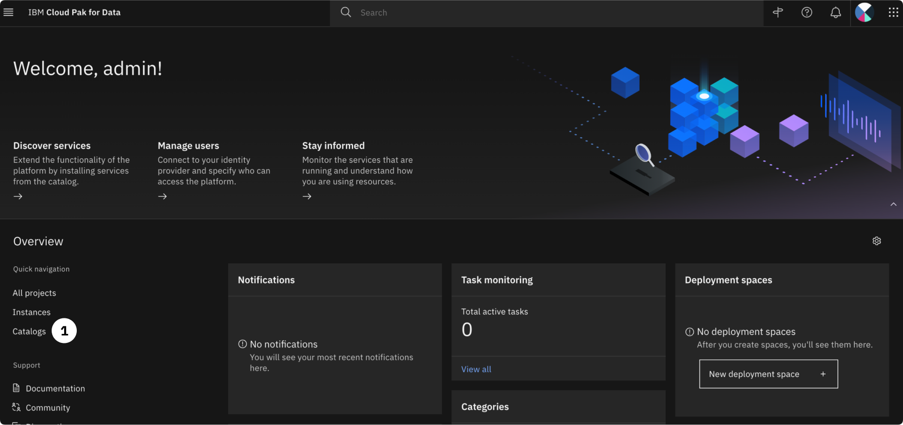
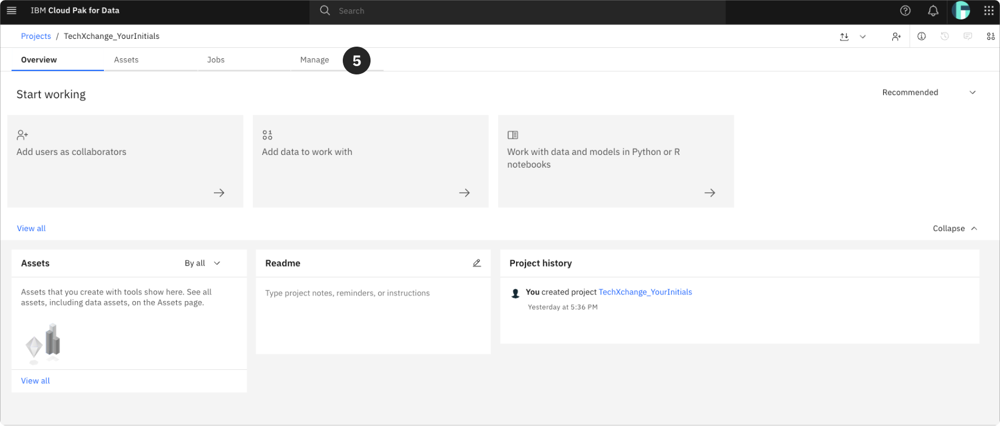
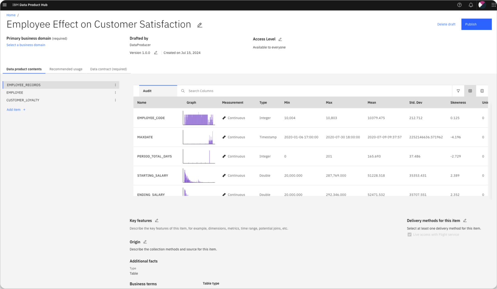
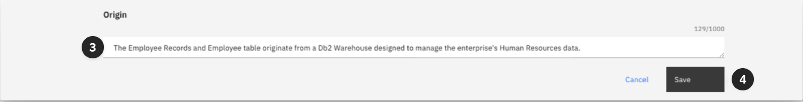
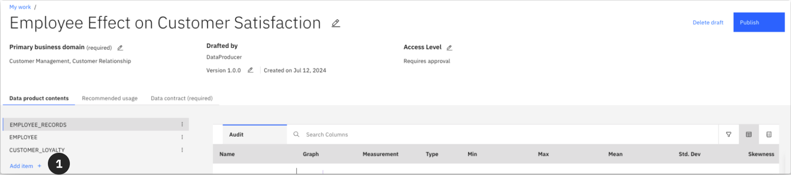
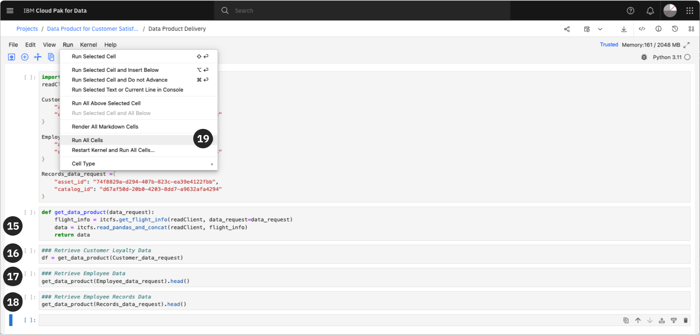
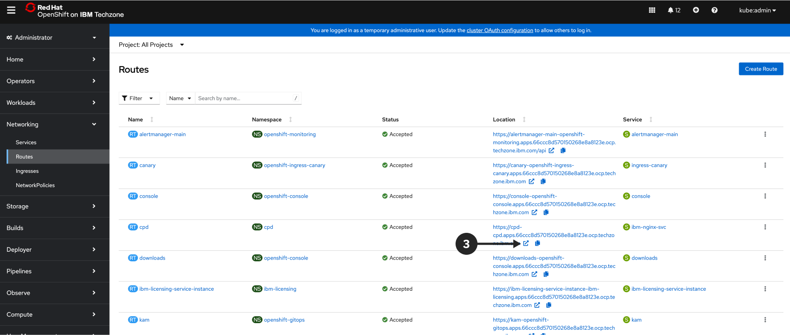

## Introduction


**IBM Data Product Hub** empowers data producers to publish curated data products for easy access by data consumers within their community. This lab introduces the critical features of **Data Product Hub**, demonstrating its capabilities in data sharing across an organization and automating the delivery of data products for users of all skill levels. Integrating with various source systems, **Data Product Hub** simplifies the onboarding of data products, regardless of their origin. Data producers can package, operationalize, and share reusable data products such as datasets, AI models, and notebooks. Business users and other data consumers can quickly discover these curated data products and receive them in a format optimized for their needs, reducing friction and improving enterprise data quality, reliability, and discoverability.

### Understanding Data Product Hub

**Data Product Hub** is a comprehensive platform designed to help seamlessly integrate and manage data product across an organization. It provides a unified environment where data producers can transform raw data into valuable data products. This involves packaging, productizing, and distributing these data assets, ensuring they are accessible, high-quality, and relevant for data consumers. The platform supports various data sources and formats, making it versatile and robust for multiple use cases.

### What is a Data Product?

A data product is a composite entity that encapsulates one or more curated data assets designed for reuse and broad distribution. Unlike traditional data assets in governance catalogs, data products are governed through a lifecycle that includes stages such as **Draft**, **Published**, and **Retired**. This lifecycle management ensures that data products are always in a state that maximizes their business value and usability. Data products can include datasets, AI models, notebooks, and more, each thoroughly described with metadata to aid discoverability and usability.

### Key features of Data Product Hub


---

## Lab Scenario


Management has observed a decline in order fulfillment rates and increased shipment times, which has resulted in consumer complaints through surveys and customer care channels. To address these concerns, an analytics project has been initiated to conduct a comprehensive AI investigation to identify the root causes of the significant drop in customer satisfaction over the past year.

### Data Request

The analytics team has requested access to customer loyalty, employee and warehouse staff data to support this investigation. The following data assets are needed to perform the necessary analytical and AI tasks to meet the project's business objectives:

| Data Requested   | Located              | Analytics and AI Use Case                                    |
| ---------------- | -------------------- | ------------------------------------------------------------ |
| Employee         | DB2 Warehouse        | Needed for insight analysis to investigate warehouse staffing effects on customer satisfaction. |
| Warehouse Staff  | Cloud Object Storage | Needed insight analysis to investigate warehouse staffing effects on customer satisfaction. |
| Customer Loyalty | PostgreSQL Database  | Needed for insight analysis to investigate warehouse staffing effects on customer satisfaction. |

This data will enable the analytics team to effectively analyze the factors contributing to customer satisfaction’s decline and provide actionable insights for improvement.

Before the analytics team can begin performing business analytics and building and training machine learning and AI models to help determine the decline in customer satisfaction, it’s essential to easily access, understand, and trust the data. The analytics and resulting outcomes are only as good as the data.

To satisfy the project team's request to meet their analytical goals, the **Data Producer** assigned to the project will use the **Data Product Lifecycle Management** capabilities of IBM's **Data Product Hub** to create an operationalized, reusable, and ready-to-use data product for the analytics team. This ensures that the required data assets are easily found and accessible from a trusted source, with the necessary data contracts and terms of use provided to ensure no risk of exposure to unauthorized users.

To address management's concerns and successfully deliver this project, the following tasks will be performed:

## 1. Data Product Request

The **Data Consumer** will make a **Data Product Request** specifying the:

* Project Overview
* Business Justification
* Key Features Needed
* Delivery Method
* Data Contract


> A **Data Contract** details a mutual data-sharing agreement. The **Data Producer** can specify the terms and conditions of usage and set Service Level Agreements (SLAs). They can also define aspects such as classification categories and compliance with regulatory laws. Descriptive data policies outline permitted usage and sharing, while policy enforcement ensures consistently high-quality data products, acting as SLAs. For example, an SLA related to permitted usage could specify that the data can only be accessed by authorized personnel within the organization and cannot be shared with external parties without explicit consent. Data contracts introduce governance, enabling safe and secure data-sharing practices.

## 2. Request Acceptance

The Data Request initiates a workflow by sending the task to the Data Producer, who can accept or reject it based on the specified criteria. Once a data product request is submitted, it is distributed to all producers for assessment. Producers evaluate the request based on the consumer and request details before accepting or rejecting it. The Data Producer can also provide feedback to the Data Consumer if the request is rejected or accepted

## 3. Creation

Once the **Data Producer** has accepted the request, they will begin creating the new Data Product. This includes:

* Assigning a **Business Domain**
* Setting the **Access Level**
* Adding the **Data Assets**
* Defining **Key Features**
* Choosing the **Delivery Methods**
* Providing **Recommended Usage**
* Crafting the **Data Contract**

## 4. Publish

Once the Data Product meets all requirements, the **Data Producer** will publish it for access by authorized members of your data community.

Published data products are accessible to community members listed on the **Manage community** page. Access restrictions can be set to require approval before delivery. The access level of published data products can be modified, but the content of a published data product cannot be altered.

Data products are retained on the Data Product Hub until they are retired. Data consumers can discover and subscribe only to published data products.

## 5. Subscribe and Use

Once the **Data Producer** has published the data product, the **Data Consumer**, can subscribe to the Data Product by clicking "Subscribe" on the product tile. It is recommended to review the product details by clicking on the tile to ensure it aligns with the business needs identified by management.

To subscribe, the **Data Consumer** needs to confirm the data product meets their needs, agree to the terms in the data contract, and provide a brief description of how they intend to use the data.

By subscribing, the **Data Consumer** can select their preferred Delivery Method to access the data product. This allows the consumer to begin the analytics project requested by management.

Accessing the data product is crucial for progressing with the analytics project. Users can monitor the delivery status of their subscribed data product on the **My Subscriptions** page within the **Data Product Hub**. The subscription will provide the **Data Consumer** with the necessary access to **Flight Service** to access the data product to complete the project.

---

### Lab Workflow


---

> If a pop-up message asking to guide or assist appears at any point during these lab instructions, dismiss it and follow the instructions.

---

## Environment


---

The steps in this section must be performed before proceeding with the lab.

> This environment supports the **Data Product Hub** Level 3 hands-on lab. The diagram below outlines the cluster configuration for this environment. It was sized using the [IBM Sales Configurator](https://app.ibmsalesconfigurator.com/#/).


---

## 1. Cluster Configuration

This environment is configured for the **Data Product Hub** Level 3 hands-on labs and contains a related **Cloud Pak for Data** services that encapsulate the **Data Product Lifecycle Management** capabilities of IBM's data fabric solution: Data Product Hub, Knowledge Catalog, and Watson Studio.

Data Product Hub (software) runs on b, so this will be a familiar experience for those who have installed **Cloud Pak for Data** before. The only difference is that it will used as the staging area for **Data Product Hub**.

### Installed Services

* **Analytics Engine** Powered by Apache Spark service is installed because it's a dependency of the IBM Knowledge Catalog service.
* **IBM Knowledge Catalog** is installed because is the catalog leveraged in by **Data Product Hub**.
* **Watson Studio** is installed for the data consumer to leverage the data products through the flight service delivery method.

---

## 2. Provision This Environment

Pre-warmed environments are readily available to enhance your experience, ensuring faster and more efficient transfers. Once provisioned, you will receive a notification about the transfer of the Data Product Hub Level 3 environment to your IBMid within just a few minutes.

> In the unlikely event that no pre-warmed environments are available, provisioning and installing the **Data Product Hub** base control plane along with all predefined services may take approximately **3-4 hours**. Please be patient and manage your time accordingly.

Providing an [IBM Sales Cloud opportunity number or a Gainsight Relationship ID](https://ibm.seismic.com/Link/Content/DCFqG8BTPh8VfGfXV7TccgQF8RCP) will allow you to extend your reservation date. Review the [Reservation Duration Policy](https://github.com/IBM/itz-support-public/blob/main/IBM-Technology-Zone/IBM-Technology-Zone-Runbooks/reservation-duration-policy.md) to understand default durations allowed for specific infrastructures based on the purpose of the reservation.

**Click the link** below to provision this environment. It will take you to TechZone in a new tab in your browser. Follow the instructions below the link to create a reservation.

[Data Product Hub Level 3](https://techzone.ibm.com/my/reservations/create/66b52384dee9db001ea32492)

---

The TechZone environment reservation process is straight forward and self-explanatory so screen shots will not be provided. Simply follow these steps to complete the environment reservation process:

1. Go to [Data and AI Technology Sales Enablement](https://techzone.ibm.com/collection/62f171848326770017f5f259) collection on Techzone

2. Click on the **Level 3 Technical Enablement** Journey tab on the left hand side menu.


---

3. Select the **Data Product Hub Level 3 (Pre-warmed)** environment by clicking **Reserve**


---

4. Select **Reserve now**


---

5. Leave the default name as **Data Product Hub**

6. Select **Education** as the purpose of the reservation.

7. Enter a **Purpose description**.

8. Select a **Preferred Geography**. Choose a geography closest to your physical location.

9. Select the **checkbox** to agree to IBM Technology Zone's Terms and Conditions and End User Security Policies. (Affirming that the environment **will not be used with customer data**).

10. Click the **Submit** button in the bottom right corner.


---

The reservation request has been successfully submitted. You will receive an email notification once the **OpenShift** Cluster has finished provisioning and is ready for the **Deployer** to begin installing the environment.


---

TechZone will issue a series of emails notifying you of the provisioning process and progress. When you get the final email, notifying you the environment is **Ready**, the reservation will be populated with a link to access the **Red Hat OpenShift Console** for the environment, and the **Red Hat OpenShift Console** credentials (the **kubeadmin** user and password) to login to the console.

When the environment has provisioned successfully and is **Ready** for use refer to the steps in the [Post provisioning instructions](#3._Post_Provisioning_Instructions) for guidance on what steps to take next.

---

## 3. Post Provisioning Instructions

The steps in this section are to guide you through the post-provisioning steps in order to access your **Data Product Hub** environment.

### 1. Log in to OpenShift

---
Follow the instructions in this step to locate the **Red Hat OpenShift** console URL and credentials to log in to the **Red Hat OpenShift** environment that has been successfully provisioned and that TechZone has provided a **notification email** informing you that the reservation for the environment is **Ready**. These instructions will also show how to monitor the installation of **Data Product Hub** and how to locate the **Cloud Pak for Data** console route (URL) and credentials to log in to the **Cloud Pak for Data**/**Data Product Hub** console.

Check the email account associated with your **TechZone** account and look for an email with the subject: **[EXTERNAL] Reservation Ready on IBM Technology Zone**. It will look similar to the screen shot below.

> If you use the Microsoft Outlook web client for email, the email might be placed in the **Other** tab in your inbox so make sure you check the **Other** tab if you don't see it in the **Focused** tab.

> Make note of the **Reservation Name** because there may be multiple reservations in your TechZone account. Your reservation name may be different from the name depicted in the screenshot below. Also, the example used in the following instructions were produced by reserving a **Data Product Hub Level 3** environment. Other than the name of the environment, the instructions are universal for all the Level 3 and 4 Enablement **TechZone Certified Deployer** environments.

1. Click the **View My Reservations** button.


> If prompted, and depending on the authentication method you are presented with, enter your IBMId or IBM w3id and password. As mentioned previously, it is more than likely that you will have multiple reservations in your TechZone account like the screenshot below. So, make sure the reservation you are instructed to select in the following step is for the Level 4 PoX Enablement environment you just reserved, and make sure the reservation status is set to **Ready**.


---

2. Click on the **Data Product Hub Level 3** environment to view the details of the reservation.


---

3. Click on the **Copy** button next to the password field to copy the **kubeadmin** password to your clipboard.
4. Click the **Open your IBM Cloud environment** button.


---

If prompted, enter the Red Hat OpenShift console credentials:

5. Select the **kube:admin** button.


---

6. Enter the credentials provided earlier in your reservation to login

* Enter **kubeadmin** for the Username.
* Paste the **password** that was copied to the clipboard in the previous step into the Password field.

7. Click the **Log in** button.


---

8. From the left side menu, click the **Pipelines** menu to open it, and select the **Pipelines** sub-menu.


---

9. Click the **PipelineRuns** tab.
10. Click the **cloud-pak-deployer-5.0-xxxx-run-xxxx** (where xxxx is a unique random identifier/ environment type). There should only be one Pipeline run in the list.


> If the deployer pipeline states failure, refer to the [Troubleshooting](#3._Deployer_States_Failure) section below.


---

11. Click the **Logs** tab.


On the left side of the logs tab, the log is broken down into sections that convey the different steps that are being executed to install **Data Product Hub**. When you first enter the log you will most likely be taken to the **run-the-deployer** section of the log (the current step that is being executed) with a ton of **Waiting for job to Complete.** messages displayed and the **run-the-deployer** menu items depicting a blue spinning wheel. This means that **Data Product Hub** is still being installed and the environment **is not ready** for use just yet.


---


When all log menus have a green check mark and you see the **update-configmap-success** log step (the very last step in the log menu) with a green check mark next to it, and it contains the **Data Product Hub** Console Route, Username, and Password, the **Cloud Pak for Data** and **Data Product Hub** installation is complete!

> These instructions are universal anytime you reserve a **Certified TechZone Deployer** environment.


---

12. Select the the **Password**, right mouse click, and select **Copy**. This will copy the password to the clipboard.
13. Select the **Console Route**, right mouse click, and select **Open link in new tab**. This will open the **Cloud Pak for Data** console in a new tab in the browser.


> Leave the tab to the OpenShift console open in your browser. If you provisioned a **Cloud Pak for Data Custom** environment you will be instructed to come back to the OpenShift console to install **Data Product Hub** services. You may also need to come back to the console to obtain a token to access the cluster using the **oc** command line utility or to do some troubleshooting if something does not look right in the environment after you log in to **Data Product Hub** etc.


---

### 2. Log in to Cloud Pak for Data

You should be now be in the new tab that was just opened from the **Red Hat OpenShift** console with the **Data Product Hub** console ready to log in.

1. Enter **admin** for the Username.
2. Paste the **password** you copied to the clipboard in the previous step into the Password field.
3. Click the **Log in** button.


---

>>  Once on the landing page, ensure everything is configured correctly before continuing. One known issue is that in some installs, the ZenExtensions do not properly load, and the platform switch icon enabling seamless access between  **Data Product Hub** and **Cloud Pak for Data** may not be visible.

* If the landing page has the same components as *Figure* **A**, continue to the [Prerequisites](#Prerequisites) section.
* If the landing page is missing the same components as *Figure* **B**, refer to the [Missing Platform Switcher](#1._Missing_Platform_Switcher) section of the [Troubleshooting](#Troubleshooting) guide before continuing.


---

## Prerequisites


## 1. Personas

Now that we have successfully logged into the platform, it's time to create the personas that will be utilized in this lab. This lab will focus on two primary personas: the data producer and the data consumer.

### Data Producers

**Data Product Hub** provides producers with full control over the data product lifecycle. Producers are responsible for creating, publishing, and updating data products to maintain compliance with data quality and security standards. Additionally, producers can enforce governance by defining data-sharing policies and establishing service-level agreements (SLAs) that address access restrictions, delivery mechanisms, and product retirement criteria.

### Data Consumers

**Data Product Hub** streamlines the process for consumers to find the information necessary to fulfill their business requirements. Consumers can efficiently search through collections of data products and access data from a wide range of sources within a secure environment, thanks to **Data Product Hub**'s integration capabilities with both IBM and third-party tools. The platform also ensures data products are optimized for large-scale sharing across various consumers and consumption endpoints.

---

To initiate the creation of the personas, please follow these steps:

1. Click on the hamburger menu **&#9776;** in the upper left-hand corner of the Home page to open the navigation bar.


---

2. Select **Administration**.
3. From the sub-menu, select **Access Control**.


---

> Once on the Access Control page, you will need to create a new role specifically for the data producer, titled **Data Product Hub Functional Administrator**. This role is essential for initializing the **Data Product Hub** service and enabling the data producer to effectively administer the service.

> **&#9432;** **Update:** As of release 5.0.1 of **Cloud Pak for Data** and **Data Product Hub**, this role is not created by default and is automatically assigned to the **admin** or **cpadmin** accounts. Since this lab emphasizes the **Data Producer** persona as the administrator of Data Product Hub, manually creating this role is critical for the successful creation and management of data products. For more information on this role, please refer to the [What's new and changed in Data Product Hub](https://www.ibm.com/docs/en/cloud-paks/cp-data/5.0.x?topic=new-data-product-hub) section in the **Cloud Pak for Data** documentation.

---

To create this role, please proceed with the following steps:

4. On the Access Control page, click the **Roles** tab.


---

5. Click the **New Role** button located in the top right-hand corner of the existing roles table.


---

6. Enter the following text into the **Name** field:

```markdown
Data Product Hub Functional Administrator
```

7. Enter the following text into the **Description** field:

```markdown
Administrator of Data Product Hub responsible for initializing the service and managing the community.
```

8. Click the **Next** button to continue.


---

To configure the role, the following permission is required for the **Data Product Hub Functional Administrator**:

9. Expand the **Data products** dropdown by clicking the caret symbol **&#94;**.

10. Within the **Data products** dropdown, select the **Act as functional administrator** option.

11. Click **Next**.


---

12. On the **Summary** page, click the **Create** button to finalize the role creation.


---

The **Data Product Hub Functional Administrator** role is now active, and you can proceed to create the **Data Producer** persona.

13. Navigate to the **Users** tab in Access Control.


---

14. Click the **Add User** button in the top right-hand corner of the page.


---

### 1. The Data Producer

---

Now that the **Data Product Hub Functional Administrator** role is in place, it's time to proceed with creating the **Data Producer** persona. This persona is vital for managing and overseeing the creation, governance, and distribution of data products within the platform.

Please follow the steps outlined below to accurately set up the **Data Producer** persona, ensuring that all required fields are completed to enable seamless operation within the **Data Product Hub**.

1. Fill Out **Data Producer's** information with the following:

---

##### A. **Full Name**

```markdown
Data Producer
```

##### B. **Username**

```markdown
dataproducer
```

##### C. **Email**

```markdown
dataproducer@acme.com
```

##### D. **Password**

```markdown
cpdemo
```

##### E. **Confirm Password**

```markdown
cpdemo
```

2. click the **Next** button once the form is completed.


---

3. Select **Assign Roles Directly**
4. Click the **Next** button


---

The **Data Producer** persona requires extra permissions to administer, craft, and manage Data Products. The primary role needed is that of **Data Product Functional Administrator**. Additionally, for this lab's purposes, they will be assigned **Administrator**, **Data Steward**, **Data Quality Analyst**, **User**, and **Data Engineer** privileges.

---
>>  If the **Data Product Functional Administrator** role is not availble please go to the [Functional Administrator Role](#2._Functional_Administrator_Role) section of the [Troubleshooting](#Troubleshooting) guide to create the role before continuing.
---

5. Select the following roles:

* **Data Product Functional Administrator**
* **Administrator**
* **Data Steward**
* **Data Quality Analyst**
* **Data Engineer**
* **User**

6. Click the **Next** button


---

7. Review and finalize the roles given to the **Data Producer**, and once confirmed, click the **Add** button to complete the creation of the personas.


---

### 3. The Data Consumer

Repeat the same workflow when creating the **Data Consumer** with a few alterations in the assigned roles.

1. Click the **Add Users** button in the top right corner of the **Access Control** page.


2. Fill Out the **Data Consumer's** Information with the following:

---

##### A. **Full Name**

```markdown
Data Consumer
```

##### B. **Username**

```markdown
dataconsumer
```

##### C. **Email**

```markdown
dataconsumer@acme.com
```

##### D. **Password**

```markdown
cpdemo
```

##### E. **Confirm Password**

```markdown
cpdemo
```

Once the form is completed, click on the **Next** button.


---

3. Select **Assign Roles Directly**

4. Click the **Next** button


---

5. To ensure the Data Consumer has access to the **Data Product Hub** and Analytics projects, assign the following roles:

* **Data Scientist**
* **Business Analyst**
* **User**

6. Click the **Next** button


---

7. Review and finalize the roles given to the Data Consumer, and once confirmed, click Add to complete the creation of the personas.


> The **Data Product Functional Administrator** is responsible for initializing the data product catalog and executing API calls within the service. This user has access to all assets and connections associated with published data products and manages the functional credentials for each connection.


---

## 2. Create the Catalog

---

Now that the different personas needed for the lab have been successfully created, it is time to create the backend and staging area for the assets used when creating data products.

1. First, a data source or catalog is needed. Return to the home page, click the hamburger menu **&#9776;** and select **Catalog** or the **Catalogs** option in the column on the left of the landing page.



---

2. Next, click the **New Catalog** button in the top right corner of the screen.  


---

3. **Copy** and **Paste** the following details into the **Name** and **Description** fields for the catalog. Make sure you take note of the name if you create you own; it will needed later in the [Import Assets](#Importing_Assets) section.

**Name**

```markdown
DPH Demo Catalog
```

**Description**

```markdown
This catalog contains the assets used in the Data Product Hub demo.
```

4. Check the **Enforce data protection rules** box. This will be used to automatically profile the data in the catalog.
5. Click the **Create** button in the bottom right-hand corner.


---

The **Data Producer** will need access to the catalog to import the relevant assets. To do this:

6. Click on the **Access Control** tab
7. Select **Add Collaborators**
8. Under the dropdown, select **Add Users**.


---

9. Select **Admin** under role.
10. Focus on the search bar and start typing in the name of the **Data Producer** created in the previous section.
11. Once it populates, select the **Data Producer**
12. Click the **Add** button.


---

13. Click the **Cloud Pak for Data** label to return to the Cloud Pak for Data home page.


---

## 3. Create the Project

---

Next, a project is needed to house the assets that will be imported and later crafted into data products.

1. Return to the home page and select the **Projects** option in the column on the left of the landing page.


---

2. Give the project a memorable name section.

```markdown
DPH Demo Project
```

3. Give the project a brief description.

```markdown
This project houses the assets used in the Data Product Hub demo.
```

4. Click the **Create** button in the bottom right-hand corner.


---

The **Data Producer** will need access to the project for the **Import Assets** section of this lab in order to stage the environment.

5. From the home page of the project, select **Manage** which can be found in the top right-hand corner of the project tabs.



---

6. Select the **Access Control** tab.
7. Select **Add Collaborators** in the upper right-hand corner.
8. And **Add Users**.


---

9. Search for the **Data Producer**.
10. Once it populates, select the **Data Producer**.
11. Ensure they have **Admin** Access by clicking on the **&#8248;** next to **Role**.
12. After you confirm they are being added as an Admin, click the **Add** button.


---

13. Return to the **Manage** tab.
14. Copy and save the **Project ID** for the project. This will be needed in the next section.


---

> **&#10032;** **Congratulations:** You have successfully created the personas, catalog, and project needed for this lab. Now, import the assets that will be used to generate the data products.

Before moving to the next section you will need to log out from the **Admin** account, to logout:

15. Click the Avatar in the top right-hand corner.


16. Select **Log out** from the dropdown menu.


17. Click **Log out** in the pop-up window.


---

## Importing Assets


In this section, we will set up essential backend assets to streamline the pre-work in this lab. These tasks can be time-consuming and often are the focal in a governance or **Knowledge Catalog** lab. To expedite the process, participants will use a helper script that automates the setup. The essential tasks include:

1. **Creating Connections to Our Catalog**: Establishing secure and reliable connections to our data catalog to ensure seamless access and integration of data assets.

2. **Importing Metadata into Our Project**: Relevant metadata is brought into our project to provide context and structure to our data, which is crucial for effective data management and utilization.

3. **Running Metadata Enrichment**: This step enhances the imported metadata by adding valuable information, annotations, and classifications. It improves data quality and discoverability.

4. **Publishing Enriched Data Assets**: These data assets will be published in our catalog once enriched. This makes them readily available for creating data products and ensures that the enriched information is accessible for future use.

By using the helper script to automate these steps, we can significantly reduce the setup time, allowing us to focus on more advanced aspects of the lab.

>> The helper script is a Python script that uses the Watson Data API to automate the tasks outlined above. The participant must ensure that the **correct environment variables are entered** to enable the script to perform these tasks efficiently. This approach lays a solid foundation for creating a data product, ensuring that all necessary assets are prepared and optimized for efficient use.

## 1. Download the Lab Files

---
This lab section uses a Python module to import relevant connections and governance artifacts such as business terms, categories, policies, and rules into the environment. The file has been predefined and is provided in a zip file located in the **IBM Data and AI Live Demos** GitHub repository. Before proceeding, click the link below to download the zip file:

1. Visit the [CloudPak-Outcomes](https://github.com/CloudPak-Outcomes/Outcomes-Projects) repository on GitHub and go to the [Data-Product-Hub-L3](https://github.com/CloudPak-Outcomes/Outcomes-Projects/tree/main/Data-Product-Hub-L3) directory.


---

2. From there, select the **Data-Product-Hub-Level-3.zip** file.


3. Click on the  **&darr;** button in the upper right-hand corner and save the file to your computer.


---

When the download is complete, go to the download location and unzip the **Data-Product-Hub-Level-3.zip** file. Remember where the file was extracted because the instructions in the [Import Assets](#2._Import_Assets) section below will require it to expedite the environment setup process. Unzipping the file will create a directory named **Data-Product-Hub-L3** that will contain the following files:

| File Name                | Description                                                                                                             |
| ------------------------ | ----------------------------------------------------------------------------------------------------------------------- |
| import.py                  | Python script to run the Import client                                                                                |
| client.py                  | Python Client to import data connections and relevant governance artifacts                                            |
| 1-ImportEnvironment.ipynb  | Jupyter Notebook for those who prefer a notebook over the command line                                                |
| 2-DataProductDelivery.ipynb| Jupyter Notebook for importing data products to showcase delivery via FlightService                                   |
| governance_artifacts.zip   | Relevant governance artifacts to the data sources                                                                     |
| requirements.txt           | Python dependencies for importing connections and assets                                                              |
| DataContract.pdf           | Employee Effect on Customer Satisfaction - Mock Data Contract                                                         |
| .env.example               | Environment file for lab participants to put variables specific to their environment necessary for the import process |
| README.md                  | Detailed instructions on importing assets                                                                             |

Lab participants can use Watson Studio on their Cloud Pak for Data cluster to execute a helper script to import the governance artifacts, data source connections, and run metadata enrichment jobs.


---

## 2. Stage Data and Assets

Lab participants can also use Watson Studio on Cloud Pak for Data as a method to import to do this.

1. Login to **Cloud Pak for Data** as the **Data Producer** using the password you create in the [Personas](#1._Personas) section.


>> The default credentials provided in this lab for the **Data Producer** are:
>
##### Username:

```markdown
dataproducer 
```

##### Password:

```markdown
cpdemo 
```


---

2. Return to the project created in the [Create the Project](#3._Create_the_Project) section by clicking the project named **DPH Demo Project** underneath **Recent Projects**.


---

3. Once on in the **DPH Demo Project**, click the **New Asset** button.


---

4. Under **Work with models**, select **Work with data and models in Python or R notebooks**.

>> Dependending on your browser's resolution you may need to scroll down to the **Work with models** section to find the **Jupyter Notebook Editor** option.


---

In this lab, we will utilize a notebook found in the [**Data-Product-Hub-L3**](https://github.com/CloudPak-Outcomes/Outcomes-Projects/tree/main/Data-Product-Hub-L3) repository, which was referenced earlier. You have the option to either upload or clone this notebook into your environment; for this lab, we will proceed by cloning it directly from GitHub.

5. Select the **URL** tab in the left-hand menu to copy the template notebook from GitHub.
6. Give the notebook a preferred name or **Copy** and **Paste** the name below into the **Name** field below **Define details**.

```markdown
Import Client
```

7. **Copy** and **Paste** the URL below into the **Notebook URL** field on the right hand side.

```markdown
https://raw.githubusercontent.com/CloudPak-Outcomes/Outcomes-Projects/main/Data-Product-Hub-L3/1-ImportEnvironment.ipynb
```

8. Click the **Next** button.


---

You will need to manually set the environment variables for the notebook. These variables are specific your the environment and are essential for the import process to run successfully.

| #    | Variable Name    | Description                                             |Example                                             |
| ---- | ---------------- | ------------------------------------------------------- |------------------------------------------------------- |
| 1    | CPD_CLUSTER_HOST | Hostname/Base URL of the Cloud Pak for Data cluster     | cpd-cpd.apps.xxxxxxxxxxx.ocp.techzone.ibm.com |
| 2    | USERNAME         | Username of the [Data Producer](3._The_Data_Producer)   | dataproducer                                         |
| 3    | PASSWORD         | Password of the [Data Producer](3._The_Data_Producer)   | cpdemo                                              |
| 4    | CATALOG_NAME     | Name that [catalog](5._Create_the_Catalog) was created. | DPH Demo Catalog                                     |
| 5    | PROJECT_ID       | ID of [project](6._Create_the_Project) created          | be0cb8ff-b0d6-469a-9ed2-xjdfasx378547              |

---

Next you will need to modify the first **Code Cell**:

9. Update the **Code Cell** by adding your environment variables.

* A.  **CPD_CLUSTER_HOST**

  * Make sure the url does not include the http or https or any trailing slashes.
  * Example: **cpd-cpd.apps.668c1748ae7640001e26a9f0.ocp.techzone.ibm.com**

* B.  **USERNAME**

  * Example: **dataproducer**

* C.  **PASSWORD**

  * Example: **cpdemo**

* D.  **CATALOG_NAME**

  * Example: **DPH Demo Catalog**

* E.  **PROJECT_ID**

  * Example: **be0cb8ff-b0d6-469a-9ed2-810240b7ee27**


---

10. **Copy** and **Paste** the following connection information into the **Code Cell** underneath the variables that you just set.

```markdown
# PostgreSQL Warehouse Credentials
PSQL_DB_USERNAME=cpdemo
PSQL_DB_PASSWORD=C!oudP@k4DataDem0s
PSQL_DB_PORT=31128
PSQL_DB_DATABASE=3RDPARTY
PSQL_DB_HOST=85331fa6-6b56-4355-935e-290f3ac8aa8c.8117147f814b4b2ea643610826cd2046.databases.appdomain.cloud
PSQL_DATASOURCE_TYPE=048ed1bf-516c-46f0-ae90-fa3349d8bc1c

# DB2 Warehouse Credentials
DB_USERNAME=cpdemo
DB_PASSWORD=C!oudP@k4DataDem0s
DB_PORT=50001
DB_DATABASE=BLUDB
DB_HOST=db2w-ovqfeqq.us-south.db2w.cloud.ibm.com
DB2_DATASOURCE_TYPE=cfdcb449-1204-44ba-baa6-9a8a878e6aa7

# Cloud Object Storage Credentials
COS_BUCKET=cpd-outcomes
COS_SECRET_KEY=6f3fafc225b2c8527f22d13e2c67034f4da989dc08adffac
COS_API_KEY=_-W6DMVd3cQV7YrWIdmExhX29ApoDIBAu4y0C07dCMPB
COS_ACCESS_KEY=bd3d4829929a41ac8a2e8e7ab58e5cdb
COS_RESOURCE_INSTANCE_ID=crn:v1:bluemix:public:cloud-object-storage:global:a/feb0a088323a45db90b8dd694b314c53:88ee55e3-fc61-46a9-9ccd-e81593585ba6::
COS_DATASOURCE_TYPE=193a97c1-4475-4a19-b90c-295c4fdc6517

ORIGIN_COUNTRY=us
```


---

11. Select the **Run** dropdown&rarr; **Run all cells**.


---

12. Once you receive the successful run of the message, you may proceed to the lab!


---

## Setting Up Data Product Hub


## 1. Initialize Data Product Hub

Now that all of the relevant lab environment assets are in place or configured, the last part of the prework is to initialize Data Product Hub.

1. Return to the homepage by clicking **Cloud Pak for Data** label in the upper left hand corner.


---

2. In the upper right-hand corner is a 9-dotted square, the Platform Switch Icon. Click on that.
3. Under the dropdown, select **Data Product Hub**


This will bring you to the **Data Product Hub** homepage. Since this is the first time, the community needs to be initialized.


---

4. Click the **Setup **Data Product Hub**** button in the bottom right corner of the welcome message pop-up.


> If you encounter an error indicating that the data cannot be displayed, it is likely because the platform was initially set up using the admin account. This issue can occur if you had switched to Data Product Hub at any point prior to completing the lab steps. To resolve this, please refer to the [Data Producer Access](#2._Data_Producer_Access) section in the troubleshooting guide.

> **&#9432;** Once the **Data Product Hub** is fully loaded, it will take you to the **Manage Community** page where the **Data Producer** will need to create the community, allowing other users to access the data products.


---

5. Click the **Add members** button in the top right corner of the screen.


---

6. Select the **Data Consumer**
7. Click the **Add** button.


The data consumer is now officially part of the **Data Product Hub** community and has the access required to subscribe and request new data products.


---

8. Click on **Data Product Hub** in the top left corner and return to the homepage.


---

## 2. Add a Direct Connection

---

During this lab, we will package a data product from various sources, one of these data sources will be a connection established directly in **Data Product Hub**.

1. From the homepage, click on the hamburger menu **&#9776;** in the top left.


---

2. Select **Administration** to expand the menu.
3. Select **Configuration and settings**.


---

4. Click on the **Data Product Hub** card. This will take you back to the **Manage Community** page.


---

5. From the **Manage Community** page, click on **Connections** tab on the left-hand side.


---

6. Once on the **Connections** tab, click the **New Connection** button in the top right corner of the screen.


> **&#9432;** This will include a list of all the platform connections that can be added directly to **Data Product Hub**. For more information about the different features of each connector, sellers should investigate the [compatibility table](https://dataplatform.cloud.ibm.com/docs/content/wsj/data-products/prd_delivery_methods.html?context=dph). For this use case, the **Data Producer** will be adding a **Cloud Object Storage** connection directly to Data Product Hub. This connection contains the warehouse data needed for the analytics project.


---

7. Focus on the search bar and input **Cloud Object Storage**
8. Once the results populate select the **IBM Cloud Object Storage** connection option in the sidebar.  
9. Click the **Next** button.


---

Perform the following steps to complete the creation of the **Cloud Object Storage** connection:

10. Click the **Copy** button below and paste the value into the **Name** field:

```markdown
Cloud Object Storage
```

11. Click the **Copy** button below and paste the value into the **Description** field:

```markdown
Cloud Object Storage containing csv files for warehouse staff and related information.
```

12. Click the **Copy** button below and paste the value into the **Bucket** field:

```markdown
cpd-outcomes
```

13. Click the **Copy** button below and paste the value into the **Login URL** field:

```markdown
https://s3.us-south.cloud-object-storage.appdomain.cloud
```

14. Select the **Authentication** dropdown and select **Resource instance ID, API key, Access key, and Secret Key**.
15. Once the **Authentication** dropdown is set to **Resource instance ID, API key, Access key, and Secret Key**, scroll down to enter the credentials.


16. Click the **Copy** button below and paste the value into the **Resource instance ID** field:

```markdown
crn:v1:bluemix:public:cloud-object-storage:global:a/feb0a088323a45db90b8dd694b314c53:88ee55e3-fc61-46a9-9ccd-e81593585ba6::
```

17. Click the **Copy** button below and paste the value into the **API key** field:

```markdown
_-W6DMVd3cQV7YrWIdmExhX29ApoDIBAu4y0C07dCMPB
```

18. Click the **Copy** button below and paste the value into the **Access key** field:

```markdown
bd3d4829929a41ac8a2e8e7ab58e5cdb
```

19. Click the **Copy** button below and paste the value into the **Secret Key** field:

```markdown
6f3fafc225b2c8527f22d13e2c67034f4da989dc08adffac
```

20. Ensure all fields mentioned have been filled. Once that is confirmed, click the **Test Connection** button at the top of the page.


---

> **&#9432;** If the connection credentials are correct a banner stating that **The test was successful**. If not, double-check that each field matches the values above.

21. Click the **Create** button to save the connection information.


> **&#10032;** **Congratulations:** You have successfully completed the prerequisite setup for the **Data Product Hub** level 3 lab.


---

Before moving to the next section you will need to log out from the **Data Producer** account, to logout:

22. Click the Avatar in the top right-hand corner.


23. Select **Log out** from the dropdown menu.


24. Click **Log out** in the pop-up window.


---

## Shopping for Data


In this section of the lab, you will assume the role of a **Data Consumer**. Your task is to find a suitable data product to fulfill a request from management. Specifically, you need to locate a data product that addresses the **Employee Effect on Customer Satisfaction** use case, which is central to the analytics project. This project aims to identify the root causes of declining customer satisfaction, with a focus on order fulfillment rates and shipment times. To support this investigation, the analytics team requires access to employee and warehouse staff data for decision optimization analysis and enhancements to the executive dashboard.

---

## 1. Data Consumer Login

1. Login into **Data Product Hub** as the **Data Consumer**.


>> The default credentials provided in this lab for the **Data Consumer** are:
>
##### Username:

```markdown
dataconsumer 
```

##### Password:

```markdown
cpdemo 
```

---

## 2. Shopping Experience

**Data Product Hub** provides multiple ways to find a data product suitable for the Data Consumer's needs and deliver insights into the drop in satisfaction. They decide to check the **Marketplace** to see if they can leverage an existing data product.

There are three primary methods of **Shopping for Data** in **Data Product Hub**:

* **Search**: Search for data products using semantic search, which acts as an enterprise search engine for all data products the user can access.
* **Discovery**: Using the discovery tiles, which present recent and trending data products created by the community that are relevant to the Data Consumer.
* **Domain**: When a data producer publishes a data product, they designate a business domain and, optionally, a subdomain. Data consumers can search by selecting a specific business domain, akin to shopping for a product by category on an online retailer.


---

1. Enter **Customer** as search terms or characters in the search field to discover data products that may uncover insights related to the decline in customer satisfaction.

2. Immediately, **Customer Demographics and Sales** appear, which aligns with the use case. Selects this data product to see if it meets the requirements.


---

3. Look through the search results and click on a tile to view the details of a data product.

A. Verify the business domain &amp; data product contents

B. Check the recommended usage

C. Assess the data contract to determine its suitability for the analytics project.


> This is a sample data product, so the data product details will differ from actual data products in a production environment.

The **Data Consumer** finds that no existing data product meets their needs, so they submit a **Data Product Request** to the **Data Producer**.

---

## Requesting a New Data Product


**Data Consumers** can create a data product request tailored to their specific business needs. In the request, consumers can specify exactly what type of data they need, the format they prefer, and any specific data sources to be used. They can also indicate how they would like the data delivered and how often it should be refreshed. Additionally, they can outline who can access the data and any confidentiality agreements or data retention policies.

Once the request is submitted, producers review the details to make sure they understand the requirements. They might contact the consumers to clarify any points. After confirming the requirements, producers create the data product to meet the specified criteria. When the data product is ready, it is delivered to the consumer in the agreed-upon method, making it available for their business use.

1. Click on the **Request a New Data Product** button in the top right corner of the screen.


---

This will take the requestor to the **New data product request** form. The requestor must fill out the required fields and click the **Submit** button to create the request.


---

## 1. Content Requirements

1. **Edit and enter a name for the request.** A default title with the request date is populated if no name is entered.

```markdown
Employee Effect on Customer Satisfaction
```

2. Select the **Select a business domain** link to open the business domain modal.


---

The domain and sub-domain selections are set to help categorize the data product and simplify the process of finding domain-specific data products. This can be beneficial for the **Data Consumer** when they are searching for cross-industry data product that can be reused across multiple projects.

3. Select **Customer Management** as the primary business domain.
4. Select **Customer Relationship** as the Sub-domain.
5. Click on the **Select** button.


---

Next we will fill out the **Content Requirements** for the new data product. These are crucial to the data producer and therefore the overall success of the data product. Properly defined content requirements ensure that the data producer can curate and package the data product effectively, meeting the needs and expectations of the data consumers. Clear and detailed content requirements facilitate efficient data product development and help avoid misunderstandings or gaps in the final product.

The parts of the **Content Requirements** are:

| Content Requirement      | Importance                                                                                                           |
|--------------------------|-----------------------------------------------------------------------------------------------------------------------|
| **Overview**             | Provides a description of what the data product needs to contain, offering a clear understanding of its content.       |
| **Business Justification** | Explains why the data product is needed, highlighting its importance in supporting business needs and goals.         |
| **Key Features**         | Details crucial aspects of the data product, such as field metrics, dimensions, granularity, and time range, ensuring comprehensive understanding and usability. |
| **Delivery Method**      | Specifies how the data product will be received, ensuring the method aligns with security, privacy, and resource considerations. |
| **Due Date**             | Specifies the date by which the data product must be delivered, ensuring the data product is delivered on time.           |
| **Sample**               | Indicate how the data consumer wants the data to be structured and visually look. If possible, attach a sample for the producer to reference.                   |

---

6. **Copy** and **Paste** the following text into the **Overview** field. This will be the description of the data product.

```markdown
Data product to analyze the impact of employee scheduling on customer satisfaction in our warehouse operations. The primary objective is to identify correlations between staffing levels, employee performance, and customer satisfaction scores and to optimize scheduling to improve customer satisfaction.
```

7. **Copy** and **Paste** the following text into the **Business Justification** field, this will describe why the data product is needed to support business needs.

```markdown
There has been a noticeable drop in customer satisfaction linked to our current employee scheduling process. The manual and time-consuming scheduling often results in overstaffing or understaffing during various shifts, leading to poor customer experiences. Understanding these correlations is crucial for enhancing customer satisfaction and overall business performance.
```

8. **Copy** and **Paste** the following text into the **Key features** field.

````markdown
The requested data product should include various fields such as Employee ID, Employee Name, Role/Position, Shift Start Time, Shift End Time, Scheduled Hours, Actual Hours Worked, Overtime Hours, Absenteeism Records, Skill Level/Qualifications, and Customer Satisfaction Scores. 

Key metrics to be incorporated are Average Shift Length, Shift Utilization Rate, Overtime Rate, Absenteeism Rate, Employee Availability, Labor Cost per Shift, Productivity per Shift (e.g., units handled per hour), and Customer Satisfaction Score per Shift. 

The data should be segmented by dimensions including Time (Daily, Weekly, Monthly), Department/Section, Role/Position, Shift Type (Morning, Afternoon, Night), and Customer Feedback Categories. Additionally, the data should cover a time range with Historical Data for the last 12 months and Forecast Data for the next six months.
````

9. Select the caret symbol **&#94;** in the **Delivery Method** dropdown. From there select the following:

* [ ] ~~Download~~
* [x] Flight Service
* [ ] ~~URL~~

10. Select the calendar icon under **Due Date** and select a future date.

---

> Data Consumers can also attach a **Sample** to indicate how they want the data product to be based off of. For this exercise, we will not be providing a sample.

---

11. Select the **Submit** button in the upper right hand corner of the page.


---

By following these steps, consumers can formulate a detailed request for a new data product. This ensures that **Data Producer** have all the necessary information to deliver the required data efficiently and accurately.

---

## 2. Data Contract

Now that the **Content Requirements** are complete, the next step is to ensure proper governance and security for the data product. To do this, we need to complete the security, privacy, and licensing questions on the **Data Contract Requirements** tab. These questions will determine the type of data included (sensitive vs. public information), who can access the data, and the quality of the data.

A high-level overview of the data contract requirements is provided in the following table:
| Requirement                | Description                                                                                          |
|----------------------------|------------------------------------------------------------------------------------------------------|
| **Privacy**    | Determines whether the data product includes sensitive information and if the necessary permissions are in place to access such information. |
| **Sharing**    | Specifies whether the data product will be shared and identifies whether the shared users are internal or external to the organization.         |
| **Data Quality** | Outlines the conditions or standards that the data product must meet, such as criteria for accuracy, completeness, and uniqueness.          |
| **Data Refresh** | Indicates whether the data product will have recurring updates and the frequency of these updates.                                         |

To complete the data contract requirements:

1. Select the **Data Contract Requirements** tab.

2. For the **Privacy Requirements** select the **Yes** radio button since we will are reqesting access to employee and consumer data that will likeely contain sensitive information.

* [x] Yes - I need access to the sensitive information
* [ ] ~~No - I do not require access to sensitive information~~
* [ ] ~~No - I cannot use the data if it contains sensitive information~~

3. Next under **Sharing Requirements** select the *Yes - I need to share this data with users who are internal to my organization* radio button since we will be collaborating with colleagues on this specific use case.

* [x] Yes - I need to share this data with users who are internal to my organization
* [ ] ~~Yes - I need to share this data with users who are external to my organization~~

4. In the **Data Quality Requirements** section, **Copy** and **Paste** the following to describe any conditions or standards the data product needs to meet.

```markdown
The data quality requirements must be rigorously defined to ensure the effectiveness of our data product, which is aimed at optimizing employee scheduling for warehouse operations. Our primary objectives are to streamline the scheduling process, enhance workforce efficiency, and ensure optimal coverage across all shifts.

To achieve these goals, we require that the data set be approximately 95% complete. This level of completeness is critical for maintaining the accuracy and reliability of our scheduling algorithms. The data set must also adhere to master data management best practices, particularly concerning the employee reference table. This table will cross-reference past shifts and other relevant metrics, ensuring consistency and integrity in the scheduling process.

By meeting these data quality standards, we can effectively enhance our warehouse operations and support our employees' productivity and satisfaction.
```

5. Since this is likely to be an ongoing use case under **Data refresh requirement** indicate that data product should have recurrent refreshes every 3 months.

* [x] I need this data product refreshed every **3 months**.

6. Once all the fields are complete, click the **Submit** button to start the **Data Product Request** workflow, sending the information provided to the **Data Producer**.


---

> **&#10032;** **Congratulations:** You have successfully made a **Data Product Request**, now to proceed to the **Data Producer** to start the creation process.


Before moving to the next section you will need to log out from the **Data Consumer** account, to logout:

7. Click the Avatar in the top right-hand corner.

8. Select **Log out** from the dropdown menu.

9. Click **Log out** in the pop-up window.


---

## Drafting the Data Product


Now that the data consumer's request has been submitted, a workflow is initiated, sending the request to the data producer for approval. Once approved, the **Data Product Lifecycle** begins.

### Overview of the Data Product Lifecycle

A data product moves through several states that indicate its availability to consumers on the Data Product Hub. The states are: **Draft**, **Published**, and **Retired**.

#### **Draft**

In the Draft state, the data product is being authored and can be edited as needed. Actions during this phase include adding items, setting the business domain and delivery methods, describing key features and the origin of the data, adding a data contract, and tracking versions by incrementing the version number for each edit. Drafts are listed on the **My Work** dashboard and can only be edited by the data product owner. A draft data product is **not available to the community.**

#### **Published**

Once a data product is published, it becomes accessible to members of the **Data Product Hub** community. At this stage, the **Data Producer** can take actions such as restricting access by requiring approval before delivery and adjusting the access level. However, the contents of the data product cannot be modified after publishing. Published data products remain available to the community until they are retired, allowing data consumers to find and subscribe to them.

#### **Retired**

When a data product is retired, it is no longer available for new subscriptions by consumers and cannot be edited. However, consumers who subscribed before the retirement can continue to work with the data product. Retired data products are not listed on **Data Product Hub**.

This lifecycle ensures that data products are well-managed and appropriately accessible, maintaining quality and relevance throughout their usage.


---

## 1. Task Inbox

As a **Data Producer**, data product requests and access requests for data products that require approval are managed through the **Task Inbox**.

Log back in as the data producer to check the task inbox and assess the new **Data Product Request** submitted by the **Data Consumer**. Access requests for data products can be assigned to specific approvers or claimed by producers.

1. The **Data Producer** will need to log into the **Data Product Hub**.


>> The default credentials provided in this lab for the **Data Producer** are:
>
##### Username:

```markdown
dataproducer 
```

##### Password:

```markdown
cpdemo 
```


---

2. Click the bell icon 🔔 in the top right-hand corner to check for any notifications. Notifications will alert you to new tasks and updates.


---

Once in the task inbox, you can see all open tasks, and if it is your duty, you will claim the task.

3. Click the **Claim task** button to assign the data product request to yourself. This action sends a status update to the consumer, indicating that a producer has viewed and claimed the request.

>  You can claim an open task to indicate that you are working on it. If necessary, you can return a claimed task so another approver can claim it.

4. Before approving or rejecting a request, thoroughly read all the requirements and scroll down to the bottom to ensure all details are noticed.
5. Review the request details for each task and choose **Approve** or **Reject**. After reviewing the request, the **Data Producer** decides to approve the task so that they will click the blue accept button in the top right.


---

When accepting or rejecting a task, it is best practice to document thoroughly. Also, for further questions or clarifications, messages can be sent to the consumer using the **Leave a comment field**.

6. Use the **Leave a comment** field to message the **Data Consumer** for further questions or clarifications.


---

By following these steps, **Data Producers** can effectively manage and process data product requests within Data Product Hub, ensuring timely and accurate responses to **Data Consumer** needs.

---

## 2. Create the Draft

Creating a data product involves adding assets from a catalog in IBM Knowledge Catalog. The assets must be added to the catalog from a connected data source. IBM Knowledge Catalog allows metadata enrichment on data assets before adding them to a data product. Metadata enrichment helps add important information and context to data assets, such as assigning business terms, checking data quality, and profiling the data. This information provides data consumers with valuable insights into the data product's contents and quality.

1. From the Data Product Hub homepage, select **New data product** in the upper right-hand corner.


---

2. Once the **Create a data product draft** dialog appears, provide a name for the data product.

```markdown
Employee Effect on Customer Satisfaction
```

3. Next, the **Data Producer** will select the source. For this scenario, choose the **Add from catalog** tile.
4. Click the **Next** button.


---

5. Click on the **Select items** from the catalog.


---

Here, you can select the items to be added from one or more catalogs. The drop-down menu can be expanded to view more details about each data asset.

6. Select **EMPLOYEE**
7. Select **EMPLOYEE_RECORDS**
8. Select **CUSTOMER_LOYALTY**
9. Click on the **Add** button.

> Only connected data assets from supported data source connectors may be added to a data product.


---

## 3. Verify Connections

### DB2 Warehouse &amp; PostgreSQL

To enable high-scale sharing while balancing security, **Data Product Hub** uses the credentials of the connection owner to create and deliver data products.

1. (If needed) To verify a connection, click the connection status and complete the fields by providing credentials.

Ensure that an appropriate set of credentials is used, as these credentials are used to deliver the data product to consumers following a subscription. To verify a connection, click the connection status and complete the fields by providing credentials. Ensure that an appropriate set of credentials is used, as these credentials are used to deliver the data product to consumers following a subscription.


---

> If asked to verify the connections for DB2 or the PostgreSQL database connection, the following username and password apply to both credentials :

2. Click the **Copy** button below and paste the value into the **Username** field:

```markdown
cpdemo
```

3. Click the **Copy** button below and paste the value into the **Password** field:

```markdown
C!oudP@k4DataDem0s
```

4. Click the **Test connection** button to confirm.
5. When prompted with a **"*The test was successful*"** message, click the **Save** button.


---

6. Once all the data sources leveraged are verified and connected, click the **Create Draft** button in the upper right-hand corner.


---

By following these steps, data assets from IBM Knowledge Catalog can be effectively added to a data product, enabling **Data Consumers** to leverage metadata enrichment and providing valuable context to data consumers.

> **&#10032;** **Congratulations:** You have successfully created a data product draft in Data Product Hub!



---

## Completing the Data Product


## 1. Business Domain

Business domains provide a structured taxonomy to help consumers locate the data product that meets their requirements.

After creating a data product draft using the chosen method, the following fields must be completed before publishing the data product.

1. Click the **Select a business domain** button to open the domains list.


---

2. Choose the most appropriate industry for the data/use-case **Customer Management**.
3. Select the Sub-domain **Customer Relationship**.
4. Click the **Select** button.


---

## 2. Access Level

Access levels determine users’ permissions to view, edit, or manage data. **Data Producers** can choose if data is **open to all** or **requires approval**.

Approval requests must include a business justification and will be reviewed by selected community members for access.

1. **Edit Access Level:** Specify whether the data product is **Available to everyone** or **Requires approval**. For this scenario, it will be **Requires Approval** as the Employee data will contain sensitive information.


---

2. Keep the **Data Producer** as the **Approver**
3. Click the **Save** button


> For data products that require approval, consumers must submit a business justification. Approvers will evaluate and approve or reject access requests based on this justification. Approvers are selected from your community members.


---

## 3. Data Product Contents

Within the **Data Product Contents** section, manage the data product’s Key Features, Delivery Method, and Origin. Additionally, you can add more items or preview a visualization.

* **Key Features**: Detail the crucial aspects of the data, such as dimensions, metrics, time range, and potential joins.
* **Origin**: Provide insights into each item’s collection methods and data source.
* **Delivery Methods**: Choose one or more delivery methods for the data product, depending on the available options linked to the associated data source connection.

---

The first step is to detail the key features of the data product.

1. **Copy** and **Paste** the **Key Features** into the appropriate field.

```markdown
This data product encompasses several key features that provide comprehensive insights into employee performance and operational efficiency. It includes essential fields such as Employee ID, Employee Name, Role/Position, Shift Start Time, Shift End Time, Scheduled Hours, Actual Hours Worked, Overtime Hours, Absenteeism Records, Skill Level/Qualifications, and Customer Satisfaction Scores.

Key metrics incorporated are Average Shift Length, Shift Utilization Rate, Overtime Rate, Absenteeism Rate, Employee Availability, Labor Cost per Shift, Productivity per Shift (e.g., units handled per hour), and Customer Satisfaction Score per Shift. The data is meticulously segmented by dimensions: Time (Daily, Weekly, Monthly), Department/Section, Role/Position, Shift Type (Morning, Afternoon, Night), and Customer Feedback Categories. Additionally, the data product covers an extensive time range, providing Historical Data for the last 12 months and Forecast Data for the next six months, enabling both retrospective analysis and future planning.
```

2. Click the **Save** button


---

3. Specify the **Origin** of Your Data Product:

```markdown
The Employee Records and Employee table originate from a Db2 Warehouse designed to manage the enterprise's Human Resources data.

The Customer Loyalty table is aggregated from multiple reputable third-party sources and stored in a PostgreSQL database.
```

4. Click the **Save** button



---

## 4. Recommended Usage

The **Recommended Usage** section is designed to help data consumers understand the benefits of using a data product.

Here, data consumers will find an overview of the data product, including detailed descriptions of its components and the business solutions it enables. By highlighting the specific business needs that this data product addresses, we aim to show its value and applicability.

This information will be displayed on the data product tile and included in the primary metadata, making it easier for consumers to locate the product through **Data Product Hub's** semantic search capabilities.

1. Click on the **Recommended Usage** tab.
2. Briefly explain why Data Consumers should use this data product. **Copy** and **Paste** the text below.

```markdown
This data product provides insights into the link between employee performance and customer satisfaction. It includes employee scheduling data, performance metrics, and customer satisfaction scores. Use it to optimize scheduling, enhance workforce efficiency, reduce labor costs, and improve customer satisfaction.
```

3. Click the **Save** button


---

## 5. Data Contracts

Data products are linked to a data contract that sets out the usage terms and conditions. This contract offers assurance to all parties involved when sharing data products across teams.

* Every data product requires a data contract detailing the terms and conditions for its use.
* Currently, there is support for two types of data contracts **URLs** and **PDFs**
* For **URLs**, the data contract must be publicly accessible.
* For **PDFs**, a bucket on IBM Cloud Object Storage must be set up with files under 50 MB.

> [Refer to Managing storage](https://dataplatform.cloud.ibm.com/docs/content/wsj/data-products/admin_dpx_storage.html?context=dph&audience=wdp#storage-for-data-contracts) for guidance on configuring a Cloud Object Storage bucket.

1. Click on the **Data contract** tab  
2. There are two options to add the **Data Contract**:
   1. Upload the **DataContract.pdf** that can be found in the assets repository downloaded in the [Download the Lab Files](1._Download_the_Lab_Files) portion of this lab
   2. Attach the Mock **Data Contracts** URL

```markdown
https://github.com/CloudPak-Outcomes/Outcomes-Projects/blob/main/Data-Product-Hub-L3/DataContract.pdf
```

3. Click the **Save** button


By following these steps, data producers can make sure their data products are clear, well-documented, and easy for the intended audience to access. This helps improve the usefulness of the data and increases productivity and satisfaction for data consumers.


---

## 6. Additional Items

> Only published data products are available to your **Data Product Hub** community. Review the draft carefully because the contents of the data product cannot be edited after publishing. Versioning will be a feature in a future release that allows for the editing of data products.

Since the contents of the Data Product cannot be edited after publishing, the **Data Producer** decides to check if any other relevant data can be included.

1. Return to the **Data Product Contents** tab and click on **add item**.



---

2. This time, the **Data Producer** decides they will **Add directly from the source**.
3. Next, they click on the **Cloud Object Storage** Connection.
4. Click the **Next** button.


---

5. The **Data Producer** sees that there are a few relevant data sets for their data product in the **Data Warehouse** bucket.
6. Select the various Warehouse datasets:

* **WAREHOUSE_ASSIGNED_SHIFTS**
* **WAREHOUSE_SHIFTS**
* **WAREHOUSE_STAFF**
* **WAREHOUSE_STAFFING**

7. Click the **Next** button


---

Data Producers can choose one or more delivery methods for the Data Product. Given that this data product originates from multiple databases, the delivery method will default to **Flight Service**.

> Available delivery methods are determined by the associated data source connection. For more information on delivery methods and connectors, see [Understanding Delivery Methods](https://dataplatform.cloud.ibm.com/docs/content/wsj/data-products/prd_delivery_methods_overview.html?context=dph&audience=wdp) and [Delivery Methods for Connectors](https://dataplatform.cloud.ibm.com/docs/content/wsj/data-products/prd_delivery_methods.html?context=dph&audience=wdp).

Since these are CSV files in Object Storage, not databases, the data product can be delivered either through:

* **Direct Download**
* **Flight Service**.

However, since a portion of the data product is being delivered via Flight Service, the **Data Producer** will elect to go with **Flight Service** as the delivery method.

8. Toggle the **Live access with FLight service** option and click **Add item**


---

## 7. Publish the Data Product

> Once again, it is essential to note that the contents of the data product cannot be edited after publishing, so always review the draft carefully.

Now that the data product has been defined and reviewed and the **Data Producer** is satisfied with its contents, it is time to publish it.

1. Click the **Publish** button.


---

2. Confirm the publishing of the data product by clicking the **Publish** button.


---

3. Return to the homepage of **Data Product Hub**


---

4. The newly created **Employee Effect on Customer Satisfaction** data product will be visible under the **Discover** tab, meaning it is active and available for data consumers.


---

The data product is now published and available, so the **Data Producer** needs to return to their **Task Inbox** and mark the request as complete, which notifies the **Data Consumer** of its availability.

5. Select the hamburger menu **&#9776;**, in the upper left hand corner, to open the sidebar menu.


---

6. Click the **Task Inbox** link.


---

7. Under the open request for the **Employee Effect on Customer Satisfaction** data product, click **Complete**.
8. *(Optional)* Add a comment
9. Click the **Complete** button.


---

> **&#10032;** **Congratulations:** You have successfully created and published a data product! That concludes this portion of the lab.


---

Before moving to the next section you will need to log out from the **Data Producer** account, to logout:

10. Click the Avatar in the top right-hand corner.


11. Select **Log out** from the dropdown menu.


12. Click **Log out** in the pop-up window.


---

## Data Product Subscription


In **Data Product Hub**, consumers can review and subscribe to data products for their business needs. There are two kinds of data products: **Unrestricted** and **Restricted**.

---

### **Unrestricted**

Unrestricted data products are  **Available to all** subscribers. When consumers subscribe to a data product, they review the contents, subscribe, and agree to the terms and conditions. After completing the subscription request, they can access the data product by downloading it or opening the URL.

### **Restricted**

Some data products are restricted and **require approval** from an approver designated by the Data Producer. When a data consumer subscribes to a restricted data product, they must provide a business justification and a use case that the approver reviews. If the subscription is approved, the data product is delivered to the consumer through the predetermined delivery method. If the subscription is rejected, the consumer can submit a new subscription with a new business justification.


---

## 1. Request Data Product

Now that the **Data Producer** has completed the **New Data Product Request**, the **Data Consumer** is ready to subscribe and use the data product needed to help with the use case requested by management.

1. Login as the **Data Consumer**.


>> The default credentials provided in this lab for the **Data Consumer** are:

##### Username:

```markdown
dataconsumer 
```

##### Password:

```markdown
cpdemo 
```


---

2. The **Data Consumer** sees a new notification indicating that the **Data Producer** has completed the data product.

![Notification  


---

3. Notice that not only is there a notification about the new data product, the card for the **Employee Effect on Customer Satisfaction** is front and center on the homepage of the **Data Product Hub** community.
4. Click on the **Employee Effect on Customer Satisfaction** card to explore the data product.


---

5. Takes a few moments to explore the different parts of the data product to ensure that it meets their requirements from the profile to distribution, as well as exploring the collection of data sets.


6. The **Data Consumer** believes it meets the requirements for the project proposed by management, so they click subscribe.


Some data products are restricted and require approval from an approver designated by the producer. When subscribing to a restricted data product, a **Business Justification** and a **Use Case** are provided that are reviewed by the approver. If the data consumer's subscription is approved, the data product is delivered to the data consumer. If the subscription is rejected, a new subscription with a new business justification can be submitted.

Since this is a restricted data product, it will require a business justification and use case to be approved by the approver.

7. **Select Delivery Method:** Choose a preferred delivery method for each item in the data product. If only one delivery method is available, it will be automatically selected.
8. Provide **Business Justification:**

Explain why the data product is needed to support business needs. This justification is required and will be reviewed by the approver as part of the approval process.

```markdown
Project on behalf of management. We are requesting the data product to address inefficiencies in employee scheduling, which have led to increased labor costs, reduced productivity, and declining customer satisfaction.
```

9. (Optional) **Use Case:** Describe an optional use case to further support the data consumer’s request.

```markdown
This data product aims to provide detailed insights to optimize scheduling, enhance workforce efficiency, improve customer satisfaction, support strategic decision-making, and reduce costs.
```

10. Agree to Data Contract:** Read and agree to the data contract, then subscribe.

* [x] I agree to the data contract

11. Once the data consumer has provided the business justification and use case, they can click the **Subscribe** button.


---

**Data Consumers** can monitor the progress of your request for approval in the **Requested by you** list in your **Task inbox**. If the subscription is approved, **Data Consumers** can monitor the delivery status in **My subscriptions**. If the subscription is rejected, you can submit a new subscription with a new business justification.

> **&#10032;** **Congratulations:**  You have successfully requested a restricted data product as the **Data Consumer**. Once the **Data Producer** approves the request, you will be notified once the data product is ready for delivery.

---

Before moving to the next section you will need to log out from the **Data Consumer** account, to logout:

12. Click the Avatar in the top right-hand corner.

13. Select **Log out** from the dropdown menu.

14. Click **Log out** in the pop-up window.


---

## 2. Approving Subscriptions

---

Since the data product requires approval by the **Data Producer**, the **Data Consumer** will be notified once the data product is ready for delivery.

1. To approve the data product delivery, log in as the **Data Producer**.


>> The default credentials provided in this lab for the **Data producer** are:

##### Username:

```markdown
dataproducer 
```

##### Password:

```markdown
cpdemo 
```


---

2. Click the hamburger **&#9776;** to open the sidebar menu.


3. From the menu, click on **Task inbox**.


---

4. Review the data product access request from the consumer, ensuring all relevant information is complete and that the **Data Consumer** has agreed to the **Data Contract.**

5. Once the **Data Producer** has reviewed the data product access request, they can approve it by clicking the **Approve button** in the upper right-hand corner.

> As with any portion of the data product request process, it is best practice to document the reason for approval or rejection thoroughly.


---

Once the approval workflow has begun, the Data Consumer will be notified that the data product is ready to be delivered.

Before moving to the next section you will need to log out from the **Data Producer** account, to logout:

6. Click the Avatar in the top right-hand corner.


---

7. Select **Log out** from the dropdown menu.


---

8. Click **Log out** in the pop-up window.


---

## 3. Data Product Delivery

Once the **Data Producer** has approved the subscription, the **Data Consumer** will be notified that the data product is ready to be delivered allowing them to begin working on the **Employee Effect on Customer Satisfaction** use case.

1. Log back in as the **Data Consumer.**


>> The default credentials provided in this lab for the **Data Consumer** are:

##### Username:

```markdown
dataconsumer 
```

##### Password:

```markdown
cpdemo 
```


---

2. From the **Data Product Hub** homepage, select **My Subscriptions** in the upper right-hand corner.


---

Once on the **Subscriptions** dashboard, it can be seen that the **Data Producer** approved the request and that the data product is delivered.

3. The **Data Consumer** will now copy the following **Flight descriptors in Python**  and save the code snippets for later use.

A. **CUSTOMER_LOYALTY**

B. **EMPLOYEE**

C. **EMPLOYEE_RECORDS**


---

> Sometimes, the data product may still be in the delivery process, depending on the delivery method. To refresh the delivery status of a data product, click the **Refresh** status icon **⟲**.
> 
---

## Use the Data Product


This task demonstrates how a Data Consumer can access a data product once approved. In this scenario, the Data Consumer will focus on the **Flight Service** delivery method and bringing the data product into a Juypter notebook.

There are currently three primary delivery methods:

| Name                                                         | Description                                                  | Notes                                                        |
| ------------------------------------------------------------ | ------------------------------------------------------------ | ------------------------------------------------------------ |
| [Download](https://dataplatform.cloud.ibm.com/docs/content/wsj/data-products/prd_delivery_methods_overview.html?context=dph&audience=wdp#download) | The consumer receives a URL to download files directly from a connected source. | Requires a data source connection that supports download.    |
| [Open URL](https://dataplatform.cloud.ibm.com/docs/content/wsj/data-products/prd_delivery_methods_overview.html?context=dph&audience=wdp#url) | Consumer receives a URL to access the data product.          | Does not require a data source connection.                   |
| [Live access with Flight service](https://dataplatform.cloud.ibm.com/docs/content/wsj/data-products/prd_delivery_methods_overview.html?context=dph&audience=wdp#flight) | Direct access by using the Flight service.                   | Consumer receives a code snippet for use with the Flight service. |

---

## 1. Leveraging Flight Service

### Create a New Project

---
This analytics project will be done outside of **Data Product Hub**, so we will need to go back to **Cloud Pak for Data** platform..

1. Click the **Platform Switch Icon** in the upper right-hand corner and select **Cloud Pak for Data**.


---

2. Click the **New Project** button in the **Recent Projects** card on the welcome dashboard’s left side.


---

3. Provide a name for the project:

```
Data Product for Customer Satisfaction
```

4. Enter a brief description of the project:

```
Analyzing Employee Impact on Customer Satisfaction
```

5. Click the **Create** button.


---

### Create a Notebook

6. Navigate to the project's **Assets** tab

7. Select **New Asset**.


---

8. Choose **Jupyter Notebook Editor**.


---

9. Provide a name for the notebook:

```markdown
Data Product Delivery
```

10. Enter a description for the notebook:

``` markdown
Delivery of Employee Impact on Customer Satisfaction from Data Product Hub
```

11. Click the **Create** button.


---

### Prepare the Notebook

Once the notebook is created, proceed with importing the Data Product Connection information:

12. **Copy** and **Paste** the following template into the notebook to import the Data Product Connection information:

```python
import itc_utils.flight_service as itcfs
readClient = itcfs.get_flight_client()

Customer_data_request = ## PASTE CUSTOMER FLIGHT SERVICE CONNECTION INFO HERE

Employee_data_request = ## PASTE EMPLOYEE FLIGHT SERVICE CONNECTION INFO HERE

Records_data_request = ## PASTE EMPLOYEE_HISTORY FLIGHT SERVICE CONNECTION INFO HERE
```


---

13. Return to the **Subscription** dashboard in **Data Product Hub** or where you have stored the variables. Copy the **Flight Descriptor in Python** connection information for **CUSTOMER_LOYALTY** and paste it as the value for **Customer_data_request**.


---

14. Repeat the previous step for both:

  * **EMPLOYEE** &#10238; **Employee_data_request**
  * **EMPLOYEE_RECORDS** &#10238; **Records_data_request**


---

Next, add a cell to the notebook and use the **get_flight_data** function to retrieve the data from the data product:

15. **Copy** and **Paste** the following cell into the notebook to create a function called **get_data_product()** to call the Flight Service and retrieve the data product:

```python
def get_data_product(data_request):
    flight_info = itcfs.get_flight_info(readClient, data_request=data_request)
    data = itcfs.read_pandas_and_concat(readClient, flight_info)
    return data
```

16. **Copy** and **Paste** the following cell into the notebook to create a function to retrieve the **CUSTOMER_LOYALTY** data:

```python
## Retrieve Customer Loyalty Data
get_data_product(Customer_data_request).head()
```

17. **Copy** and **Paste** the following cell into the notebook to create a function to retrieve the **EMPLOYEE** data:

```python
## Retrieve Employee Data
get_data_product(Employee_data_request).head()
```

18. **Copy** and **Paste** the following cell into the notebook to create a function to retrieve the **EMPLOYEE_RECORDS** data:

```python
## Retrieve Employee Records Data
get_data_product(Records_data_request).head()
```

19. Select the **Run** dropdown menu and click the **Run All Cells** button in the dropdown to execute the cells and retrieve the Data Product.



---

#### **&#10032; Congratulations:** You have successfully retrieved the Data Product from **Data Product Hub**.


This section of the lab guide illustrates how Data Consumers can effectively utilize the Flight Service delivery method through a Jupyter Notebook within Data Product Hub. By leveraging this approach, Data Consumers can seamlessly access and analyze critical data products, enhancing their ability to make informed decisions and drive business outcomes. This method empowers consumers to integrate diverse datasets into their workflows efficiently, ensuring compliance with data governance policies and promoting collaborative insights across organizational teams.

---

## Summary


**Data Product Hub** offers a robust solution for organizations looking to maximize the value of their data assets through efficient management and distribution. Throughout this lab, participants explored the capabilities of **Data Product Hub**, understanding how it can streamline data sharing and enhance collaboration across teams.

### Overview of What Was Done

Participants gained insights into:

* The fundamental concepts of Data Product Hub, including its role in packaging and distributing curated data products.
* Key features like lifecycle management, data contracts, and optimized distribution methods like the Flight Service.
* Practical application through creating and utilizing data products for analytical and AI tasks.

By mastering these capabilities, sellers and partners can effectively demonstrate the transformative impact of Data Product Hub to clients, showcasing its role in driving data-driven decision-making and achieving strategic business objectives.

This lab has laid the foundation for harnessing the full potential of data through Data Product Hub, enabling organizations to thrive in an increasingly data-driven world.

---

## Troubleshooting


## 1. Missing Platform Switcher

In specific installations, the platform switch icon may not be visible. This issue typically arises due to the absence of the Cloud Pak for Data and Data Product Hub Zen extensions. Follow the steps below to troubleshoot and resolve this issue.


---

### Understanding Zen Extensions

Zen Extensions are a vital component within the Cloud Pak for Data Platform that enables the integration and extension of platform functionalities. They facilitate adding new capabilities and customizing the user interface to meet specific business needs. Zen Extensions configure various perspectives within the platform, enhancing the overall user experience by tailoring it to different roles and workflows.

### Relevant Zen Extensions:

* **icp4data-perspective-config**: Configures the perspective for Cloud Pak for Data, providing a tailored interface for general data platform users.
* **dph-perspective-configuration**: Configures the perspective for Data Product Hub, providing a specialized view for users working with data products.

### Step-by-Step Troubleshooting Guide

#### Verify Zen Extensions Presence

1. Login to OpenShift Console using the **kubeadmin** login credentials assigned to the cluster on Techzone. Refer to the [Post Provisioning Guide](#3._Post_provisioning_instructions) for the credentials if needed.


>**&#9432; Note:** If you do not remember how to access the **OpenShift Console** refer to the [Post Provisioning Guide](#3._Post_provisioning_instructions) for the credentials.


---

Zen Extensions are Custom Resource Definitions (CRDs) defined in the OpenShift cluster. To access them From the OpenShift landing page:

2. Click on **Administration** in the sidebar.
3. Select **Custom Resource Definitions** from the dropdown menu.


---

4. Once on the **Custom Resource Definitions** page, in the search bar at the top, enter **ZenExtension**.
5. Once it populates click on the **ZenExtensions** search result to continue to check if the necessary extensions exist.


---

The ZenExtension we are looking for are:

* **icp4data-perspective-config**
* **dph-perspective-configuration**

6. To check the active Zen Extensions click on the **Instances** tab.
7. Use the search function to look for **perspective** and if nothing is returned, you will need to add them.


> **&#9432;** **Note:**
> If one or both of the above perspectives are missing, proceed to the next section

---

### Adding the **icp4data-perspective-config**

To resolve this issue, follow these steps for each missing Zen Extension:

1. Click on the **Create Zen Extension** button.


---

2. Once on the **Create ZenExtension** page, **Copy** the following YAML to your clipboard:

```yaml
apiVersion: zen.cpd.ibm.com/v1
kind: ZenExtension
metadata:
annotations:
kubectl.kubernetes.io/last-applied-configuration: |
{"apiVersion":"zen.cpd.ibm.com/v1","kind":"ZenExtension","metadata":{"annotations":{},"name":"icp4data-perspective-config","namespace":"cpd"},"spec":{"extensions":"[\n    {\n        \"extension_point_id\": \"zen_perspective_configuration\",\n        \"extension_name\": \"icp4data-perspective\",\n        \"display_name\": \"IBM CloudPak for Data Perspective\",\n        \"order_hint\": 100,\n        \"match_permissions\": \"\",\n        \"meta\": {},\n        \"details\": {\n            \"product_name\": \"Cloud Pak for Data\",\n            \"product_edition\": \"Enterprise\",\n            \"product_version\": \"v5.0\",\n            \"context\": \"icp4data\",\n            \"links\": {\n                \"homepage\": \"/zen/?context=icp4data#/homepage\",\n                \"documentation\": \"https://www.ibm.com/docs/SSQNUZ_5.0.x\",\n                \"walk_me\": \"/zen-content/static/lite-guided-tours/5c74b6e5f8b341c7a37268296b6551c6/walkme_5c74b6e5f8b341c7a37268296b6551c6_https.js\"\n            },\n            \"images\": {\n                \"homepage\": \"default_welcome_image.svg\",\n                \"browser_icon\": \"default_favicon.ico\",\n                \"login\": \"default.svg\"\n            },\n            \"exclusive_components\": [\n                \"factsheet\",\n                \"analyticsengine\",\n                \"cognos_analytics\",\n                \"dashboard\",\n                \"dp\",\n                \"replication\",\n                \"datastage_ent\",\n                \"datastage_ent_plus\",\n                \"db2oltp\",\n                \"bigsql\",\n                \"datagate\",\n                \"dmc\",\n                \"db2wh\",\n                \"dods\",\n                \"postgresql\",\n                \"edb_cp4d\",\n                \"hee\",\n                \"wkc\",\n                \"govgenai\",\n                \"kcgovgenai\",\n                \"match360\",\n                \"informix\",\n                \"informix_cp4d\",\n                \"mantaflow\",\n                \"mongodb\",\n                \"mongodb_cp4d\",\n                \"openpages\",\n                \"planning_analytics\",\n                \"productmaster\",\n                \"rstudio\",\n                \"spss\",\n                \"syntheticdata\",\n                \"voice_gateway\",\n                \"watson_discovery\",\n                \"wml\",\n                \"wml_accelerator\",\n                \"openscale\",\n                \"ws_pipelines\",\n                \"dv\",\n                \"watson_speech\",\n                \"ws\",\n                \"ws_runtimes\",\n                \"watson_assistant\",\n                \"watsonx_data\"\n            ],\n            \"entitlements\": [\n                \"cpd-standard\",\n                \"cpd-enterprise\"\n            ]\n        }\n    }\n]\n"}}
resourceVersion: '2058328'
name: icp4data-perspective-config
uid: f49aea5b-f1b6-4e5f-abf9-42184ab5cad6
creationTimestamp: '2024-07-04T20:35:12Z'
generation: 1
managedFields:
- apiVersion: zen.cpd.ibm.com/v1
fieldsType: FieldsV1
fieldsV1:
'f:metadata':
  'f:annotations':
    .: {}
    'f:kubectl.kubernetes.io/last-applied-configuration': {}
  'f:finalizers':
    .: {}
    'v:"zenextension.zen.cpd.ibm.com/finalizer"': {}
'f:spec':
  .: {}
  'f:extensions': {}
manager: Mozilla
operation: Update
time: '2024-07-04T20:35:12Z'
- apiVersion: zen.cpd.ibm.com/v1
fieldsType: FieldsV1
fieldsV1:
'f:status':
  'f:message': {}
  'f:zenExtensionStatus': {}
  'f:zenLastSuccessfulSpec': {}
manager: OpenAPI-Generator
operation: Update
subresource: status
time: '2024-07-04T20:35:41Z'
- apiVersion: zen.cpd.ibm.com/v1
fieldsType: FieldsV1
fieldsV1:
'f:status':
  .: {}
  'f:conditions': {}
manager: ansible-operator
operation: Update
subresource: status
time: '2024-07-04T20:35:42Z'
namespace: cpd
finalizers:
- zenextension.zen.cpd.ibm.com/finalizer
spec:
extensions: |
[
{
    "extension_point_id": "zen_perspective_configuration",
    "extension_name": "icp4data-perspective",
    "display_name": "IBM CloudPak for Data Perspective",
    "order_hint": 100,
    "match_permissions": "",
    "meta": {},
    "details": {
        "product_name": "Cloud Pak for Data",
        "product_edition": "Enterprise",
        "product_version": "v5.0",
        "context": "icp4data",
        "links": {
            "homepage": "/zen/?context=icp4data#/homepage",
            "documentation": "https://www.ibm.com/docs/SSQNUZ_5.0.x",
            "walk_me": "/zen-content/static/lite-guided-tours/5c74b6e5f8b341c7a37268296b6551c6/walkme_5c74b6e5f8b341c7a37268296b6551c6_https.js"
        },
        "images": {
            "homepage": "default_welcome_image.svg",
            "browser_icon": "default_favicon.ico",
            "login": "default.svg"
        },
        "exclusive_components": [
            "factsheet",
            "analyticsengine",
            "cognos_analytics",
            "dashboard",
            "dp",
            "replication",
            "datastage_ent",
            "datastage_ent_plus",
            "db2oltp",
            "bigsql",
            "datagate",
            "dmc",
            "db2wh",
            "dods",
            "postgresql",
            "edb_cp4d",
            "hee",
            "wkc",
            "govgenai",
            "kcgovgenai",
            "match360",
            "informix",
            "informix_cp4d",
            "mantaflow",
            "mongodb",
            "mongodb_cp4d",
            "openpages",
            "planning_analytics",
            "productmaster",
            "rstudio",
            "spss",
            "syntheticdata",
            "voice_gateway",
            "watson_discovery",
            "wml",
            "wml_accelerator",
            "openscale",
            "ws_pipelines",
            "dv",
            "watson_speech",
            "ws",
            "ws_runtimes",
            "watson_assistant",
            "watsonx_data"
        ],
        "entitlements": [
            "cpd-standard",
            "cpd-enterprise"
        ]
    }
}
]

```

3. **Select All** of the default text in the ZenExtension editor and **Replace** with the YAML file copied to your clipboard in the previous step.


---

4. Click on the **Create** button to create the ZenExtension.


---

You will see the **icp4data-perspective-config** is now created.

5. Click on the **ZenExtensions** link in the upper right hand corner to return to the Zen Extensions page to create the **dph-perspective-configuration**.


---

### Adding the **dph-perspective-configuration**

Next we will create the **dph-perspective-configuration** ZenExtension. This ZenExtension adds the abilitiy to switch to Data Product Hub and links to related resources like the homepage and documentation. It ensures this **Data Product Hub** is integrated properly and the user experience is seamless.

1. From the **ZenExtension** page, click on **Create**.


---

2. Once on the **Create ZenExtension** page, **Copy** the following YAML to your clipboard:

```yaml
apiVersion: zen.cpd.ibm.com/v1
kind: ZenExtension
metadata:
annotations:
kubectl.kubernetes.io/last-applied-configuration: |
{"apiVersion":"zen.cpd.ibm.com/v1","kind":"ZenExtension","metadata":{"annotations":{},"name":"dph-perspective-configuration","namespace":"cpd"},"spec":{"extensions":"[\n    {\n        \"extension_point_id\": \"zen_perspective_configuration\",\n        \"extension_name\": \"dph-perspective\",\n        \"display_name\": \"Data Product Hub perspective\",\n        \"order_hint\": 400,\n        \"match_permissions\": \"\",\n        \"meta\": {},\n        \"details\": {\n            \"product_name\": \"Data Product Hub\",\n            \"product_edition\": \"Enterprise\",\n            \"product_version\": \"v5.0\",\n            \"context\": \"dph\",\n            \"links\": {\n                \"homepage\": \"/dpx?context=dph\",\n                \"documentation\": \"https://www.ibm.com/docs/SSQNUZ_5.0.x\",\n                \"walk_me\": \"\"\n            },\n            \"images\": {\n                \"homepage\": \"\",\n                \"browser_icon\": \"favicondpx-32x32.ico\",\n                \"login\": \"DPX_login_illustration.svg\"\n            },\n            \"exclusive_components\": [\n                \"dataproduct\"\n            ],\n            \"entitlements\": [\n            ]\n        }\n    }\n]\n"}}
resourceVersion: '2059098'
name: dph-perspective-configuration
uid: ae39b8ef-a31f-4488-9b56-dc5908d071dd
creationTimestamp: '2024-07-04T20:35:42Z'
generation: 1
managedFields:
- apiVersion: zen.cpd.ibm.com/v1
fieldsType: FieldsV1
fieldsV1:
'f:metadata':
  'f:annotations':
    .: {}
    'f:kubectl.kubernetes.io/last-applied-configuration': {}
  'f:finalizers':
    .: {}
    'v:"zenextension.zen.cpd.ibm.com/finalizer"': {}
'f:spec':
  .: {}
  'f:extensions': {}
manager: Mozilla
operation: Update
time: '2024-07-04T20:35:42Z'
- apiVersion: zen.cpd.ibm.com/v1
fieldsType: FieldsV1
fieldsV1:
'f:status':
  'f:message': {}
  'f:zenExtensionStatus': {}
  'f:zenLastSuccessfulSpec': {}
manager: OpenAPI-Generator
operation: Update
subresource: status
time: '2024-07-04T20:36:11Z'
- apiVersion: zen.cpd.ibm.com/v1
fieldsType: FieldsV1
fieldsV1:
'f:status':
  .: {}
  'f:conditions': {}
manager: ansible-operator
operation: Update
subresource: status
time: '2024-07-04T20:36:13Z'
namespace: cpd
finalizers:
- zenextension.zen.cpd.ibm.com/finalizer
spec:
extensions: |
[
{
    "extension_point_id": "zen_perspective_configuration",
    "extension_name": "dph-perspective",
    "display_name": "Data Product Hub perspective",
    "order_hint": 400,
    "match_permissions": "",
    "meta": {},
    "details": {
        "product_name": "Data Product Hub",
        "product_edition": "Enterprise",
        "product_version": "v5.0",
        "context": "dph",
        "links": {
            "homepage": "/dpx?context=dph",
            "documentation": "https://www.ibm.com/docs/SSQNUZ_5.0.x",
            "walk_me": ""
        },
        "images": {
            "homepage": "",
            "browser_icon": "favicondpx-32x32.ico",
            "login": "DPX_login_illustration.svg"
        },
        "exclusive_components": [
            "dataproduct"
        ],
        "entitlements": [
        ]
    }
}
]

```

3. **Select All** of the default text in the ZenExtension editor and **Replace** with the **dph-perspective-configuration** YAML file copied to your clipboard in the previous step.


4. Click on **Create**.


You will see the **dph-perspective-configuration** is now created.

### Confirmation

Return to your Cloud Pak for Data interface and clear your browser cache. Then, check if the platform switcher icon is visible. If it does not appear immediately, try logging out and logging back in, and allow a few minutes for the configuration to update properly.


> **&#9432; Note:** After the platform switch icon appears, please return to this lab and proceed with the steps outlined in the [Prerequisites](#Prerequisites) section.
>
## 2. Data Producer Access

If you accidentally initialized the Data Product Hub service while logged in as the **admin**, it will prevent the **Data Producer** from initializing the platform. To resolve this, you'll need to assign the admin role to the data producer within the Data Product Hub community. Follow the steps below to make the necessary adjustments:

---

First you will need to login to **Cloud Pak for Data** as the **Admin**. Logout of the platform as needed.

1. Enter **admin** as the **Username**.
2. Paste the **password** you previously copied from the Red Hat OpenShift console in **Step 13** of the [Post provisioning instructions](#3._Post_Provisioning_Instructions).
3. Click the **Log in** button.


---

Next we will need to switch to the **Data Product Hub** perspective in order to assign the admin role to the **Data Producer.**

4. In the upper right-hand corner, click the 9-dotted square, known as the **Platform Switch Icon**.
5. From the dropdown menu, select **Data Product Hub**.


---

> **&#9432; Note:** If you are  prompted to setup the platform, click **Setup now**. 

6. Select the hamburger menu **&#9776;** in the upper left-hand corner.


---

7. In the side panel, click the caret **&#94;** next to **Administration** to expand the menu.
8. Select **Configurations and settings** from the dropdown.


---

9. On the **Configurations and settings** page, locate the **Data Product Hub** card and click on it.


---

You will now be on the **Manage community** tab of Data Product Hub's admin console.

10. Click on **Add members** to view a list of all users.


---

11. Select **Data Producer**.
12. Click **Add** to include the data producer in the community.


---

> **Note:** New members are automatically assigned the **Viewer** role when they are added to the community. To enable the data producer to administer the Data Product Hub platform, you will need to change this role.

13. Locate and select the **Actions menu** **⋮** in the to the Data Producer’s row.
14. From the menu, select **Assign the Admin role**.


---

By following these steps, you have successfully enabled the **Data Producer** to administrate the **Data Product Hub** platform. You can now log out of the admin account and return to the Data Producer persona to continue with the setting up the platform. [Return to Initialize the platform instructions](#1._Initialize_Data_Product_Hub).


---

## 3. Deployer States Failure

In the event that your deployer pipeline indicates a failure before you attempt to delete or troubleshoot it, follow these steps to determine if the environment installation is usable. It is possible that the deployer provided a conservative failure notification. To proceed, you will need to acquire the CPD URL and the initial admin password.

### Obtain the CPD URL

1. In the sidebar, click **Networking**.
2. Click **Routes**.


---

3. Look for the route labeled **cpd** and click the URL under the **Location** for **cpd**.



---

### Retrieve the Admin Password

1. On the sidebar, click **Home**.
2. Click **Search**.


---

3. In the **Resources** field located in the upper left corner, enter **Secret**.
4. Once it populates, select **Secrets**.


---

5. Locate the **admin-user-details** secret in the results and click on the link.


---

6. Scroll down to the bottom, and under **Data**, you will see the **initial_admin_password**. 
7. Click the **Copy** button on the far right.


---

### Access the Platform

Return to the CPD URL you opened and use the following credentials:
**Username**:

```markdown
admin
```

**Password**: \{The value you copied to your clipboard\}

---

If the homepage loads normally, you are clear to proceed with the lab and continue to the [Prerequisites](#Prerequisites) section. These steps will help you confirm that your environment installation is operational, despite any initial error notifications.