*Updated October 14, 2024* 

Welcome to the Level 4 Proof of Experience (PoX) hands-on lab for watsonx.governance. This lab assumes that you have completed the [watsonx.governance Level 3 hands-on lab](https://cp4d-outcomes.techzone.ibm.com/data-fabric-lab/watsonx-governance) and that you are comfortable using the watsonx/Cloud Pak for Data environment to work with projects, models, and Jupyter notebooks.

The purpose of this lab is to provide you with enough knowledge, information, and resources to perform a PoX for a client. The use case has been selected to be as broadly applicable as possible, but you should customize aspects of it to your client where appropriate.

Where the Level 3 lab focused on evaluating and monitoring models built in IBM's environment from the persona of an AI engineer, this lab will examine AI governance from the perspective of the broader organization. You will use the watsonx.governance console from the perspective of business stakeholders such as organization heads and risk officers. You will use the console to customize workflows, build questionnaires, assign regulatory evaluations, and more.

## Getting help - PLEASE READ

This is an extremely lengthy, highly technical lab that touches on multiple products and environments that are all under active development. Every effort has been made to address possible causes and issues in the instructions themselves; however, it is not uncommon for problems to arise, error messages to appear, or screens to sometimes differ from the lab instructions.

**PLEASE** refer to the [Troubleshooting](#Troubleshooting) section of the lab first to see if your problem is addressed there. That section will be continually updated to respond to the most frequent issues encountered in running the lab.

**If your issue is not addressed, PLEASE contact the author via Slack if at all possible**. IBMers can reach Eric Martens [via Slack](https://ibm.enterprise.slack.com/user/@W4XCL2AMC). Business partners can reach out via [email](mailto:emartens@us.ibm.com).

Leaving comments on the YourLearning page or attempting to address issues via a TechZone ticket will eventually get a response, but the above two methods are significantly preferred and will result in a much quicker resolution. 

## UPDATE IN PROGRESS - PLEASE READ

Due to an issue with the Cloud Pak for Data deployer, the Cloud Pak for Data 4.8.5 environment used in the lab has been removed from TechZone. The lab is currently being updated for the newer 5.0.2 environment; however, until this update is complete, some screens and terminology may differ between versions. We appreciate your patience while we update these instructions. This note will be removed when the work is complete.

## Use case

In this case, you will work as several members of a large international bank. You will need to oversee the creation of use cases to address business problems with AI, put in place specialized workflows, identify risks, and ensure that best practices are met in the approval process.

## Getting started

This lab assumes that you have access to a fully configured watsonx.governance environment, with installed and running instances of the governance console (OpenPages), monitoring console (OpenScale), and Db2. It does **NOT** assume that your environment is equipped with graphics processing units (GPUs). For instructions on provisioning and configuring an environment in TechZone, see the [watsonx.governance configuration lab](https://cp4d-outcomes.techzone.ibm.com/l4-pox/governance-config). You will need the Cloud Pak for Data console URL and login credentials created in that lab.

## Environment

As discussed in the [watsonx.governance configuration lab](https://cp4d-outcomes.techzone.ibm.com/l4-pox/governance-config), environments available in TechZone are not equipped with Graphics Processing Units (GPUs) to allow for development and some evaluations of generative AI models. While this restriction will likely ease in the future, this lab will use a combination of the software environment on TechZone and a shared Software-as-a-Service environment on IBM Cloud to demonstrate watsonx.governance capabilities. As environments with GPUs become more readily available, or when the full watsonx.governance solution is available on SaaS, the lab will be updated to use a single environment.

Note that you may be able to access a GPU-enabled environment through IBM, or use a client environment before the instructions have been updated. In that case, the interfaces and capabilities are similar enough that adapting the lab should be relatively straightforward. 

## Customize the governance console

[IBM OpenPages](https://www.ibm.com/products/openpages) is an AI-driven, highly scalable governance, risk and compliance (GRC) solution that runs on any cloud with IBM Cloud Pak for Data. Its full capabilities are well beyond the scope of this lab. Instead, the lab will focus on the features that relate to governing models: customizable workflows and alerts, integration with Factsheets, and the ability to get an enterprise-wide view of the status of AI and machine learning initiatives. In the context of watsonx.governance, the OpenPages solution is referred to as the **governance console**. However, in many locations in the user interface, you will see it being referred to as OpenPages.

The watsonx governance console can be fully customized to fit an individual organization. In the [configuration](https://cp4d-outcomes.techzone.ibm.com/l4-pox/governance-config) pre-requisite for this lab, you loaded sample user and organization data to more fully flesh out the business. For the first several sections of the lab, you will customize business entities, create users, and modify views and workflows to see how the solution can be customized to meet an organization's requirements. These customizations would be performed by an administrator persona, responsible for configuring the watsonx.governance solution for the organization.

## 1. Switch contexts

The **IBM watsonx** context offers an improved user interface and better integration for AI governance than the Cloud Pak for Data context, and offers expanded functionality such as monitoring for detached prompt templates. Some operations, such as creating a database, currently require using the **Cloud Pak for Data context**. However, for the remainder of the lab, you will use the **IBM watsonx** context.

1. Log into the Cloud Pak for Data home page using the credentials from your reservation.

2. Click on the **grid icon** in the upper right to open the context menu.

3. Click on the **IBM watsonx** menu item to change the context. A **Welcome to watsonx** popup window may open.


4. Close the popup window, or click the **Take a tour** button if you wish.

Your screen should now show IBM watsonx branding. This screen will be referred to throughout the lab as the watsonx home screen.

## 2. Launch the governance console

In this section, you will launch the OpenPages service.

1. If necessary, return to the watsonx home page by clicking the **IBM watsonx** link in the upper left.

2. Click on the **hamburger menu** in the upper left.

3. Click on the **Services** item from the menu to expand it.

4. Click on **Instances** to open the **Instances** screen.


5. Locate the instance of OpenPages in the table and click on the link in the **Name** column to open the instance details screen.


6. Scroll down to the **Access information** section, and click the **launch icon** to launch the service.


The OpenPages services launches.

## 3. Update the user profile

In the [environment setup](https://cp4d-outcomes.techzone.ibm.com/l4-pox/governance-config) portion of the lab, you created a Cloud Pak for Data user, and provided them access to the governance console. In this step, you will give them access to the roles and permissions they need to perform required tasks.

Note that in this example, you will provide the created user with multiple profiles that will allow them to perform all actions, in order to streamline the instructions and avoid repetitive login/logout actions to switch between user profiles. However, the sample users you configured earlier have been created with separate profiles if you would prefer to actually switch users to perform different actions.

1. Click the **gear icon** in the upper right to open the Administration view.

2. Click on the **Users and Security** menu option to expand it.

3. Click on **Users**.


4. Locate the created user in the table, which is alphabetized by first name. Click on the link for the created user.

> If the user does not appear in the table, then the list of governance console users has likely not updated yet from the previous step, in which you granted the new user access to the OpenPages service. It can take up to 20 minutes for the created user to appear.


5. Click on the **Locale and Profiles** menu item from the menu on the left to scroll down to the **Locale and profiles** section.

6. Click the **pencil icon** next to **Allowed user profiles**.


7. Enter **watsonx** in the **Allowed user profiles** text entry to narrow down the list of profiles.

8. Check the boxes next to all four **watsonx.governance** profiles.


9. Scroll down to the **Role Assignments** section and click on the arrow to expand it.

10. Click on **Assign Roles**. The **Role Assignments** pane opens.


11. In the **Role Template** field, enter the text **mrg** to narrow down the search fields. In this context, **mrg** stands for Model Risk Governance, as you will be assigning related roles to your created user.

12. Check the box next to **MRG - All Permissions**.


13. Click on the **Choose** link to the right of **Security Domain**. A new panel opens with the organizational hierarchy.


Note that you can expand the hierarchy to view all the different business units in the organization, which were created when you uploaded the FastMap configuration file as you set up your environment. In this way, the governance console allows for fine-grained control over which users are allowed to access which data; you could assign your user access to only models and metrics information for specific parts of the business, for example.

14. Check the top-level box **above** the **High Oaks Bank** box to provide access to all of the relevant model risk governance data for the organization. **NOTE that you must click the box one level ABOVE High Oaks Bank** as shown in the screenshot.

15. Click **Done** to close the **Security Domain** panel.


16. Click the **Add** button to add the role assignments to the user.

17. Click the **Save** button in the upper right to save the user profile changes.

## 5. Create a business entity

Next, you will create a [business entity](https://www.ibm.com/docs/en/openpages/9.0.0?topic=objects-business-entities), which is an abstract representation of a business structure. In the previous step, when assigning the security domain for the created user's roles, you saw some of the organizational structure created in the setup for this lab, when you loaded a FastMap file into the governance console. That file contained the structure for the High Oaks bank organization, including a Human Resources department.

In the steps below, you will create a *Regulatory Compliance* entity beneath the *Human Resources* organization. However, when performing your Proof of Experience (PoX), allowing the client to create their own entities to mimic the structure of their organization can be a good way to engage with the client and allow them a sense of ownership over the solution you are building. Feel free to customize the steps to match their requirements.

1. From the watsonx governance console home screen, click the **hamburger menu** in the upper left.

2. Click the **Organization** menu item to expand it.

3. Click on **Business Entities**. The **Business Entities** tab opens.


4. Type **High Oaks** in the **Search** field and press the **Return** key to narrow the list of business entities.

5. Click on the link for **High Oaks Bank** in the table to open the entity.


6. Scroll down to the **Business Entity Map** section of the page, which shows a tree view of the different entities beneath the High Oaks bank entity. Note that the High Oaks Bank parent entity contains a variety of children, including other business entities, employees, models, and use cases. This view is a convenient way to quickly see all the different items associated with a part of an organization.

7. Click on the **Business Entities** item in the tree view. The **Children of High Oaks Bank** view opens in a new pane on the right of the screen.


8. Each of the child entities is represented by a tile in the view. Scroll down to the **Corporate** entity tile and click on it. A new tab opens to display the information for the **Corporate** business entity.


9. Scroll down to the **Child Business Entity** table in the **General** section of the screen and click on **Human Resources** to open a new tab for that entity.


Note that the **Human Resources** entity does not have any child business entities. If you scroll down to the **Business Entity Map**, you will see that it does contain models and use cases that are unique to this business entity. These sample models and use cases were loaded during the environment configuration step, when you loaded the Fastmap spreadsheet file.

10. Scroll back to the **Child Business Entity** table and click the **New Business Entity** button.


11. Enter **Regulatory Compliance** in the **Name** field.

12. Enter **complianceofficer** in the **Executive Owner** field.

Note that the **Primary Business Entity** has been pre-populated with the **Human Resources** entity, though you can change it if you wish. Also note that the **Create new Business Entity** progress bar on the right shows that the one required field has been completed, turning the status bar green and enabling the **Save** button.

13. Click **Save** to save the business entity.


The Regulatory Compliance business entity has been created in the governance console, and will appear as a child of the **Human Resources** entity.

## 6. Create a custom field for the use case view

Watsonx.governance uses the concept of model use cases to organize machine learning and AI solutions to business problems. A model use case represents a single problem an organization is attempting to address with AI or machine learning. Many different models can be associated with a use case, whether they are in development, testing, or production phases.

There are no defined global standards for information that must be included in a use case; while there is a minimum set of information such as model metadata and performance metrics that should be present, specifics will vary widely between different industries and different organizations. The watsonx governance console is fully customizable to allow clients to tailor the forms and processes to their exact needs.

In this step, you will add a new field to the use case view. This particular example adds the **Secondary EU AI Review** field, though again you should engage with the client to allow them to choose fields or information that is relevant to them. Again, allowing the client to customize the solution can give them a sense of ownership and demonstrate value.

To add a field to the internal database, you must first enable changes to the system.

1. Click the **gear icon** in the upper right to open the **Administration** menu.

2. Click **Enable System Admin Mode** to enable changes.


3. A popup window will open, prompting you to confirm your choice, and notifying you that while the mode is enabled, the system will be unavailable to other users. Click the **Enable** button to confirm.

4. Click on the **gear icon** again to open the **Administration** menu.

5. Click on the **Solution Configuration** menu item to expand it.

6. Click on the **Object Types** menu item. The **Object Types** tab opens.

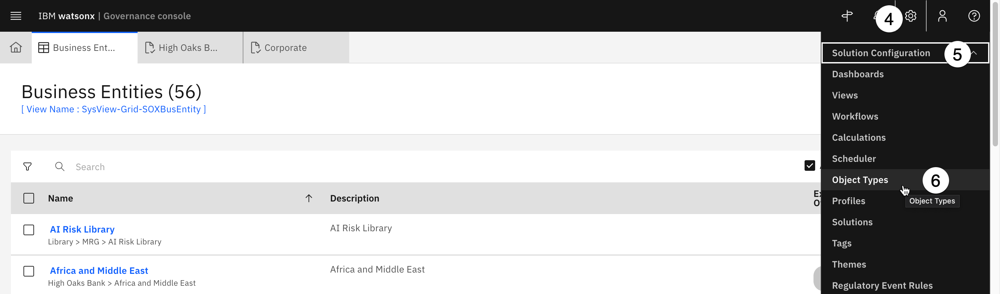

7. Enter **use case** in the search field to narrow the list of object types.

8. Locate and click on **Use Case** from the table to open the **Use Case** object.


9. Click on the **Fields** section to expand it. All the fields currently associated with model use cases are listed in their existing groups.

10. Click on **New Field** to open the **New Field** panel.


11. You will place the field in a new grouping. Click the **New** button above the **Field Group** dropdown. The **New Field Group** panel opens.


12. Enter **EU Compliance** in the **Name** field and click the **Create** button to create the grouping. The **New Field** panel updates, showing that the field is now contained in the **EU Compliance** group. Note that there is already a **Compliance** field group in the use case, and, strictly speaking, the field you are creating could go there. In this lab you are creating a new group to see how it could be done for other fields the client may want to create.

13. Enter **Secondary EU AI Review** in the **Name** field.

14. Click the **Data Type** dropdown and select **Enumerated String**. This data type will appear as a dropdown in the form. Note the other data types, including strings, integers, booleans (true/false), dates, currencies, and more. 


Note that you have the option to set the field to **Required** using the toggle. However, **DO NOT** set the field to required at this time, as it will prevent approval actions from being taken. You can also set default values and descriptions.

15. Scroll to the **Enumerated String Values** section and click the **New Value** button. The **New Enum Value** panel opens.


16. Enter **Approved** into both the **Name** and **Label** fields and click **Create**.

17. Repeat steps 15 and 16 to add **Denied** and **N/A** values.

Note that you can set colors for the different values, which will show on the icon badges when the form is completed.

18. Assign colors to the values using the dropdowns.

Note that you can also select which object profiles (such as the watsonx profiles you assigned to users in previous steps) are allowed to interact with the field

19. Click **Create** to add the new field to the object.


Note that, occasionally, saving the field can take longer than expected and results in a **Network error** or the error message below:


If you get this message, try and save the field again. If you receive an error that the field already exists, then most likely the changes were saved successfully. Close the **New Field** panel and refresh the page, and you should see the field listed in the **Fields** section.

To allow other users to access the governance console again, you will need to disable system admin mode.

20. Click on the **gear icon** to open the **Administration** menu.

21. Click on **Disable System Admin Mode** to return the console to its normal state.


Once again, you will be prompted to confirm your choice. Click **Disable** to confirm.

## 7. Add the custom field to the use case view

In the previous section, you created a custom field. In this section, you will add that field to the view for use cases so that it can be included. Note that the system views cannot be modified; instead, you will copy the existing view, make changes to the copy, and then set your modified view as the new default.

To create a copy of a system view, you could locate the view from the inventory. However, there are hundreds of views included in the console, and it is not always clear which view corresponds with the object you wish to edit. Fortunately, there is a shortcut built into the system to identify which view is being shown.

1. Click on the **hamburger menu** in the upper left.

2. Click on the **Inventory** menu item to expand it.

3. Click on the **Use Cases** menu item. A new tab opens listing all existing use cases.


4. Click on any use case from the list to open it.

5. Click on the **gear icon** in the upper right to open the **Administration** menu.

6. Click on the **Other** menu item to expand it.

7. Click on the **Display Debug Info** menu item.


A link will appear beneath the name of the use case, identifying the view as **watsonx-governance-Task-Register**.

> If the default view name shows as **SysView-Task-Register**, then the admin user is not using the correct profile. Follow the *5. Enable on the watsonx profiles for the admin user* instructions from the [configuration hands-on lab](https://cp4d-outcomes.techzone.ibm.com/l4-pox/governance-config) to ensure that the watsonx profiles are assigned, and that the admin user has changed to one of those profiles.

The *Display Debug Info* option is extremely useful for determining the view that is showing on a given screen, making it easier to find and customize that view.

8. Click the link for **watsonx-governance-Task-Register** to open the view in a new tab.


A warning message appears in the top right of the new tab, informing you that this is a read-only system view and cannot be changed.

9. Click the **Copy view** button just below the warning message. The **New View** panel opens.


10. Enter a name for your view in the **Name** field. Staying consistent with the watsonx views will make it easier to locate later, so choose a name like **custom-watsonx-Task-Register**. Your text entry will be automatically mirrored in the **Label** field.


11. Scroll to the bottom of the **New View** panel and check the box next to **Use as default view for this object type for all profiles**.

12. Click **Create** to create the view.


When the view has finished saving, note that there is now a **Design** tab that allows you to change the design of the form in the view. Available fields that are not already included in the view are located in the left panel. The center panel shows the current layout of the view, divided into sections such as **Header**, **General**, and **Use Case Details**.

From this view, you can create new sections of the form by scrolling to the bottom of the screen and clicking the **New section** button. However, since the field you will be adding is related to government regulations, you will use the existing **Regulatory Information** section.

13. Scroll to the **Regulatory Information** section of the center panel.

14. Scroll to the **Object Fields** section of the left panel. Click and drag the **Secondary EU AI Act Review** object into the **Regulatory Information** section in the center panel beneath the **Applicability Assessment Completion Date** item.


Next, you will need to add the **Use Case Review** fields to the view.

15. Scroll the main window to the **Use Case Details** section.

16. Scroll the left panel to the **Relationship Fields** section.

17. Click and drag the **Grid** item from the left panel into the **Use Case Details** section. The **Relationship** panel opens on the right side of the screen.


18. Enter **Use Case Reviews** in the **Label** field.

19. Click on the **Relationship Type** dropdown and select **Children**.

20. Click on the **Object Type** dropdown and select **Use Case Review**.


The pending use case reviews will now show in this section of the view; however, it would be even more helpful to show their status, and the department responsible for reviewing them.

21. Scroll down to the **Fields** section and click the **Add** button. The **Fields** panel opens, showing all of the available fields for use case reviews.

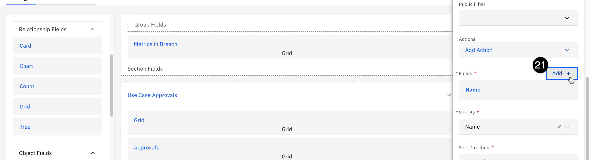

22. From the list of fields, check the box to the left of the **Approval Status** item.

23. From the list of fields, check the box to the left of the **Stakeholder Departments** item.

24. Click the **Done** button to add the new fields to the grid. The **Fields** panel closes.


25. Click the **Done** button to finalize your changes to the grid and close the **Relationship** panel.

26. Click **Publish** in the upper right to publish your changes to the view.


## 8. Disable the old view

You have successfully updated the use case view to include your new custom field. However, the new view may not show for all model use cases. In this section, you will disable the default system view, which will cause your changes to appear for all use cases.

1. Click on the **gear icon** to open the **Administration** menu.

2. Click on the **Solution Configuration** menu item.

3. Click on the **Views** menu item to open a new tab listing all the views.


4. Ensure that the **Include system views** box is checked.

5. Enter **watsonx** in the search field to narrow down the results.

6. Click on the **Filter by Object type** dropdown and select **Use Case** to further narrow the search results.


7. Click the box next to the **watsonx-governance-Task-Register** system view.

8. Click **Disable** from the context menu above the table.


You have successfully disabled the system view, ensuring that the new view with the custom field will now appear for all use cases as long as the user has the **watsonx** profiles enabled for their account. You can open an existing use case to see the new field if you wish.

## Create a questionnaire

The watsonx governance console provides the ability to create and employ [questionnaires](https://www.ibm.com/docs/en/openpages/9.0.0?topic=questionnaires-questionnaire-overview) to assist in the governance process. As with all elements of the governance console, questionnaires are fully customizable, and can be configured to automatically trigger further actions such as use case reviews, audits, communications, alerts, and more.

In this section of the lab, you will see how the questionnaire editor works by creating a form to edit the custom field you created in the previous step, allowing the compliance officer to fill out a form for their secondary review.

Finally, you will add the questionnaire as a part of the built-in AI assessment workflow, which will then allow you to integrate the questionnaire into the workflow for approving model use cases.

## 1. Create the questionnaire template

1. From the governance console, click the **hamburger menu** in the upper left.

2. Click on the **Assessments** menu item to expand it.

3. Click on the **Questionnaire Templates** menu item. Note that, depending on the current profile for your user, you may have more items listed in your menu. A new tab listing available templates opens.


4. Click the **New** button in the upper right.


5. In the **Name** field, enter **Secondary EU AI Act Review**.

6. Enter a description in the **Description** field.


7. Enter the created **complianceofficer** user in the **Primary Owner** field.

8. Click the **Select Folder** button. The folder selection dialog opens.


9. Scroll down in the table of folders and click on the **Library** folder.

10. Click the **Done** button. The dialog closes.


11. Click the **Save** button in the upper right to save the new questionnaire template. The **Task** view opens.

## 2. Add questions

Now that the questionnaire template has been created, you may add questions to it. In this example, you will create a very simple set of questions to reflect a larger review, but when performing a Proof of Experience (PoX), it can be valuable to allow the client to create their own questions that are relevant to their organization's requirements.

1. From the questionnaire template **Task** view, click on the **Editor** tab.

2. Click on the **Blank** tile to create questions from scratch. The **Format settings** dialog opens.


3. Enter **Secondary Assessment** in the **Name first section** field.

4. Enter **Compliance Review** in the **Name first subsection** field.

5. Click the **Create** button. Note that if you receive a **Network error** message, you may need to close the current tab, return to the **Questionnaire Templates** tab, and refresh the page. From this point, the new template should appear in the list. You can click on it and switch to the **Editor** tab on the template screen.


6. The template has been pre-populated with a default question. Click the question tile to edit it. The **Configure question** form opens.


7. Copy and paste the following text in the **Question** field, replacing the existing text:

```
After a secondary review, is this use case acceptable under the EU AI Act?
```

8. Click the **Remove** icon to the right of the **Not applicable** choice.


9. Take a moment to review the other possible actions you can take on this question. You have the ability to build display logic to determine when this question appears. You can add additional context, set up multiple choice questions, and more. Creating full in-depth questionnaires is beyond the scope of this lab, but familiarizing yourself with some of the options and allowing the client to build their own questionnaires can be helpful in a PoX.

10. When you are finished exploring, click the gray area beneath the **Configure question** panel to save your changes. At this point, you may add additional questions as you wish. When you are satisfied with the questionnaire, you may proceed with the lab.

## 3. Add the questionnaire to the existing AI assessments

You have just created a new type of assessment for AI models. In order to incorporate it into AI-related workflows, you will need to make further configuration changes to add it to the list of existing AI assessments.

1. Click the **gear icon** in the upper right to open the **Administration** menu.

2. Click **Enable System Admin Mode** to enable changes.


3. A popup window will open, prompting you to confirm your choice, and notifying you that while the mode is enabled, the system will be unavailable to other users. Click the **Enable** button to confirm.

4. Click on the **gear icon** again to open the **Administration** menu.

5. Click on the **Solution Configuration** menu item to expand it.

6. Click on the **Object Types** menu item. The **Object Types** tab opens.


7. Enter **Questionnaire Assessment** in the search field to narrow the results of the table, then click on **Questionnaire Assessment** in the table.


8. Click on the **Fields** section to expand it.

9. Scroll down to the **watsonx-QAssessment** section and click on the entry for **AI Assessment Type**. The field information panel opens.


10. In the information panel on the right, scroll down to the **Enumerated String Values** section and click on the **New Value** button.


11. Enter **Secondary EU Assessment** in both the **Name** and **Label** fields.


12. Click the **Create** button at the bottom right.

13. Click the **Done** button to save your change to the AI Assessment object.

14. Once the changes have saved, you can turn off System Admin mode. Click the **gear icon** in the upper right to open the **Administration** menu.

15. Click **Disable System Admin Mode** menu item, then click the **Disable** button in the confirmation dialog box that opens to confirm your choice.

## 4. Update the AI assessment workflow 

Now that you have created a new type of AI assessment, you will need to associate your assessment into the built-in workflow for AI use cases.

1. From the watsonx governance console, click the **gear icon** in the upper right to open the **Administration** window.

2. Click on the **Solution Configuration** menu item to expand it.

3. Click on the **Workflows** menu item. A new tab listing all the existing workflows opens. Note that you may receive a warning message about not having access to all of the items in the workflow; this can be ignored.


4. Click on the **AI Assessment Workflow** from the table. The editor palette opens, showing the different stages of the workflow.


You will explore the editor in more detail in the next section, when you customize the **Use Case Request** workflow.

5. Locate the **+** icon in the upper right of the palette window. Click and drag it to beneath the **Other Assessment** box to create a new workflow stage. The **New Stage** dialog opens.


6. Enter **Secondary EU Assessment** in the **Name** field.

7. Click the **Create** button to create the stage, which will now appear on the palette.


8. Hover your mouse pointer over the **Start** workflow stage to make four black boxes appear on the stage border. Click and drag one of the boxes to the new **Secondary EU Assessment** stage box to create an action linking the two stages. The **New Action** dialog opens.


9. Enter **Perform Secondary Assessment** in the **Name** field. 

10. Click the **Create** button to create the action and close the dialog.


11. In the **Action Properties** panel on the right, scroll down and click on the **Conditions** section to expand it.

12. Click on the **New Condition** button. The **Conditions** panel opens.


13. Click on the **Object Field** dropdown and select **AI Assessment Type...** from the list.

14. Click on the **AI Assessment Type** dropdown and select **Secondary EU Assessment** from the list. This value appears in this list because you added it as an *Enumerated String Value* for AI Assessment Types in the previous step.

15. Click the **Done** button to save the condition. The **Condition** panel closes.


16. In the **Action Properties** panel on the right, scroll down and click on the **Validations and Operations** section to expand it.

17. Click on the **New Operation** button. The **Operations** panel opens.


18. Click on the **Operation** dropdown and select **Associate objects** from the list.

19. Enter **Associate Assessment** in the **Name** field.

20. Click on the **New Condition** button. The **When** condition panel opens.


21. Click on the **Object Field** dropdown and select **AI Assessment Type...**.

22. Click on the **AI Assessment Type** dropdown and select **Secondary EU Assessment**.

23. Click the **Done** button to close the **When** panel.

24. Click the **Edit** button to the right of **Object to associate**. The **Object to associate** panel opens.


25. Click on the **Relationship Type** dropdown and select **Direct Child** from the list.

26. Click on the **Related Object Type** dropdown and select **Questionnaire Template** from the list.

27. Click on the **New Condition** button. The **Filter By** panel opens.


28. Click on the **Related Object Field** dropdown and select **Name...** from the list.

29. Enter the exact name of the questionnaire template you created in a previous step in the **Name** field. If you have been following the instructions, you named it **Secondary EU AI Act Review**.


30. Click **Done** to close the **Filter By** panel.

31. Click **Done** to close the **Object to associate** panel.

32. Click **Done** to close the **Operations** panel.

You have now linked the **Start** stage and the **Secondary EU Assessment** stage using an action. To complete the process, you must link the **Secondary EU Assessment** stage to the **End** stage.

33. Hover your mouse pointer over the **Secondary EU Assessment** stage box to make four black boxes appear on the stage border. Click and drag one of the boxes to **End** stage box to create an action linking the two stages. The **New Action** dialog opens.


34. Enter **Assessment complete** in the **Name** field and click the **Create** button to close the dialog.

35. Click the **Publish** button in the upper right of the screen to save your updates. Your new questionnaire has been added to the AI assessment workflow, and can now be integrated into the workflow for use case approval. 

## Customize the use case approval workflow

Every organization will have their own requirements and preferences when it comes to governance processes. In the governance console, a workflow represents a business process and describes the tasks involved in the process. The ability to fully configure and customize an automated workflow is one of the main differentiators for watsonx.governance. Many clients will be relying on manual processes that involve email approval chains between developers, risk assessors, and other stakeholders. Others will have attempted to awkwardly fit their existing organizational structure into pre-set approval workflows offered by some of our competitors.

In this section of the lab, you will examine the workflow for a model use case request, and customize it. In this example, if the risk assessment questionnaire from the previous section results in a use case that is prohibited under the EU AI Act, the workflow will be configured to trigger a second-level audit by the compliance officer user you created earlier in the lab. As with all aspects of this lab, engaging with your client to alter the customization to fit their particular needs is a great way to demonstrate the flexibility of the solution.

## 1. Create workflow stages and actions

1. From the watsonx governance console, click the **gear icon** in the upper right to open the **Administration** window.

2. Click on the **Solution Configuration** menu item to expand it.

3. Click on the **Workflows** menu item. A new tab listing all the existing workflows opens. Note that you may receive a warning message about not having access to all of the items in the workflow; this can be ignored.


4. Locate **Use Case Request** in the table and click on it. The editor palette opens, showing the different stages of the workflow.


Take a moment to explore the items in the palette by clicking on them and observing the **Workflow Properties** panel on the right of the screen. For example, click on the **Initial Approval** box. Boxes represent stages of the workflow. In the properties panel, you can see that the due date of the action is set to five days after the stage start date. If you click on the **Assignees and Subscribers** section to expand it, you can see that the stage gets assigned to the use case owner.


Next, click on the arrow joining the **Initial Approval** stage and the **Stakeholder Review** stage. Arrows represent actions that transition the use case between stages. Click on the **Conditions** section of the properties panel to expand it, and note that the two conditions here are being to bring about this action. First, that the **Use Case Risk Identification** assessment has been completed. And second, that the **Use Case EU AI Risk Category** property generated by that questionnaire's results was not *Prohibited*. In plain language, after the use case passes initial approval, the owner would fill out the questionnaire to determine risk. If the use case is not deemed prohibited by the EU AI Act, then it can proceed to the individual stakeholder review.

However, what if the organization wanted a second assessment in the case of a *Prohibited* result? In the steps below you will configure that as part of the workflow.

5. Locate the **+ icon** on the palette toolbar, then click and drag it to the area on the palette shown below to create a new workflow stage. The **New Stage** dialog opens.


6. Enter **EU AI Act Second Assessment** in the **Name** field and click **Create**. The stage now appears on the palette.

7. In the **Stage Properties** panel, click the **Edit** button below the **Due Date**. 


8. Note the different options for setting the due date, and the flexibility provided by the governance console. Set the **Number Of Days** field to **7** to give the reviewer one week to perform the action, and click **Done**. 

9. In the **Stage Properties** panel, click on the **Assignees and Subscribers** section to expand it. 

10. Click on the **Add Assignee** button. The **Assignees** panel opens.


11. In the **Users or Groups** field, enter **complianceofficer** and select the user you created earlier in the lab to assign them to this task. Note that in a real-world example, you would likely have created a group of compliance officers and assigned this task to them, as opposed to one specific user.

12. Click **Done**.


The workflow stage has been created. Next, you will add actions to trigger it.

13. Locate the **Create a new workflow action** button on the palette toolbar to the right of the **+** icon and click it. The **New Action** dialog opens.


14. Click the **Start** dropdown and select the **Initial Approval** stage.

15. Click the **End** dropdown and select the **EU AI Act Second Assessment** stage you just created.

16. Enter **Prohibited Use Case Assessment** in the **Name** field. The text you enter into this field will appear as an available action in the **Actions** menu in the model use case view when the use case is in this stage.

17. Click **Create**. The action now appears as an arrow linking the **Initial Approval** stage with the **EU AI Act Second Assessment** stage.


18. In the **Action Properties** panel on the right, scroll down to the **Conditions** section and click on it to expand it.

19. Click on the **New Condition** button. The **Conditions** panel opens.


20. Click on the **Object Field** dropdown and select **Risk Identification Completion Date...**.

21. Click on the **Operator** field and select **not empty** to designate that the completion date of the Risk Identification assessment has a value, meaning that the questionnaire has been filled out.

22. Click **Done** to add the condition.


23. Click the **New Condition** button again to add a second condition.

24. Click on the **Object Field** dropdown and select **EU AI Risk Category...**.

25. Click on the **Operator** dropdown and select **equal**.

26. Click on the **EU AI Risk Category** and select **Prohibited**.

27. Click **Done** to add the condition.


The conditions for the action have been set so that it will trigger correctly. Next, you will need the action to automatically create the questionnaire for the secondary reviewer to fill out. In previous steps, you drafted questions for the form, and added the questionnaire to the AI assessment workflow. Taking those steps allows you to insert the new questionnaire into the current use case request workflow as operations that your action can take. 

28. In the **Action Properties** panel, click on the **Validations and Operations** section to expand it.

29. Click on the **New Operation** button. The **Operations** panel opens.


30. Click on the **Operation** dropdown and select **Create objects**.

31. Enter a description like **Create secondary assessment questionnaire** in the **Name** field.


32. Scroll to the bottom of the **Operations** panel. Click on the **Related Object Type** dropdown and select **Questionnaire Assessment**.

33. Click the **Add Field** button. The **Fields** panel opens.


34. Click on the **Object Field** dropdown and select **AI Assessment Type...**.

35. Click on the **AI Assessment Type** dropdown and select **Secondary EU Assessment**. This assessment type is visible because you added it to the AI assessment workflow in the previous step. 


36. Click the **Done** button in the lower right to close the **Fields** panel.

37. Click the **Done** button to close the **Operations** panel.

At this point, you have created a new workflow stage, an automated action to trigger that stage, and an action to prompt a stakeholder with your newly-created questionnaire. However, the stage also needs resolution actions. The secondary reviewer must be able to either confirm the questionnaire assessment that the use case is prohibited under the EU AI Act and reject it, or overrule the questionnaire assessment and send it to the next stage of the workflow (**Stakeholder Review**).

## 2. Add resolution actions

1. Hover your mouse the **EU AI Act Second Assessment** stage; four black dots appear on the borders of the stage box. Click and drag one of the dots from the stage over to the **Rejected** stage on the palette to create an action linking the two. The **New Action** dialog appears.


2. Enter **Reject Use Case** in the **Name** field and click **Create**. This value is what will appear in the user interface for the stage owner for them to reject the use case.

In addition to conditions, actions can also have operations assigned to them. In this example, you will set the use case status to **Rejected**.

3. In the **Action Properties** panel, scroll down the bottom and click on the **Validations and Operations** section to expand it.

4. Click on **New Operation**. The **Operations** panel opens.

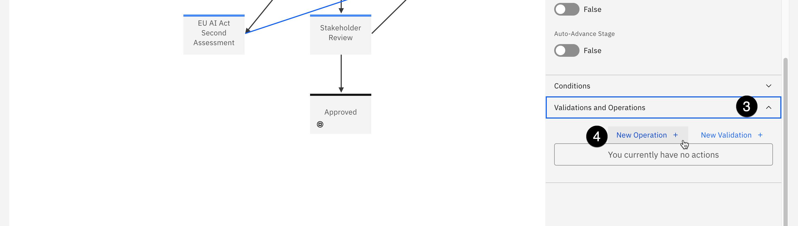

5. Enter **Set status as rejected** in the **Name** field.

6. Scroll to the bottom of the panel and click the **Add Field** button.


7. Click on the **Object Field** dropdown and select **Status (MRG-AIFacts-ModelUseCase:Status)**.

8. Click on the **Status** dropdown and select **Rejected**.


9. Click **Done** to create the field on the operation.

10. Click **Done** again to set the operation on the action. Performing the action will now update the model status.

11. Repeat step 1 above, clicking and dragging from the **EU AI Act Second Assessment** stage to the **Stakeholder Review** stage to create an action linking the two.

12. Enter **Approve to Stakeholder Review** in the **Name** field and click **Create**.

Note that the action linking the **Initial Approval** and **Stakeholder Review** stages has seven operations it performs, which you can see by clicking on it and expanding the **Validations and Operations** section of the properties panel. These operations prompt use case reviews from different departments before the final use case is approved. In a real-world example, you would duplicate these operations on the action you just created to link the **EU AI Act Second Assessment** and **Stakeholder Review** stages, since this represents the same level of approval. However, for the sake of brevity, this lab will not go over adding the operations to the new action. You may do so if you wish.

Finally, because you made changes to the default use case view, you will need to update the workflow stages, since they reference the view. Failure to update the stages will cause errors when a use case request goes through the workflow.

13. Click on the **Use Case Data Gathering** stage in the workflow. The **Stage Properties** panel opens.

14. Scroll to the bottom of the **Stage Properties** panel and click on the **Task View Overrides** section to expand it.

15. Click on the **Select Task View** dropdown and select the customized view you modified in previous steps from the list.


16. Repeat steps 13-15 for the three other stages intermediate stages in the workflow (it is not necessary for the **Start**, **Rejected**, or **Approved** stages).

17. When you are finished, click the blue **Publish** button in the upper right to publish your changes to the workflow.

Now that the use case request workflow has been modified, you will need to make one further customization to be able to approve a use case request for development.

## 3. Update the stakeholder review workflow

In the current workflow, the final stage before a use case request is approved for development is the **Stakeholder Review**. In a real world situation, an organization would assign this review to members of the business entity that requested the use case, risk managers, or other stakeholders. For the sake of this lab, you will assign the stakeholder review to the use case owner.

1. From the watsonx governance console, click the **gear icon** in the upper right to open the **Administration** window.

2. Click on the **Solution Configuration** menu item to expand it.

3. Click on the **Workflows** menu item. A new tab listing all the existing workflows opens. Note that you may receive a warning message about not having access to all of the items in the workflow; this can be ignored.


4. Locate and click on the **Use Case Stakeholder Review** link from the table. The workflow editor opens.


5. Click on the **Awaiting Approval** stage of the workflow. The **Stage Properties** panel opens on the right side of the screen.

6. Scroll to the bottom of the panel and click on the **Assignees and Subscribers** item to expand it.

7. Click on the **Add Assignee** button. The **Assignees** panel opens.


8. Click on the **A field in a related object** item to select it.

9. Click on the **Relationship Type** dropdown and select **Direct Parent**.

10. Click on the **Related Object Type** dropdown and select **Use Case**.

11. Click on the **Related Object Field** dropdown and select **Owner (MRG-ModelUseCaseOwner)**.


12. Click the **Done** button to close the **Assignees** panel.

13. Click the **Publish** button to publish the changes to the workflow.

At this point in the lab, you have performed several customizations of the governance console. You have worked with user profiles, created business entities, set up custom fields, added those fields to views, experimented with questionnaires, and altered use case workflows.

The depth and configurability of the governance console is one of the major differentiators for watsonx.governance, and a successful proof of experience (PoX) should spend time highlighting these capabilities and encouraging the client to perform their own customizations based on their organization's requirements.

From this point on, the lab will focus on governing models using the workflows and processes you created and customized in the previous steps.

## Govern generative models

In this section of the lab, you will go through the steps of the approval workflow you customized during the governance console configuration steps. The human resources department has received a large number of applications for open positions, and would like to use AI to summarize them to help save time for the hiring department, and process the applications more efficiently to improve the experience for the applicants.

Most use cases for generative models involve interacting with prompts and prompt templates, which help users provide clear input to a Large Language Model(LLM) by giving them a structured framework to follow, which in turn helps the model generate accurate responses.

## 1. Switch user personas

For this portion of the lab, you will switch to the user you created in the configuration portion, and have been granting access permissions. Recall that, for the sake of simplicity, you were instructed to create a single user with access to multiple pre-defined [roles](https://www.ibm.com/docs/en/cloud-paks/cp-data/4.8.x?topic=users-predefined-roles-permissions-in-cloud-pak-data) in Cloud Pak for Data and watsonx. While creating and managing multiple user personas and groups is beyond the scope of this lab, doing so can provide a more realistic PoX for your client, particularly if they are unfamiliar with Cloud Pak for Data, watsonx, and the level of access control and collaboration provided.

While the instructions did have you assign multiple roles to the Compliance Officer user, one role that you did **not** assign was that of administrator of the watsonx governance console (OpenPages) service. For this reason, when you log in as this user, the governance console view will have changed slightly, and you will not be able to modify views, workflows, or other aspects of the service.

Finally, it is **HIGHLY RECOMMENDED** that when logging in as the created user, you use a different browser or your browser's private/incognito mode. Previous session login information may persist and cause repeated errors when attempting to save your work or fill out questionnaires.

1. In a private/incognito browser window, navigate to the watsonx home page. If you are asked to log in, skip ahead to step 4. If you opened the home page and are signed in, you will need to log out.

2. Click on the **avatar icon** in the upper right to open the user menu.

3. Click on the **Log out** link. When given the option to confirm, click the **Log out** button. You will be returned to the login page.


4. Enter the username of the created user in the configuration portion of the lab. If you followed those instructions exactly, the username will be **complianceofficer**.

5. Enter the password of the created user in the configuration portion of the lab. If you followed those instructions exactly, the password will be **passw0rd**.

6. Click the **Log in** button to log into Cloud Pak for Data. Close any tutorial or welcome windows that open.


7. Click on the **grid icon** in the upper right to open the context menu.

8. Click on the **IBM watsonx** menu item to change the context. A **Welcome to watsonx** popup window may open. Close the popup window, or click the **Take a tour** button if you wish.


9. Click on the **hamburger menu** in the upper left to open it.

10. Click on the **Services** menu item to expand it.

11. Click on the **Instances** menu item. The **Instances** screen opens.


12. From the **Instances** list, locate and click on the **OpenPages** instance.


13. Scroll down to the **Access information** section of the screen and click on the **Launch** icon to launch the watsonx governance console (OpenPages).


14. Once the governance console opens, you will need to switch to the correct profile to see all of the applicable fields. Click the **avatar icon** in the upper right. The **User** menu opens. 

15. Click the **Change Profile** menu item. The **Select profile** dialog opens.


Take a moment to review the different profile roles and descriptions available. Each of these can be customized, or new profiles created, to fit the structure and requirements of the organization. While this lab will deal primarily with the **watsonx-governance MRG Master** for governing models, pre-defined profiles also exist for regulatory compliance officers (**watsonx-governance RCM Master**) and for risk managers (**watsonx-governance ORM Master**). 

16. Click on the **watsonx-governance MRG Master** profile from the list to select it. 

17. Click **Save** to finalize your choice.

Note that when you return to the dashboard, it is populated with several charts displaying metrics for the sample models and use cases you loaded in the configuration step. The pre-defined roles have been created to display the information most useful for that role in their dashboards. Like all aspects of the governance console, the dashboard charts can be customized per role, or per individual user.


## 2. Create a model use case

The model governance process begins with the creation of a model use case. A use case is meant to track and capture information about a collection of models and prompts that will be built to serve a particular purpose. A use case should be created whenever there is a business need requiring the use of a model (AI or non-AI) to be built. Model records should then be added as a child of the use case.

To ensure that model use cases are tracked across the entire solution, they should be created using the watsonx governance console. In the configuration lab, you turned on integration between the governance console (OpenPages) and watsonx, so any actions related to model use cases should now redirect you to the governance console interface. 

Only the models that you add to use cases are tracked with AI Factsheets. You can control which models to track for an organization without tracking samples and other models that are not significant to the organization.

In a real-world scenario, this action would be performed by an organizational stakeholder who would like to request the development and implementation of a model; in this case, the manager of the human resources department, who is unable to keep up with the volume of resumes submitted for employment opportunities and would like help from an AI solution.

1. Click on the **hamburger menu** in the upper left.

2. Click on the **Inventory** menu item to expand it.

3. Click on the **Use Cases** menu item. The **Use Cases** tab opens. Note that several sample uses cases were loaded during the FastMap import step you performed in the configuration lab.

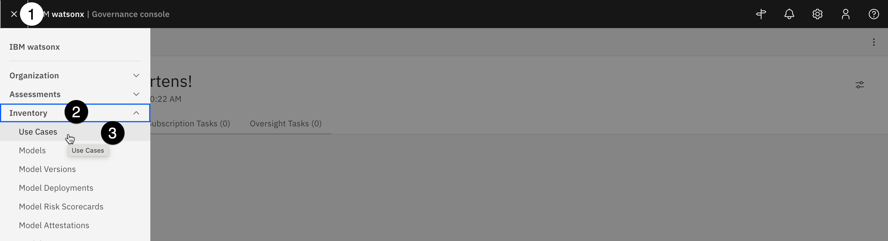

4. Click the blue **New** button. The **New Use Case** tab opens.


Note that the **Model Use Case creation** information panel on the right of the screen offers helpful information about model use cases, as well as a list of required fields. Clicking on any of the fields in that panel will scroll the screen directly to that portion of the form, helping you quickly rectify any items needing attention. 

5. In the **General** section of the form, enter **Resume summarization** in the **Name** field. Note that when you enter a value in the field, the progress bar in the **Model Use Case creation** information panel updates.

6. Click the **Owner** field and enter the **complianceofficer** created user into this field. Note that if you created multiple user personas in the environment configuration lab, you could choose a different user here. **DO NOT** select any of the sample users that were loaded during the system configuration import step, as they will not have associated Cloud Pak for Data accounts and will not be able to log in and work with the use case.

7. Enter a description in the **Description** field.


8. Click on the **Use Case Type** dropdown and 

9. All model use cases are owned by business entities, representing the part of the organization responsible for requesting the use case. In the **Business Entities** section of the form, click the **Add** button. The **Add** window opens with a list of business entities defined for the organization.


10. Locate the **Human Resources** entity from the list and click on it to select it.

11. Click **Done** to add the business entity to the use case. The **Add** window closes.


12. Click the **Save** button in the upper right to save the use case.

When the use case has finished saving, the screen will reload with the view you customized in previous steps; you should see the **Secondary EU AI Review** field in the **Compliance** section of the use case. At this point, the use case has been created and is now governed by the **Use Case Request** workflow that you modified. Specifically, it is in the **Use Case Data Gathering** stage of the workflow, as shown in the screenshot below. Note that this screen is for informational purposes, and your screen will not look like this.


To progress the use case through the workflow, you will now need to perform the actions specified in the **Action** items in the workflow.

## 3. Progress the use case to the next phase

The use case request has progressed to the data gathering stage of the workflow, and has been assigned as an action for the appropriate owner. Recall that owners of each stage of the workflow can be configured, and alerts assigned.

1. Click on the **Home** icon in the upper left to return to the user's home tab.


2. Note that the **My Tasks** tab now shows a new entry. Click on the tab to open it.


The **My Tasks** tab shows a list of all the current tasks assigned to the user. It can be filtered by a variety of fields. At the moment, it only contains a single task, showing that the use case request is in the data gathering stage and is in need of action, along with the stage due date. 

3. Click on the link for the **Resume summarization** link in the table to return to the use case request tab.


In an earlier section of the lab, you updated the model use case review to hold a new field (Secondary EU AI Review). When performing a PoX for your client, you may wish to add other fields to this view, which may contain other required information to be filled out in this stage. Information could include things like billing codes, additional documentation or justification, or more. In this case, you will only edit required fields specified in the information panel on the right before progressing to the next stage of the workflow.

**Risk Level** represents the risk to the organization should issues arise with the models used to address the requirements laid out by the use case. A full risk assessment is beyond the scope of this lab; however, because hiring and employment violations can lead to expensive litigation damage to an organization's reputation, this use case will be marked as high risk.

4. In the **Risk** section of the form, click on the **pencil icon** next to the **Risk Level** field to edit it.

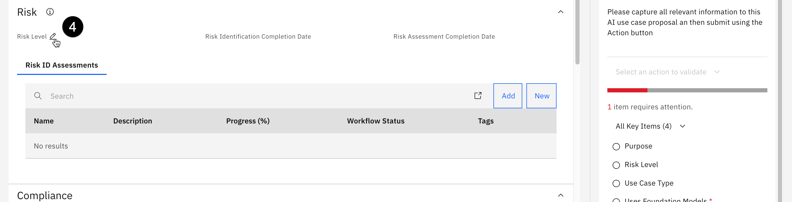

5. Select **High** from the dropdown.

6. Click on **Uses Foundation Models** in the information panel on the right to locate it in the form. The **Uses Foundation Models** dropdown opens.

7. Select **Yes** in the **Uses Foundation Models** dropdown, as you will optionally use IBM Foundation models and compare them to Azure OpenAI models. 

8. Scroll to the **General** section, click on the **Stakeholder Departments** dropdown, and select **Model Risk** from the list. As the model progresses through the workflow, this will require a stakeholder review from the **Model Risk** department. Recall that you added use case reviews to the use case view in previous steps.

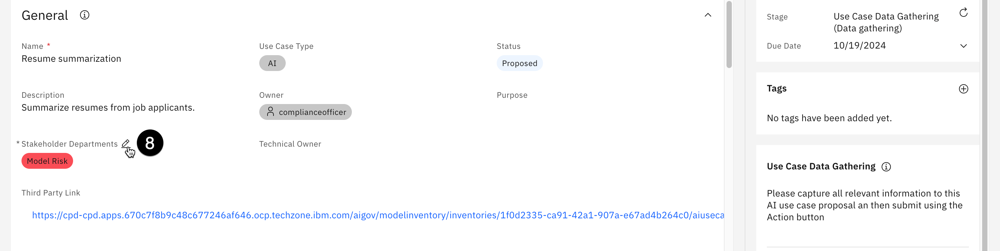

9. Click the **Save** button in the upper right to save your changes. 

10. Once the changes have been saved, click on the **Action** button in the upper right to open the **Actions** menu.

11. Click on the **Submit for initial approval** action. Note that the text of this action is defined by the **Name** field given to the action connecting the **Use Case Data Gathering** stage to the **Initial Approval** stage in the workflow. The **Submit for initial approval** confirmation dialog opens.


12. Click the black **Continue** button to confirm your action, but keep the use case tab open.

> If you receive an error message saying *The Use Case view referenced in the workflow stage Initial Approval does not exist or has been deleted...*, your changes to the workflow (particularly the **Task View Override**) may not have been published. You will need to log back in as the **admin** user and ensure that the **Task View Override** field is set on each intermediate stage, and that the workflow changes are published.

If you receive a **Network error** message, your change may have been recorded, but network issues may have prevented the screen from refreshing. Try submitting again; if the error persists, click the **Refresh workflow info** button to the right of the **Stage** field in the information panel on the right. The **Stage** should progress to **Initial Approval (Awaiting use case approval)**.


13. When the action completes, note that the **Stage** field in the information panel on the right has updated once again to **Initial Approval**. Once again, the screen below is provided for informational purposes. The information will not appear on your screen.


Recall that, in order to progress the use case to the next stage (**Stakeholder Review**) the action in the workflow requires the risk identification questionnaire to be filled out. As that questionnaire has yet to be completed, clicking on the **Actions** menu for the use case only shows two available actions: rejecting the use case (moving it to the **Rejected** stage, or returning it to the owner (moving it back to the **Use Case Data Gathering** stage). In order to continue forward, the questionnaire must be filled out.

## 4. Identify use case risks

In this section, you will fill out the default risk assessment questionnaire included in the governance console. This questionnaire, which can be modified using the same method you used to create a questionnaire in earlier sections of the lab, has been configured to automatically associate relevant risks from IBM's AI risk atlas based on answers to the questions.

The [AI risk atlas](https://www.ibm.com/docs/en/watsonx/saas?topic=ai-risk-atlas) is an open source tool to help clients understand some of the risks of working with generative AI, foundation models, and machine learning models.

> As mentioned when you switched user personas to the created user, if you receive frequent error messages stating that *The requested operation could not be completed*, you are likely encountering an issue with persistent session information in your browser. A browser cache clear may fix this issue, but the best way to avoid these errors is to use your browsers private/incognito mode when signed in as the created user.

1. Click on the **Home** tab.

2. Click on the **My Tasks** tab from the home screen to reopen the view of assigned tasks.

3. Click on the **Risk Identification (Resume summarization)** task from the task list. The **Risk Identification** questionnaire assessment for the use case opens.


4. Fill out the questionnaire for a model that will perform summarization of resumes provided by human applicants. Your answers should reflect that content will be provided by humans, and that the output will be reviewed by humans. Also specify that the model and the model training data are hosted internally, and have been screened for bias and hateful, aggressive, and profane speech (HAP). Note that the idea of this questionnaire is to identify potential risks in the model use case. Feel free to use generic answers when filling out the form, and evaluating how that changes the risks identified at later steps.

This questionnaire has been provided by IBM as a general use form for AI use cases. Many clients will want to build their own questionnaires to satisfy different legal and organizational requirements. As you saw while creating your custom questionnaire, they can easily modify existing forms, or build new ones from scratch using the editor.

Note the progress panel on the left side of the screen will show any required questions that have not been answered, and you can use it to jump between sections of the questionnaire. Your progress will also be automatically saved as you progress.

5. When you have finished filling out the survey, click the **Action** button in the upper right. The **Actions** menu opens.

6. Click the **Risk identification complete** button. A confirmation dialog opens.


7. Click **Submit** to submit the risk identification questionnaire. 


8. Based on the questionnaire answers, the governance console now calculates and assigns certain risks to the use case. You can view these by clicking on the **Home** tab.

9. Click on the **My Tasks** tab of the **Home** tab. The use case appears in the list of tasks, with the stage set to **Initial Approval**.

10. Click on the use case from the task list. The use case opens in a new tab.

11. Scroll down to the **Risk** section of the page. Note that the **Risk Identification Completion Date** now has a value.

12. Scroll down to the **Risk Status** and **Residual Risk Rating** graphs. Based on your questionnaire answers, your charts may look different than the screen shot. Click on the **Risk Status** graph. The **Risks** tab opens.


13. Examine the table of risks. Note that each has a description, and a reference URL for more information. These risks have been populated from the [AI risk atlas](https://www.ibm.com/docs/en/watsonx/saas?topic=ai-risk-atlas). They also have a **Status** of **Awaiting assessment**, indicating that a risk assessor must decide if they are relevant to the use case or not.

14. When you are finished examining the risks, close the tab and return to the use case tab.

Next, you must perform an applicability assessment of the use case.

## 5. Assess applicability for the use case

In this step, fill out the applicability assessment questionnaire. As with the previous questionnaire, this form is provided by IBM, but can be fully customized by clients to fit their own needs. It is modeled after some of the requirements set forth in legislation around AI in the European Union.

1. Click on the **Home** tab to switch to it. The tab should still be showing the **My Tasks** view.

2. Locate and click on the **Applicability Assessment** link from the tasks table. THe **Applicability Assessment Questionnaire** opens in a new tab.


Take a moment to skim the text for each of the questions, and understand how potentially clients might answer them and how it affects their risk profile for adopting AI tools.

3. Click on the dropdown for the first question, and check the box next to the **A deployer of AI systems that have their place of establishment or who are located within the Union**.


4. In the second question tile, check the box next to the **None of the above** option.


5. In the third question tile, select the **No** option.

At this point, the questionnaire will add extra questions based on your answers. Continue to fill out the questions for the resume summarization use case, taking into account that the model will not perform classification, facial or image recognition, biometric data, individual risk assessments, or other potentially harmful acts. 

When you have completed the questions, the **Category Assessment** section of the form will populate.

6. Click on the **Category Assessment** section to view it.


7. Most of the assessments will not apply; however, for question 2.1.5, select **Yes** to reflect that the AI system will be used to analyze and filter job applications.


8. When you have finished answering all the questions, click on the **Action** button to open the actions menu.

9. Click on the **Applicability assessment complete** menu item.


10. Click on the **Submit** button to confirm your choice. Your action may take a few moments to save, and the screen may not update. However, you may proceed with the lab.

You have now completed two assessments regarding the model use case, which have been used to both automatically identify possible risks associated with using AI and helped insure regulatory compliance. Next, you will individually assess the risks identified by the questionnaires, which have been automatically added to the use case.

## 6. Assess individual risks

The questionnaires you completed have been constructed to automatically add various risks to the use case, based on the answers provided. Clients looking to use a similar process can use this questionnaire template as a model for creating their own, customized to their individual use cases.

In this section, you will assess individual risks. For the sake of time, you will only perform a single in-depth assessment, to see how this is handled in the governance console.

1. Click on the **Home** tab. The **My Tasks** tab should still be open on the page, showing a single task remaining.

2. Click on the **Resume summarization** link from the task list. The use case request opens.


3. Scroll down to the **Risk** section of the use case and click on an entry from the **Risks** table to open it.


4. Scroll down to the **Related Content** section of the page, and note that the risk can be associated with mitigating controls, processes, or other issues. Take a moment to inspect some of the other sections on the page, including **Internal Audit Risk Rating**, and note how risks can be customized based on the threat they pose to a client's business.

5. Click on the **Action** button in the upper right to open the actions menu.

6. Click on the **Start model risk assessment** button to begin assessing the risk. The risk assessment form opens. If you look at the task list on your home tab, you will also see the assessment there.


7. Scroll down to the **Risk Assessment** portion of the page and click on the **information** icon next to the session header to open the **Field Guidance** window. Take a moment to read the descriptions of what each field represents.

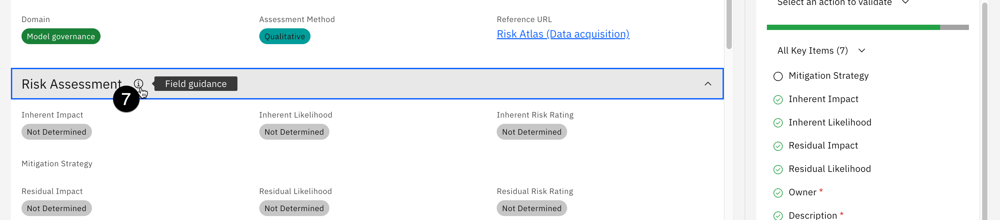

8. Close the **Field Guidance** window by clicking the **X** button in the upper right corner of the popup.

9. Click on the **edit icon** for each field and assign a rating.


10. Click on the **edit icon** for the **Mitigation strategy** field and enter text representing how the organization could mitigate this particular risk.


11. Click the **Save** button to save your changes.


12. Click on the **Action** button in the upper right to open the actions menu.

13. Click on the **Assessment Complete** button to finish the risk assessment.


14. When asked to confirm your choice, click on the **Continue and close tab** button.

15. Return to the use case view, either by clicking on the tab or locating it from the **My tasks** section of your **Home** tab.

16. Scroll down to the **Risks** section, and note that the **Inherent Risk Rating**, **Residual Risk Rating**, and **Status** have been updated in the table.

You may repeat this process for as many of the risks as you wish before proceeding. For the sake of brevity, the next steps show you how to change the status of multiple risks at once.

17. Click on the **Launch Grid page** button at the top of the **Risks** table. The grid page opens.


18. Check the box to the left of all the risks still marked with the **Awaiting Assessment** status. Note that you may need to scroll the window to check them all.

19. Click the **Bulk Update** button at the top of the table. The **Bulk Update** panel opens.


20. Click on the **Add a field** dropdown and select the **Inherent Risk Rating** item from the list. A dropdown for **Inherent Risk Rating** appears in the panel.


21. Repeat the previous step to add **Residual Risk Rating** and **Status** to the panel.

22. Click on the dropdowns and select risk ratings and a status. Note that to progress the use case, you **must** select either **Approved** or **Not Applicable** in the **Status** dropdown.


23. Click the **Update** button at the bottom of the panel.

24. When asked to confirm your bulk update, click the **Confirm** button. The update will run, and may take a few minutes to complete depending on how many risks were updated.

25. When the update completes, click the **X** button to close the **Bulk Update Report** popup. The **Risks** table will refresh, showing the new values.


The risk assessments are now complete. You can progress the use case to the next phase.

## 7. Approve the use case for development

Now that the risks have been identified and assessed, the use case can be approved for the next stage of the lifecycle.

1. Return to the use case view, either by clicking on the tab or locating it from the **My tasks** section of your **Home** tab.

2. The use case is now ready to be progressed to the next stage of the workflow. Click on the **Actions** button in the upper right. The **Actions** menu opens.

3. Click on the **Submit for stakeholder review** menu option. A confirmation dialog opens.


4. Click on the **Continue** button to confirm your choice. The use case progresses to the **Stakeholder Review** stage. Once again, the graphic below is informational, and will not be shown on your screen.


5. Once the use case view refreshes, scroll to the **Use Case Details** section of the page. The view has been updated to show that the stakeholder departments you identified in the **Use Case Data Gathering** stage have been assigned a use case review; the status shows as **Awaiting Approval**.

6. Click on the name of the required review. The **Use Case Review** tab opens.


At this point in the process, the model risk department would review the use case, including the answers provided in the risk identification questionnaire. Note that links to the questionnaires have been provided in the **Use Case Assessments** section of the page, for easy access.

7. Click on the **edit icon** for the **Approval Status** field and set it to **Approved**.


Note that you can also identify the review, and add comments as necessary.

8. Click on the **Save** button to save the status change.

9. Return to the **Resume summarization** use case by clicking on its tab. Note that the **Approval Status** of the use case review by the Model Risk department has been updated. If you assigned any other stakeholder departments to the use case, perform those reviews now.

10. Click on the **Actions** button once more. The **Actions** menu opens.

11. Click on the **Approve for development** menu item to approve the use case. A confirmation dialog opens.


12. Click the **Continue** button to confirm your choice. The **Status** field changes to **Approved for Development**.

If you click on the **Action** button again to progress the use case to the next stage of its lifecycle, you will receive an error stating that the use case view for the relevant workflow stage has been removed; because you disabled the default system use case view, to clear this error you would need to also set the **Task View Override** on the stages of the **Use Case Development and Validation** workflow to use the new, updated view. However, for the purposes of this lab, the focus will shift away from progressing the use case view to the development and monitoring of models. Feel free to update the workflow and continue progressing the use case through the different phases if your client would like to see the entire process.

At this point in the lifecycle, the model use case has been created, reviewed for risks, and approved by the various stakeholders. Personas involved are mostly non-technical, from the business user who requested the model to the risk and compliance officer who evaluated it. Next, the model would be developed by teams of data scientists and AI engineers. The following steps of the lab will take actions from the point of view of those personas.

## 7. Develop the models

In this case, the AI engineers have elected to try two different frameworks for building a resume summarization model. One team will work with the Azure OpenAI service, and the other will work with an IBM foundation model.

**THESE EVALUATIONS ARE NOT INTENDED TO SHOW THE RELATIVE STRENGTHS OF THE TWO PLATFORMS, AND SHOULD NOT BE PRESENTED AS SUCH.** Both models are fairly simple prompts, and in a real-world scenario would be tuned and optimized for the individual use case. The evaluations here are presented to show how the watsonx.governance platform can collect facts and metrics for hybrid environments with models deployed on any platform.

This lab assumes that your environment does not have watsonx.ai installed, and will be using the shared TechZone SaaS account and model you deployed in the configuration lab. In this case, you will treat the watsonx.ai model almost as an external model, creating the model record in the governance console and evaluating it via Jupyter notebook, as you will do with the Azure OpenAI model.

If your environment *does* have watsonx.ai installed, you could deploy the model there and click on the **Track this model** option in the user interface to add the model to the use case.

1. From the watsonx governance console, click on the **hamburger menu** in the upper left.

2. Click on the **Inventory** menu item to expand it.

3. Click on the **Models** menu item. The **Models** tab opens.


4. Click on the **New** button. The **New Model** tab opens.

5. Enter **Azure Resume Summarization** in the **Name** field. Make a note of this value, as you will use it later in the evaluation Jupyter notebook as the **MODEL\_TITLE**.

6. Enter a description in the **Description** field.

7. Click on the **Model Status** dropdown and select **Under Development**.

8. Click on the **Model Owner** dropdown and select the created user.

9. Click on the **Model or Non-Model** dropdown and select **Model**.

10. Click on the **Machine Learning Model** dropdown and select **No**.

11. Click on the **Model Class** dropdown and select **Prompt-tuned**.


12. Scroll down to the **Associations** section and click on the **Add** button in the **Parent Entities** tab. The **Add** window opens.


13. Scroll down to the **Human Resources** business entity and click on it.

14. Click on the **Done** button to associate the business entity. The **Add** window closes.

15. Click on the **Parent Use Case** tab of the **Associations** section.

16. Click on the **Add** button in the **Parent Use Case** tab. The **Add** window opens.


17. Scroll down to the **Resume summarization** use case you created and moved through the workflow. Click on the use case to select it.

18. Click on the **Done** button to add the model entry to the use case and close the **Add** window.

19. Now that you have added all the required information, click on the **Save** button in the upper right to save your changes.

20. Repeat steps 1-19 above to create an entry for the watsonx.ai model, with all information the same except for the name. Name this model **watsonx Resume Summarization**. Make a note of this value, as you will use it later in the evaluation Jupyter notebook as the **WATSONX\_MODEL\_TITLE**.

## 8. Prepare to evaluate the Azure model

At the time of writing, watsonx.governance supports the evaluation of third-party generative models via Jupyter notebook. In this step, you will create a Watson Studio project, import and modify the Jupyter notebook, and perform the evaluation.

> The notebook will perform an evaluation on an Azure OpenAI deployment of ChatGPT 3.5 Turbo. At the time this lab was written, TechZone does not offer reservations that can access these deployments, though they are coming soon. You can talk to your sales lead to gain access or use a customer's service. Alternatively, you can run the notebook without any credentials, in which case it will use pre-generated responses from an Azure OpenAI ChatGPT 3.5 Turbo deployment to perform the evaluation.

To begin, you will need to gather credentials used by the notebook. From Cloud Pak for Data, you will need the base Cloud Pak for Data URL, as well as the username and password of the created user. You will also create an API key for the user.

For Azure, you will need the base URL, API key, and engine. Instructions on finding these are in the **Getting Microsoft Azure credentials** section of the [configuration hands-on lab](https://cp4d-outcomes.techzone.ibm.com/l4-pox/governance-config).

1. Return to the Cloud Pak for Data home screen.

2. Click on the **avatar icon** in the upper right to open the user menu.

3. Click on the **Profile and settings** item from the menu. The user profile screen opens.


4. Click on the **API key** button in the upper right. The API key menu opens.

5. Click on the **Generate new key** menu item. The **Generate new API key?** dialog window opens.


6. Click the red **Generate** button to confirm API key creation. Note that, as the warning states, generating a new key will invalidate any existing keys you have.

7. Click the **Copy** button to copy your new key to the clipboard. Paste it into a text file for later use in the notebook, where it will represent the **API_KEY** value.


8. Once you have pasted the key into a text file, click the **Close** button to close the window.

At this point, you have all the information necessary to run the model evaluation and write the resulting output to the model's Factsheet.

## 9. Evaluate the Azure model

In Cloud Pak for Data, Jupyter notebooks are run from within Watson Studio projects. In this step, you will create a new project and download a notebook from GitHub. You will then customize the notebook with the credentials from the previous step and run it to perform the evaluation.

The notebook uses the *ibm-watson-openscale* installable Python library, which allows users to configure and run model evaluations via Python code in both Python scripts and Jupyter notebooks.

1. Click the **hamburger icon** in the upper left.

2. Click on the **Projects** menu item to expand it.

3. Click on the **All projects** menu item. The **Projects** screen opens.


4. Click the **New project** button to create a new project.

5. Click the **Create an empty project** tile. The **New project** screen opens.


6. Enter **Prompt evaluation** in the **Name** field.

7. Click the **Create** button in the lower right to create the project.

8. Click on the **Assets** tab to open it.

9. Click on the **New asset** button. The **New asset** window opens.


10. Scroll down to the **Code editors** section and click on the **Jupyter notebook editor** tile. The **New notebook** window opens.


11. Click on the **URL** button on the left.

12. Enter **Evaluate Azure model** in the **Name** field.

13. Copy and paste the following URL into the **URL** field:

```
https://raw.githubusercontent.com/CloudPak-Outcomes/Outcomes-Projects/main/watsonx-governance-l4/notebooks/azure_openai_evaluation.ipynb
```


14. Click the **Create** button in the bottom right to create the notebook. The notebook will be downloaded from Github and made available for editing.

15. Enter the credentials you gathered in the previous step in the cell. As a reminder, if you do not have access to an Azure OpenAI deployment, leave the Azure credentials blank. The **MODEL_TITLE** will be the title of the model you created in the watsonx governance console in a previous step. If you followed the directions exactly, you named it **Azure Resume Summarization**, which has been already added to the cell. The **API\_KEY** value in this cell refers to the Cloud Pak for Data API key you generated with the created user.


You gathered the Azure credentials in the configuration portion of this lab; enter the values into the cell.

16. Execute the cells of the notebook, reading the comments and paying attention to what each cell is doing. The notebook will download sample data and either query the Azure OpenAI model or retrieve pre-generated responses, then evaluate those responses for a variety of metrics. Finally, the metrics will be written to the model's record in watsonx.governance.

## 10. Evaluate the watsonx model

In this step, you will run a similar set of evaluations on a watsonx model. **THESE EVALUATIONS ARE NOT INTENDED TO SHOW THE RELATIVE STRENGTHS OF THE TWO PLATFORMS, AND SHOULD NOT BE PRESENTED AS SUCH.** Both models are fairly simple prompts, and in a real-world scenario would be tuned and optimized for the individual use case. The evaluations here are presented to show how the watsonx.governance platform can collect facts and metrics for hybrid environments with models deployed on any platform.

1. From the Jupyter notebook, click the **Prompt evaluation** breadcrumb link in the upper left to return to the project.


2. Click on the **New asset** button. The **New asset** window opens.

3. Scroll down to the **Code editors** section and click on the **Jupyter notebook editor** tile. The **New notebook** window opens.

4. Click on the **URL** button on the left.

5. Enter **Evaluate watsonx model** in the **Name** field.

6. Copy and paste the following URL into the **URL** field:

```
https://raw.githubusercontent.com/CloudPak-Outcomes/Outcomes-Projects/main/watsonx-governance-l4/notebooks/watsonx_evaluation.ipynb
```


7. Click the **Create** button in the bottom right to create the notebook. The notebook will be downloaded from Github and made available for editing.

8. Enter the credentials you gathered in first code cell. The **CPD** credentials will be identical to those you used in the previous notebook. You gathered the **WATSONX** credentials during the configuration lab when you deployed the watsonx prompt template to a deployment space. The **WATSONX\_MODEL\_TITLE** will be the name of the model you created in the governance console in a previous step. If you followed the directions exactly, you named it **watsonx Resume Summarization**, which has been already added to the cell. The **API\_KEY** value in this cell refers to the Cloud Pak for Data API key you generated with the created user, and used in the previous notebook.


9. Execute the cells of the notebook, reading the comments and paying attention to what each cell is doing. The notebook will download sample data query the watsonx model, then evaluate those responses for a variety of metrics. Finally, the metrics will be written to the model's entry in watsonx.governance.

## 11. View the metrics in the governance console

Now that the metrics have been calculated, they can be viewed in the governance console.

1. Signed in as the **complianceofficer** user in the watsonx governance console, click on the **hamburger menu** in the upper left.

2. Click on the **Inventory** menu item to expand it.

3. Click on the **Use Cases** menu item. The **Use Cases** tab opens.


4. Locate the **Resume summarization** use case from the list and click on it. The **Use Case** tab opens.

5. Scroll down to the **Relationships** section of the screen. Note that the **Resume summarization** parent node has two listed **Models** as child nodes.

6. Click on the circle for the **Models** node to expand it.


7. The Azure and watsonx resume summarization models you created and assigned to the use case are listed here. Click on one of them. The **Model** information panel opens on the right, showing the model details.

8. Click on the **Open in tab** button at the top right of the panel. The model will open in a new tab in the governance console.


9. Scroll down to the **Associations** section of the window. The different computed model metrics are displayed in a table. Click on one of them to view the evaluation score.


10. The evaluation shows in the **Metric Values** section of the table.

> The functionality for monitoring and displaying metrics for third-party generative models is under **rapid** development. In June 2024, a new release of watsonx.governance will significantly expand this capability and improve integration into the governance dashboard. If you would prefer to show your client more detailed visualizations of the metrics prior to that release, the best solution is to evaluate the watsonx model in the SaaS environment.

## Govern predictive models

While much of the industry focus has been on ChatGPT and generative AI, the vast majority of models solving real-world business problems in production are traditional predictive machine learning models. Most organizations would significantly benefit from a governance solution for their predictive models, particularly given the increased regulatory environment.

In this section of the lab, you will create a model to make hiring recommendations for the HR department. You will then evaluate that model and compare it to an external model running on Amazon SageMaker.

## 1. Create a hiring model use case

As discussed in the generative model section, model governance starts with a use case request.

1. Signed in as the **complianceofficer** user in the watsonx governance console, click on the **hamburger menu** in the upper left.

2. Click on the **Inventory** menu item to expand it.

3. Click on the **Use Cases** menu item. The **Use Cases** tab opens.


4. Click on the **New** button on the right. The **New Use Case** tab opens.


5. Enter **Application screening** into the **Name** field.

6. Enter **complianceofficer** into the **Owner** field.

7. Enter **Screen applications for positions** or similar text in the **Description** field.


8. Scroll down the **Business Entities** section and click the **Add** button. The **Add** dialog opens.

9. Locate the **Human Resources** entity from the list and click on it.

10. Click **Done** to add the entity and close the dialog.


11. Click the **Save** button in the upper right to save the use case information.

You will now need to follow the same process you used for the generative model use case as described in [3. Progress the use case to the next phase](#3._Progress_the_use_case_to_the_next_phase) and [4. Identify use case risks](#4._Identify_use_case_risks) to approve the model use cases for the predictive models. When you have finished, proceed to the next step.

## 2. Create a deployment space for the hiring model

Now that the use case for the model has been approved, you can create the models. The steps in this section would be typically undertaken by data scientists and AI engineers, as they work with data developed and cleaned by the data engineers to build models. This lab does not focus on the details of model creation and deployment; instead, you will rapidly prototype a model using [IBM's AutoAI service](https://www.ibm.com/docs/en/cloud-paks/cp-data/4.8.x?topic=models-autoai), and deploy it in your environment. Next, you will evaluate it as well as a similar model deployed on AWS SageMaker.

1. Return to the Cloud Pak for Data home screen, signed in as the created user.

2. Click on the **hamburger menu** in the upper left to open it.

3. Click on the **Deployments** menu item. The **Deployments** screen opens.


4. Click the **New deployment space** button to create a deployment space. A [deployment space](https://dataplatform.cloud.ibm.com/docs/content/wsj/analyze-data/ml-spaces_local.html?context=cpdaas) is an object in Cloud Pak for Data and watsonx that contains deployable assets, deployments, deployment jobs, associated input and output data, and the associated environments.

5. Enter **application screening development** in the **Name** field.

6. Click on the dropdown for **Deployment stage** and select **Development**. This metadata for the space will be used by the monitoring service (OpenScale) to determine how data for the model is stored in the datamart when performing evaluations. Predictive models hosted internally (in the same Cloud Pak for Data environment as the monitoring service) that are deployed to **Production** spaces will automatically have their input and output data recorded in the datamart, and evaluations will be performed on that data. Models hosted in non-production spaces will be evaluated based on comma-separated value (CSV) file uploads. 


7. Click **Create** to create the deployment space. When the space is finished creating, you will be able to deploy models to it as REST endpoints, and can begin monitoring the models in the monitoring service.

8. When the dialog window shows **The space is ready**, click the **View new space** button. The new space opens.

## 3. Create the hiring model

Next, you will build the hiring model, and begin tracking it through the approved hiring use case you created and moved through the workflow in previous steps.

1. Click on the **hamburger menu** in the upper left.

2. Click on the **Projects** menu item to open it.

3. Click on the **All projects** menu item. The **Projects** screen opens.


4. Click the **New project** button to create a new project.

5. Click the **Create an empty project** tile. The **New project** screen opens.


6. Enter **hiring model development** in the **Name** field.

7. Click the **Create** button. A new empty project will be created, and will open to the **Overview** tab.

8. Right click on the link for the [hiring training data file](https://raw.githubusercontent.com/CloudPak-Outcomes/Outcomes-Projects/main/watsonx-governance-l4/data/hiring_training_data.csv) and save it to your hard drive. Ensure that the file is saved with the **.csv** (comma-separated value) extension.

9. From the **Data in this project** panel of the project screen, click the **Drop data files here...** link. The system file explorer opens. Browse to the file you downloaded and import it. When the file has been imported, it will show in the **All assets** list in the center of the screen.

10. Click on the **New asset** button. The **New asset** window opens.

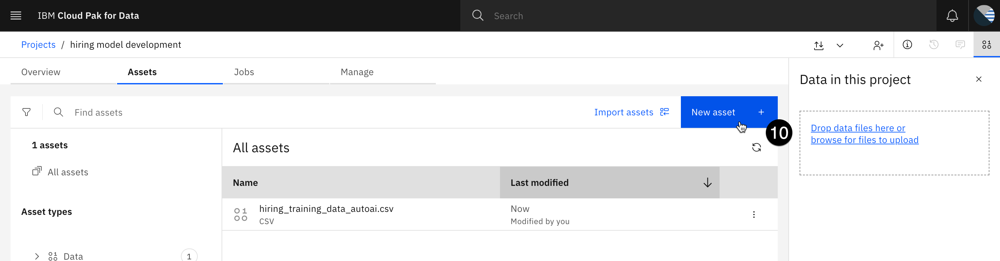

11. From the **Automated builders** section, click on the **AutoAI** tile. The **Create an AutoAI experiment** window opens.

12. In the **Define details** section, enter **application screening experiment** in the **Name** field.


13. Click **Create** to create the experiment. The **Add data source** window opens.

14. Click the **Select data from project** button. The **Select data from project** window opens.

15. From the **Categories** list, click on the **Data asset** item. The **Data assets** list appears, showing all data assets in your project.

16. Check the box to the left of the training data file you uploaded to the project.


17. Click the **Select asset** button in the bottom right. The **Configure details** panel opens.

18. Click **No** in the **Create a time series analysis?** section.

19. In the **What do you want to predict?** section, click on the **Prediction column** dropdown and select **HIRED**.

20. Click the **Run experiment** button. The AutoAI service begins running, generating eight potential pipelines for a machine learning model. Note that it can take up to ten minutes to finish.

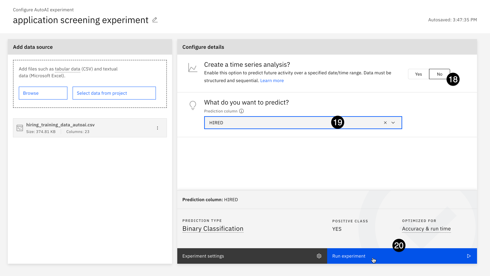

When the service finishes, the **Experiment summary** screen will show the pipelines generated, ranked based on accuracy. Note that the algorithm with the highest accuracy will likely differ than the screenshot below, based on the random selection of training and test data performed by the model.

21. From the **Pipeline leaderboard** table, click on the entry with the highest accuracy score. The **Pipeline details** window opens.

22. From the **Model viewer** section on the left, click on the **Feature summary** item. The **Feature summary** is displayed, ranking features by their importance. The more important the feature, the greater the effect it has on the output of the model when it is altered.

23. Make a note of the important features for your model. In the screenshot below, **InterviewScore** and **YearsAtCurrentCompany** are by far the most important features; the ones in your model may differ. You will use this information later when configuring the drift V2 monitor.


24. Click the **x** icon in the upper right of the **Pipeline details** window to close it.

25. From the **Pipeline leaderboard** table, hover your mouse over the entry with the highest accuracy score. Click on the **Save as** button that appears. The **Save as** window opens.


26. Click the **Create** button in the bottom right to save the pipeline as a model in your project.

27. When the model finishes saving, a **Saved model successfully** notification will appear on your screen. Click the **View in project** link in the notification to go to the model information screen.


28. To create a Factsheet for the model, it must be tracked as part of an AI use case. Click the **Track in AI use case** button in the **Governance** section. The **Track in AI use case** window opens, with a list of available use cases. Note that this list has been automatically populated with the list of use cases created in the governance console.

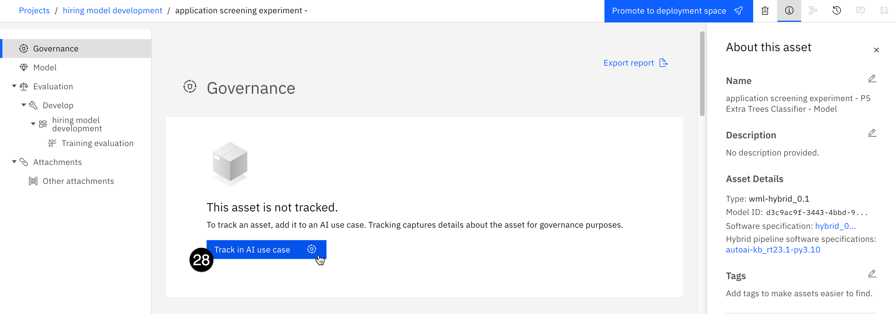

29. Select the **Application screening** use case from the list.


30. Click the **Next** button. The **Define approach** screen opens.

31. Click on the **Next** button. The **Define asset record** screen opens. This screen allows you to specify an existing model entry created in the governenace console (OpenPages). Because you have not already created a model entry for this model, click on the tile for **New asset record**.


32. Click the **Next** button. The **Assign version** screen opens. The version will be included in model metadata in the Factsheet.

33. Click on the **Stable** tile to reflect a model that the model developers are ready to have evaluated.

34. Click on the **Next** button. The **Review** screen opens.

35. Click on the **Track asset** button to add the model to the use case. After the model is added, the Factsheet opens, displaying governance information.

Note that you may receive an error message that the model was not reachable, or that it is already being tracked; this typically occurs if the system call to track the model takes longer than expected to return, and can typically be fixed by refreshing the screen.

## 4. Deploy the model

Now that the model has been added as part of the use case, the model Factsheet will start automatically collecting metadata about the model, including deployments, evaluation metrics, and more. If you wish, you can open the **Models** view from the inventory in the governance console to see how that data is represented there; you can also find it in the view of the **Application screening** use case.

Take a moment to review the information presented on the Factsheet. In the **Lifecycle** section, the model is shown as being in the **Develop** phase. You can see the model creator, the creation date, software specification, prediction type, and information on the training data features. Additionally, since the model was created in AutoAI, the initial evaluation done while training the model is available, showing model quality features such as **Accuracy**, **F1**, and **Precision**.

1. When you have finished reviewing the Factsheet, click the **Promote to deployment space** button at the top of the screen. The **Promote to space** window opens.


2. Click on the **Target space** dropdown and select the deployment space you created in a previous step.

3. Check the box to the left of **Go to the model in the space after promoting it**.


4. Click the **Promote** button to promote the model to the space. Promoting the model can take up to a minute. When the process has finished, the deployment information screen for the model opens.

5. Click the **New deployment** button. The **Create a deployment** window opens.


6. Enter **application screening - dev** in the **Name** field.

7. Click the **Create** button to create the deployment. The **Create a deployment** window closes. The deployment you created now shows in the list, with the **Status** field showing as **Initializing**. It may take up to two minutes for the deployment to be ready.

8. When the **Status** field changes to **Deployed**, click on the name of the deployment. Its information screen opens.

## 5. Configure model info

Models can be evaluated at any point during their lifecycle. In the next step, you will configure the evaluation settings.

1. Click on the **Evaluations** tab.

2. Click on the **Configure OpenScale evaluation settings** button. The **Associate a service instance** dialog opens.


3. Click the **Associate a service instance** button. The deployment space will be added as a machine learning provider for the watsonx.governance monitoring service (OpenScale), and a subscription will be created for the model. Note that you may receive an error or failure message here; typically, this is again related to a service call taking longer than expected and can be ignored.

4. Click on the **hamburger menu** in the upper left.

5. Click on the **Services** menu item to expand it.

6. Click on the **Instances** menu item. The **Instances** screen opens.

7. Locate the watsonx.governance monitoring service (OpenScale) instance from the list. Click the three vertical dots in the far right column of the list and click **Open**. The **Insights dashboard** opens.

8. Note that a tile for your deployed model appears on the dashboard. Click on it. The subscription details screen opens.

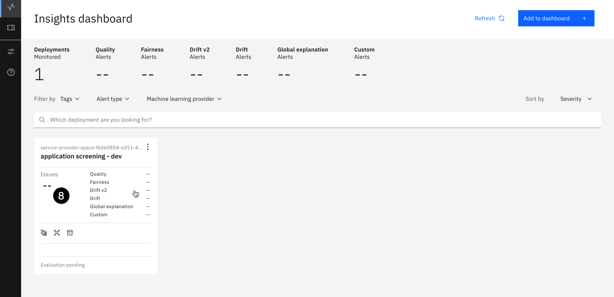

9. Click on the **Actions** button. The **Actions** menu opens.

10. Click on the **Configure monitors** menu item. The **Model details** screen opens.


Note that much of the information, including training data label, features, and model output details have already been automatically gathered from the model metadata.

11. Click on the **Edit** icon in the **Configuration package** tile.


12. Click on the **Next** button to perform a manual setup.

13. Providing the training data file to watsonx.governance will allow you to more easily configure the **Drift v2** monitor. Click the link to browse to the [hiring_training_data.csv](https://github.com/CloudPak-Outcomes/Outcomes-Projects/raw/main/watsonx-governance-l4/data/hiring_training_data.csv) file you downloaded to your machine earlier to train the model.

14. Click on the **Select delimiter** dropdown and select the **Comma (,)** option from the list.


15. Click on the **Next** button. Watsonx will take up to a minute to read in the data file.

16. From the list of columns, ensure that **HIRED** is identified as the **Label/Target**.

17. Scroll to the bottom of the list and check the **Categorical** box for the **IsFemale** feature to denote that this feature is categorical.

18. Click on the **Next** button. The **Select model output** screen opens.


19. Verify that the **Prediction** and **Probability** features are correctly identified, and click on the **View summary** button.

20. Click on the **Finish** button to save your configuration. Completing the setup can take up to two minutes to finish.

## 6. Configure explainability and fairness

Next, you will configure the explainability service and the fairness monitor.

1. In the **Explainability** section, click **General settings**.


2. Click the **Edit** button in the **Explanation method** tile. Watsonx.governance offers two different algorithms to explain predictions: LIME (Local Interpretable Model-Agnostic explanations), and SHAP (SHapley Additive exPlanations).

3. Click the **Next** button to use the LIME method.

4. You can upload an explainability archive to use for explaining predictions. Click the **Next** button to continue without uploading the archive. The **Controllable features** panel opens.

5. You can designate certain features of the model as controllable, and can subsequesntly choose to include or exclude features that you cannot control when running an analysis. Use the switches to adjust controllable features as you wish, then click the **Save** button to save your choices.

6. From the **Evaluations** section in the left panel, click on **Fairness**. 

7. Click on the **Edit** button in the **Configuration** tile.

8. The **Configure manually** configuration type has been selected. Click the **Next** button.

To monitor fairness, you need to identify favorable and unfavorable outcomes, as well as monitored and reference groups. In this particular model, **1** represents a hiring recommendation, and is a favorable outcome. **0** represents a no-hire recommendation, and is unfavorable.

9. Enter **0** in the **Select the favorable outcomes** field and click the **Add value** button.


10. Enter **1** in the **Select the favorable outcomes** field and click the **Add value** button.

11. Use the checkboxes to mark **0** as **Unfavorable** and **1** as **Favorable**.


12. Click on the **Next** button. The **Sample size** screen opens.

13. Enter **100** in the **Minimum sample size** field. This will allow you to calculate evaluations without needing more than 100 rows of data.

14. Click on the **Next** button. The **Metrics** screen opens.

Multiple metrics are available for measuring fairness. Two of them (**Disparate impact** and **Statistical parity difference**) can be calculated at runtime strictly from data being submitted to the model. The others require feedback (ground truth) data. More information on the metrics can be found in the [watsonx.governance documentation](https://www.ibm.com/docs/en/watsonx/saas?topic=evaluations-fairness-metrics).

15. Click on the **Next** button.

16. The [standard threshold for disparate impact](https://labor.hawaii.gov/wp-content/uploads/2012/12/WIA-MOA-Element-7-2012-Exhibit-J-Adverse-80-Rule.pdf) is 80%, though it can be adjusted to meet specific requirements.

17. Click on the **Next** button. The **Select the fields to monitor** screen opens.

18. Scroll down in the table on the right and check the box to the left of the **IsFemale** item.

19. Click on the **Next** button.


In this model, females are denoted with a **1** in the IsFemale feature column, while males are denoted with a **0**. Note that in a real-world example, you would use the indirect bias detection feature explored in the [watsonx.governance Level 3 lab](https://cp4d-outcomes.techzone.ibm.com/data-fabric-lab/watsonx-governance). 

20. Click the **Add value** button to add the 0-0 range to the table.

21. Enter **1** in both text entry boxes and click **Add value** to add the 1-1 range to the table.

22. Click the checkboxes to designate the **0** value (0-0 range, males) as **Reference** group and the **1** value (1-1 range, females) as the **Monitored** group.


23. Click the on **Next** button.

24. Note that you have the option to set different thresholds for each fairness monitor. Click on the **Save** button to save your fairness configuration. 

## 7. Configure quality and drift

Next, you will configure the quality and drift monitors. Drift refers to the degradation of model performance due to changes in data or changes in relationships between input and output.

1. From the **Evaluations** section on the left, click on the **Quality** item.

2. Click on the **Edit** icon in the **Quality thresholds** tile.


3. Over a dozen quality metrics are automatically calculated by watsonx.governance. You can find more information on each of them in the [documentation](https://www.ibm.com/docs/en/watsonx/saas?topic=evaluations-quality). Click on the **Next** button to accept the default thresholds.

4. Enter **100** in the **Minimum sample size** field.

5. Click on the **Save** button to save your configuration.

6. From the **Evaluations** section on the left, click on the **Drift v2** item.

7. Click on the **Edit** icon in the **Compute the drift archive** tile.


8. Because you uploaded the training data earlier when configuring the monitors, you now have the option to let Watson OpenScale compute the necessary statistics to measure drift. Click on the **Next** button.

9. Leave the default drift thresholds set to their default values. Click on the **Next** button. The **Important features** screen opens.

10. When developing the model in AutoAI, you identified the features that had the greatest impact on the model's output. Locate those features in the list and check the boxes to the left of them to mark them as important.

11. Once all of the important features have been identified, click on the **Next** button to continue. The **Most important features** screen opens.


12. Check the box to the left of the most important feature to identify it.

13. Click on the **Next** button to continue.

14. Leave the **Minimum sample size** value set to its default and click the **Save** button. Watson OpenScale begins training the drift model in the background. This process can take up to five minutes. Once it has finished, the monitors will be fully configured and the model can be evaluated.

## 8. Evaluate the AutoAI model

Evaluation methods in watsonx.governance differ depending on whether the models are deployed to production spaces or pre-production spaces. Production models hosted in the same environment as watsonx.governance automatically register their input and output into the watsonx.governance datamart. Third-party production models can use a REST API to write their input and output into the datamart. Pre-production models are evaluated by uploading data in comma-separated value (CSV) files.

1. Right click on the link for the [hiring_evaluation_data.csv](https://github.com/CloudPak-Outcomes/Outcomes-Projects/raw/main/watsonx-governance-l4/data/hiring_evaluation_data.csv) file and download it to your machine.

2. Click on the **Dashboard** link in the upper left corner of the screen to return to the **Insights dashboard**.


3. Click on the tile for your deployed model. The subscription details screen opens.

4. Click on the **Actions** button. The **Actions** menu opens.

5. Click on the **Evaluate now** menu item. The **Import test data** panel opens.


6. Click on the **Import** dropdown and select **from CSV file**.

7. Click the link to browse to the *hiring_evaluation_data.csv* file you downloaded in step 1.


8. Click on the **Upload and evaluate** button to begin the evaluation. Note that the evaluation can take up to five minutes to complete.

9. When the evaluation has finished, take a moment to review the results. The model has likely failed several tests. Clicking on the individual monitors provides further details.

At this point, you can find the model in the governance console and view the metrics associated with it. You may do so now if you wish. Next, you will evaluate a third-party model deployed to Amazon SageMaker. Instructions for reserving an account that can connect to this model are in the [environment configuration lab](https://cp4d-outcomes.techzone.ibm.com/l4-pox/governance-config).

## 9. Add the SageMaker model to the dashboard

1. Return to the watsonx monitoring (OpenScale) Insights dashboard and click on the **Configure** button. The **System setup** screen opens.


2. From the **Required** section in the left panel, click on **Machine learning providers**.

3. Click on the **Add machine learning provider** button.


4. Click the **Edit** button for the **Machine learning providers** to edit the provider name. 


5. Enter **SageMaker development** in the text field and click the **Apply** button.

6. Click on the **Edit** button in the **Connection** tile. The **Connection** panel opens.

7. Click on the **Service provider** dropdown. Note the different pre-built connectors available, including Microsoft Azure ML Studio and Microsoft Azure ML Service. Select **Amazon SageMaker** from the list.


Enter your SageMaker credentials from your [TechZone reservation](https://techzone.ibm.com/my/reservations). 

8. In the **Access key ID** field, enter the **AWS\_ACCESS\_KEY\_ID** value from your reservation.

9. In the **Secret access key** field, enter the **AWS\_SECRET\_ACCESS\_KEY** value from your reservation.

10. In the **Region** field, enter the **Region** value from your reservation. 


11. Click on the **Save** button to save the SageMaker service as a machine learning provider for watsonx.governance.

12. Click on the **Insights dashboard** button to return to the dashboard.


13. Click on the **Add to dashboard** button. The **Select a model deployment** window opens.

14. In the **Select model location** section, click on the **Machine learning Providers** button. A list of providers appears.

15. Click on the **SageMaker development** provider from the list.


16. Click on the **Next** button. The monitoring service will query the SageMaker service using the credentials you provided to get a list of deployed model endpoints.

17. Click on the **hiring-endpoint-scoring...** deployment from the list.


18. Click on the **Next** button. The **Select storage type** window opens.

19. Click on the **Data type** dropdown and select **Numeric/categorical** from the list.

20. Click on the **Algorithm type** dropdown and select **Binary classification** from the list.


21. Click on the **View summary** button.

22. Click on the **Save and continue** button to add the deployed model to the dashboard. The **Configure hiring-endpoint...** screen opens.

## 10. Configure the SageMaker monitors 

Next, you will configure the SageMaker model information and monitors.

1. Leave the **Configuration method** set to **Manual setup** and click on the **Next** button. The **Specify training data** window opens.

2. Click the link to browse to the [hiring_training_data.csv](https://github.com/CloudPak-Outcomes/Outcomes-Projects/raw/main/watsonx-governance-l4/data/hiring_training_data.csv) file you downloaded to your machine earlier to train the AutoAI model. The same file was used to train the SageMaker model.

3. Click on the **Select delimiter** dropdown and select the **Comma (,)** option from the list.

4. Click the **Next** button. The monitoring service reads the CSV file. The **Select the feature columns and label column** screen opens.

5. Check the **Label / Target** box for the **HIRED** column.

6. Check the box in the table header row to select the remaining columns as features.

7. Click on the **Next** button. The monitoring service queries the model to determine the structure of its output. The **Select model output** screen opens.


8. Check the **Prediction** box for the **predicted_label** field.

9. Check the **Probability** box for the **score** field.


10. Click on the **View summary** button.

11. Click on the **Finish** button to finalize your configuration.

12. Configure the model monitors and explainability service for the SageMaker model using the same values and thresholds you used for the AutoAI model, making sure to set the minimum records required for fairness and quality scoring to **100**.

## 11. Evaluate the SageMaker model

1. Return to the **Insights dashboard** for the monitoring service.

2. Click on the tile for the **hiring-endpoint-scoring** model.

3. Click on the **Actions** button to open the **Actions** menu.

4. Click on **Evaluate now** from the list of actions.

5. Click on the **Import** dropdown and select **from CSV file**.

6. Click the link to browse to the [hiring_evaluation_data.csv](https://github.com/CloudPak-Outcomes/Outcomes-Projects/raw/main/watsonx-governance-l4/data/hiring_evaluation_data.csv) file you used to evaluate the AutoAI model.

7. Click on the **Upload and evaluate** button to begin the evaluation. Note that the evaluation can take up to five minutes to complete.

8. When the evaluation has finished, take a moment to review the results. Compare the evaluations for this model with the AutoAI model.

## 12. Link the SageMaker model to the use case

Now that the SageMaker model has been evaluated, it will appear in the **External models** page found in the **AI governance** menu. However, the model entry defaults to the **admin** user as the owner. In order to add it to the use case, you will need to log in as the **admin** to add it to the use case.

Again, due to issues with watsonx governance console sessions, it is **HIGHLY ADVISED** that you use a different browser or a browser window running in private/incognito mode when changing users.

1. Log into the Cloud Pak for Data home screen as the **admin** user that you used to do the configuration steps.

2. Click on the **hamburger menu** in the upper left.

3. Click on the **AI governance** menu item to expand it.

4. Click on the **External models** menu item. The **External models** screen opens.


5. Locate the external hiring model in the list and click on the **three vertical dots** to the right of the model. The context menu opens.

6. Click on the **Track in AI use case** menu item from the context menu. The **Track in AI use case** window opens.


7. Locate the **Application screening** use case in the list and check the circle to the left of the use case name to select it.


8. Click on the **Next** button. The **Define approach** window opens.

9. Click on the **Next** button to accept the default approach. The **Define asset record** window opens.

10. Click on the **New asset record** tile to create a new record for the model in the inventory and the governance console.


11. Click on the **Next** button. The **Assign version** window opens.

The versions listed here refer to there already being a model defined for this particular use case; the AutoAI version of the model was created as version 1.0.0. Therefore, this model is seen as an iteration on the AutoAI model, with version numbers changing to reflect that. Choose the version change as desired or leave it set to **Patch change**.

12. Click on the **Next** button. The **Review** window opens.

13. Click on the **Track asset** button to being tracking the asset in the use case.

## 13. View the model metrics in the use case

1. Return to the governance console, signed in as the created user, and click on the **hamburger menu** in the upper left corner.

2. Click on the **Inventory** menu item to expand it.

3. Click on the **Use Cases** menu item. The **Use Cases** tab opens.


4. Uncheck the **Active Only** box to be able to see all use cases.


5. Click on the **Application screening** use case from the list.

6. Scroll down to the **Performance Monitoring** section. Note that the metrics for both models are combined here, organized into breach status for major categories such as quality, fairness and more. You can explore the metrics in detail, clicking into each to find more information.

Note that you can also view the model metrics, and the updates made to the model lifecycle, in the model Factsheet. The Factsheet can be found in the **AI use cases** page of the **AI governance** section of Cloud Pak for Data.

Metrics data is generated by the watsonx.governance monitoring service (OpenScale), and automatically written to the Factsheet, then automatically updated in the governance console. In this way, data is always kept in sync and stakeholders automatically receive the most current information in the format that is most useful for them.

## 14. Promote the model to production

In this section, you will promote the AutoAI-created model to a production deployment space to see how this change is reflected in the model lifecycle and how it affects the appearance and calculations of metrics data. 

1. From the Cloud Pak for Data home screen, click the **hamburger icon** in the upper left.

2. Click on the **Projects** menu item to expand it.

3. Click on the **All projects** menu item. The **Projects** screen opens.


4. From the list of projects, click on the **hiring model development** project. The project information screen opens.

5. Click on the **Assets** tab to open it.

6. CLick on the **three vertical dots** to the right of the **application screening...** model to open the context menu.

7. Click on the **Promote to space** menu item. The **Promote to space** window opens.


8. Click on the **Target space** dropdown and select **Create a new deployment space**. The **Create a deployment space** window opens.


9. Enter **application screening production** in the **Name** field.

10. Click on the **Deployment stage** dropdown and select **Production**.

11. Click **Create** to create the space, which can take up to two minutes.


12. Click the **x** icon to close the **The space is ready** dialog. The **Promote to space** window opens.

13. Check the box to the left of **Go to the model in the space after promoting it**.


14. Click the **Promote** button to promote the model to the space. Promoting the model can take up to a minute. When the process has finished, the deployment information screen for the model opens.

15. Click the **New deployment** button. The **Create a deployment** window opens.

16. Enter **application screening - production** in the **Name** field.

17. Click the **Create** button to create the deployment. The **Create a deployment** window closes. The deployment you created now shows in the list, with the **Status** field showing as **Initializing**. It may take up to two minutes for the deployment to be ready.

18. When the **Status** field changes to **Deployed**, click on the link for the deployment name. The deployment information screen opens to the **API reference** tab.


19. Click on the **Copy** button for the **Deployment ID** value in the information panel on the right to copy it to your clipboard. You will use this value in upcoming steps in a Jupyter notebook as the **DEPLOYMENT_ID** value.

20. Click on the **Deployments breadcrumb** link at the top of the screen. The list of deployment spaces opens.


21. Click on the **application screening production** space from the list.

22. Click on the **Manage** tab.

23. Click on the **Copy** icon for the **Space GUID** value to copy it to your clipboard. You will use this value in upcoming steps in a Jupyter notebook as the **SPACE_GUID** value.


The model has now been deployed to a production deployment space. In the next step, you will configure monitoring for a production model.

## 15. Configure production monitoring

Now that the model has been deployed to a production space, you can configure it to be monitored as if it were in a production environment. For models in production environments, watsonx.governance records all input and output data of the model in a datamart, which is a set of tables in the Db2 database you configured for the monitoring service (OpenScale) in the environment configuration lab.

For IBM models hosted in the same environment as your watsonx.governance services (in this case, the AutoAI hiring model), that data is automatically written to the datamart without any further effort or code required. For third-party models or IBM models hosted in other environments (the SageMaker hiring model, the Azure and watsonx resume summarization models) that data must be written to the datamart using API calls.

Additionally, for production environments, the monitoring service will automatically run at timed intervals to take evaluations. Fairness and quality are evaluated hourly, and drift is evaluated every three hours. Disparate impact (fairness) and drift are computed based on the model input and output, and do not require additional ground truth feedback data. Quality **does** require the upload of additional ground truth feedback data.

1. Return to the watsonx.governance monitoring service (OpenScale) Insights dashboard. Recall that it can be found from the **Instances** item in the **Services** section of the Cloud Pak for Data home page menu.

2. Click on the **Configure** button on the left.


3. Click on the **Machine learning providers** item in the menu on the left.

4. Click on the **Add machine learning provider** button.


5. Click on the **Edit** icon for the **Machine learning providers.

6. Enter **application screening production space** in the name field and click the **Apply** button.


7. Click on the **Edit** button in the **Connection** tile. The **Connection** window opens.

8. Click on the **Service provider** dropdown and select **Watson Machine Learning (V2)**.

9. Click on the **Location** dropdown and select **Local**.

10. Click on the **Deployment space** dropdown and select the **application screening production** space you created in a previous step.

11. Use the radio button to select the **Production** setting for **Environment type**.


12. Click on the **Save** button to save the deployment space as a machine learning provider.

13. Return to the **Insights dashboard** by clicking the button in the upper left.

14. Click on the **Add to dashboard** button in the upper right.

15. Use the radio button to select the **application screening production** deployment space from either the **Deployment spaces** list or the **Machine learning providers** list.


16. Click on the **Next** button. The **Select a deployed model** screen opens.

17. Use the radio button to select the **application screening - production** deployment.

18. Click on the **Next** button. The **Select storage type** screen opens.

Because you have already configured monitoring for the pre-production version of this model, you can import those settings without having to re-enter all of them.

19. Check the **Import settings** box.


20. Click on the **Next** button. The **Select pre-production deployment** screen opens.

21. Use the radio button to select the **application screening - dev** deployment.


22. Click on the **View summary** button. The configuration settings for the model appear.

23. Click on the **Finish** button to complete the monitoring configuration. 

## 16. Feed data to the model

Because IBM-hosted production models log data directly into the datamart from requests received by the model, you will need to send actual scoring requests to the model to trigger the evaluations. In this step, you will run a Jupyter notebook to feed data to the model.

1. Click on the **hamburger menu** in the upper left.

2. Click on the **Projects** menu item to expand it.

3. Click on the **All projects** menu item. The **Projects** screen opens.


4. Click on the **hiring model development** project from the list to open it.

5. Click on the **Assets** tab to open it.

6. Click on the **New asset** button. The **New asset** window opens.


7. Scroll down to the **Code editors** section and click on the **Jupyter notebook editor** tile. The **New notebook** window opens.

8. Click on the **URL** option from the panel on the left.

9. Enter **production model feed** into the **Name** field.

10. Copy and paste the following URL into the **Notebook URL** field:

```
https://github.com/CloudPak-Outcomes/Outcomes-Projects/raw/main/watsonx-governance-l4/notebooks/production_model_feed.ipynb
```


11. Click the **Create** button to create the notebook.

12. Update the values in the first code cell.
- The **USERNAME** and **PASSWORD** values are for the user you created as part of the lab, and will already be filled out if you have followed the instructions exactly.
- The **CPD_URL** value will be the URL of your Cloud Pak for Data environment.
- The **DEPLOYMENT_ID** and **SPACE_GUID** values are the ones you obtained in [6. Promote the model to production](6._Promote_the_model_to_production).
- **RECORDS_TO_SCORE** is the number of requests that will be sent to the model, and must be greater than or equal to the minimum number of records required for **Fairness** and **Drift** evaluations you configured when setting up the model monitoring.

13. Run the notebook, examining what the cells are doing. Note that this notebook can be configured as a scheduled job to continually feed data to the model for demo purposes. 

Once the notebook has finished, the model's datamart payload log will have enough data to perform fairness and drift evaluations. You can also upload the evaluation data you used for the pre-production models if you would like to calculate model quality.

Take a moment to view the model Factsheets and observe the updates to the model's lifecyle, as well as changes in the governance console.

## Conclusion

Congratuations, you have completed the watsonx.governance Level 4 proof of experience (PoX) hands-on lab. In this extensive lab, you saw how the governance console could be configured to meet the individual needs of an organization, and how it helps define, automate, and enforce best practices in approval workflows.

You saw how to create questionnaires, and how those questionnaires can be used to perform actions like associating risks with model use cases or prompting additional reviews. 

You then created a pair of model use cases, and took them through the approval process.

Next, you oversaw the model lifecycle, including metrics gathering, for generative models on both Microsoft Azure and IBM watsonx. You then did the same for predictive models on Amazon SageMaker and Watson Machine Learning. You saw how the metrics evaluations of those models were automatically updated in multiple platforms, from Factsheets to the governance console, to provide the right information to the right stakeholder at the right time without any additional effort from data science teams, or any reliance on manual processes.

Your feedback is essential to the improvement of this course. Please feel free to provide that on the course page, or directly to the course author. Thank you for your time, and happy selling.

## Troubleshooting

The following issues may appear as you run through the lab. This section will grow over time based on user feedback.

## 1. Governance console Save button disabled 

When editing entities in the governance console, occasionally the **Save** button will be disabled. The most common cause is that some relevant information in the form is missing, which may or may not be called out in the progress panel on the right. Ensure that all required fields (denoted with a red asterisk) have been filled out.

## 2. Governance console errors

Occasionally, creating new entities or altering existing ones may result in network errors like the one below when attempting to save:


In most cases, re-trying the action will resolve the problem. In some cases when creating a new entity, you will receive an error stating that the entity already exists, in which case it likely saved successfully:


Typically, the object has been created successfully, but the action took longer than expected, which generated the failure message. In these cases, you can ignore the message and proceed. In rare cases, you will need to delete and then re-create the entity.

## 3. Requested operation could not be completed in the governance console

The most frequent cause of this error is incorrectly persisted browser session information when switching between the admin user and the created user in the governance console. For this reason, it is **HIGHLY RECOMMENDED** that you use your browser's private/incognito mode when signing in as the created user.